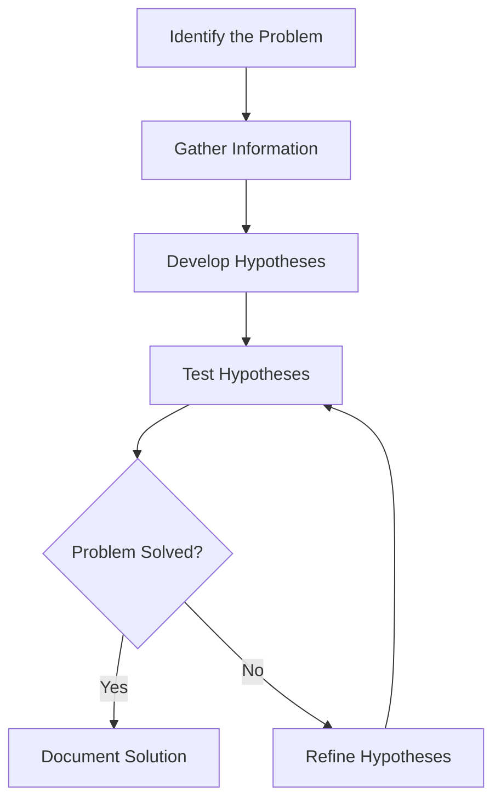

# Troubleshooting Techniques

## Introduction

Troubleshooting is the systematic process of identifying, diagnosing, and resolving problems in computer systems and software. For anyone working with operating systems, developing the ability to methodically solve technical issues is an essential skill. This guide introduces fundamental troubleshooting techniques that will help you approach and resolve problems in operating systems effectively.

Whether you're dealing with system crashes, performance issues, or configuration errors, the structured approach outlined here will guide you through the troubleshooting process and help you develop critical problem-solving skills.

## The Troubleshooting Mindset

Before diving into specific techniques, it's important to develop a proper troubleshooting mindset:

1. **Stay calm and logical** - Panic leads to rushed decisions and overlooked details
2. **Be methodical** - Follow a structured approach rather than making random changes
3. **Document everything** - Record your observations and actions
4. **Test one change at a time** - This helps identify which change fixed (or worsened) the issue
5. **Verify the fix** - Ensure the problem is truly resolved and understand why the solution worked

## The Troubleshooting Process

The following diagram illustrates a structured troubleshooting process:



Let's explore each step in detail:

### 1. Identify the Problem

The first step is to clearly define what's wrong. This might seem obvious, but properly articulating the issue is crucial for effective troubleshooting.

**Key actions:**
- Determine the exact symptoms
- Identify when the problem started
- Note any recent changes to the system
- Define what "fixed" would look like

**Example:**
Instead of "The server is slow," define it as "The web server response time has increased from 200ms to 2000ms since yesterday's security update."

### 2. Gather Information

Once you've identified the problem, collect relevant information to understand its context and potential causes.

**Key information sources:**
- System logs
- Error messages
- Resource utilization (CPU, memory, disk, network)
- Configuration files
- User reports

#### Using System Logs

Most operating systems store detailed logs that can provide valuable insights:

**Linux Example:**

```bash
# View system logs
sudo journalctl -b

# View application-specific logs
sudo cat /var/log/apache2/error.log

# Filter logs by time
sudo journalctl --since "2023-09-01 12:00:00"
```

**Windows Example:**

```powershell
# View system logs with PowerShell
Get-EventLog -LogName System -Newest 50

# Filter for error events
Get-EventLog -LogName System -EntryType Error
```

#### Checking Resource Utilization

High resource utilization often causes performance issues:

**Linux Example:**

```bash
# Check overall system resources
top

# Check disk space
df -h

# Check memory usage
free -m
```

**Windows Example:**

```powershell
# Check CPU and memory usage
Get-Process | Sort-Object -Property CPU -Descending | Select-Object -First 10

# Check disk space
Get-PSDrive -PSProvider FileSystem
```

### 3. Develop Hypotheses

Based on the information gathered, form hypotheses about what might be causing the problem. Start with the most likely causes, especially those related to recent changes.

**Example Scenario:** A web server is responding slowly after a recent update.

**Possible hypotheses:**
1. The update introduced a memory leak
2. A new configuration setting is causing excessive logging
3. The database connection pool is misconfigured
4. Increased user traffic is overwhelming the server

### 4. Test Hypotheses

For each hypothesis, develop a test to confirm or rule it out. Start with tests that are least invasive and easiest to perform.

**Example tests for the slow web server:**

```bash
# Test for memory leaks
watch -n 2 'ps -o pid,user,%mem,%cpu,command ax | grep httpd'

# Check for excessive logging
sudo ls -la /var/log/apache2/
sudo tail -f /var/log/apache2/access.log

# Test database connection
mysql -u username -p -e "SHOW PROCESSLIST;"

# Check current traffic
sudo netstat -anp | grep :80 | wc -l
```

### 5. Implement and Verify Solutions

Once you've identified the likely cause, implement a solution and verify that it resolves the issue.

**Example solution for a memory leak:**

```bash
# Update the problematic package
sudo apt update
sudo apt upgrade problematic-package

# Restart the service
sudo systemctl restart apache2

# Verify the fix
watch -n 2 'ps -o pid,user,%mem,%cpu,command ax | grep httpd'
```

## Common Troubleshooting Techniques

### 1. Binary Search Troubleshooting

When dealing with a large configuration file or many potential causes, binary search can help narrow down the problem efficiently.

**Example:** Finding a problematic line in a large configuration file:

1. Comment out half of the configuration
2. Test if the problem persists
3. If the problem is gone, the issue is in the commented section
4. If the problem remains, the issue is in the active section
5. Repeat the process on the problematic half until you isolate the issue

```bash
# Example of binary search in Apache configuration
sudo cp /etc/apache2/apache2.conf /etc/apache2/apache2.conf.backup

# Edit the file and comment out the first half
sudo nano /etc/apache2/apache2.conf

# Test the configuration
sudo apache2ctl configtest
sudo systemctl restart apache2
```

### 2. Change Reversion

If the problem started after a specific change, reverting that change can confirm the cause.

```bash
# Revert a package to a previous version in Ubuntu
sudo apt install package-name=version-number

# Restore a backup configuration file
sudo cp /etc/service/service.conf.backup /etc/service/service.conf
sudo systemctl restart service
```

### 3. Process of Elimination

Systematically disable components until the problem disappears.

```bash
# Disable Apache modules one by one
sudo a2dismod module_name
sudo systemctl restart apache2

# Test if the problem persists after each change
```

### 4. Isolation Testing

Create a minimal test environment to reproduce the issue without interference from other factors.

```bash
# Create a minimal Apache configuration
sudo cp /etc/apache2/apache2.conf /etc/apache2/minimal.conf
sudo nano /etc/apache2/minimal.conf
# (remove everything except essential directives)

# Test with the minimal configuration
sudo apache2ctl -f /etc/apache2/minimal.conf
```

## Real-World Troubleshooting Scenarios

### Scenario 1: High CPU Usage

**Problem:** A Linux server is experiencing high CPU usage, making the system sluggish.

**Troubleshooting Steps:**

1. **Identify the process consuming CPU:**

```bash
top
# or for a sorted list
ps aux --sort=-%cpu | head -10
```

Output:
```
USER       PID %CPU %MEM    VSZ   RSS TTY      STAT START   TIME COMMAND
mysql     1234 97.0  5.6 567232 223548 ?       R    09:15   48:23 mysqld
user1     2345  2.0  0.7 122588  28648 ?       S    10:21    0:12 python3
```

2. **Investigate the high-CPU process:**

```bash
# For a MySQL process
mysqladmin debug

# Check for long-running queries
mysql -u root -p -e "SHOW FULL PROCESSLIST;"
```

3. **Review related logs:**

```bash
sudo tail -f /var/log/mysql/error.log
```

4. **Solution:** Found a query without proper indexing causing full table scans.

```sql
-- Add appropriate index
CREATE INDEX idx_column_name ON table_name(column_name);
```

5. **Verify the fix:**

```bash
# Check CPU usage again
top

# Verify the index is being used
EXPLAIN SELECT * FROM table_name WHERE column_name = 'value';
```

### Scenario 2: System Boot Failure

**Problem:** A Linux system fails to boot after a kernel update.

**Troubleshooting Steps:**

1. **Identify the problem:**
   - System stops at emergency mode prompt
   - Journalctl shows errors mounting the root filesystem

2. **Boot with previous kernel:**
   - Select previous kernel version from GRUB menu

3. **Investigate initramfs:**

```bash
# Check if initramfs was properly generated for the new kernel
ls -la /boot/initramfs-*

# Regenerate initramfs for the problematic kernel
sudo mkinitcpio -p linux
# or
sudo update-initramfs -u -k 5.15.0-71-generic
```

4. **Check for missing drivers in initramfs:**

```bash
# Extract initramfs to check its contents
mkdir /tmp/initramfs
cd /tmp/initramfs
sudo unmkinitramfs /boot/initramfs-5.15.0-71-generic.img .

# Check if necessary modules are included
find . -name "*.ko" | grep -i "required_module"
```

5. **Solution:** Found that a required storage driver was missing from initramfs. Added the missing module to the configuration:

```bash
sudo nano /etc/initramfs-tools/modules
# Add: required_module

# Update initramfs
sudo update-initramfs -u -k 5.15.0-71-generic
```

6. **Verify the fix:**

```bash
# Reboot and select the fixed kernel
sudo reboot
```

## Advanced Troubleshooting Tools

### Strace for Tracking System Calls

Strace traces system calls and signals, which can help identify where programs are getting stuck:

```bash
# Basic usage
strace command

# Attach to running process
sudo strace -p PID

# Focus on specific system calls
strace -e open,read,write command

# Output to file for later analysis
strace -o trace.log command
```

Example output:
```
open("/etc/passwd", O_RDONLY)      = 3
read(3, "root:x:0:0:root:/root:/bin/bash
"..., 4096) = 1176
close(3)                            = 0
```

### Tcpdump for Network Issues

Tcpdump can capture and analyze network traffic:

```bash
# Capture packets on specific interface
sudo tcpdump -i eth0

# Filter by host
sudo tcpdump host 192.168.1.1

# Filter by port
sudo tcpdump port 80

# Save to file for later analysis
sudo tcpdump -w capture.pcap
```

Example output:
```
13:42:22.922869 IP server.ssh > client.52986: tcp 76
13:42:22.923296 IP client.52986 > server.ssh: tcp 0
```

### Using lsof to Find Open Files and Ports

```bash
# List all open files
sudo lsof

# Find processes using a specific port
sudo lsof -i :80

# Find all files opened by a specific process
sudo lsof -p PID
```

Example output:
```
COMMAND  PID   USER   FD   TYPE DEVICE SIZE/OFF NODE NAME
apache2  1234  www-data  3u  IPv4  16728      0t0  TCP *:http (LISTEN)
```

## Creating a Troubleshooting Toolkit

As you gain experience, build a personal troubleshooting toolkit with:

1. **Diagnostic scripts** - Automate common checks
2. **Configuration templates** - For quick comparison
3. **Documentation resources** - Quick access to manuals and guides
4. **System baseline information** - Normal performance metrics

Example of a simple diagnostic script:

```bash
#!/bin/bash
# quick_diag.sh - Basic system diagnostics

echo "=== System Uptime ==="
uptime

echo -e "
=== Memory Usage ==="
free -h

echo -e "
=== Disk Usage ==="
df -h

echo -e "
=== CPU Load ==="
mpstat 1 5

echo -e "
=== Network Connections ==="
ss -tuln

echo -e "
=== Last 10 System Errors ==="
journalctl -p err -b | tail -10
```

## Avoiding Common Troubleshooting Pitfalls

1. **Making multiple changes at once** - Makes it impossible to know what fixed the issue
2. **Jumping to conclusions** - Test your assumptions before acting on them
3. **Neglecting documentation** - Document what you found and how you fixed it
4. **Forgetting to back up** - Always create backups before making changes
5. **Ignoring the source of the problem** - Treating symptoms without addressing the root cause

## Summary

Effective troubleshooting is a methodical process that combines technical knowledge with critical thinking. By following a structured approach—identifying the problem, gathering information, developing and testing hypotheses, and implementing solutions—you can efficiently resolve issues in operating systems and software.

Remember that troubleshooting is both an art and a science. The more you practice, the more intuitive the process becomes. Document your experiences, learn from each problem you solve, and continuously expand your toolkit.

## Exercises and Practice Activities

1. **System Log Analysis**: Examine system logs on your computer and identify any warnings or errors. Research what they mean and how they might be resolved.

2. **Simulated Failures**: Create a controlled error (like misconfiguring a service) and practice troubleshooting it.

3. **Performance Troubleshooting**: Deliberately run a resource-intensive application and use troubleshooting tools to identify what resources it's consuming.

4. **Process Mapping**: For a service you use regularly (like a web server), draw a flowchart of its components and dependencies to help visualize potential failure points.

5. **Troubleshooting Documentation**: Create a troubleshooting guide for a common issue you've encountered, documenting symptoms, diagnostic steps, and solutions.

## Further Learning Resources

- **Man Pages**: Use `man` command to access built-in documentation for Linux commands
- **Command Documentation**: Use `--help` flag with commands for quick reference
- **Official Documentation**: Refer to documentation for specific software and services
- **Community Forums**: Sites like Stack Overflow and Server Fault
- **Books**: "The Practice of System and Network Administration" by Thomas A. Limoncelli