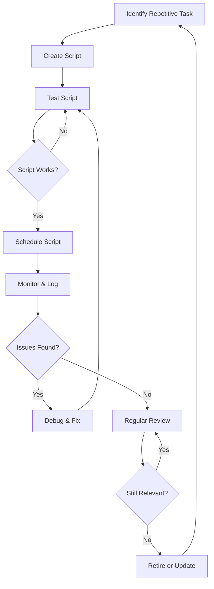

# Automation and Scripting

## Introduction

Automation and scripting are essential skills for anyone working with operating systems, especially system administrators. At its core, automation is the process of creating systems that can perform tasks with minimal human intervention, while scripting is the practice of writing code that automates these tasks. Together, they form a powerful toolkit that can save time, reduce errors, and increase productivity.

In this guide, we'll explore how automation and scripting work in the context of OS management and administration. We'll look at practical examples using popular scripting languages like Bash (for Unix/Linux) and PowerShell (for Windows), and demonstrate how these skills can be applied to solve real-world problems.

## Why Automate?

Before diving into the technical details, let's understand why automation is valuable:

1. **Time Efficiency**: Tasks that might take hours manually can be completed in seconds or minutes with automation.
2. **Consistency**: Automated tasks are performed exactly the same way each time, reducing human error.
3. **Scalability**: Scripts can be easily modified to handle larger workloads or different environments.
4. **Documentation**: Scripts serve as documentation of processes, making it easier to understand and modify system configurations.

## Bash Scripting for Linux/Unix Systems

Bash (Bourne Again SHell) is the default shell for most Linux distributions and macOS. It's a powerful scripting language for automating tasks in Unix-like operating systems.

### Basic Bash Script Structure

Here's a simple Bash script that displays a greeting:

```bash
#!/bin/bash

# This is a comment
echo "Hello, World!"

# Variables
name="Learner"
echo "Hello, $name!"
```

**Output:**
```
Hello, World!
Hello, Learner!
```

Let's break down the components:

- `#!/bin/bash`: This "shebang" line tells the system which interpreter to use.
- Comments start with `#`
- `echo` is a command that outputs text to the terminal
- Variables are defined without spaces around the equals sign and accessed using `$`

### Making Scripts Executable

After creating a script (e.g., `hello.sh`), you'll need to make it executable:

```bash
chmod +x hello.sh
```

Then you can run it with:

```bash
./hello.sh
```

### Conditional Statements

Conditional statements allow scripts to make decisions:

```bash
#!/bin/bash

# Check if a file exists
file_path="/etc/hosts"

if [ -f "$file_path" ]; then
    echo "The file $file_path exists."
    echo "Here's its content:"
    cat "$file_path"
else
    echo "The file $file_path does not exist."
fi
```

### Loops in Bash

Loops allow you to perform repetitive tasks efficiently:

```bash
#!/bin/bash

# For loop example
echo "Counting from 1 to 5:"
for i in {1..5}; do
    echo "Number: $i"
done

# While loop example
echo -e "
Counting down from 3:"
count=3
while [ $count -gt 0 ]; do
    echo "Count: $count"
    count=$((count-1))
done
```

**Output:**
```
Counting from 1 to 5:
Number: 1
Number: 2
Number: 3
Number: 4
Number: 5

Counting down from 3:
Count: 3
Count: 2
Count: 1
```

## PowerShell Scripting for Windows Systems

PowerShell is Microsoft's task automation and configuration management framework, consisting of a command-line shell and scripting language.

### Basic PowerShell Script Structure

Here's a simple PowerShell script:

```powershell
# This is a comment
Write-Host "Hello, World!"

# Variables
$name = "Learner"
Write-Host "Hello, $name!"
```

**Output:**
```
Hello, World!
Hello, Learner!
```

### Running PowerShell Scripts

By default, PowerShell restricts script execution. To run scripts, you may need to change the execution policy:

```powershell
Set-ExecutionPolicy -ExecutionPolicy RemoteSigned -Scope CurrentUser
```

Then run your script with:

```powershell
.\hello.ps1
```

### Conditional Statements in PowerShell

```powershell
# Check if a file exists
$filePath = "C:\Windows\System32\drivers\etc\hosts"

if (Test-Path $filePath) {
    Write-Host "The file $filePath exists."
    Write-Host "Here's its content:"
    Get-Content $filePath
} else {
    Write-Host "The file $filePath does not exist."
}
```

### Loops in PowerShell

```powershell
# ForEach loop example
Write-Host "Counting from 1 to 5:"
1..5 | ForEach-Object {
    Write-Host "Number: $_"
}

# While loop example
Write-Host "`nCounting down from 3:"
$count = 3
while ($count -gt 0) {
    Write-Host "Count: $count"
    $count--
}
```

## Practical Automation Examples

Let's look at some real-world examples of how scripting can automate OS management tasks.

### Example 1: System Health Check Script (Bash)

This script checks various system resources and outputs their status:

```bash
#!/bin/bash

echo "=== System Health Check ==="
echo

# Check disk space
echo "Disk Space Usage:"
df -h | grep -vE '^Filesystem|tmpfs|cdrom'
echo

# Check memory usage
echo "Memory Usage:"
free -h
echo

# Check CPU load
echo "CPU Load:"
uptime
echo

# Check for failed systemd services
echo "Failed Services:"
systemctl --failed
echo

# Check for recent errors in system log
echo "Recent System Errors:"
journalctl -p err --since "1 hour ago" | tail -n 10
echo

echo "=== Health Check Complete ==="
```

### Example 2: Bulk User Creation (PowerShell)

This script creates multiple user accounts from a CSV file:

```powershell
# Import user data from CSV
# CSV format: Username,FullName,Department
$users = Import-Csv -Path "users.csv"

foreach ($user in $users) {
    # Generate a random password
    $password = ConvertTo-SecureString -String "InitialPassword123!" -AsPlainText -Force
    
    # Create the user account
    New-LocalUser -Name $user.Username `
                  -FullName $user.FullName `
                  -Description "Member of $($user.Department) department" `
                  -Password $password `
                  -AccountNeverExpires
    
    Write-Host "Created user: $($user.Username) in $($user.Department) department"
    
    # Add to appropriate group based on department
    if ($user.Department -eq "IT") {
        Add-LocalGroupMember -Group "Administrators" -Member $user.Username
    } else {
        Add-LocalGroupMember -Group "Users" -Member $user.Username
    }
}

Write-Host "User creation complete. All users have initial password: InitialPassword123!"
```

### Example 3: Automated Backup Script (Bash)

This script creates a backup of important directories and rotates old backups:

```bash
#!/bin/bash

# Configuration
BACKUP_DIR="/backups"
MAX_BACKUPS=7
DIRS_TO_BACKUP=("/etc" "/home" "/var/www")
TIMESTAMP=$(date +"%Y%m%d-%H%M%S")
BACKUP_NAME="system-backup-$TIMESTAMP.tar.gz"

# Create backup directory if it doesn't exist
mkdir -p "$BACKUP_DIR"

echo "Starting backup at $(date)"

# Create the backup
tar -czf "$BACKUP_DIR/$BACKUP_NAME" "${DIRS_TO_BACKUP[@]}" 2>/dev/null

# Check if backup was successful
if [ $? -eq 0 ]; then
    echo "Backup completed successfully: $BACKUP_NAME"
    
    # Rotate old backups (delete oldest if we have more than MAX_BACKUPS)
    backup_count=$(ls -1 "$BACKUP_DIR"/*.tar.gz 2>/dev/null | wc -l)
    if [ "$backup_count" -gt "$MAX_BACKUPS" ]; then
        oldest_backup=$(ls -tr "$BACKUP_DIR"/*.tar.gz | head -1)
        rm "$oldest_backup"
        echo "Removed oldest backup: $(basename "$oldest_backup")"
    fi
else
    echo "Backup failed!"
fi

echo "Backup process finished at $(date)"
```

## Advanced Automation Concepts

### Scheduling Scripts

To truly automate tasks, you need to schedule them to run at specific times or events.

#### Cron Jobs (Linux/Unix)

On Linux/Unix systems, use cron to schedule tasks:

```bash
# Edit crontab
crontab -e

# Add a line to run a script at 2 AM every day
0 2 * * * /path/to/script.sh
```

#### Task Scheduler (Windows)

On Windows, use Task Scheduler to run PowerShell scripts at scheduled times:

```powershell
# Create a scheduled task that runs daily at 2 AM
$action = New-ScheduledTaskAction -Execute "PowerShell.exe" -Argument "-File C:\scripts\backup.ps1"
$trigger = New-ScheduledTaskTrigger -Daily -At 2am
Register-ScheduledTask -Action $action -Trigger $trigger -TaskName "Daily Backup" -Description "Runs the backup script daily"
```

### Error Handling

Robust scripts should handle errors gracefully:

```bash
#!/bin/bash

# Bash error handling
backup_files() {
    tar -czf /backups/backup.tar.gz /home/user/data
    if [ $? -ne 0 ]; then
        echo "Backup failed!" >&2
        return 1
    fi
    echo "Backup succeeded"
    return 0
}

if ! backup_files; then
    echo "Sending alert email..."
    mail -s "Backup Failed" admin@example.com <<< "The backup script failed to run!"
fi
```

In PowerShell:

```powershell
# PowerShell error handling
try {
    Compress-Archive -Path C:\data -DestinationPath C:\backups\backup.zip -ErrorAction Stop
    Write-Host "Backup succeeded"
} catch {
    Write-Host "Backup failed: $_"
    Send-MailMessage -To "admin@example.com" -Subject "Backup Failed" -Body "The backup script failed: $_"
}
```

### Logging

Good scripts maintain logs for troubleshooting:

```bash
#!/bin/bash

# Bash logging example
LOG_FILE="/var/log/myscript.log"

log() {
    echo "$(date '+%Y-%m-%d %H:%M:%S') - $1" >> "$LOG_FILE"
}

log "Script started"

# Do something
if some_command; then
    log "Command succeeded"
else
    log "Command failed with error code $?"
fi

log "Script finished"
```

PowerShell logging:

```powershell
# PowerShell logging
function Write-Log {
    param (
        [string]$Message
    )
    
    $timestamp = Get-Date -Format "yyyy-MM-dd HH:mm:ss"
    "$timestamp - $Message" | Out-File -FilePath "C:\logs\script.log" -Append
}

Write-Log "Script started"

# Do something
try {
    # Some command
    Write-Log "Command succeeded"
} catch {
    Write-Log "Command failed: $_"
}

Write-Log "Script finished"
```

## Automation Flow Visualization

Here's a diagram showing a typical automation workflow:



## Best Practices for Automation and Scripting

1. **Start Small**: Begin with simple, well-defined tasks before tackling complex processes.
2. **Comment Your Code**: Include detailed comments explaining what your script does.
3. **Use Version Control**: Store your scripts in a Git repository to track changes.
4. **Include Error Handling**: Prepare for unexpected situations.
5. **Add Logging**: Log script actions for troubleshooting.
6. **Test Thoroughly**: Test scripts in a development environment before using them in production.
7. **Secure Your Scripts**: Avoid hardcoding sensitive information like passwords.
8. **Document Usage**: Include usage instructions at the top of each script.
9. **Modularize Code**: Break complex scripts into functions for better maintainability.
10. **Regular Reviews**: Periodically review and update your scripts as requirements change.

## Summary

Automation and scripting are powerful tools for OS management and administration. By learning to write effective scripts, you can save time, reduce errors, and create more reliable systems. Whether you're using Bash on Linux or PowerShell on Windows, the principles remain the same: identify repetitive tasks, create scripts to automate them, test thoroughly, and implement with proper scheduling and monitoring.

As you continue your journey in OS management, remember that automation is an investment. Time spent learning and creating good scripts now will pay dividends in efficiency and reliability later.

## Additional Resources

- **For Bash Scripting**:
  - The Linux Documentation Project - Bash Guide for Beginners
  - Advanced Bash-Scripting Guide
  - ShellCheck - Online tool for script analysis

- **For PowerShell**:
  - Microsoft PowerShell Documentation
  - PowerShell in a Month of Lunches (book)
  - PowerShell Gallery - Script repository

## Exercises

1. Create a Bash or PowerShell script that checks which processes are using the most CPU and memory, and outputs the top 5.
2. Write a script to find all files larger than 100MB in a directory tree and output their locations and sizes.
3. Create an automated backup script for your personal files that includes a timestamp in the backup name.
4. Write a script that monitors a web server log file and sends an alert if it detects more than 10 error messages in a minute.
5. Create a user management script that can add, remove, and list users on your system.