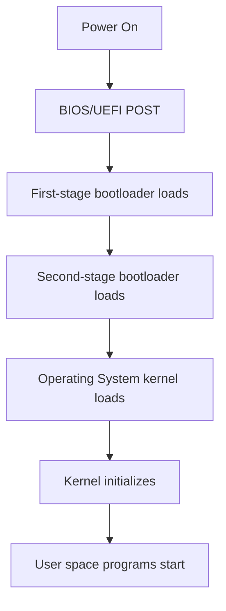

# Bootloader: The Bridge Between Hardware and Operating System

## Introduction

When you turn on your computer, a fascinating process begins before your operating system even starts. At the heart of this process is a small but crucial component called the **bootloader**. A bootloader is a piece of code responsible for initializing the hardware environment and loading the operating system into memory. It serves as the essential bridge between your computer's hardware and the software that makes it useful.

In this tutorial, we'll explore what bootloaders are, how they work, and even walk through creating a simple bootloader of our own. By the end, you'll have a solid understanding of this fundamental component in operating system implementation.

## What is a Bootloader?

A bootloader is a small program that runs when a computer boots up, before the operating system starts. Its main responsibilities include:

1. Initializing essential hardware components
2. Performing system checks
3. Locating the operating system
4. Loading the operating system kernel into memory
5. Transferring control to the operating system

Think of a bootloader as a helpful guide that prepares your computer for the main event (the operating system) and then steps aside once its job is done.

## The Boot Process: Step by Step

Let's walk through what happens when you press the power button on your computer:



1. **Power-On Self-Test (POST)**: The BIOS/UEFI performs hardware checks.
2. **First-stage bootloader**: A tiny program (typically 512 bytes for BIOS systems) is loaded from the boot device.
3. **Second-stage bootloader**: The first-stage bootloader loads a more complex bootloader (like GRUB, LILO, or Windows Boot Manager).
4. **OS Kernel loading**: The bootloader locates and loads the OS kernel into memory.
5. **Kernel initialization**: The kernel initializes and takes control of the system.
6. **User space**: The kernel starts user space programs and presents the user interface.

## BIOS vs. UEFI Boot Process

There are two main firmware interfaces that kickstart the boot process: BIOS (Basic Input/Output System) and UEFI (Unified Extensible Firmware Interface).

### BIOS Boot Process

The BIOS boot process follows these steps:

1. Power on → BIOS executes from a ROM chip
2. BIOS performs POST (Power-On Self-Test)
3. BIOS identifies boot devices according to priority settings
4. BIOS loads the first sector (Master Boot Record or MBR) from the boot device into memory
5. BIOS transfers control to the loaded bootloader

### UEFI Boot Process

The newer UEFI boot process works differently:

1. Power on → UEFI firmware executes
2. UEFI performs initialization and hardware checks
3. UEFI reads the boot configuration
4. UEFI loads EFI applications from the EFI System Partition (ESP)
5. The EFI boot manager loads the bootloader
6. Control is transferred to the operating system

UEFI offers several advantages over BIOS:
- Support for drives larger than 2TB
- Faster boot times
- More secure boot process with Secure Boot
- CPU-independent architecture
- Better programmability with a feature-rich environment

## Creating a Simple BIOS Bootloader

Let's dive into some practical examples by creating a simple bootloader for a BIOS-based system. We'll write it in assembly language since bootloaders operate at a very low level.

### First-Stage Bootloader

Here's a minimal bootloader that just displays a message:

```nasm
; A minimal bootloader that prints "Hello, World!"
[bits 16]     ; We're in 16-bit real mode
[org 0x7c00]  ; BIOS loads us at this memory address

; Set up segments
mov ax, 0     ; Can't set ds/es directly
mov ds, ax
mov es, ax
mov ss, ax
mov sp, 0x7c00 ; Set up stack pointer

; Print message
mov si, message
call print_string

; Hang forever
hang:
    jmp hang

; Function: print_string
; Input: SI points to string
print_string:
    push ax
    push bx
    mov ah, 0x0E    ; BIOS teletype function
    mov bh, 0       ; Page number
    mov bl, 0x07    ; Text attribute (gray on black)
.loop:
    lodsb           ; Load next character
    or al, al       ; Test if character is 0 (end of string)
    jz .done        ; If it is, we're done
    int 0x10        ; Otherwise, print it
    jmp .loop       ; And continue
.done:
    pop bx
    pop ax
    ret

message: db 'Hello, World!', 0

; Pad with zeros and add boot signature
times 510-($-$$) db 0
dw 0xAA55          ; Boot signature
```

This bootloader:
1. Sets up the segment registers and stack
2. Displays "Hello, World!" using BIOS services
3. Hangs in an infinite loop
4. Ends with the magic boot signature 0xAA55

### Compiling and Testing the Bootloader

To compile and test this bootloader, you need NASM (Netwide Assembler) and QEMU for emulation:

```bash
# Compile the bootloader
nasm -f bin bootloader.asm -o bootloader.bin

# Test it using QEMU
qemu-system-i386 -fda bootloader.bin
```

If all goes well, you should see "Hello, World!" displayed in the QEMU window.

## Loading a Kernel

A bootloader isn't very useful unless it loads an operating system. Let's extend our bootloader to load a simple "kernel":

```nasm
; Bootloader that loads a kernel from disk
[bits 16]
[org 0x7c00]

KERNEL_OFFSET equ 0x1000   ; Memory offset where we'll load the kernel

; Set up segments
mov ax, 0
mov ds, ax
mov es, ax
mov ss, ax
mov sp, 0x7c00

; Print starting message
mov si, MSG_REAL_MODE
call print_string

; Load kernel
call load_kernel

; Switch to protected mode
call switch_to_pm

jmp $  ; Should never get here

; Function: load_kernel
load_kernel:
    mov si, MSG_LOAD_KERNEL
    call print_string

    mov ah, 0x02      ; BIOS read sector function
    mov al, 15        ; Number of sectors to read
    mov ch, 0         ; Cylinder number
    mov cl, 2         ; Sector number (1 is the boot sector)
    mov dh, 0         ; Head number
    mov dl, [BOOT_DRIVE] ; Drive number
    mov bx, KERNEL_OFFSET ; Buffer pointer
    int 0x13          ; BIOS interrupt
    
    jc disk_error     ; Jump if error (carry flag set)
    
    cmp al, 15        ; Check if we read all 15 sectors
    jne disk_error
    
    ret

disk_error:
    mov si, MSG_DISK_ERROR
    call print_string
    jmp $

; Function: switch_to_pm (Protected Mode)
switch_to_pm:
    cli              ; Disable interrupts
    lgdt [gdt_descriptor] ; Load GDT
    
    ; Set PE bit in CR0
    mov eax, cr0
    or eax, 0x1
    mov cr0, eax
    
    ; Far jump to 32-bit code
    jmp CODE_SEG:init_pm

[bits 32]
; Initialize 32-bit protected mode
init_pm:
    ; Update segment registers
    mov ax, DATA_SEG
    mov ds, ax
    mov ss, ax
    mov es, ax
    mov fs, ax
    mov gs, ax
    
    ; Set up stack
    mov ebp, 0x90000
    mov esp, ebp
    
    ; Jump to kernel
    call KERNEL_OFFSET
    jmp $

[bits 16]
; Include functions
%include "print_string.asm"  ; Assume this file contains the print_string function

; GDT (Global Descriptor Table)
gdt_start:
gdt_null:           ; Null descriptor
    dd 0x0
    dd 0x0
gdt_code:           ; Code segment descriptor
    dw 0xffff       ; Limit (bits 0-15)
    dw 0x0          ; Base (bits 0-15)
    db 0x0          ; Base (bits 16-23)
    db 10011010b    ; Flags
    db 11001111b    ; Flags + Limit (bits 16-19)
    db 0x0          ; Base (bits 24-31)
gdt_data:           ; Data segment descriptor
    dw 0xffff
    dw 0x0
    db 0x0
    db 10010010b
    db 11001111b
    db 0x0
gdt_end:

gdt_descriptor:
    dw gdt_end - gdt_start - 1  ; Size
    dd gdt_start                ; Address

CODE_SEG equ gdt_code - gdt_start
DATA_SEG equ gdt_data - gdt_start

; Data
MSG_REAL_MODE db "Started in 16-bit Real Mode", 0
MSG_LOAD_KERNEL db "Loading kernel into memory", 0
MSG_DISK_ERROR db "Disk read error!", 0
BOOT_DRIVE db 0

; Boot signature
times 510-($-$$) db 0
dw 0xAA55
```

This more advanced bootloader:
1. Sets up the necessary registers
2. Loads a kernel from disk sectors into memory
3. Switches from 16-bit real mode to 32-bit protected mode
4. Jumps to the loaded kernel

## Real-World Bootloaders

While our examples are minimal, real-world bootloaders are more sophisticated. Let's take a look at some popular ones:

### GRUB (Grand Unified Bootloader)

GRUB is a powerful, flexible bootloader used by many Linux distributions. Its features include:

- Supporting multiple operating systems (multiboot)
- Reading various filesystems (ext4, NTFS, FAT32, etc.)
- Loading configuration from files
- Providing a command-line interface for boot options
- Supporting boot from network

### UEFI Boot Managers

On UEFI systems, bootloaders are EFI applications that can:
- Load operating system kernels
- Be written in C (instead of assembly)
- Use richer hardware interfaces
- Access filesystems directly
- Provide graphical interfaces
- Support secure boot

## Practical Considerations for Bootloader Development

If you're developing a bootloader for a real project, consider these challenges:

1. **Hardware Diversity**: Your bootloader might run on different hardware configurations.
2. **Size Limitations**: First-stage bootloaders are limited to 512 bytes (for MBR systems).
3. **Debugging Difficulty**: Debugging at this low level is challenging; use emulators extensively.
4. **Legacy vs. UEFI**: Decide whether to support older BIOS systems or focus on UEFI.
5. **Secure Boot**: Modern systems might require signed bootloaders.

## Bootloader Security

Bootloaders are critical for system security. Modern bootloaders implement:

- **Secure Boot**: Verifies that bootloaders are digitally signed by trusted authorities
- **Measured Boot**: Records the boot process for later verification
- **Boot Password Protection**: Requires passwords for modifying boot settings
- **TPM Integration**: Uses Trusted Platform Module for hardware-backed security

## Summary

Bootloaders play a crucial role in bringing our computers to life. They bridge the gap between hardware and software, initializing the system and loading the operating system kernel. 

Key takeaways:
- A bootloader is the first software that runs when a computer starts
- It initializes hardware and loads the operating system kernel
- BIOS and UEFI systems have different boot processes
- Bootloaders must handle the transition from 16-bit real mode to 32/64-bit protected mode
- Modern bootloaders provide features like multiboot, filesystem support, and security mechanisms

Understanding bootloaders gives you a deeper appreciation of how operating systems work and can be an exciting first step in OS development.

## Exercises

1. Modify the first bootloader example to display your name instead of "Hello, World!"
2. Extend the bootloader to read keyboard input and echo it back to the screen.
3. Research how to implement a simple menu in your bootloader that can select between different options.
4. Investigate how to add support for loading a kernel from a FAT12 filesystem instead of raw sectors.
5. Compare and contrast the boot process for UEFI vs. BIOS systems.

## Additional Resources

- [OSDev Wiki](https://wiki.osdev.org) - Comprehensive resource for OS development
- [Writing a Simple Operating System from Scratch](https://www.cs.bham.ac.uk/~exr/lectures/opsys/10_11/lectures/os-dev.pdf) by Nick Blundell
- [The GRUB Manual](https://www.gnu.org/software/grub/manual/grub/)
- [UEFI Specification](https://uefi.org/specifications)
- [x86 Assembly Reference](https://www.felixcloutier.com/x86/)

Happy bootloader coding!