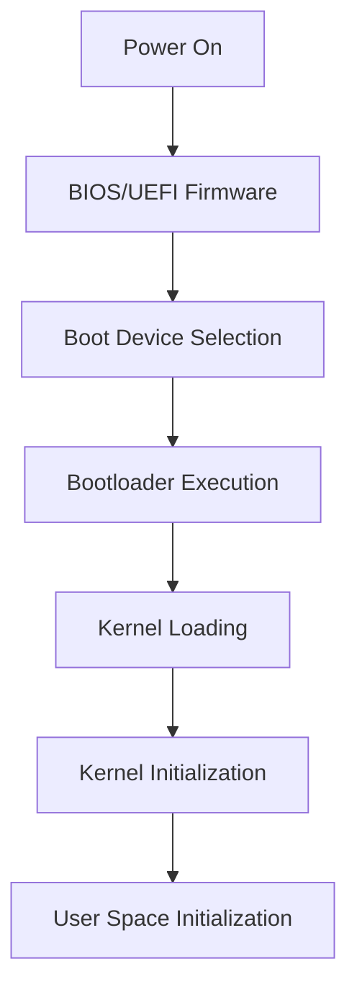

# Kernel Initialization

## Introduction

When you turn on your computer, a complex sequence of operations begins before you see your familiar desktop environment. At the heart of this process lies **kernel initialization** - the critical phase where the core of your operating system (the kernel) comes to life and establishes control over your computer's hardware.

Kernel initialization is the foundation of any operating system. It's like the moment a conductor raises their baton before an orchestra begins to play - everything that follows depends on this crucial starting point being executed correctly.

In this guide, we'll explore how operating systems initialize their kernels, breaking down the complex process into understandable steps for beginners. We'll examine real code examples and understand the fundamental concepts that allow modern computers to boot successfully.

## What is a Kernel?

Before diving into initialization, let's clarify what a kernel actually is:

The **kernel** is the central component of an operating system that:
- Acts as a bridge between applications and hardware
- Manages system resources (CPU, memory, devices)
- Provides essential services to other parts of the operating system
- Implements security and protection mechanisms

Think of the kernel as the "heart" of your operating system - without it, nothing else can function.

## The Boot Process: Before the Kernel

To understand kernel initialization, we need to briefly look at what happens before the kernel even loads:



1. **Power On**: The computer's hardware initializes
2. **BIOS/UEFI**: Firmware performs hardware checks (POST - Power-On Self Test)
3. **Boot Device Selection**: System chooses where to boot from
4. **Bootloader**: A small program that loads the kernel (e.g., GRUB for Linux)
5. **Kernel Loading**: The kernel is loaded into memory

Only after these steps does kernel initialization begin.

## Kernel Initialization Steps

Let's break down the major steps involved in kernel initialization:

### 1. Early Hardware Setup

The kernel begins by setting up basic hardware access and initializing core CPU features.

```c
void early_hardware_setup(void) {
    // Disable interrupts during initialization
    disable_interrupts();
    
    // Set up basic CPU features
    init_cpu_features();
    
    // Configure basic memory regions
    setup_initial_memory_map();
    
    // Initialize console for early output
    init_early_console();
    
    console_print("Early hardware initialization complete
");
}
```

In this early phase, the kernel usually:
- Disables hardware interrupts to prevent conflicts
- Sets up CPU-specific features (like protected mode on x86)
- Configures a minimal memory map
- Initializes a basic console for debugging messages

### 2. Memory Management Initialization

Memory management is critical - the kernel must set up paging, memory regions, and memory allocators.

```c
void init_memory_management(void) {
    // Initialize physical memory manager
    init_physical_memory();
    
    // Set up virtual memory (paging)
    init_virtual_memory();
    
    // Initialize kernel heap
    init_kernel_heap();
    
    // Set up memory protection
    setup_memory_protection();
    
    console_print("Memory management initialized
");
}
```

This step involves:
- Setting up the physical memory manager to track available RAM
- Configuring virtual memory and paging tables
- Creating the kernel heap for dynamic memory allocation
- Establishing memory protection mechanisms

### 3. Initializing Essential Subsystems

Next, the kernel initializes critical subsystems needed for basic operation.

```c
void init_essential_subsystems(void) {
    // Initialize interrupt controller
    init_interrupt_controller();
    
    // Set up system timer
    init_system_timer();
    
    // Initialize basic device drivers
    init_essential_drivers();
    
    console_print("Essential subsystems initialized
");
}
```

These subsystems typically include:
- Interrupt controllers (like PIC or APIC on x86)
- System timers for scheduling
- Essential device drivers (keyboard, display, disk controllers)

### 4. Process Management Setup

The kernel must set up structures for process management before any processes can run.

```c
void init_process_management(void) {
    // Initialize process table
    init_process_table();
    
    // Set up scheduler
    init_scheduler();
    
    // Create initial kernel threads
    create_initial_kernel_threads();
    
    // Set up idle process
    create_idle_process();
    
    console_print("Process management initialized
");
}
```

This includes:
- Creating process tables and data structures
- Setting up the scheduler
- Creating initial kernel threads
- Establishing the idle process (runs when nothing else needs CPU time)

### 5. File System Initialization

Most operating systems need to set up at least a basic file system.

```c
void init_filesystem(void) {
    // Initialize Virtual File System (VFS) layer
    init_vfs();
    
    // Set up root filesystem
    mount_root_filesystem();
    
    // Initialize standard file descriptors
    setup_standard_descriptors();
    
    console_print("Filesystem initialized
");
}
```

This typically involves:
- Setting up the Virtual File System (VFS) layer
- Mounting the root filesystem
- Initializing standard file descriptors (stdin, stdout, stderr)

### 6. Final Initialization

The final stage prepares the system to begin normal operation.

```c
void complete_initialization(void) {
    // Initialize remaining hardware
    init_remaining_hardware();
    
    // Set up system calls
    init_syscall_interface();
    
    // Enable interrupts
    enable_interrupts();
    
    // Start scheduler
    start_scheduler();
    
    console_print("Kernel initialization complete, starting system
");
}
```

This includes:
- Initializing remaining hardware devices
- Setting up the system call interface
- Enabling interrupts
- Starting the scheduler to begin process execution

## Real-World Example: Linux Kernel Initialization

Let's look at a simplified version of how the Linux kernel initializes:

```c
// This is a simplified representation of Linux's start_kernel function
void start_kernel(void) {
    // Disable interrupts
    local_irq_disable();
    
    // Early architecture setup
    setup_arch();
    
    // Set up early console
    console_init();
    
    // Initialize memory management
    mm_init();
    
    // Set up scheduler
    sched_init();
    
    // Initialize timekeeping
    time_init();
    
    // Set up interrupts
    init_IRQ();
    
    // Initialize the rest of the kernel
    rest_init();
}

void rest_init(void) {
    // Create initial kernel thread
    kernel_thread(kernel_init, NULL, CLONE_FS);
    
    // Become the idle task
    cpu_startup_entry(CPUHP_ONLINE);
}

void kernel_init(void) {
    // Mount root filesystem
    mount_root_fs();
    
    // Execute init process
    run_init_process("/sbin/init");
}
```

The actual Linux kernel initialization is much more complex, but this gives you a sense of the overall flow.

## Common Challenges in Kernel Initialization

Kernel initialization faces several challenges:

1. **Chicken-and-egg problems**: Many subsystems depend on each other, requiring careful initialization ordering.

2. **Hardware diversity**: The kernel must support a wide range of hardware configurations.

3. **Minimal environment**: Early initialization occurs with limited resources and support.

4. **Error handling**: Errors during kernel initialization can be catastrophic and difficult to recover from.

Here's how these challenges are typically addressed:

```c
// Example of handling hardware diversity
void init_device_drivers(void) {
    // Detect hardware configuration
    enum_hardware_devices();
    
    // For each detected device
    for (i = 0; i < detected_devices_count; i++) {
        // Try to initialize with appropriate driver
        if (init_device_driver(detected_devices[i]) != SUCCESS) {
            // Log error but continue with other devices
            log_error("Failed to initialize device %d
", i);
        }
    }
}
```

## Implementing a Simple Kernel Initializer

Let's create a very simple kernel initializer to demonstrate the concepts:

```c
// Entry point - this is where the bootloader transfers control
void kernel_main(uint32_t multiboot_magic, void* multiboot_info) {
    // Initialize basic console for output
    init_console();
    
    console_print("Starting kernel initialization...
");
    
    // Check bootloader magic number
    if (multiboot_magic != MULTIBOOT_MAGIC) {
        console_print("ERROR: Invalid bootloader magic number!
");
        halt_system();
    }
    
    // Initialize basic hardware
    init_gdt();        // Global Descriptor Table
    init_idt();        // Interrupt Descriptor Table
    
    console_print("CPU tables initialized
");
    
    // Initialize memory management
    uint32_t mem_size = detect_memory_size(multiboot_info);
    init_memory(mem_size);
    
    console_print("Memory initialized, ");
    console_print_dec(mem_size / (1024 * 1024));
    console_print(" MB available
");
    
    // Initialize interrupt controller
    init_pic();
    
    // Initialize system timer (e.g., 100Hz)
    init_timer(100);
    
    console_print("Interrupts and timer initialized
");
    
    // Enable interrupts
    enable_interrupts();
    
    console_print("Kernel initialization complete
");
    
    // Enter main system loop
    while (1) {
        // Halt CPU until next interrupt
        halt_cpu();
    }
}
```

Output of this simple kernel might look like:

```
Starting kernel initialization...
CPU tables initialized
Memory initialized, 64 MB available
Interrupts and timer initialized
Kernel initialization complete
```

## Real-World Applications

Kernel initialization has important real-world applications:

### 1. Embedded Systems

Embedded systems often have specialized kernel initialization:

```c
void embedded_kernel_init(void) {
    // Initialize hardware specific to this device
    init_custom_hardware();
    
    // Set up real-time scheduler
    init_realtime_scheduler();
    
    // Start the main application directly
    start_main_application();
}
```

Embedded systems typically have simpler initialization because:
- Hardware configuration is fixed and known
- Resources are more limited
- Real-time requirements demand predictable initialization

### 2. Virtual Machines

Virtual machine kernels initialize differently:

```c
void vm_kernel_init(void) {
    // Detect virtualization environment
    detect_hypervisor();
    
    // Set up paravirtualized devices
    init_paravirt_devices();
    
    // Use hypervisor services when available
    if (hypervisor_present) {
        setup_hypercall_interface();
    }
    
    // Continue with normal initialization...
}
```

Virtual machines can take advantage of:
- Paravirtualization (direct cooperation with the hypervisor)
- Simplified hardware models
- Hypervisor services

## Summary

Kernel initialization is the foundation upon which an operating system is built. We've explored:

- How the kernel fits into the overall boot process
- The key steps in kernel initialization:
  - Early hardware setup
  - Memory management initialization
  - Essential subsystems setup
  - Process management configuration
  - File system initialization
  - Final preparation for normal operation
- Common challenges and real-world applications

Understanding kernel initialization provides deep insights into how operating systems work at their most fundamental level. While we've simplified many concepts for clarity, this overview provides a solid foundation for further exploration.

## Exercises

1. **Basic Understanding**: Draw a flowchart of the kernel initialization process with the major steps.

2. **Code Exploration**: Look at the source code for a real operating system kernel (Linux is well-documented) and identify the main initialization functions.

3. **Implementation Challenge**: Try to implement a "hello world" kernel that just initializes enough to display text on the screen.

4. **Research Project**: Compare kernel initialization between different operating systems (Windows, Linux, macOS) and note the similarities and differences.

5. **Advanced Challenge**: Extend the simple kernel we implemented with additional features like keyboard input or memory allocation.

## Further Resources

- **Books**: 
  - "Operating Systems: Three Easy Pieces" by Remzi H. Arpaci-Dusseau and Andrea C. Arpaci-Dusseau
  - "Linux Kernel Development" by Robert Love

- **Online Resources**:
  - The OSDev Wiki (osdev.org) has excellent tutorials on kernel development
  - Linux source code (especially init/main.c containing start_kernel)

- **Practical Projects**:
  - Try building a minimal OS with a project like ToaruOS or xv6
  - Experiment with QEMU or VirtualBox to run and test custom kernels