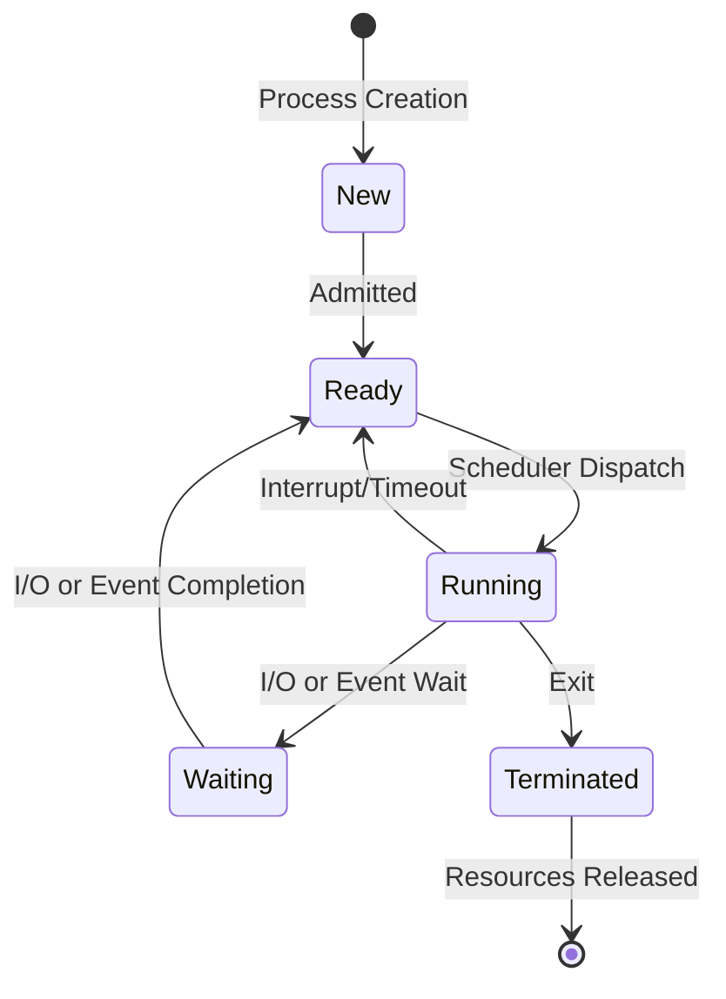
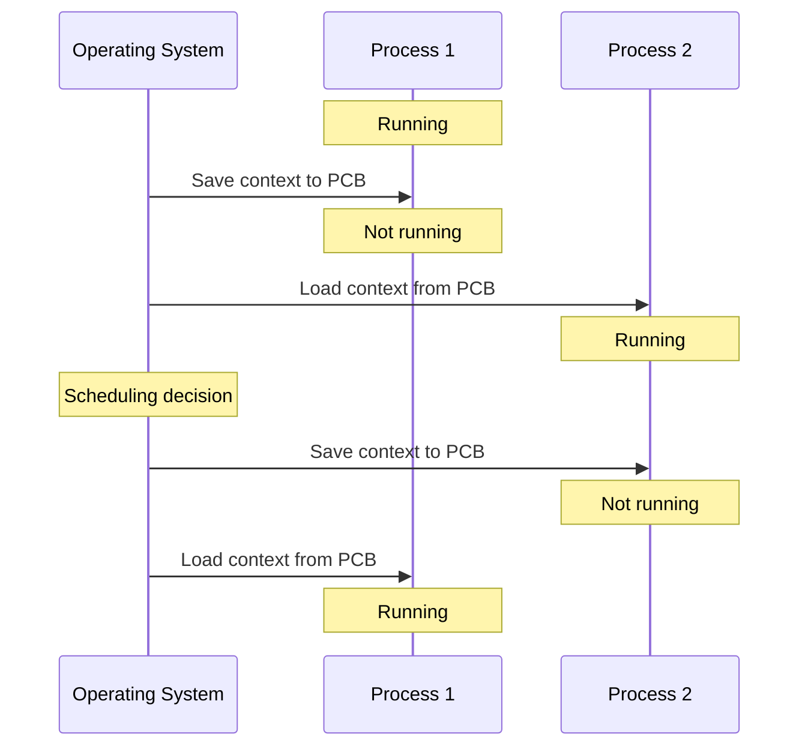

# Process Implementation

## Introduction

Processes are one of the fundamental concepts in operating systems. A process is simply a program in execution - but the way operating systems implement and manage these processes involves sophisticated mechanisms. Understanding process implementation helps you grasp how your computer can seemingly run multiple programs simultaneously and how the OS maintains order among competing resources.

In this tutorial, we'll explore how operating systems implement processes, from creation to termination, and everything in between. We'll examine the data structures that represent processes, scheduling algorithms that determine which process runs when, and the context switching mechanism that enables multitasking.

## Process Representation: Process Control Blocks (PCBs)

At the core of process implementation is the **Process Control Block (PCB)**, sometimes called a **task control block**. The PCB is a data structure that contains all the information about a process that the OS needs to manage it.

Here's a simplified representation of a PCB in C:

```c
struct PCB {
    int process_id;             // Unique identifier for the process
    enum {READY, RUNNING, WAITING, TERMINATED} state;  // Current state
    int priority;               // Scheduling priority
    void* program_counter;      // Address of next instruction to execute
    void* registers[REG_COUNT]; // CPU register values
    void* memory_limits;        // Memory boundaries for the process
    list open_files;            // Table of open files
    PCB* parent_process;        // Link to parent process
    // Additional fields...
};
```

### Key Components of a PCB

1. **Process Identifier (PID)**: A unique number that identifies the process
2. **Process State**: Current state of the process (running, ready, waiting, etc.)
3. **Program Counter**: Address of the next instruction to be executed
4. **CPU Registers**: Contents of processor registers when the process is not running
5. **CPU Scheduling Information**: Priority and other scheduling parameters
6. **Memory Management Information**: Memory allocation information
7. **Accounting Information**: CPU time used, time limits, etc.
8. **I/O Status Information**: List of open files, pending I/O requests, etc.

## Process States and Transitions

Processes move through various states during their lifetime. Understanding these states and the transitions between them is crucial to understanding process implementation.



### Common Process States

1. **New**: The process is being created
2. **Ready**: The process is waiting to be assigned to a processor
3. **Running**: Instructions are being executed
4. **Waiting**: The process is waiting for some event to occur (I/O completion, etc.)
5. **Terminated**: The process has finished execution

## Process Creation

Process creation involves several steps:

1. **Assign a unique PID**: The OS generates a unique process identifier
2. **Allocate space for the PCB**: Memory is reserved for the process control block
3. **Allocate memory**: Space is allocated for the program code, stack, and heap
4. **Initialize the PCB**: Fill in initial values for PCB fields
5. **Set up appropriate links**: For example, add the process to scheduling queues
6. **Create or extend other data structures**: Update system-wide structures

In Unix-like systems, processes are created using the `fork()` system call, which creates a new process by duplicating an existing one. The new process (child) is almost identical to the creating process (parent).

```c
#include <stdio.h>
#include <unistd.h>

int main() {
    pid_t pid = fork();
    
    if (pid < 0) {
        // Error occurred
        fprintf(stderr, "Fork failed
");
        return 1;
    } else if (pid == 0) {
        // Child process
        printf("Child process, PID: %d
", getpid());
    } else {
        // Parent process
        printf("Parent process, PID: %d, Child PID: %d
", getpid(), pid);
    }
    
    return 0;
}
```

**Sample Output:**
```
Parent process, PID: 12345, Child PID: 12346
Child process, PID: 12346
```

After a `fork()`, the child process often calls `exec()` to replace its memory space with a new program.

## Process Scheduling

Process scheduling determines which process in the ready queue should be allocated the CPU. There are various scheduling algorithms, each with different goals and trade-offs:

### Common Scheduling Algorithms

1. **First-Come, First-Served (FCFS)**
   - Processes are executed in the order they arrive
   - Simple but can lead to the "convoy effect" where short processes wait behind long ones

2. **Shortest Job First (SJF)**
   - Executes the process with the shortest expected execution time first
   - Optimal for minimizing average waiting time but requires knowing execution times in advance

3. **Priority Scheduling**
   - Each process is assigned a priority, and the CPU is allocated to the highest-priority process
   - Can lead to starvation of low-priority processes

4. **Round-Robin (RR)**
   - Each process gets a small unit of CPU time (time quantum), then is preempted
   - Good for time-sharing systems, provides better response time

Here's a simple implementation of a Round-Robin scheduler:

```c
void round_robin_scheduler(Process processes[], int n, int time_quantum) {
    int remaining_time[n];
    for (int i = 0; i < n; i++) {
        remaining_time[i] = processes[i].burst_time;
    }
    
    int time = 0;
    int completed = 0;
    
    printf("Gantt Chart:
");
    
    while (completed < n) {
        bool all_done = true;
        
        for (int i = 0; i < n; i++) {
            if (remaining_time[i] > 0) {
                all_done = false;
                
                if (remaining_time[i] > time_quantum) {
                    // Process runs for full time quantum
                    time += time_quantum;
                    remaining_time[i] -= time_quantum;
                    printf("P%d ", processes[i].id);
                } else {
                    // Process completes within time quantum
                    time += remaining_time[i];
                    printf("P%d ", processes[i].id);
                    remaining_time[i] = 0;
                    completed++;
                }
            }
        }
        
        if (all_done) break;
    }
    printf("
All processes completed at time %d
", time);
}
```

## Context Switching

Context switching is the process of saving the state (context) of a currently running process and loading the saved state of another process. This enables time-sharing and is a crucial aspect of multitasking.

Steps in a context switch:

1. Save the context (CPU registers, program counter, etc.) of the currently executing process in its PCB
2. Select the next process to run using the scheduling algorithm
3. Load the context of the selected process from its PCB
4. Update memory management structures if necessary
5. Resume execution of the selected process

Context switching incurs overhead, as the CPU spends time saving and restoring contexts rather than executing user processes. Operating systems aim to minimize this overhead.



## Process Termination

A process can terminate either:
- Voluntarily by calling an exit system call
- Involuntarily when an error occurs or when killed by another process

The termination process involves:

1. Releasing all allocated resources (memory, files, I/O devices)
2. Removing the PCB from system tables
3. Updating the status of the parent process if it's waiting for this process
4. Moving the process to the terminated state

In Unix-like systems, the `exit()` system call terminates a process, and the `wait()` system call allows a parent to wait for a child to terminate:

```c
#include <stdio.h>
#include <stdlib.h>
#include <unistd.h>
#include <sys/wait.h>

int main() {
    pid_t pid = fork();
    
    if (pid < 0) {
        fprintf(stderr, "Fork failed
");
        return 1;
    } else if (pid == 0) {
        // Child process
        printf("Child process is running
");
        exit(42);  // Exit with status 42
    } else {
        // Parent process
        int status;
        wait(&status);  // Wait for child to terminate
        
        if (WIFEXITED(status)) {
            printf("Child exited with status: %d
", WEXITSTATUS(status));
        }
    }
    
    return 0;
}
```

**Sample Output:**
```
Child process is running
Child exited with status: 42
```

## Inter-Process Communication (IPC)

Processes often need to communicate with each other. Operating systems provide various mechanisms for IPC:

1. **Pipes**: Unidirectional communication channel
2. **Message Queues**: Permit processes to exchange messages
3. **Shared Memory**: Allow multiple processes to access a common memory segment
4. **Semaphores**: Used for synchronization between processes
5. **Sockets**: Enable communication between processes on different machines

Here's an example of using pipes for IPC:

```c
#include <stdio.h>
#include <unistd.h>
#include <string.h>

int main() {
    int pipe_fd[2];
    pid_t pid;
    char message[] = "Hello from parent!";
    char buffer[100];
    
    // Create pipe
    if (pipe(pipe_fd) == -1) {
        fprintf(stderr, "Pipe creation failed
");
        return 1;
    }
    
    pid = fork();
    
    if (pid < 0) {
        fprintf(stderr, "Fork failed
");
        return 1;
    } else if (pid == 0) {
        // Child process
        close(pipe_fd[1]);  // Close write end
        
        read(pipe_fd[0], buffer, sizeof(buffer));
        printf("Child received: %s
", buffer);
        
        close(pipe_fd[0]);
    } else {
        // Parent process
        close(pipe_fd[0]);  // Close read end
        
        write(pipe_fd[1], message, strlen(message) + 1);
        printf("Parent sent: %s
", message);
        
        close(pipe_fd[1]);
    }
    
    return 0;
}
```

**Sample Output:**
```
Parent sent: Hello from parent!
Child received: Hello from parent!
```

## Real-World Applications

Understanding process implementation is crucial for many real-world scenarios:

### 1. Web Servers

Web servers like Apache or Nginx create a new process (or thread) for each client connection. The server must efficiently manage these processes to handle thousands of concurrent connections.

### 2. Smartphone Operating Systems

Mobile operating systems like Android and iOS implement sophisticated process management to:
- Preserve battery life by suspending background processes
- Provide responsive UI by prioritizing foreground processes
- Manage limited resources by terminating less important processes when memory is low

### 3. Task Managers

Applications like Task Manager (Windows) or Activity Monitor (macOS) display information about running processes, including CPU usage, memory consumption, and other resources. This information comes directly from the PCBs and other OS data structures.

## Summary

Process implementation is a fundamental aspect of operating systems that enables multitasking and resource management. Key components include:

- **Process Control Blocks (PCBs)**: Data structures that maintain all information about processes
- **Process States**: Different states a process can be in (new, ready, running, waiting, terminated)
- **Process Creation**: How new processes are created and initialized
- **Process Scheduling**: Algorithms that determine which process runs when
- **Context Switching**: The mechanism that enables time-sharing between processes
- **Process Termination**: How processes end and release resources
- **Inter-Process Communication**: Methods for processes to communicate and synchronize

Understanding these concepts is essential for anyone working with operating systems, developing multi-process applications, or optimizing system performance.

## Exercises

1. Implement a simple FCFS (First-Come, First-Served) scheduler and compare its performance with a Round-Robin scheduler for a given set of processes.

2. Write a program that creates a child process using `fork()`, has the child calculate the factorial of a number, and then communicates the result back to the parent using a pipe.

3. Modify the process state diagram to include suspension states (suspended ready and suspended blocked) and explain when and why an OS might suspend processes.

4. Research and compare how process implementation differs in Windows, Linux, and macOS. What unique features or approaches does each OS take?

5. Implement a simple program that demonstrates priority inversion, where a low-priority process indirectly blocks a high-priority process. How might an OS mitigate this problem?

## Additional Resources

- **Books**:
  - "Operating System Concepts" by Silberschatz, Galvin, and Gagne
  - "Modern Operating Systems" by Andrew S. Tanenbaum

- **Online Courses**:
  - Operating Systems courses on platforms like Coursera, edX, or MIT OpenCourseWare

- **Documentation**:
  - The Linux Kernel documentation on process management
  - The POSIX standard for system calls related to process management