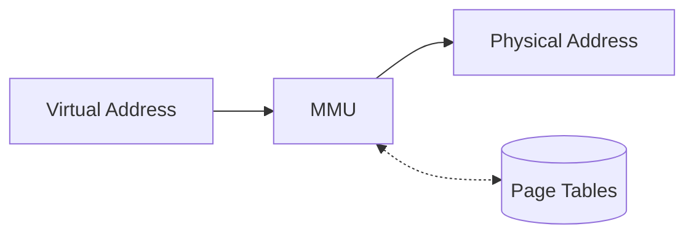

# Memory Management Implementation

## Introduction

Memory management is a critical component of any operating system. It's responsible for allocating memory to processes, managing the hierarchy of storage, and ensuring that processes can't access memory that doesn't belong to them. In this tutorial, we'll explore how memory management is implemented in modern operating systems, focusing on techniques like virtual memory, paging, and segmentation.

Whether you're building your own operating system or just want to understand how your computer manages memory behind the scenes, this guide will walk you through the core concepts and implementation details.

## Memory Management Basics

Before diving into implementation details, let's understand some fundamental concepts:

### Physical vs. Virtual Memory

- **Physical Memory**: The actual RAM hardware in your computer.
- **Virtual Memory**: An abstraction created by the OS that gives each process the illusion of having its own dedicated memory space.

### Why Virtual Memory?

Virtual memory solves several problems:

1. **Isolation**: Prevents processes from accessing each other's memory.
2. **Larger Address Spaces**: Allows programs to use more memory than physically available.
3. **Memory Efficiency**: Enables sharing of memory between processes when appropriate.
4. **Simplified Programming**: Developers don't need to worry about physical memory constraints.

## Implementing Virtual Memory

Let's see how we can implement a basic virtual memory system:

### Address Translation

At the core of virtual memory is address translation: converting virtual addresses (used by programs) to physical addresses (in RAM).



The Memory Management Unit (MMU) is hardware that performs this translation using data structures called page tables.

### Page Tables

Here's a simple implementation of a page table in C:

```c
#define PAGE_SIZE 4096
#define NUM_PAGES 1024

typedef struct {
    uint32_t frame_number : 20;  // Physical frame number
    uint8_t present : 1;         // Is the page in physical memory?
    uint8_t writable : 1;        // Can the page be written to?
    uint8_t user_accessible : 1; // Can user-mode code access this page?
    uint8_t accessed : 1;        // Has the page been accessed?
    uint8_t dirty : 1;           // Has the page been modified?
} PageTableEntry;

typedef struct {
    PageTableEntry entries[NUM_PAGES];
} PageTable;

// Initialize a page table
void init_page_table(PageTable* table) {
    for (int i = 0; i < NUM_PAGES; i++) {
        table->entries[i].present = 0;
        table->entries[i].writable = 0;
        table->entries[i].user_accessible = 0;
        table->entries[i].accessed = 0;
        table->entries[i].dirty = 0;
        table->entries[i].frame_number = 0;
    }
}
```

### Address Translation Example

Let's see how a virtual address gets translated to a physical address:

```c
uint32_t translate_address(PageTable* table, uint32_t virtual_address) {
    uint32_t page_number = virtual_address / PAGE_SIZE;
    uint32_t offset = virtual_address % PAGE_SIZE;
    
    if (page_number >= NUM_PAGES) {
        // Address out of range
        return 0xFFFFFFFF;  // Invalid address
    }
    
    PageTableEntry entry = table->entries[page_number];
    
    if (!entry.present) {
        // Page fault - the page is not in physical memory
        handle_page_fault(table, page_number);
        entry = table->entries[page_number];  // Get updated entry
    }
    
    // Construct physical address
    uint32_t physical_address = (entry.frame_number * PAGE_SIZE) + offset;
    
    return physical_address;
}
```

Example usage:

```c
int main() {
    PageTable table;
    init_page_table(&table);
    
    // Map virtual page 10 to physical frame 25
    table.entries[10].present = 1;
    table.entries[10].writable = 1;
    table.entries[10].frame_number = 25;
    
    // Translate a virtual address
    uint32_t virtual_address = 10 * PAGE_SIZE + 200;  // Page 10, offset 200
    uint32_t physical_address = translate_address(&table, virtual_address);
    
    printf("Virtual address 0x%x maps to physical address 0x%x
", 
           virtual_address, physical_address);
    
    return 0;
}
```

Output:
```
Virtual address 0xa0c8 maps to physical address 0x190c8
```

## Paging Implementation

Paging is the most common technique used to implement virtual memory. It divides memory into fixed-size blocks called pages.

### Multi-level Page Tables

Modern systems use multi-level page tables to save memory:


Here's a two-level page table implementation:

```c
#define PAGE_SIZE 4096
#define ENTRIES_PER_TABLE 1024

typedef struct {
    uint32_t present : 1;
    uint32_t writable : 1;
    uint32_t user_accessible : 1;
    uint32_t page_table_addr : 20;
} PageDirectoryEntry;

typedef struct {
    uint32_t present : 1;
    uint32_t writable : 1;
    uint32_t user_accessible : 1;
    uint32_t frame_addr : 20;
} PageTableEntry;

typedef struct {
    PageDirectoryEntry entries[ENTRIES_PER_TABLE];
} PageDirectory;

typedef struct {
    PageTableEntry entries[ENTRIES_PER_TABLE];
} PageTable;

uint32_t translate_address_two_level(PageDirectory* dir, uint32_t virtual_address) {
    uint32_t dir_index = (virtual_address >> 22) & 0x3FF;
    uint32_t table_index = (virtual_address >> 12) & 0x3FF;
    uint32_t offset = virtual_address & 0xFFF;
    
    PageDirectoryEntry dir_entry = dir->entries[dir_index];
    if (!dir_entry.present) {
        // Directory entry not present
        handle_page_fault(dir, virtual_address);
        dir_entry = dir->entries[dir_index];
    }
    
    PageTable* table = (PageTable*)(dir_entry.page_table_addr << 12);
    PageTableEntry table_entry = table->entries[table_index];
    
    if (!table_entry.present) {
        // Page not present
        handle_page_fault(dir, virtual_address);
        table_entry = table->entries[table_index];
    }
    
    return (table_entry.frame_addr << 12) | offset;
}
```

## Page Fault Handling

A page fault occurs when a program tries to access a page that isn't currently in physical memory.

```c
void handle_page_fault(PageTable* table, uint32_t page_number) {
    // 1. Find a free frame in physical memory (or evict one)
    uint32_t frame_number = find_free_frame();
    
    if (frame_number == NO_FREE_FRAMES) {
        // Implement page replacement algorithm
        frame_number = evict_page();
    }
    
    // 2. Load the page from disk into the physical frame
    load_page_from_disk(page_number, frame_number);
    
    // 3. Update the page table
    table->entries[page_number].present = 1;
    table->entries[page_number].frame_number = frame_number;
}
```

## Page Replacement Algorithms

When physical memory is full, the OS must decide which page to evict. Here are a few common algorithms:

### 1. FIFO (First-In, First-Out)

```c
typedef struct {
    uint32_t page_numbers[MAX_FRAMES];
    int front;
    int rear;
    int count;
} FIFOQueue;

uint32_t fifo_page_replacement(FIFOQueue* queue) {
    uint32_t victim = queue->page_numbers[queue->front];
    queue->front = (queue->front + 1) % MAX_FRAMES;
    queue->count--;
    return victim;
}
```

### 2. LRU (Least Recently Used)

```c
typedef struct {
    uint32_t page_number;
    uint64_t last_used_time;
} PageInfo;

uint32_t lru_page_replacement(PageInfo pages[MAX_FRAMES], int num_frames) {
    uint32_t victim_page = 0;
    uint64_t oldest_time = UINT64_MAX;
    
    for (int i = 0; i < num_frames; i++) {
        if (pages[i].last_used_time < oldest_time) {
            oldest_time = pages[i].last_used_time;
            victim_page = pages[i].page_number;
        }
    }
    
    return victim_page;
}
```

### 3. Clock Algorithm (Approximated LRU)

```c
typedef struct {
    uint32_t page_numbers[MAX_FRAMES];
    uint8_t referenced[MAX_FRAMES];
    int hand;  // Clock hand pointer
} ClockAlgorithm;

uint32_t clock_page_replacement(ClockAlgorithm* clock, int num_frames) {
    while (1) {
        if (clock->referenced[clock->hand] == 0) {
            uint32_t victim = clock->page_numbers[clock->hand];
            clock->hand = (clock->hand + 1) % num_frames;
            return victim;
        }
        
        // Give the page a second chance
        clock->referenced[clock->hand] = 0;
        clock->hand = (clock->hand + 1) % num_frames;
    }
}
```

## Memory Segmentation

Segmentation is another memory management technique that divides memory into segments of variable size.

```c
typedef struct {
    uint32_t base_address;
    uint32_t limit;
    uint8_t present : 1;
    uint8_t writable : 1;
    uint8_t user_accessible : 1;
} SegmentDescriptor;

uint32_t translate_segmented_address(SegmentDescriptor* segment, uint32_t offset) {
    if (!segment->present) {
        // Segment not in memory
        handle_segment_fault(segment);
    }
    
    if (offset > segment->limit) {
        // Segmentation fault
        handle_segmentation_violation();
        return 0xFFFFFFFF;  // Invalid address
    }
    
    return segment->base_address + offset;
}
```

## Combining Segmentation and Paging

Modern systems often combine both approaches:


## The TLB (Translation Lookaside Buffer)

Address translation can be slow, so CPUs include a special cache called the TLB:

```c
#define TLB_SIZE 64

typedef struct {
    uint32_t virtual_page;
    uint32_t physical_frame;
    uint8_t valid : 1;
} TLBEntry;

typedef struct {
    TLBEntry entries[TLB_SIZE];
} TLB;

uint32_t tlb_lookup(TLB* tlb, uint32_t virtual_page) {
    for (int i = 0; i < TLB_SIZE; i++) {
        if (tlb->entries[i].valid && tlb->entries[i].virtual_page == virtual_page) {
            return tlb->entries[i].physical_frame;
        }
    }
    
    // TLB miss
    return 0xFFFFFFFF;
}

void tlb_insert(TLB* tlb, uint32_t virtual_page, uint32_t physical_frame) {
    // Simple replacement policy: replace the first entry
    static int next_index = 0;
    
    tlb->entries[next_index].virtual_page = virtual_page;
    tlb->entries[next_index].physical_frame = physical_frame;
    tlb->entries[next_index].valid = 1;
    
    next_index = (next_index + 1) % TLB_SIZE;
}
```

## Memory Protection

Memory protection ensures processes can only access memory they're allowed to:

```c
bool check_memory_access(PageTableEntry* entry, uint8_t access_type) {
    if (!entry->present) {
        return false;  // Page not present
    }
    
    if (access_type == WRITE_ACCESS && !entry->writable) {
        return false;  // Write to read-only page
    }
    
    if (access_type == USER_ACCESS && !entry->user_accessible) {
        return false;  // User mode accessing kernel-only page
    }
    
    return true;
}
```

## Practical Example: Implementing a Memory Allocator

Let's implement a simple memory allocator (similar to `malloc`):

```c
#define HEAP_SIZE 1048576  // 1 MB heap

typedef struct Block {
    size_t size;
    int free;
    struct Block* next;
} Block;

static char heap[HEAP_SIZE];
static Block* free_list = NULL;

void init_allocator() {
    // Initialize the heap with a single free block
    free_list = (Block*)heap;
    free_list->size = HEAP_SIZE - sizeof(Block);
    free_list->free = 1;
    free_list->next = NULL;
}

void* my_malloc(size_t size) {
    // Align size to 8 bytes
    size = (size + 7) & ~7;
    
    Block* curr = free_list;
    Block* prev = NULL;
    
    // First-fit algorithm
    while (curr) {
        if (curr->free && curr->size >= size) {
            // Found a suitable block
            if (curr->size > size + sizeof(Block) + 8) {
                // Split the block if it's large enough
                Block* new_block = (Block*)((char*)curr + sizeof(Block) + size);
                new_block->size = curr->size - size - sizeof(Block);
                new_block->free = 1;
                new_block->next = curr->next;
                
                curr->size = size;
                curr->next = new_block;
            }
            
            curr->free = 0;
            return (void*)((char*)curr + sizeof(Block));
        }
        
        prev = curr;
        curr = curr->next;
    }
    
    // No suitable block found
    return NULL;
}

void my_free(void* ptr) {
    if (!ptr) return;
    
    // Get the block header
    Block* block = (Block*)((char*)ptr - sizeof(Block));
    
    // Mark the block as free
    block->free = 1;
    
    // Merge with adjacent free blocks
    Block* curr = free_list;
    
    while (curr) {
        if (curr->free && (char*)curr + sizeof(Block) + curr->size == (char*)curr->next) {
            // Merge with next block
            curr->size += sizeof(Block) + curr->next->size;
            curr->next = curr->next->next;
            continue;
        }
        
        curr = curr->next;
    }
}
```

Example usage:

```c
int main() {
    init_allocator();
    
    int* arr = (int*)my_malloc(10 * sizeof(int));
    if (arr) {
        for (int i = 0; i < 10; i++) {
            arr[i] = i * 2;
        }
        
        printf("Array contents: ");
        for (int i = 0; i < 10; i++) {
            printf("%d ", arr[i]);
        }
        printf("
");
        
        my_free(arr);
    }
    
    return 0;
}
```

Output:
```
Array contents: 0 2 4 6 8 10 12 14 16 18
```

## Common Memory Management Issues

### 1. Memory Leaks

Memory leaks occur when allocated memory is never freed:

```c
void memory_leak_example() {
    while (1) {
        int* ptr = (int*)malloc(1000);
        // ptr is never freed!
        // Do something with ptr...
    }
    // System will eventually run out of memory
}
```

### 2. Segmentation Faults

Segmentation faults happen when a program tries to access memory it's not allowed to:

```c
void segfault_example() {
    int* ptr = NULL;
    *ptr = 42;  // Attempting to write to address 0 - this will cause a segfault
}
```

### 3. Buffer Overflows

Buffer overflows occur when writing beyond allocated memory:

```c
void buffer_overflow_example() {
    char buffer[10];
    strcpy(buffer, "This string is too long for the buffer!");
    // The above will write past the end of the buffer
}
```

## Summary

Memory management is a crucial part of operating system implementation. In this tutorial, we've covered:

1. Virtual memory concepts and address translation
2. Page tables and multi-level page tables
3. Page fault handling and page replacement algorithms
4. Segmentation and combined approaches
5. TLBs for performance optimization
6. Memory protection mechanisms
7. A practical implementation of a memory allocator

Understanding these concepts is essential for operating system developers and can help application developers write more efficient and reliable code.

## Exercises

1. Implement a buddy memory allocation system
2. Add support for shared memory between processes in the page table implementation
3. Implement the Second-Chance page replacement algorithm
4. Create a memory debugger that can detect memory leaks
5. Extend the memory allocator to include a `realloc` function

## Additional Resources

- "Operating Systems: Three Easy Pieces" by Remzi H. Arpaci-Dusseau and Andrea C. Arpaci-Dusseau
- "Operating System Concepts" by Abraham Silberschatz, Peter Baer Galvin, and Greg Gagne
- "Understanding the Linux Kernel" by Daniel P. Bovet and Marco Cesati
- The OSDev Wiki (https://wiki.osdev.org/Main_Page)