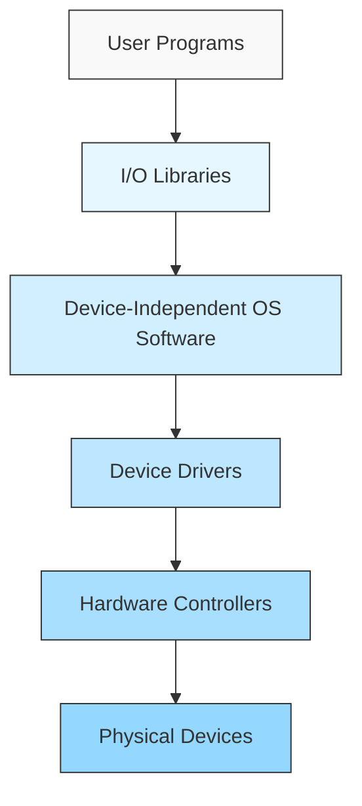

# I/O Subsystem Implementation

## Introduction

The Input/Output (I/O) subsystem is a critical component of any operating system, serving as the bridge between the CPU and external devices like keyboards, displays, disk drives, and network interfaces. Without a properly implemented I/O subsystem, a computer would be unable to interact with the outside world, making it essentially useless for practical applications.

In this guide, we'll explore how operating systems implement I/O subsystems, breaking down complex concepts into understandable components for beginners. You'll learn about the architectural layers, communication mechanisms, and techniques that enable your computer to efficiently manage data flow between its internal components and external devices.

## The I/O Subsystem Architecture

The I/O subsystem is organized into several layers, each providing different levels of abstraction and functionality.



Let's examine each layer:

1. **User Programs**: Applications that request I/O operations
2. **I/O Libraries**: Provide high-level functions for applications
3. **Device-Independent OS Software**: Handles common I/O functions
4. **Device Drivers**: Software that understands specific device details
5. **Hardware Controllers**: Physical chips that control devices
6. **Physical Devices**: Actual hardware components

## Device Drivers: The Core of I/O Implementation

Device drivers are specialized programs that allow the operating system to communicate with specific hardware devices. They translate general commands from the OS into specific instructions for the hardware.

### Basic Device Driver Structure

Here's a simplified example of what a basic device driver structure might look like:

```c
// Basic structure of a device driver
struct device_driver {
    // Initialization function
    int (*init)(struct device *dev);
    
    // Shutdown function
    void (*shutdown)(struct device *dev);
    
    // Read data from device
    int (*read)(struct device *dev, char *buffer, size_t size);
    
    // Write data to device
    int (*write)(struct device *dev, const char *buffer, size_t size);
    
    // Control operations
    int (*ioctl)(struct device *dev, unsigned int cmd, unsigned long arg);
};
```

When implemented, these functions contain the specific code needed to communicate with a particular device. For example, a keyboard driver's `read` function would retrieve keypresses, while a display driver's `write` function would output text or graphics to the screen.

## I/O Communication Techniques

Operating systems use several techniques to handle I/O operations efficiently:

### 1. Programmed I/O

In programmed I/O, the CPU directly controls data transfer by executing instructions that read from or write to I/O devices.

```c
// Simplified programmed I/O example
void write_byte_to_device(uint8_t data, uint16_t port) {
    // CPU instruction to send data to a device port
    outb(data, port);
    
    // Wait until device is ready to receive more data
    while ((inb(port + STATUS_REGISTER) & READY_BIT) == 0) {
        // CPU is busy-waiting
    }
}
```

**Advantages:**
- Simple to implement
- No special hardware required

**Disadvantages:**
- CPU is busy during I/O transfers (wasting processing power)
- Slow for large data transfers

### 2. Interrupt-Driven I/O

Interrupt-driven I/O allows the CPU to continue with other tasks while waiting for I/O operations to complete. When a device is ready, it sends an interrupt signal to the CPU.

```c
// Simplified interrupt-driven I/O

// Request data from device and continue execution
void request_data_from_device(uint16_t port) {
    // Tell device we want data
    outb(READ_COMMAND, port);
    
    // CPU continues with other work while device prepares data
}

// Interrupt handler called when device has data ready
void device_interrupt_handler(void) {
    // Read the data that's now ready
    uint8_t data = inb(DATA_PORT);
    
    // Process the data
    process_data(data);
    
    // Acknowledge the interrupt
    acknowledge_interrupt();
}
```

**Advantages:**
- CPU can perform other tasks while waiting for I/O
- Better CPU utilization

**Disadvantages:**
- More complex to implement
- Interrupt handling adds overhead

### 3. Direct Memory Access (DMA)

DMA allows devices to transfer data directly to/from memory without CPU involvement, except at the beginning and end of the transfer.

```c
// Simplified DMA setup
void setup_dma_transfer(void *buffer, size_t size, uint8_t device_channel) {
    // Set up the DMA controller
    outb(device_channel, DMA_CHANNEL_REG);
    outb(size & 0xFF, DMA_COUNT_REG);        // Low byte of count
    outb(size >> 8, DMA_COUNT_REG);          // High byte of count
    outb((uintptr_t)buffer & 0xFF, DMA_ADDR_REG);  // Low byte of address
    outb(((uintptr_t)buffer >> 8) & 0xFF, DMA_ADDR_REG);  // Mid byte of address
    
    // Start the transfer
    outb(DMA_START_COMMAND, DMA_COMMAND_REG);
    
    // CPU is now free to do other work until the DMA transfer completes
}
```

**Advantages:**
- Very efficient for large data transfers
- CPU is completely free during transfers

**Disadvantages:**
- Requires specialized hardware (DMA controller)
- More complex to set up and manage

## Buffering Strategies

Buffering is a technique used to temporarily store data during transfers between devices and memory. The operating system implements various buffering strategies to improve I/O performance:

### 1. Single Buffering

In single buffering, the OS allocates one buffer in memory for I/O operations.

```c
// Single buffering example
void single_buffer_read(int device_id, size_t bytes_to_read) {
    char buffer[BUFFER_SIZE];
    
    // Read data from device into buffer
    read_from_device(device_id, buffer, bytes_to_read);
    
    // Process data in buffer
    process_data(buffer, bytes_to_read);
}
```

### 2. Double Buffering

Double buffering uses two buffers, allowing the OS to process data in one buffer while filling the other.

```c
// Double buffering example
void double_buffer_read(int device_id, size_t bytes_to_read) {
    char buffer1[BUFFER_SIZE];
    char buffer2[BUFFER_SIZE];
    char *current_buffer = buffer1;
    char *processing_buffer = buffer2;
    
    // Initial read into first buffer
    read_from_device(device_id, current_buffer, bytes_to_read);
    
    while (more_data_available()) {
        // Swap buffers
        char *temp = current_buffer;
        current_buffer = processing_buffer;
        processing_buffer = temp;
        
        // Start reading into current buffer
        read_from_device(device_id, current_buffer, bytes_to_read);
        
        // Process data in processing buffer (concurrent with reading)
        process_data(processing_buffer, bytes_to_read);
    }
}
```

### 3. Circular Buffering

Circular buffering (ring buffer) uses a single buffer divided into multiple segments, with pointers to track which segments are being read and written.

```c
// Simplified circular buffer implementation
struct circular_buffer {
    char buffer[BUFFER_SIZE];
    int read_position;
    int write_position;
    int count;
};

void write_to_circular_buffer(struct circular_buffer *cb, char data) {
    if (cb->count < BUFFER_SIZE) {
        cb->buffer[cb->write_position] = data;
        cb->write_position = (cb->write_position + 1) % BUFFER_SIZE;
        cb->count++;
    }
}

char read_from_circular_buffer(struct circular_buffer *cb) {
    char data = 0;
    if (cb->count > 0) {
        data = cb->buffer[cb->read_position];
        cb->read_position = (cb->read_position + 1) % BUFFER_SIZE;
        cb->count--;
    }
    return data;
}
```

## I/O Scheduling

I/O scheduling is a technique used by operating systems to optimize the order in which I/O requests are serviced, particularly for disk operations.

### Common I/O Scheduling Algorithms

#### 1. First-Come, First-Served (FCFS)

Requests are processed in the order they arrive.

```c
// FCFS scheduler pseudocode
void fcfs_scheduler(Queue *request_queue) {
    while (!is_empty(request_queue)) {
        Request *req = dequeue(request_queue);
        process_io_request(req);
    }
}
```

#### 2. Shortest Seek Time First (SSTF)

Selects the request that requires the least head movement from the current position.

```c
// SSTF scheduler pseudocode
void sstf_scheduler(Queue *request_queue, int current_position) {
    while (!is_empty(request_queue)) {
        Request *closest_req = find_closest_request(request_queue, current_position);
        process_io_request(closest_req);
        current_position = closest_req->position;
        remove_from_queue(request_queue, closest_req);
    }
}
```

#### 3. SCAN (Elevator Algorithm)

The disk head moves in one direction servicing requests until it reaches the end, then reverses direction.

```c
// SCAN scheduler pseudocode
void scan_scheduler(Queue *request_queue, int current_position, Direction direction) {
    while (!is_empty(request_queue)) {
        // Service all requests in current direction
        while (has_requests_in_direction(request_queue, current_position, direction)) {
            Request *next_req = find_next_in_direction(request_queue, current_position, direction);
            process_io_request(next_req);
            current_position = next_req->position;
            remove_from_queue(request_queue, next_req);
        }
        
        // Reverse direction when end is reached
        direction = reverse_direction(direction);
    }
}
```

## Real-World Example: Implementing a Simple Character Device Driver

Let's look at a simplified example of a Linux character device driver that could be used for a custom hardware device:

```c
#include <linux/module.h>
#include <linux/kernel.h>
#include <linux/fs.h>
#include <linux/cdev.h>
#include <linux/device.h>
#include <linux/uaccess.h>

#define DEVICE_NAME "simpledev"
#define CLASS_NAME "simple"

static int major_number;
static struct class* device_class = NULL;
static struct device* device_device = NULL;
static char message[256] = {0};
static short message_size;

// Function prototypes
static int device_open(struct inode*, struct file*);
static int device_release(struct inode*, struct file*);
static ssize_t device_read(struct file*, char*, size_t, loff_t*);
static ssize_t device_write(struct file*, const char*, size_t, loff_t*);

// File operations structure
static struct file_operations fops = {
    .open = device_open,
    .read = device_read,
    .write = device_write,
    .release = device_release,
};

// Initialize the module
static int __init simple_device_init(void) {
    printk(KERN_INFO "SimpleDevice: Initializing the SimpleDevice LKM
");
    
    // Register the character device
    major_number = register_chrdev(0, DEVICE_NAME, &fops);
    if (major_number < 0) {
        printk(KERN_ALERT "SimpleDevice failed to register a major number
");
        return major_number;
    }
    
    // Register the device class
    device_class = class_create(THIS_MODULE, CLASS_NAME);
    if (IS_ERR(device_class)) {
        unregister_chrdev(major_number, DEVICE_NAME);
        printk(KERN_ALERT "Failed to register device class
");
        return PTR_ERR(device_class);
    }
    
    // Register the device driver
    device_device = device_create(device_class, NULL, MKDEV(major_number, 0), NULL, DEVICE_NAME);
    if (IS_ERR(device_device)) {
        class_destroy(device_class);
        unregister_chrdev(major_number, DEVICE_NAME);
        printk(KERN_ALERT "Failed to create the device
");
        return PTR_ERR(device_device);
    }
    
    printk(KERN_INFO "SimpleDevice: device class created correctly
");
    return 0;
}

// Cleanup the module
static void __exit simple_device_exit(void) {
    device_destroy(device_class, MKDEV(major_number, 0));
    class_unregister(device_class);
    class_destroy(device_class);
    unregister_chrdev(major_number, DEVICE_NAME);
    printk(KERN_INFO "SimpleDevice: Goodbye from the LKM!
");
}

// Device open function
static int device_open(struct inode* inodep, struct file* filep) {
    printk(KERN_INFO "SimpleDevice: Device has been opened
");
    return 0;
}

// Device release function
static int device_release(struct inode* inodep, struct file* filep) {
    printk(KERN_INFO "SimpleDevice: Device successfully closed
");
    return 0;
}

// Device read function
static ssize_t device_read(struct file* filep, char* buffer, size_t len, loff_t* offset) {
    int error_count = 0;
    
    // Copy data from kernel space to user space
    error_count = copy_to_user(buffer, message, message_size);
    
    if (error_count == 0) {
        printk(KERN_INFO "SimpleDevice: Sent %d characters to the user
", message_size);
        return message_size;
    }
    else {
        printk(KERN_INFO "SimpleDevice: Failed to send %d characters to the user
", error_count);
        return -EFAULT;
    }
}

// Device write function
static ssize_t device_write(struct file* filep, const char* buffer, size_t len, loff_t* offset) {
    // Copy data from user space to kernel space
    sprintf(message, "%s(%zu letters)", buffer, len);
    message_size = strlen(message);
    printk(KERN_INFO "SimpleDevice: Received %zu characters from the user
", len);
    return len;
}

// Register initialization and cleanup functions
module_init(simple_device_init);
module_exit(simple_device_exit);

MODULE_LICENSE("GPL");
MODULE_AUTHOR("Your Name");
MODULE_DESCRIPTION("A simple Linux char driver");
MODULE_VERSION("0.1");
```

To use this driver, you would compile it as a kernel module and then interact with it through the `/dev/simpledev` device file:

```bash
# Install the driver
sudo insmod simpledev.ko

# Write to the device
echo "Hello, I/O Subsystem" > /dev/simpledev

# Read from the device
cat /dev/simpledev

# Remove the driver
sudo rmmod simpledev
```

## Debugging I/O Subsystems

Debugging I/O subsystems can be challenging due to their interaction with hardware. Here are some approaches:

1. **Logging**: Insert print statements at key points in your driver code.

```c
// Debug logging in a device driver
#define DEBUG_LEVEL 3  // Higher means more verbose

#define DEBUG_PRINT(level, fmt, args...) \
    do { if (level <= DEBUG_LEVEL) printk(KERN_DEBUG "MyDriver [%d]: " fmt, level, ##args); } while (0)

// Usage
DEBUG_PRINT(1, "Critical error: %s
", error_message);
DEBUG_PRINT(3, "Data received: %x
", data);
```

2. **Hardware Simulation**: Use virtual hardware to test drivers before deploying them on real hardware.

3. **Trace Tools**: Use OS-specific tools like `strace` (Linux) or ETW (Windows) to trace I/O calls.

## Performance Considerations

Optimizing I/O performance is critical for overall system responsiveness:

1. **Minimize Context Switches**: Each transition between user and kernel mode adds overhead.

2. **Use Asynchronous I/O**: Allow the application to continue processing while I/O operations complete.

```c
// Example of asynchronous I/O in Linux
#include <aio.h>

void async_read_example(int fd, void *buffer, size_t size) {
    struct aiocb cb;
    
    // Set up the AIO control block
    memset(&cb, 0, sizeof(struct aiocb));
    cb.aio_fildes = fd;
    cb.aio_buf = buffer;
    cb.aio_nbytes = size;
    
    // Start the asynchronous read
    if (aio_read(&cb) == -1) {
        perror("aio_read");
        exit(1);
    }
    
    // Continue with other work while read completes
    do_other_work();
    
    // Check if the read has completed
    while (aio_error(&cb) == EINPROGRESS) {
        // Still waiting, can do more work or yield
    }
    
    // Get the completion status
    int ret = aio_return(&cb);
    if (ret > 0) {
        printf("Successfully read %d bytes
", ret);
    } else {
        printf("Read failed
");
    }
}
```

3. **Batch Operations**: Combine multiple small I/O operations into fewer large ones.

4. **Memory-Mapped I/O**: Map device memory directly into the application's address space.

```c
// Memory-mapped I/O example
void *mmap_device_memory(off_t device_address, size_t length) {
    int fd = open("/dev/mem", O_RDWR | O_SYNC);
    if (fd == -1) {
        perror("open /dev/mem");
        return NULL;
    }
    
    void *mapped_base = mmap(0, length, PROT_READ | PROT_WRITE, MAP_SHARED, fd, device_address);
    close(fd);
    
    if (mapped_base == MAP_FAILED) {
        perror("mmap");
        return NULL;
    }
    
    return mapped_base;
}

// Usage
void access_device_register() {
    // Map a device register at physical address 0x1000
    volatile uint32_t *device_register = mmap_device_memory(0x1000, 4);
    
    if (device_register) {
        // Read from device
        uint32_t value = *device_register;
        
        // Write to device
        *device_register = 0x12345678;
        
        // Unmap when done
        munmap((void*)device_register, 4);
    }
}
```

## Summary

In this guide, we've explored the core concepts of I/O subsystem implementation in operating systems:

1. **Layered Architecture**: I/O subsystems are organized in layers from user applications down to physical devices.

2. **Device Drivers**: These form the core of I/O implementation, translating between OS requests and specific device commands.

3. **Communication Techniques**:
   - Programmed I/O: Simple but CPU-intensive
   - Interrupt-driven I/O: Better CPU utilization
   - Direct Memory Access (DMA): Most efficient for large transfers

4. **Buffering Strategies**: Single, double, and circular buffering techniques help optimize data flow.

5. **I/O Scheduling**: Algorithms like FCFS, SSTF, and SCAN help optimize the order of I/O requests.

6. **Real-world Implementation**: We saw a practical example of a character device driver.

7. **Optimization Techniques**: Asynchronous I/O, batching, and memory mapping help improve performance.

Understanding these concepts is essential for anyone interested in operating system design, embedded systems, or low-level programming.

## Exercises

1. **Basic Device Driver**: Modify the sample character device driver to add an `ioctl` function that supports at least two different control commands.

2. **Buffering Implementation**: Implement a circular buffer data structure in C that can be used for an I/O device.

3. **I/O Scheduler**: Write a simple program that simulates the SCAN (elevator) algorithm for disk scheduling.

4. **DMA Simulation**: Create a program that simulates DMA transfers between a device and memory.

5. **Research Project**: Compare I/O subsystem implementations across different operating systems (Windows, Linux, macOS) and write a brief report on their similarities and differences.

## Additional Resources

- **Books**:
  - "Operating System Concepts" by Silberschatz, Galvin, and Gagne
  - "Linux Device Drivers" by Jonathan Corbet, Alessandro Rubini, and Greg Kroah-Hartman

- **Online Tutorials**:
  - The Linux Kernel documentation (https://www.kernel.org/doc/)
  - Linux Device Drivers Tutorial (https://lwn.net/Kernel/LDD3/)

- **Courses**:
  - MIT's Operating System Engineering
  - Stanford's Operating Systems and Systems Programming

Remember that mastering I/O subsystem implementation requires both theoretical knowledge and practical experience. Start with simple projects and gradually work your way up to more complex implementations.