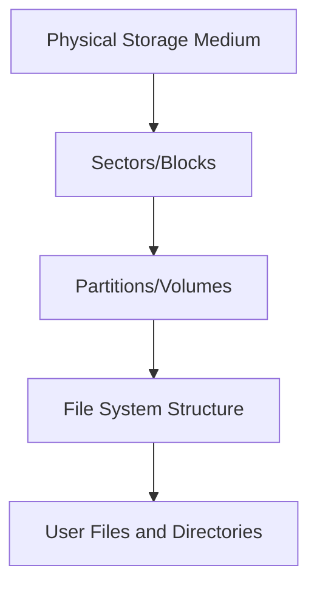
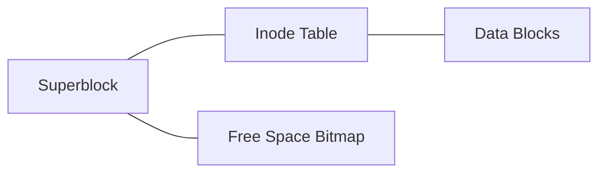
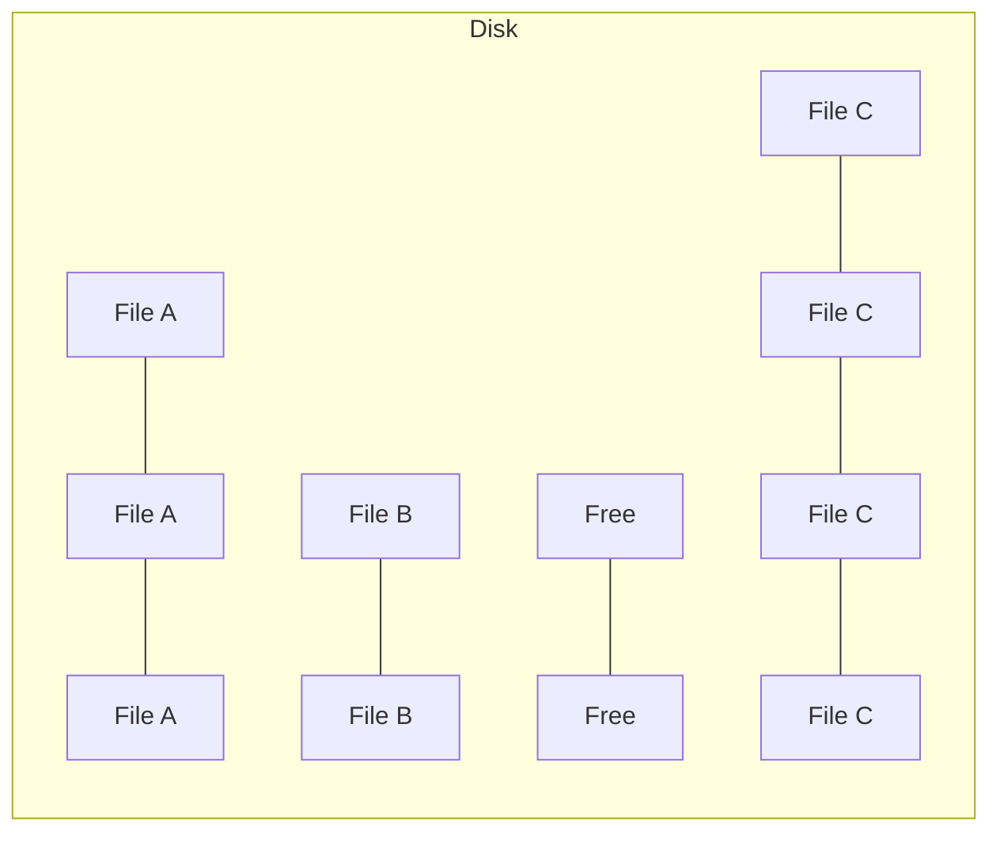
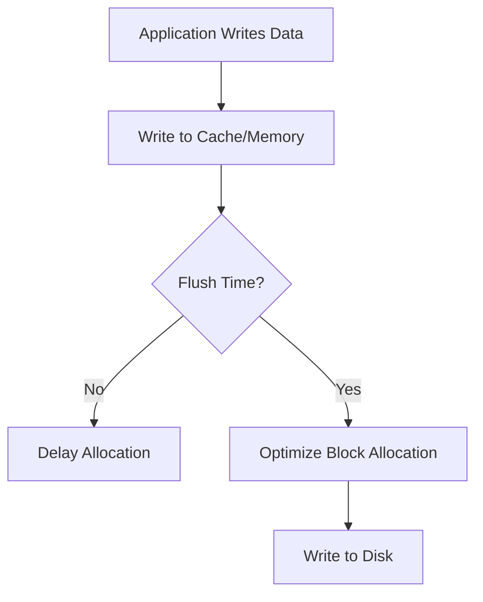
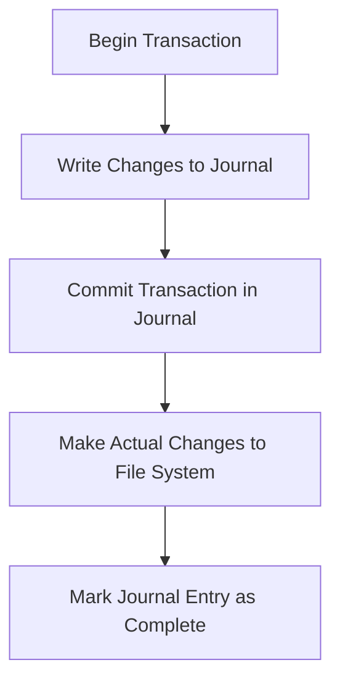

# File System Implementation

## Introduction

File systems are the backbone of data storage in operating systems. They provide a way to organize, store, retrieve, and manage data on storage devices. Understanding how file systems are implemented gives you insight into how your data is stored and accessed, which is crucial knowledge for any programmer.

In this tutorial, we'll explore the inner workings of file system implementation in operating systems, covering everything from basic disk organization to advanced file operations and performance optimization techniques.

## What is a File System?

A file system is a method and data structure that an operating system uses to control how data is stored and retrieved on storage devices like hard drives, SSDs, or flash storage. It defines:

- How files are named
- Where files are located on the storage medium
- How files are organized hierarchically
- How data within files is accessed
- How storage space is allocated and managed

## Key Components of File System Implementation

### 1. Disk Structure Organization

Storage devices are typically organized into several layers:



#### Physical Blocks and Sectors

At the lowest level, disk drives are divided into small fixed-size units:

- **Sector**: The smallest physical storage unit on a disk (traditionally 512 bytes)
- **Block**: The smallest logical unit that a file system works with (typically multiple sectors, e.g., 4KB)

```jsx
// Example of reading a disk block in C
#include <stdio.h>
#include <fcntl.h>
#include <unistd.h>

int main() {
    int fd;
    char buffer[4096]; // Typically a 4KB block
    
    fd = open("/dev/sda", O_RDONLY);
    if (fd < 0) {
        perror("Error opening disk");
        return 1;
    }
    
    // Read block #1000 (seek to position and read)
    lseek(fd, 1000 * 4096, SEEK_SET);
    read(fd, buffer, 4096);
    
    close(fd);
    return 0;
}
```

### 2. File System Structure

Most file systems include these key structures:

- **Superblock/Master File Table**: Contains overall file system information
- **Inode Table/File Records**: Stores metadata about individual files
- **Data Blocks**: Where actual file content is stored
- **Free Space Management**: Tracks available storage

Let's visualize a simplified file system structure:



#### Superblock

The superblock is the file system's master record, containing critical information:

```jsx
struct superblock {
    uint32_t magic_number;       // Identifies the file system type
    uint32_t block_size;         // Size of blocks in bytes
    uint64_t total_blocks;       // Total number of blocks on volume
    uint64_t free_blocks;        // Number of free blocks
    uint32_t inodes_count;       // Total number of inodes
    uint32_t free_inodes;        // Number of free inodes
    uint32_t blocks_per_group;   // Blocks in each block group
    time_t  last_mount_time;     // When the file system was last mounted
    time_t  last_write_time;     // When the superblock was last updated
};
```

#### Inodes (Index Nodes)

Inodes store metadata about files but not the actual filenames. Each file has one inode:

```jsx
struct inode {
    uint16_t mode;          // File type and permissions
    uint16_t uid;           // User ID of owner
    uint32_t size;          // File size in bytes
    time_t   atime;         // Last access time
    time_t   ctime;         // Creation time
    time_t   mtime;         // Last modification time
    uint32_t block_count;   // Number of blocks allocated
    uint32_t direct_blocks[12]; // Direct pointers to data blocks
    uint32_t indirect_block;    // Pointer to a block of pointers
    uint32_t double_indirect;   // Pointer to a block of indirect pointers
    uint32_t triple_indirect;   // Pointer to a block of double indirect pointers
};
```

### 3. File Allocation Methods

File systems use different methods to allocate disk space to files:

#### Contiguous Allocation

Files are stored in consecutive blocks on disk.

**Pros**: Simple and fast sequential access
**Cons**: External fragmentation, difficult to grow files



#### Linked Allocation

Each block contains a pointer to the next block of the file.

**Pros**: No external fragmentation
**Cons**: Slow random access, space overhead for pointers

```jsx
struct block {
    char data[BLOCK_SIZE - sizeof(int)];
    int next_block; // -1 for end of file
};
```

#### Indexed Allocation

A special index block contains pointers to all blocks of the file.

**Pros**: Supports direct access, easy to grow files
**Cons**: Overhead for small files, complex for very large files

This is what the ext4 file system uses with direct, indirect, double indirect, and triple indirect blocks.

### 4. Directory Implementation

Directories map filenames to their metadata (inodes):

```jsx
struct directory_entry {
    uint32_t inode_number;          // Inode number for this file
    uint16_t record_length;         // Length of this record
    uint8_t  name_length;           // Length of the filename
    uint8_t  file_type;             // Type of file
    char     name[FILENAME_MAX];    // The filename
};
```

## Practical Implementation: Creating a Simple File System

Let's walk through a simplified example of implementing a basic file system in C. This example creates an in-memory file system with basic operations:

```jsx
#include <stdio.h>
#include <stdlib.h>
#include <string.h>

#define BLOCK_SIZE 4096
#define MAX_BLOCKS 1024
#define MAX_FILES 128
#define MAX_FILENAME 32

// Simplified inode structure
typedef struct {
    char filename[MAX_FILENAME];
    int size;
    int block_pointers[10]; // Direct block pointers
    int is_used;
} inode_t;

// Our in-memory file system
typedef struct {
    char blocks[MAX_BLOCKS][BLOCK_SIZE]; // Data blocks
    int free_blocks[MAX_BLOCKS];         // 1 if free, 0 if used
    inode_t inodes[MAX_FILES];           // Inode table
    int free_inodes[MAX_FILES];          // 1 if free, 0 if used
} filesystem_t;

// Initialize the file system
void init_fs(filesystem_t *fs) {
    // Mark all blocks and inodes as free
    memset(fs->free_blocks, 1, sizeof(fs->free_blocks));
    memset(fs->free_inodes, 1, sizeof(fs->free_inodes));
    
    // Clear inode metadata
    memset(fs->inodes, 0, sizeof(fs->inodes));
}

// Allocate a free block
int allocate_block(filesystem_t *fs) {
    for (int i = 0; i < MAX_BLOCKS; i++) {
        if (fs->free_blocks[i]) {
            fs->free_blocks[i] = 0; // Mark as used
            return i;
        }
    }
    return -1; // No free blocks
}

// Allocate a free inode
int allocate_inode(filesystem_t *fs) {
    for (int i = 0; i < MAX_FILES; i++) {
        if (fs->free_inodes[i]) {
            fs->free_inodes[i] = 0; // Mark as used
            return i;
        }
    }
    return -1; // No free inodes
}

// Create a new file
int create_file(filesystem_t *fs, const char *filename) {
    // Get an inode
    int inode_num = allocate_inode(fs);
    if (inode_num == -1) {
        printf("Error: No free inodes
");
        return -1;
    }
    
    // Initialize the inode
    inode_t *inode = &fs->inodes[inode_num];
    strncpy(inode->filename, filename, MAX_FILENAME-1);
    inode->size = 0;
    inode->is_used = 1;
    
    // Initialize block pointers to -1 (no blocks allocated yet)
    for (int i = 0; i < 10; i++) {
        inode->block_pointers[i] = -1;
    }
    
    return inode_num;
}

// Write data to a file
int write_file(filesystem_t *fs, int inode_num, const char *data, int size) {
    if (inode_num < 0 || inode_num >= MAX_FILES || !fs->inodes[inode_num].is_used) {
        printf("Error: Invalid inode number
");
        return -1;
    }
    
    inode_t *inode = &fs->inodes[inode_num];
    
    // Calculate how many blocks we need
    int blocks_needed = (size + BLOCK_SIZE - 1) / BLOCK_SIZE;
    if (blocks_needed > 10) {
        printf("Error: File too large
");
        return -1;
    }
    
    // Allocate blocks and write data
    int bytes_written = 0;
    for (int i = 0; i < blocks_needed; i++) {
        // Allocate a block if needed
        if (inode->block_pointers[i] == -1) {
            int block_num = allocate_block(fs);
            if (block_num == -1) {
                printf("Error: Disk full
");
                return bytes_written;
            }
            inode->block_pointers[i] = block_num;
        }
        
        // Write data to block
        int bytes_to_write = (size - bytes_written < BLOCK_SIZE) ? 
                              size - bytes_written : BLOCK_SIZE;
        
        memcpy(fs->blocks[inode->block_pointers[i]], 
               data + bytes_written, 
               bytes_to_write);
        
        bytes_written += bytes_to_write;
    }
    
    inode->size = size;
    return bytes_written;
}

// Read data from a file
int read_file(filesystem_t *fs, int inode_num, char *buffer, int max_size) {
    if (inode_num < 0 || inode_num >= MAX_FILES || !fs->inodes[inode_num].is_used) {
        printf("Error: Invalid inode number
");
        return -1;
    }
    
    inode_t *inode = &fs->inodes[inode_num];
    int size_to_read = (inode->size < max_size) ? inode->size : max_size;
    
    int bytes_read = 0;
    while (bytes_read < size_to_read) {
        int block_index = bytes_read / BLOCK_SIZE;
        int offset = bytes_read % BLOCK_SIZE;
        int block_num = inode->block_pointers[block_index];
        
        if (block_num == -1) {
            break; // End of allocated blocks
        }
        
        int bytes_to_read = BLOCK_SIZE - offset;
        if (bytes_read + bytes_to_read > size_to_read) {
            bytes_to_read = size_to_read - bytes_read;
        }
        
        memcpy(buffer + bytes_read, 
               fs->blocks[block_num] + offset, 
               bytes_to_read);
        
        bytes_read += bytes_to_read;
    }
    
    return bytes_read;
}

// Delete a file
void delete_file(filesystem_t *fs, int inode_num) {
    if (inode_num < 0 || inode_num >= MAX_FILES || !fs->inodes[inode_num].is_used) {
        printf("Error: Invalid inode number
");
        return;
    }
    
    inode_t *inode = &fs->inodes[inode_num];
    
    // Free all data blocks
    for (int i = 0; i < 10; i++) {
        if (inode->block_pointers[i] != -1) {
            fs->free_blocks[inode->block_pointers[i]] = 1;
            inode->block_pointers[i] = -1;
        }
    }
    
    // Free the inode
    inode->is_used = 0;
    inode->size = 0;
    fs->free_inodes[inode_num] = 1;
}

// Main function to demonstrate the file system
int main() {
    filesystem_t fs;
    init_fs(&fs);
    
    // Create a file
    int file1 = create_file(&fs, "example.txt");
    
    // Write to the file
    const char *data = "This is an example file in our simple file system.";
    write_file(&fs, file1, data, strlen(data) + 1);
    
    // Read from the file
    char buffer[100];
    read_file(&fs, file1, buffer, sizeof(buffer));
    
    printf("File content: %s
", buffer);
    
    // Delete the file
    delete_file(&fs, file1);
    
    return 0;
}
```

Output:
```
File content: This is an example file in our simple file system.
```

## Real-World File Systems

Let's explore how some common file systems implement these concepts:

### 1. ext4 (Fourth Extended File System)

Used in many Linux distributions, ext4 implements:

- Block sizes from 1KB to 64KB
- File sizes up to 16 TiB
- Extents (contiguous blocks) instead of individual block mapping
- Journal for recovery after crashes
- Delayed allocation for better performance

### 2. NTFS (New Technology File System)

Used in Windows, NTFS features:

- Master File Table (MFT) instead of inodes
- Journaling for reliability
- File-level encryption and compression
- Support for very large files and partitions
- Built-in RAID support

### 3. APFS (Apple File System)

Used in macOS and iOS, APFS includes:

- Copy-on-write metadata
- Space sharing between volumes
- Native encryption
- Snapshots for backups
- Optimized for SSDs

## Performance Optimization Techniques

File systems use several techniques to improve performance:

### 1. Caching

Most file systems cache frequently accessed data in memory:

```jsx
// Pseudocode for a simple block cache
struct cache_entry {
    int block_number;
    char data[BLOCK_SIZE];
    bool dirty;          // Whether the block has been modified
    uint64_t last_used;  // For implementing LRU replacement
};

struct block_cache {
    cache_entry entries[CACHE_SIZE];
};

// Function to get a block, either from cache or disk
cache_entry* get_block(block_cache* cache, int block_number) {
    // Check if block is in cache
    for (int i = 0; i < CACHE_SIZE; i++) {
        if (cache->entries[i].block_number == block_number) {
            // Cache hit - update last_used and return
            cache->entries[i].last_used = get_current_time();
            return &cache->entries[i];
        }
    }
    
    // Cache miss - load from disk
    int victim = find_least_recently_used(cache);
    
    // If dirty, write back to disk first
    if (cache->entries[victim].dirty) {
        write_to_disk(cache->entries[victim].block_number, 
                     cache->entries[victim].data);
    }
    
    // Load new block
    cache->entries[victim].block_number = block_number;
    read_from_disk(block_number, cache->entries[victim].data);
    cache->entries[victim].dirty = false;
    cache->entries[victim].last_used = get_current_time();
    
    return &cache->entries[victim];
}
```

### 2. Block Grouping

File systems like ext4 group related blocks together to minimize disk head movement:


### 3. Delayed Allocation

Modern file systems don't immediately allocate blocks when file data is written:



### 4. Defragmentation

Over time, files become fragmented. Defragmentation reorganizes files to be contiguous:

```jsx
// Pseudo-algorithm for defragmentation
function defragment() {
    // 1. Create a map of free space
    freemap = build_free_space_map();
    
    // 2. For each file
    for (file in files) {
        // 2.1 Read the file's blocks
        blocks = read_file_blocks(file);
        
        // 2.2 Find contiguous space large enough
        new_location = find_contiguous_space(freemap, blocks.length);
        
        // 2.3 Move the file
        if (new_location != -1) {
            write_blocks(blocks, new_location);
            update_file_metadata(file, new_location);
            update_freemap(freemap, new_location, blocks.length);
        }
    }
}
```

## Common Challenges in File System Implementation

### 1. Crash Recovery

File systems must be able to recover from sudden power loss or system crashes. Journaling is one approach:



### 2. Balancing Speed vs. Reliability

Different allocation strategies have different impacts on performance and reliability:

| Feature | Speed Impact | Reliability Impact |
|---------|-------------|-------------------|
| Journaling | Reduces write speed | Improves crash recovery |
| Block size | Larger blocks faster for sequential access | Smaller blocks reduce internal fragmentation |
| Caching | Increases read/write speed | May lose data on crash |
| Checksums | Reduces performance | Improves data integrity |

### 3. Ensuring Atomicity

File operations often need to be atomic (all-or-nothing):

```jsx
// Pseudocode for safely replacing a file
function safe_replace(old_file, new_content) {
    // Create a temporary file
    temp_file = create_temp_file();
    
    // Write new content to temporary file
    write_file(temp_file, new_content);
    
    // Ensure the data is on disk
    fsync(temp_file);
    
    // Atomically rename (most file systems guarantee rename atomicity)
    rename(temp_file, old_file);
}
```

## Summary

File system implementation is a complex but fascinating topic that demonstrates how operating systems manage the data we work with daily. In this tutorial, we've covered:

- The basic structure of file systems
- Different allocation methods (contiguous, linked, indexed)
- How directories and inodes store file metadata
- Performance optimization techniques
- Practical examples of file system operations
- Real-world file systems like ext4, NTFS, and APFS

Understanding file systems helps you make better decisions about how to store and organize your data, and provides insights into optimizing your applications for better I/O performance.

## Additional Resources and Exercises

### Resources

1. "Operating Systems: Three Easy Pieces" by Remzi H. Arpaci-Dusseau and Andrea C. Arpaci-Dusseau
2. "Advanced Programming in the UNIX Environment" by W. Richard Stevens
3. The Linux Documentation Project (TLDP) File System HOWTO

### Exercises

1. **Basic**: Write a program that creates a file, writes data to it, reads it back, and verifies the data is correct.

2. **Intermediate**: Implement a simple disk usage analyzer that recursively traverses directories and reports total size and number of files.

3. **Advanced**: Extend the simple file system implementation shown above to include:
   - Directory support (files within directories)
   - Additional metadata (file permissions, creation times)
   - A simple journal for crash recovery