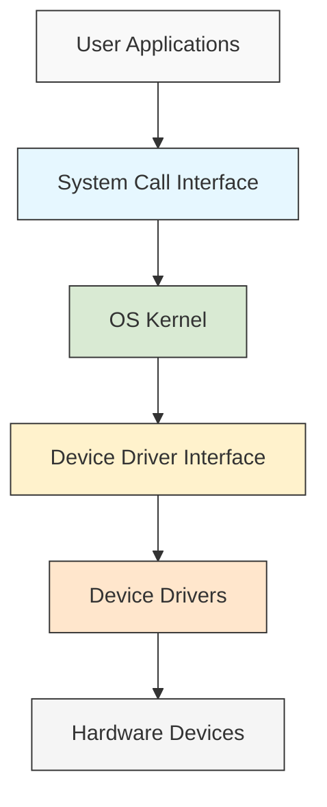

# Device Driver Implementation

## Introduction

Device drivers are essential components of an operating system that enable communication between hardware devices and the operating system. They serve as the crucial interface that translates the operating system's requests into hardware-specific commands and vice versa. In this guide, we'll explore how device drivers work and learn the fundamentals of implementing them.

Think of device drivers as "translators" that allow your operating system to communicate with various hardware components like printers, graphics cards, network adapters, and storage devices. Without properly functioning device drivers, your hardware would be useless—the operating system wouldn't know how to interact with it.

## Why Device Drivers Are Important

Device drivers are critical for several reasons:

1. **Hardware Abstraction**: They hide the complexities of hardware operations from the operating system and applications.
2. **Standardization**: They provide standardized interfaces for accessing different hardware devices.
3. **Resource Management**: They manage hardware resources efficiently to prevent conflicts.
4. **Performance Optimization**: They optimize communication between software and hardware for better performance.

## Device Driver Architecture

Before diving into implementation, let's understand the architecture of device drivers in modern operating systems:



Device drivers typically operate in one of two modes:

1. **Kernel-mode drivers**: These run in the operating system's kernel space with high privileges and direct access to hardware.
2. **User-mode drivers**: These run in user space with restricted privileges, communicating with hardware through kernel services.

## Types of Device Drivers

Device drivers can be categorized into several types:

1. **Character Device Drivers**: Handle devices that transfer data as a stream of bytes (e.g., keyboards, mice).
2. **Block Device Drivers**: Handle devices that transfer data in blocks (e.g., hard disks, SSDs).
3. **Network Device Drivers**: Handle network interface cards and manage network communications.
4. **Virtual Device Drivers**: Emulate hardware devices and provide interfaces to virtual environments.

## Basic Components of a Device Driver

A typical device driver consists of these core components:

1. **Initialization and Cleanup Functions**: Called when the driver is loaded or unloaded.
2. **Device Access Functions**: Handle reading, writing, and controlling the device.
3. **Interrupt Handler**: Processes hardware interrupts.
4. **Device-Specific Functions**: Implement functionality specific to the hardware.

## Device Driver Implementation Steps

Let's walk through the basic steps of implementing a simple character device driver in Linux:

### Step 1: Setting Up the Development Environment

Before writing a device driver, you need the appropriate development environment:

```bash
# Install essential development packages (on Debian/Ubuntu)
sudo apt-get update
sudo apt-get install build-essential linux-headers-$(uname -r)
```

### Step 2: Create a Basic Driver Structure

Create a file named `simple_driver.c` with this basic structure:

```c
#include <linux/init.h>      /* For module_init and module_exit */
#include <linux/module.h>    /* For MODULE_LICENSE and other macros */
#include <linux/kernel.h>    /* For printk and KERN_INFO */

MODULE_LICENSE("GPL");
MODULE_AUTHOR("Your Name");
MODULE_DESCRIPTION("A simple Linux device driver");
MODULE_VERSION("0.1");

static int __init simple_driver_init(void) {
    printk(KERN_INFO "Simple Driver: Initialized
");
    return 0;
}

static void __exit simple_driver_exit(void) {
    printk(KERN_INFO "Simple Driver: Exited
");
}

module_init(simple_driver_init);
module_exit(simple_driver_exit);
```

This creates a very basic loadable kernel module that prints messages when loaded and unloaded.

### Step 3: Create a Makefile

Create a `Makefile` to compile your driver:

```makefile
obj-m += simple_driver.o

all:
	make -C /lib/modules/$(shell uname -r)/build M=$(PWD) modules

clean:
	make -C /lib/modules/$(shell uname -r)/build M=$(PWD) clean
```

### Step 4: Register a Character Device

Let's expand our driver to register a character device:

```c
#include <linux/init.h>
#include <linux/module.h>
#include <linux/kernel.h>
#include <linux/fs.h>        /* For file_operations */
#include <linux/cdev.h>      /* For cdev structure */
#include <linux/device.h>    /* For device_create */

#define DEVICE_NAME "simple_device"
#define CLASS_NAME "simple"
#define DEVICE_FIRST_MINOR 0
#define DEVICE_COUNT 1

MODULE_LICENSE("GPL");
MODULE_AUTHOR("Your Name");
MODULE_DESCRIPTION("A simple character device driver");
MODULE_VERSION("0.1");

static int major_number;
static struct class *simple_class = NULL;
static struct device *simple_device = NULL;
static struct cdev simple_cdev;

/* File operations function prototypes */
static int device_open(struct inode *, struct file *);
static int device_release(struct inode *, struct file *);
static ssize_t device_read(struct file *, char __user *, size_t, loff_t *);
static ssize_t device_write(struct file *, const char __user *, size_t, loff_t *);

static struct file_operations fops = {
    .owner = THIS_MODULE,
    .open = device_open,
    .release = device_release,
    .read = device_read,
    .write = device_write,
};

static int __init simple_driver_init(void) {
    /* Dynamically allocate a major number */
    major_number = register_chrdev(0, DEVICE_NAME, &fops);
    if (major_number < 0) {
        printk(KERN_ALERT "Simple Driver: Failed to register a major number
");
        return major_number;
    }
    printk(KERN_INFO "Simple Driver: Registered with major number %d
", major_number);

    /* Register the device class */
    simple_class = class_create(THIS_MODULE, CLASS_NAME);
    if (IS_ERR(simple_class)) {
        unregister_chrdev(major_number, DEVICE_NAME);
        printk(KERN_ALERT "Simple Driver: Failed to register device class
");
        return PTR_ERR(simple_class);
    }
    printk(KERN_INFO "Simple Driver: Device class registered
");

    /* Create a device in /dev */
    simple_device = device_create(simple_class, NULL, MKDEV(major_number, 0), NULL, DEVICE_NAME);
    if (IS_ERR(simple_device)) {
        class_destroy(simple_class);
        unregister_chrdev(major_number, DEVICE_NAME);
        printk(KERN_ALERT "Simple Driver: Failed to create the device
");
        return PTR_ERR(simple_device);
    }
    printk(KERN_INFO "Simple Driver: Device created successfully
");

    return 0;
}

static void __exit simple_driver_exit(void) {
    device_destroy(simple_class, MKDEV(major_number, 0));
    class_unregister(simple_class);
    class_destroy(simple_class);
    unregister_chrdev(major_number, DEVICE_NAME);
    printk(KERN_INFO "Simple Driver: Unregistered
");
}

/* File operations implementations */
static int device_open(struct inode *inodep, struct file *filep) {
    printk(KERN_INFO "Simple Driver: Device opened
");
    return 0;
}

static int device_release(struct inode *inodep, struct file *filep) {
    printk(KERN_INFO "Simple Driver: Device closed
");
    return 0;
}

static ssize_t device_read(struct file *filep, char __user *buffer, size_t len, loff_t *offset) {
    printk(KERN_INFO "Simple Driver: Read operation
");
    return 0;
}

static ssize_t device_write(struct file *filep, const char __user *buffer, size_t len, loff_t *offset) {
    printk(KERN_INFO "Simple Driver: Write operation (%zu bytes)
", len);
    return len;
}

module_init(simple_driver_init);
module_exit(simple_driver_exit);
```

### Step 5: Implement Device Communication

Now let's enhance our driver with basic read/write functionality:

```c
#include <linux/init.h>
#include <linux/module.h>
#include <linux/kernel.h>
#include <linux/fs.h>
#include <linux/cdev.h>
#include <linux/device.h>
#include <linux/uaccess.h>  /* For copy_to_user and copy_from_user */

#define DEVICE_NAME "simple_device"
#define CLASS_NAME "simple"
#define BUFFER_SIZE 256

MODULE_LICENSE("GPL");
MODULE_AUTHOR("Your Name");
MODULE_DESCRIPTION("A simple character device driver with read/write support");
MODULE_VERSION("0.1");

static int major_number;
static struct class *simple_class = NULL;
static struct device *simple_device = NULL;
static char device_buffer[BUFFER_SIZE];
static int buffer_pointer = 0;

/* File operations function prototypes */
static int device_open(struct inode *, struct file *);
static int device_release(struct inode *, struct file *);
static ssize_t device_read(struct file *, char __user *, size_t, loff_t *);
static ssize_t device_write(struct file *, const char __user *, size_t, loff_t *);

static struct file_operations fops = {
    .owner = THIS_MODULE,
    .open = device_open,
    .release = device_release,
    .read = device_read,
    .write = device_write,
};

static int __init simple_driver_init(void) {
    /* Dynamically allocate a major number */
    major_number = register_chrdev(0, DEVICE_NAME, &fops);
    if (major_number < 0) {
        printk(KERN_ALERT "Simple Driver: Failed to register a major number
");
        return major_number;
    }
    printk(KERN_INFO "Simple Driver: Registered with major number %d
", major_number);

    /* Register the device class */
    simple_class = class_create(THIS_MODULE, CLASS_NAME);
    if (IS_ERR(simple_class)) {
        unregister_chrdev(major_number, DEVICE_NAME);
        printk(KERN_ALERT "Simple Driver: Failed to register device class
");
        return PTR_ERR(simple_class);
    }
    printk(KERN_INFO "Simple Driver: Device class registered
");

    /* Create a device in /dev */
    simple_device = device_create(simple_class, NULL, MKDEV(major_number, 0), NULL, DEVICE_NAME);
    if (IS_ERR(simple_device)) {
        class_destroy(simple_class);
        unregister_chrdev(major_number, DEVICE_NAME);
        printk(KERN_ALERT "Simple Driver: Failed to create the device
");
        return PTR_ERR(simple_device);
    }
    printk(KERN_INFO "Simple Driver: Device created successfully
");

    /* Initialize device buffer */
    memset(device_buffer, 0, BUFFER_SIZE);

    return 0;
}

static void __exit simple_driver_exit(void) {
    device_destroy(simple_class, MKDEV(major_number, 0));
    class_unregister(simple_class);
    class_destroy(simple_class);
    unregister_chrdev(major_number, DEVICE_NAME);
    printk(KERN_INFO "Simple Driver: Unregistered
");
}

/* File operations implementations */
static int device_open(struct inode *inodep, struct file *filep) {
    printk(KERN_INFO "Simple Driver: Device opened
");
    return 0;
}

static int device_release(struct inode *inodep, struct file *filep) {
    printk(KERN_INFO "Simple Driver: Device closed
");
    return 0;
}

static ssize_t device_read(struct file *filep, char __user *buffer, size_t len, loff_t *offset) {
    int bytes_to_read = min((size_t)(BUFFER_SIZE - *offset), len);
    
    if (bytes_to_read <= 0)
        return 0;   /* EOF */
    
    if (copy_to_user(buffer, device_buffer + *offset, bytes_to_read))
        return -EFAULT;  /* Error in copy_to_user */
    
    *offset += bytes_to_read;
    printk(KERN_INFO "Simple Driver: Read %d bytes
", bytes_to_read);
    
    return bytes_to_read;
}

static ssize_t device_write(struct file *filep, const char __user *buffer, size_t len, loff_t *offset) {
    int bytes_to_write = min((size_t)(BUFFER_SIZE - *offset), len);
    
    if (bytes_to_write <= 0)
        return -ENOSPC;  /* No space left on device */
    
    if (copy_from_user(device_buffer + *offset, buffer, bytes_to_write))
        return -EFAULT;  /* Error in copy_from_user */
    
    *offset += bytes_to_write;
    printk(KERN_INFO "Simple Driver: Wrote %d bytes
", bytes_to_write);
    
    return bytes_to_write;
}

module_init(simple_driver_init);
module_exit(simple_driver_exit);
```

### Step 6: Compile and Test the Driver

Compile your driver:

```bash
make
```

Load and test your driver:

```bash
# Load the driver
sudo insmod simple_driver.ko

# Verify it's loaded
lsmod | grep simple

# Check kernel logs for driver messages
dmesg | tail

# Create a test file using the device
echo "Hello from user space" > /dev/simple_device

# Read from the device
cat /dev/simple_device

# Unload the driver
sudo rmmod simple_driver
```

## Advanced Device Driver Concepts

Once you've mastered the basics, you can explore these advanced concepts:

### Interrupt Handling

Devices often use interrupts to signal events to the CPU. Here's how to register and handle an interrupt:

```c
#include <linux/interrupt.h>

static int irq_number = 10;  /* Example IRQ number */
static char *device_name = "simple_device";

/* Interrupt handler function */
static irqreturn_t simple_irq_handler(int irq, void *dev_id) {
    printk(KERN_INFO "Simple Driver: Interrupt received
");
    /* Handle the interrupt */
    
    return IRQ_HANDLED;
}

/* In init function */
if (request_irq(irq_number, simple_irq_handler, IRQF_SHARED, device_name, &simple_device)) {
    printk(KERN_ERR "Simple Driver: Cannot register IRQ %d
", irq_number);
    /* Error handling */
    return -EIO;
}

/* In exit function */
free_irq(irq_number, &simple_device);
```

### Memory Mapping

For devices that need direct memory access:

```c
static int simple_mmap(struct file *filep, struct vm_area_struct *vma) {
    unsigned long size = vma->vm_end - vma->vm_start;
    unsigned long offset = vma->vm_pgoff << PAGE_SHIFT;
    unsigned long physical_address = /* device physical address */ + offset;
    
    /* Map the device memory to user space */
    if (remap_pfn_range(vma, vma->vm_start, 
                        physical_address >> PAGE_SHIFT, 
                        size, vma->vm_page_prot)) {
        return -EAGAIN;
    }
    
    return 0;
}

/* Add to file_operations structure */
.mmap = simple_mmap,
```

### DMA (Direct Memory Access)

For high-speed data transfer:

```c
#include <linux/dma-mapping.h>

/* Allocate DMA buffer */
dma_addr_t dma_handle;
void *dma_buffer = dma_alloc_coherent(dev, size, &dma_handle, GFP_KERNEL);

/* Set up device with DMA address */
/* ... */

/* Free DMA buffer when done */
dma_free_coherent(dev, size, dma_buffer, dma_handle);
```

## Device Driver Debugging Techniques

Debugging device drivers can be challenging. Here are some useful techniques:

1. **Use printk**: Add debug messages with appropriate priority levels.
   ```c
   printk(KERN_DEBUG "Simple Driver: Debug message
");
   ```

2. **Use debugfs**: Create debug files in the `/sys/kernel/debug` filesystem.

3. **Use kernel debuggers**: Tools like KGDB can help with kernel debugging.

4. **Check return values**: Always check return values of kernel functions.

## Real-World Example: A Simple GPIO Driver

Let's implement a simple GPIO (General Purpose Input/Output) driver for embedded systems:

```c
#include <linux/init.h>
#include <linux/module.h>
#include <linux/kernel.h>
#include <linux/gpio.h>
#include <linux/fs.h>
#include <linux/cdev.h>
#include <linux/device.h>
#include <linux/uaccess.h>

#define DEVICE_NAME "gpio_driver"
#define CLASS_NAME "gpio"
#define GPIO_PIN 17  /* Example GPIO pin number */

MODULE_LICENSE("GPL");
MODULE_AUTHOR("Your Name");
MODULE_DESCRIPTION("A simple GPIO device driver");
MODULE_VERSION("0.1");

static int major_number;
static struct class *gpio_class = NULL;
static struct device *gpio_device = NULL;

/* File operations function prototypes */
static int device_open(struct inode *, struct file *);
static int device_release(struct inode *, struct file *);
static ssize_t device_read(struct file *, char __user *, size_t, loff_t *);
static ssize_t device_write(struct file *, const char __user *, size_t, loff_t *);

static struct file_operations fops = {
    .owner = THIS_MODULE,
    .open = device_open,
    .release = device_release,
    .read = device_read,
    .write = device_write,
};

static int __init gpio_driver_init(void) {
    int ret;
    
    /* Request GPIO */
    ret = gpio_request(GPIO_PIN, "gpio_driver");
    if (ret) {
        printk(KERN_ALERT "GPIO Driver: Failed to request GPIO %d
", GPIO_PIN);
        return ret;
    }
    
    /* Set GPIO as output */
    ret = gpio_direction_output(GPIO_PIN, 0);
    if (ret) {
        printk(KERN_ALERT "GPIO Driver: Failed to set GPIO %d as output
", GPIO_PIN);
        gpio_free(GPIO_PIN);
        return ret;
    }
    
    /* Dynamically allocate a major number */
    major_number = register_chrdev(0, DEVICE_NAME, &fops);
    if (major_number < 0) {
        printk(KERN_ALERT "GPIO Driver: Failed to register a major number
");
        gpio_free(GPIO_PIN);
        return major_number;
    }
    
    /* Register the device class */
    gpio_class = class_create(THIS_MODULE, CLASS_NAME);
    if (IS_ERR(gpio_class)) {
        unregister_chrdev(major_number, DEVICE_NAME);
        gpio_free(GPIO_PIN);
        printk(KERN_ALERT "GPIO Driver: Failed to register device class
");
        return PTR_ERR(gpio_class);
    }
    
    /* Create a device in /dev */
    gpio_device = device_create(gpio_class, NULL, MKDEV(major_number, 0), NULL, DEVICE_NAME);
    if (IS_ERR(gpio_device)) {
        class_destroy(gpio_class);
        unregister_chrdev(major_number, DEVICE_NAME);
        gpio_free(GPIO_PIN);
        printk(KERN_ALERT "GPIO Driver: Failed to create the device
");
        return PTR_ERR(gpio_device);
    }
    
    printk(KERN_INFO "GPIO Driver: Initialized with GPIO pin %d
", GPIO_PIN);
    return 0;
}

static void __exit gpio_driver_exit(void) {
    device_destroy(gpio_class, MKDEV(major_number, 0));
    class_unregister(gpio_class);
    class_destroy(gpio_class);
    unregister_chrdev(major_number, DEVICE_NAME);
    gpio_free(GPIO_PIN);
    printk(KERN_INFO "GPIO Driver: Unregistered
");
}

/* File operations implementations */
static int device_open(struct inode *inodep, struct file *filep) {
    printk(KERN_INFO "GPIO Driver: Device opened
");
    return 0;
}

static int device_release(struct inode *inodep, struct file *filep) {
    printk(KERN_INFO "GPIO Driver: Device closed
");
    return 0;
}

static ssize_t device_read(struct file *filep, char __user *buffer, size_t len, loff_t *offset) {
    int gpio_value;
    char byte;
    
    if (*offset > 0)
        return 0;  /* EOF */
    
    gpio_value = gpio_get_value(GPIO_PIN);
    byte = gpio_value ? '1' : '0';
    
    if (copy_to_user(buffer, &byte, 1))
        return -EFAULT;
    
    *offset += 1;
    return 1;
}

static ssize_t device_write(struct file *filep, const char __user *buffer, size_t len, loff_t *offset) {
    char byte;
    
    if (copy_from_user(&byte, buffer, 1))
        return -EFAULT;
    
    if (byte == '1')
        gpio_set_value(GPIO_PIN, 1);
    else if (byte == '0')
        gpio_set_value(GPIO_PIN, 0);
    else
        return -EINVAL;
    
    printk(KERN_INFO "GPIO Driver: Set GPIO %d to %c
", GPIO_PIN, byte);
    return len;
}

module_init(gpio_driver_init);
module_exit(gpio_driver_exit);
```

Usage:

```bash
# Turn on the GPIO
echo "1" > /dev/gpio_driver

# Turn off the GPIO
echo "0" > /dev/gpio_driver

# Read the GPIO state
cat /dev/gpio_driver
```

## Cross-Platform Considerations

When implementing device drivers across different operating systems, consider these differences:

### Linux vs. Windows

1. **Driver Model**: Linux uses a monolithic kernel with loadable modules, while Windows uses a layered driver model.
2. **Development Kit**: Linux uses the kernel headers and GCC, while Windows uses the Windows Driver Kit (WDK).
3. **APIs**: Linux uses the kernel API, while Windows uses the Windows Driver Framework (WDF).

### Example: Windows Driver vs. Linux Driver

Windows Driver (simplified WDF driver):

```c
#include <ntddk.h>
#include <wdf.h>

DRIVER_INITIALIZE DriverEntry;
EVT_WDF_DRIVER_DEVICE_ADD SimpleDeviceAdd;

NTSTATUS DriverEntry(PDRIVER_OBJECT DriverObject, PUNICODE_STRING RegistryPath) {
    WDF_DRIVER_CONFIG config;
    NTSTATUS status;
    
    WDF_DRIVER_CONFIG_INIT(&config, SimpleDeviceAdd);
    
    status = WdfDriverCreate(DriverObject, RegistryPath, WDF_NO_OBJECT_ATTRIBUTES, 
                            &config, WDF_NO_HANDLE);
    
    return status;
}

NTSTATUS SimpleDeviceAdd(WDFDRIVER Driver, PWDFDEVICE_INIT DeviceInit) {
    WDFDEVICE device;
    NTSTATUS status;
    
    status = WdfDeviceCreate(&DeviceInit, WDF_NO_OBJECT_ATTRIBUTES, &device);
    
    return status;
}
```

## Best Practices for Device Driver Development

1. **Always check return values**: Kernel functions often return error codes.
2. **Clean up resources properly**: Release all resources in the exit function and error paths.
3. **Use kernel coding conventions**: Follow the style in the Linux kernel coding style guide.
4. **Use appropriate locking**: Protect shared resources with mutexes, spinlocks, etc.
5. **Minimize time spent in critical sections**: Keep interrupt handlers short.
6. **Test thoroughly**: Use tools like the Linux Test Project (LTP) for testing.

## Summary

In this guide, we've covered the fundamentals of device driver implementation:

1. We learned what device drivers are and why they're important for operating systems.
2. We examined the architecture and types of device drivers.
3. We implemented a basic character device driver with read/write functionality.
4. We explored advanced concepts like interrupt handling, memory mapping, and DMA.
5. We created a practical GPIO driver example for embedded systems.
6. We discussed cross-platform considerations and best practices.

Device driver development is a complex but rewarding area of systems programming. As you gain experience, you'll be able to write more sophisticated drivers for various hardware devices.

## Additional Resources

- **Books**:
  - "Linux Device Drivers" by Jonathan Corbet, Alessandro Rubini, and Greg Kroah-Hartman
  - "Linux Kernel Development" by Robert Love

- **Online Resources**:
  - The Linux Kernel Documentation: [https://www.kernel.org/doc/html/latest/](https://www.kernel.org/doc/html/latest/)
  - Linux Cross Reference: [https://elixir.bootlin.com/linux/latest/source](https://elixir.bootlin.com/linux/latest/source)

## Exercises

1. Modify the simple character driver to add an IOCTL command that toggles a GPIO pin.
2. Implement a block device driver that simulates a small disk in memory.
3. Create a network device driver for a virtual network interface.
4. Extend the GPIO driver to handle multiple GPIO pins configurable at load time.
5. Implement a driver for a custom hardware device (or simulator) that uses interrupts.