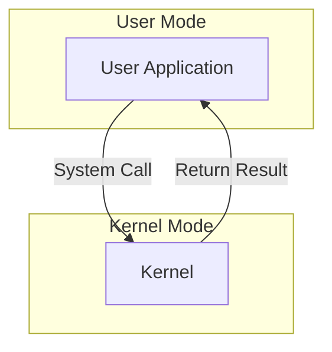
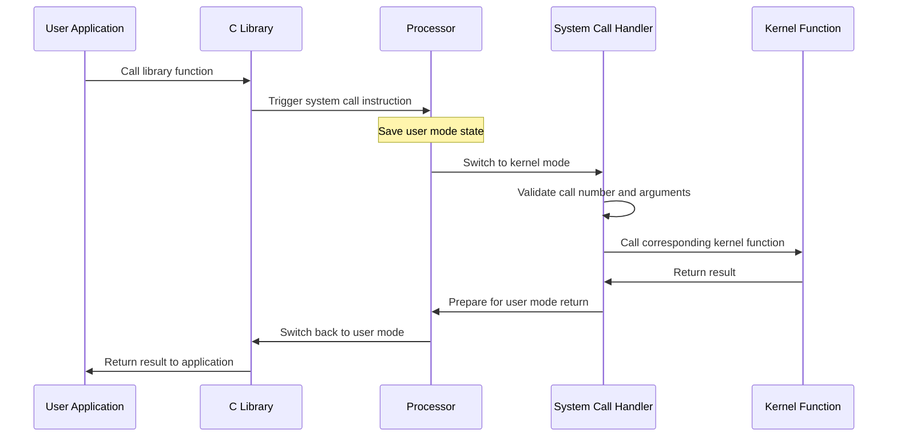

# System Call Implementation

## Introduction

System calls are the primary interface between user applications and the operating system kernel. They allow user programs to request services from the operating system, such as file operations, process management, network communication, and memory allocation. This article explains how system calls are implemented in modern operating systems, the mechanisms behind them, and how to work with them as a programmer.

Think of system calls as the "doorways" that allow your programs to access protected hardware resources through the operating system. Without system calls, your applications would be isolated and unable to perform many essential functions like reading files or communicating over networks.

## System Call Fundamentals

### What Are System Calls?

System calls provide a controlled entry point into the kernel, allowing user programs to request privileged operations that only the kernel can perform. These include:

- File operations (open, read, write, close)
- Process control (fork, exec, exit)
- Memory management (malloc, free, mmap)
- Communication (socket, pipe)
- Device manipulation

### Why Do We Need System Calls?

Operating systems use a protection mechanism that divides execution into two modes:

1. **User mode**: Limited privileges, where normal applications run
2. **Kernel mode**: Full system access, where the OS kernel runs

System calls facilitate the transition between these two modes, ensuring security and stability.



## System Call Implementation Mechanisms

The implementation of system calls involves several components working together:

### 1. System Call Interface

Programming languages provide libraries that wrap system calls with more user-friendly functions. For example, in C, the `fopen()` function ultimately calls the `open()` system call.

```c
// High-level library function
FILE *file = fopen("example.txt", "r");

// Eventually calls the underlying system call
int fd = open("example.txt", O_RDONLY);
```

### 2. System Call Table

The kernel maintains a table (sometimes called the syscall table) that maps system call numbers to their corresponding kernel functions.

```c
// Simplified example of a system call table
void *sys_call_table[] = {
    [0] = sys_read,
    [1] = sys_write,
    [2] = sys_open,
    [3] = sys_close,
    // ...more system calls
};
```

### 3. System Call Handler

When a program invokes a system call, the processor switches from user mode to kernel mode through a trap or software interrupt, and control transfers to the system call handler.

### 4. Argument Passing

System calls often need to pass arguments. These can be passed through:
- Registers
- A block of memory (with a pointer passed in a register)
- The program stack

### 5. Mode Switching Process

Let's examine the complete flow of a system call:



## Example: System Call Implementation in Linux

Let's examine how Linux implements the basic `write` system call:

### User-side Code

```c
#include <unistd.h>

int main() {
    const char *msg = "Hello, world!
";
    
    // The write system call
    write(1, msg, 14);  // file descriptor 1 is stdout
    
    return 0;
}
```

### Inside the C Library

The C library function `write()` might look something like this:

```c
ssize_t write(int fd, const void *buf, size_t count) {
    // This pseudocode shows the syscall mechanics
    register int syscall_no asm("rax") = SYS_write;
    register int arg1 asm("rdi") = fd;
    register const void *arg2 asm("rsi") = buf;
    register size_t arg3 asm("rdx") = count;
    
    // Execute the syscall instruction
    asm("syscall");
    
    // Return value is in rax after the syscall
    return syscall_no;
}
```

### Kernel-side Implementation

Inside the Linux kernel, the system call handler dispatches to the actual implementation:

```c
// Simplified version of the write syscall implementation
ssize_t sys_write(unsigned int fd, const char __user *buf, size_t count) {
    struct file *file;
    ssize_t ret = -EBADF;
    
    // Get the file structure from the file descriptor
    file = fget(fd);
    if (!file)
        goto out;
    
    // Perform the write operation
    ret = vfs_write(file, buf, count, &file->f_pos);
    
    // Release the file
    fput(file);
out:
    return ret;
}
```

## Creating Your Own System Call (For Educational Purposes)

While you typically won't need to create system calls as a regular programmer, understanding how to do so is educational. Here's a simplified example for Linux:

### 1. Define the System Call in the Kernel

```c
// In an appropriate kernel source file
asmlinkage long sys_hello(void) {
    printk(KERN_INFO "Hello from kernel space!
");
    return 0;
}
```

### 2. Register the System Call

You'd need to add your system call to the system call table and assign it a number.

### 3. Recompile the Kernel

After making your changes, you would recompile the kernel.

### 4. User Program to Call Your System Call

```c
#include <stdio.h>
#include <unistd.h>
#include <sys/syscall.h>

#define SYS_hello 335  // Example syscall number

int main() {
    long ret = syscall(SYS_hello);
    printf("System call returned: %ld
", ret);
    return 0;
}
```

## Best Practices When Working with System Calls

1. **Use Library Functions When Possible**: Direct system calls can be error-prone. Library functions handle many details for you.

2. **Check Return Values**: System calls indicate success or failure through return values.

```c
int fd = open("example.txt", O_RDONLY);
if (fd == -1) {
    perror("Error opening file");
    return 1;
}
```

3. **Handle Interrupted System Calls**: Some system calls may be interrupted by signals.

```c
ssize_t bytes;
do {
    bytes = write(fd, buffer, size);
} while (bytes == -1 && errno == EINTR);
```

4. **Understand Performance Implications**: System calls involve context switching between user and kernel mode, which can be expensive.

## Real-world Applications

### Case Study: The `strace` Tool

The `strace` tool in Linux traces system calls and signals, allowing developers to debug programs by showing how they interact with the kernel.

Running a program with `strace`:

```bash
$ strace ls
execve("/bin/ls", ["ls"], [/* 47 vars */]) = 0
brk(NULL)                               = 0x55d932e9c000
access("/etc/ld.so.nohwcap", F_OK)      = -1 ENOENT
access("/etc/ld.so.preload", R_OK)      = -1 ENOENT
openat(AT_FDCWD, "/etc/ld.so.cache", O_RDONLY|O_CLOEXEC) = 3
...
```

This shows every system call `ls` makes, helping understand the program's behavior at the OS level.

### Case Study: Web Server System Calls

A web server makes extensive use of system calls:

1. `socket()` to create network sockets
2. `bind()` to associate sockets with ports
3. `listen()` to accept connections
4. `read()` and `write()` to transfer data
5. `epoll()` or `select()` for efficient I/O multiplexing

Understanding these system calls helps optimize server performance.

## Different System Call Implementation Approaches

Different operating systems implement system calls in various ways:

### 1. Linux: Software Interrupt

Linux traditionally used the `int 0x80` instruction, and now uses the more efficient `syscall` instruction on x86-64 systems.

### 2. Windows: SYSENTER/SYSCALL

Windows uses the `SYSENTER` instruction on older CPUs and `SYSCALL` on newer ones, with the system service dispatch table (SSDT).

### 3. macOS: BSD System Calls

macOS, being based on BSD, uses a similar approach to Linux but with its own implementation details.

## System Call Sandboxing and Security

Modern security measures often involve restricting which system calls programs can make:

### Seccomp in Linux

Seccomp (secure computing mode) allows a process to limit the system calls it can make:

```c
#include <linux/seccomp.h>
#include <linux/filter.h>
#include <linux/audit.h>
#include <sys/prctl.h>

// Allow only read and write system calls
static struct sock_filter filter[] = {
    BPF_STMT(BPF_LD|BPF_W|BPF_ABS, offsetof(struct seccomp_data, nr)),
    BPF_JUMP(BPF_JMP|BPF_JEQ|BPF_K, __NR_read, 0, 1),
    BPF_STMT(BPF_RET|BPF_K, SECCOMP_RET_ALLOW),
    BPF_JUMP(BPF_JMP|BPF_JEQ|BPF_K, __NR_write, 0, 1),
    BPF_STMT(BPF_RET|BPF_K, SECCOMP_RET_ALLOW),
    BPF_STMT(BPF_RET|BPF_K, SECCOMP_RET_KILL),
};

static struct sock_fprog prog = {
    .len = (unsigned short)(sizeof(filter)/sizeof(filter[0])),
    .filter = filter,
};

int main() {
    // Set up seccomp
    prctl(PR_SET_NO_NEW_PRIVS, 1, 0, 0, 0);
    prctl(PR_SET_SECCOMP, SECCOMP_MODE_FILTER, &prog);
    
    // Now only read and write syscalls are allowed
    return 0;
}
```

This is how container technologies like Docker improve security by restricting system call access.

## Common System Call Performance Issues

Working with system calls efficiently requires understanding their costs:

1. **Context Switching Overhead**: Each system call requires switching from user mode to kernel mode and back.

2. **Batching Operations**: When possible, batch operations to minimize the number of system calls.

```c
// Inefficient - one system call per character
for (int i = 0; i < strlen(text); i++) {
    write(fd, &text[i], 1);
}

// Efficient - one system call for all characters
write(fd, text, strlen(text));
```

3. **Asynchronous I/O**: For I/O-intensive applications, asynchronous system calls can improve performance.

```c
// Using Linux's io_uring for efficient asynchronous I/O
struct io_uring ring;
io_uring_queue_init(8, &ring, 0);

// Submit a read operation
struct io_uring_sqe *sqe = io_uring_get_sqe(&ring);
io_uring_prep_read(sqe, fd, buffer, SIZE, 0);
io_uring_submit(&ring);

// Do other work while I/O is in progress

// Get the result
struct io_uring_cqe *cqe;
io_uring_wait_cqe(&ring, &cqe);
// Process result
io_uring_cqe_seen(&ring, cqe);
```

## Summary

System calls are the essential bridge between user applications and kernel functionalities. They provide a controlled interface through which programs can access hardware resources while maintaining system security and stability.

Key takeaways:

1. System calls facilitate the transition between user mode and kernel mode
2. They are implemented through a combination of software and hardware mechanisms
3. The system call process involves argument passing, mode switching, and dispatching
4. Different operating systems implement system calls in different ways
5. Understanding system calls helps in debugging, optimizing, and securing applications

## Exercises

1. Use the `strace` tool (on Linux) to observe the system calls made by a simple program like `ls` or `cat`.

2. Write a C program that opens a file, writes data to it, and closes it. Use `strace` to observe the system calls it makes.

3. Research and compare how system calls are implemented in two different operating systems (e.g., Linux vs. Windows).

4. Modify the seccomp example to allow a few more system calls and test if a program can still function with these restrictions.

5. Write a program that performs the same operation both with many small system calls and with a single batched call, and measure the performance difference.

## Additional Resources

- "Operating System Concepts" by Silberschatz, Galvin, and Gagne
- The Linux Kernel documentation on system calls
- "The Linux Programming Interface" by Michael Kerrisk
- "Windows Internals" by Russinovich, Solomon, and Ionescu