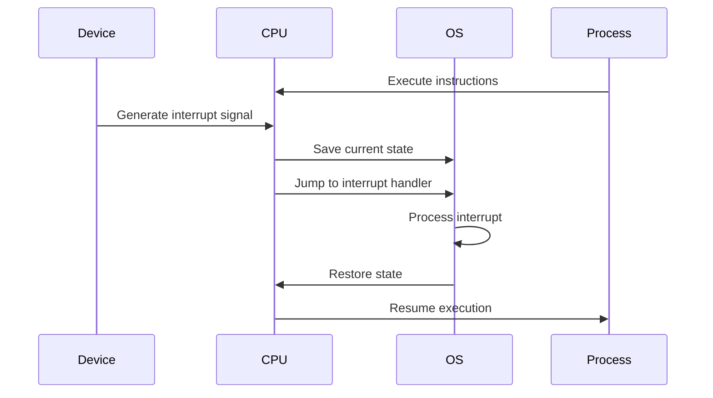

# Interrupt Handling

## Introduction

Interrupt handling is a fundamental concept in operating systems that allows computers to respond to external events while executing other tasks. Imagine you're working on your computer, typing a document, when suddenly an email arrives. How does your computer notify you about this email without stopping your typing? The answer lies in **interrupts**.

An interrupt is a signal sent to the CPU by hardware or software, indicating that an event requiring immediate attention has occurred. The CPU temporarily pauses its current execution, saves its state, and handles the interrupt before resuming the original task. This mechanism is essential for multitasking and efficient resource utilization in modern operating systems.

## Why Interrupts Matter

Interrupts are crucial for several reasons:

1. **Efficient CPU Usage**: Without interrupts, the CPU would need to continuously check (poll) devices for events, wasting processing power.
2. **Responsiveness**: Interrupts enable immediate responses to time-sensitive events like keyboard input or network packets.
3. **Prioritization**: Critical system events can be handled promptly regardless of the current task.
4. **Hardware Abstraction**: They provide a uniform way for hardware to communicate with the operating system.

## Types of Interrupts

Interrupts can be classified into three main categories:

### 1. Hardware Interrupts

Generated by hardware devices such as:
- Keyboard/mouse input
- Timer expiration
- Disk operation completion
- Network packet arrival

### 2. Software Interrupts

Generated by programs through specific instructions:
- System calls (when a program requests a service from the kernel)
- Exception handling (e.g., division by zero, page faults)

### 3. Traps

A special type of software interrupt typically used for:
- Debugging
- System calls
- Handling exceptional conditions

## The Interrupt Handling Process

Let's examine how the operating system handles an interrupt:



### Step-by-Step Breakdown

1. **Interrupt Generation**: A device signals an interrupt to the CPU.
2. **Current Process State Preservation**: The CPU saves the current program counter, processor status, and other relevant registers.
3. **Interrupt Handler Execution**: The CPU jumps to the appropriate interrupt handler routine based on the interrupt type.
4. **Interrupt Servicing**: The handler processes the interrupt, communicating with the device if necessary.
5. **State Restoration**: After handling the interrupt, the system restores the saved state.
6. **Process Resumption**: The interrupted process continues execution.

## Interrupt Vector Table

To efficiently handle different types of interrupts, operating systems use an **Interrupt Vector Table** (IVT). This table contains memory addresses (vectors) pointing to the corresponding interrupt handlers.

```
+-----------------+------------------+
| Interrupt Type  | Handler Address  |
+-----------------+------------------+
| 0x00 (Timer)    | 0x12345678       |
| 0x01 (Keyboard) | 0x23456789       |
| 0x02 (Disk)     | 0x34567890       |
| ...             | ...              |
+-----------------+------------------+
```

When an interrupt occurs, the CPU uses the interrupt number to index into this table and find the appropriate handler.

## Implementing a Basic Interrupt Handler

Let's implement a simple interrupt handler in C and assembly language. This example handles a keyboard interrupt:

```c
/* Keyboard Interrupt Handler in C */
void keyboard_interrupt_handler() {
    // Read the keystroke from the keyboard controller
    char key = read_keyboard_input();
    
    // Process the keystroke
    process_key(key);
    
    // Acknowledge the interrupt
    send_eoi_to_pic();
}
```

In x86 assembly, registering an interrupt handler might look like this:

```asm
; Setting up a keyboard interrupt handler
section .text
global _start

_start:
    ; Set up the Interrupt Descriptor Table (IDT)
    mov eax, keyboard_handler
    mov [idt + 33*8], eax   ; IRQ1 (keyboard) is typically mapped to interrupt 33
    
    ; Enable interrupts
    sti
    
    ; Main program loop
    jmp main_loop
    
keyboard_handler:
    ; Save registers
    pusha
    
    ; Handle the keyboard input
    in al, 0x60            ; Read the scan code from keyboard port
    
    ; Process the key
    ; ...
    
    ; Send End of Interrupt signal
    mov al, 0x20
    out 0x20, al
    
    ; Restore registers
    popa
    iret                   ; Return from interrupt
```

## Interrupt Priority and Nesting

Not all interrupts are equally important. Operating systems implement **interrupt priority levels** to handle critical interrupts first:

1. **Non-maskable Interrupts (NMIs)**: Highest priority interrupts that cannot be disabled (e.g., hardware failures)
2. **Maskable Interrupts**: Regular interrupts that can be temporarily disabled

Interrupt **nesting** allows higher-priority interrupts to interrupt lower-priority interrupt handlers.

## Interrupt Handling in a Real OS: Linux Example

Let's look at how Linux handles interrupts:

```c
// Simplified Linux interrupt registration
request_irq(unsigned int irq, irq_handler_t handler, unsigned long flags,
           const char *name, void *dev)
{
    // Allocate an interrupt descriptor
    struct irq_desc *desc = irq_to_desc(irq);
    
    // Set up the handler
    desc->action->handler = handler;
    desc->action->name = name;
    desc->action->dev_id = dev;
    
    // Enable the interrupt line
    unmask_irq(irq);
    
    return 0;
}

// Example interrupt handler
irqreturn_t my_device_interrupt(int irq, void *dev_id)
{
    // Handle the interrupt
    struct my_device *device = (struct my_device *)dev_id;
    
    // Read status register to determine what happened
    uint32_t status = read_device_status(device);
    
    // Process the interrupt based on status
    if (status & DATA_READY)
        process_data(device);
    
    // Clear the interrupt at the device level
    clear_device_interrupt(device);
    
    return IRQ_HANDLED;
}
```

To use this in a device driver:

```c
static int my_device_init(struct my_device *dev)
{
    // Request the interrupt
    int ret = request_irq(dev->irq, my_device_interrupt, 
                         IRQF_SHARED, "my_device", dev);
    if (ret) {
        printk(KERN_ERR "Failed to request IRQ %d
", dev->irq);
        return ret;
    }
    
    // Initialize the device
    // ...
    
    return 0;
}
```

## Common Challenges in Interrupt Handling

### 1. Race Conditions

When interrupt handlers and regular code access the same data, race conditions can occur.

**Solution**: Use synchronization primitives or disable interrupts for critical sections.

```c
// Critical section protection
void critical_function() {
    // Disable interrupts
    unsigned long flags;
    local_irq_save(flags);
    
    // Perform critical operations
    // ...
    
    // Restore interrupts
    local_irq_restore(flags);
}
```

### 2. Interrupt Latency

The time between an interrupt request and its handling can be critical for real-time systems.

**Causes of high latency**:
- Long critical sections with interrupts disabled
- Higher-priority interrupts taking precedence
- Complex interrupt handlers

### 3. Interrupt Storms

A situation where a high frequency of interrupts prevents normal system operation.

**Solution**: Implement interrupt coalescing or throttling mechanisms.

## Deferred Processing: Bottom Halves

To minimize the time spent in interrupt handlers (which typically run with interrupts disabled), modern OSes split interrupt handling into two parts:

1. **Top Half (Interrupt Handler)**: Minimal, time-critical processing
2. **Bottom Half (Deferred Work)**: Non-urgent, longer processing

Linux implements several mechanisms for bottom half processing:

### Softirqs

Low-level, statically allocated deferred processing mechanism.

```c
// Registering a softirq
void open_softirq(int nr, void (*action)(struct softirq_action *))
{
    softirq_vec[nr].action = action;
}

// Example softirq handler
static void my_softirq_handler(struct softirq_action *h)
{
    // Process deferred work
    // ...
}

// Initializing a softirq
open_softirq(MY_SOFTIRQ, my_softirq_handler);

// Triggering a softirq from an interrupt handler
void my_interrupt_handler(int irq, void *dev_id)
{
    // Minimal processing
    // ...
    
    // Schedule the softirq
    raise_softirq(MY_SOFTIRQ);
}
```

### Tasklets

Built on top of softirqs, easier to use for drivers.

```c
// Defining a tasklet
DECLARE_TASKLET(my_tasklet, my_tasklet_function, data);

// Tasklet function
void my_tasklet_function(unsigned long data)
{
    // Process deferred work
    // ...
}

// Scheduling the tasklet from an interrupt handler
void my_interrupt_handler(int irq, void *dev_id)
{
    // Minimal processing
    // ...
    
    // Schedule the tasklet
    tasklet_schedule(&my_tasklet);
}
```

### Work Queues

For longer-running tasks that can sleep.

```c
// Defining work
struct work_struct my_work;
INIT_WORK(&my_work, my_work_function);

// Work function
void my_work_function(struct work_struct *work)
{
    // Can sleep and access user space
    // ...
}

// Scheduling work from an interrupt handler
void my_interrupt_handler(int irq, void *dev_id)
{
    // Minimal processing
    // ...
    
    // Schedule the work
    schedule_work(&my_work);
}
```

## Practical Example: Building a Simple Timer Interrupt System

Let's create a simple timer interrupt system for an embedded device:

```c
#include <avr/io.h>
#include <avr/interrupt.h>

volatile uint32_t milliseconds = 0;

// Initialize timer interrupt (for AVR microcontroller)
void timer_init() {
    // Set up Timer1 in CTC mode with 1ms interval
    TCCR1A = 0;
    TCCR1B = (1 << WGM12) | (1 << CS11);  // CTC mode, prescaler 8
    OCR1A = 1999;  // For 16MHz clock: 16MHz/8/1000Hz - 1 = 1999
    
    // Enable Timer1 compare interrupt
    TIMSK1 |= (1 << OCIE1A);
    
    // Enable global interrupts
    sei();
}

// Timer1 Compare A interrupt handler
ISR(TIMER1_COMPA_vect) {
    milliseconds++;
    
    // Every 1000ms (1 second), toggle an LED
    if (milliseconds % 1000 == 0) {
        PORTB ^= (1 << PB5);  // Toggle LED on Arduino pin 13
    }
}

int main() {
    // Set LED pin as output
    DDRB |= (1 << DDB5);
    
    // Initialize timer
    timer_init();
    
    // Main program loop
    while (1) {
        // Your application code here
        // The timer interrupt will run in the background
    }
    
    return 0;
}
```

This example demonstrates a practical application of interrupts for timekeeping and periodic tasks without blocking the main program flow.

## Summary

Interrupt handling is a critical mechanism in operating systems that enables:

- Efficient multitasking
- Responsive I/O operations
- Hardware-software communication
- Exception management

The key concepts we've covered:

1. Interrupts are signals that temporarily pause program execution to handle important events
2. The operating system uses an interrupt vector table to map interrupts to their handlers
3. Interrupt handlers should be fast and minimal, with complex processing deferred
4. Modern systems implement interrupt prioritization and nesting
5. Proper synchronization is necessary to prevent race conditions

## Exercises

1. **Basic Implementation**: Write a simple keyboard interrupt handler that prints the pressed key code to the console.

2. **Deferred Processing**: Modify the handler to use a work queue for processing keystrokes.

3. **Interrupt Sharing**: Write a driver that can share an interrupt line with other devices.

4. **Benchmark**: Measure and compare the interrupt latency of different approaches.

## Additional Resources

- [Linux Kernel Development by Robert Love](https://www.oreilly.com/library/view/linux-kernel-development/9780768696974/)
- [Operating Systems: Three Easy Pieces](https://pages.cs.wisc.edu/~remzi/OSTEP/)
- The Linux kernel source code, particularly the `kernel/irq/` directory
- [Intel® 64 and IA-32 Architectures Software Developer's Manual](https://software.intel.com/content/www/us/en/develop/articles/intel-sdm.html)

Happy coding, and remember that understanding interrupts is key to mastering operating system development!