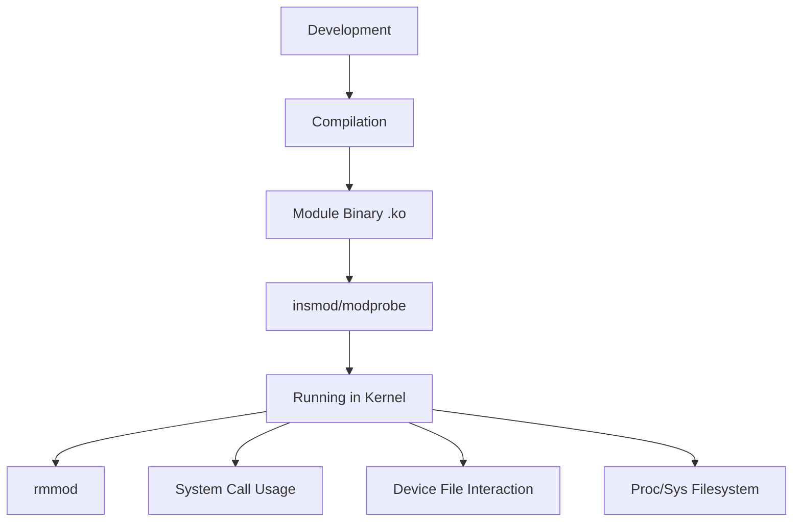

# Kernel Modules

## Introduction

Kernel modules are pieces of code that can be loaded and unloaded into the kernel upon demand. They extend the functionality of the kernel without requiring the system to be rebooted. Think of kernel modules as "plugins" for the operating system kernel - they allow the kernel to be modified dynamically, providing flexibility and efficiency.

In most modern operating systems, particularly Linux, the kernel is monolithic but modular. This means that while the core functionality is contained within a single, large binary file, additional features can be added through modules without rebuilding the entire kernel.

## Why Kernel Modules Matter

Kernel modules provide several important advantages:

1. **Dynamic Loading**: Features can be added to or removed from the running kernel without rebooting.
2. **Reduced Memory Usage**: Only necessary functionality is loaded, saving system resources.
3. **Easier Development**: Developers can work on individual modules without rebuilding the entire kernel.
4. **Maintenance**: Systems can be updated with new drivers or features without downtime.
5. **Customization**: The kernel can be tailored to specific hardware or use cases.

## Kernel Module Basics

Let's explore how kernel modules work, focusing primarily on Linux as it provides the clearest examples.

### Kernel Module Structure

A basic kernel module requires:

1. An initialization function that runs when the module is loaded
2. A cleanup function that runs when the module is unloaded
3. Proper registration with the kernel

Here's a simple "Hello World" kernel module:

```c
#include <linux/module.h>    // Core header for modules
#include <linux/kernel.h>    // Contains types, macros, functions for the kernel
#include <linux/init.h>      // Macros for module initialization

// Documentation
MODULE_LICENSE("GPL");
MODULE_AUTHOR("Your Name");
MODULE_DESCRIPTION("A simple hello world kernel module");
MODULE_VERSION("0.1");

// Initialization function (runs when module is loaded)
static int __init hello_init(void) {
    printk(KERN_INFO "Hello, World from kernel mode!
");
    return 0;  // Return 0 for success
}

// Cleanup function (runs when module is unloaded)
static void __exit hello_exit(void) {
    printk(KERN_INFO "Goodbye, World from kernel mode!
");
}

// Register functions
module_init(hello_init);
module_exit(hello_exit);
```

### Compiling a Kernel Module

To compile a kernel module, you need a Makefile. Here's a simple example:

```makefile
obj-m += hello.o

all:
	make -C /lib/modules/$(shell uname -r)/build M=$(PWD) modules

clean:
	make -C /lib/modules/$(shell uname -r)/build M=$(PWD) clean
```

To compile the module, save the C code as `hello.c` and the Makefile in the same directory, then run:

```bash
make
```

This will create several files, including `hello.ko`, which is the compiled kernel module.

### Loading and Unloading Modules

You can load and unload modules using the following commands:

```bash
# Load a module
sudo insmod hello.ko

# Check if module is loaded
lsmod | grep hello

# View kernel log messages
dmesg | tail
# Output should include: "Hello, World from kernel mode!"

# Unload the module
sudo rmmod hello

# Check logs again
dmesg | tail
# Output should include: "Goodbye, World from kernel mode!"
```

## Module Parameters

Kernel modules can accept parameters when they're loaded, making them more flexible. Let's modify our example:

```c
#include <linux/module.h>
#include <linux/kernel.h>
#include <linux/init.h>
#include <linux/moduleparam.h>

MODULE_LICENSE("GPL");
MODULE_AUTHOR("Your Name");
MODULE_DESCRIPTION("A module demonstrating parameters");

// Define a parameter
static char *name = "world";
module_param(name, charp, 0644);
MODULE_PARM_DESC(name, "The name to print in the greeting");

// Initialization function
static int __init hello_init(void) {
    printk(KERN_INFO "Hello, %s from kernel mode!
", name);
    return 0;
}

// Cleanup function
static void __exit hello_exit(void) {
    printk(KERN_INFO "Goodbye, %s from kernel mode!
", name);
}

module_init(hello_init);
module_exit(hello_exit);
```

You can load this module with a custom parameter:

```bash
sudo insmod hello.ko name="learner"
```

The kernel logs will now show "Hello, learner from kernel mode!"

## Kernel Module Communication

Modules can communicate with user space through several mechanisms:

1. Procfs (Process Filesystem)
2. Sysfs
3. Device files
4. System calls
5. Netlink sockets

Let's see a simple example using procfs:

```c
#include <linux/module.h>
#include <linux/kernel.h>
#include <linux/init.h>
#include <linux/proc_fs.h>
#include <linux/seq_file.h>
#include <linux/version.h>

MODULE_LICENSE("GPL");
MODULE_AUTHOR("Your Name");
MODULE_DESCRIPTION("A module with proc interface");

static struct proc_dir_entry *proc_file;
static int counter = 0;

// Function called when the proc file is read
static int proc_show(struct seq_file *m, void *v) {
    counter++;
    seq_printf(m, "This proc file has been read %d time(s)
", counter);
    return 0;
}

static int proc_open(struct inode *inode, struct file *file) {
    return single_open(file, proc_show, NULL);
}

#if LINUX_VERSION_CODE >= KERNEL_VERSION(5,6,0)
static const struct proc_ops proc_fops = {
    .proc_open = proc_open,
    .proc_read = seq_read,
    .proc_lseek = seq_lseek,
    .proc_release = single_release,
};
#else
static const struct file_operations proc_fops = {
    .owner = THIS_MODULE,
    .open = proc_open,
    .read = seq_read,
    .llseek = seq_lseek,
    .release = single_release,
};
#endif

static int __init proc_init(void) {
    proc_file = proc_create("hello_counter", 0644, NULL, &proc_fops);
    if (!proc_file) {
        return -ENOMEM;
    }
    printk(KERN_INFO "Hello proc module loaded
");
    return 0;
}

static void __exit proc_exit(void) {
    proc_remove(proc_file);
    printk(KERN_INFO "Hello proc module unloaded
");
}

module_init(proc_init);
module_exit(proc_exit);
```

After loading this module, you can interact with it from user space:

```bash
# Load the module
sudo insmod hello_proc.ko

# Read from the proc file
cat /proc/hello_counter
# Output: This proc file has been read 1 time(s)

# Read again
cat /proc/hello_counter
# Output: This proc file has been read 2 time(s)
```

## Module Dependencies

Kernel modules can depend on other modules. When a module is loaded, the kernel automatically loads its dependencies.

A module can explicitly state its dependencies using the `MODULE_DEPENDS_ON` macro, or the dependency can be inferred when the module uses symbols exported by another module.

Here's how to explicitly export symbols from a module:

```c
#include <linux/module.h>
#include <linux/kernel.h>
#include <linux/init.h>

MODULE_LICENSE("GPL");
MODULE_AUTHOR("Your Name");
MODULE_DESCRIPTION("Module exporting a symbol");

// Function to be exported
void hello_function(void) {
    printk(KERN_INFO "Hello function called
");
}

// Export the symbol
EXPORT_SYMBOL(hello_function);

static int __init exporter_init(void) {
    printk(KERN_INFO "Exporter module loaded
");
    return 0;
}

static void __exit exporter_exit(void) {
    printk(KERN_INFO "Exporter module unloaded
");
}

module_init(exporter_init);
module_exit(exporter_exit);
```

And here's a module that depends on the exported symbol:

```c
#include <linux/module.h>
#include <linux/kernel.h>
#include <linux/init.h>

MODULE_LICENSE("GPL");
MODULE_AUTHOR("Your Name");
MODULE_DESCRIPTION("Module using an exported symbol");

// Declare the external function
extern void hello_function(void);

static int __init importer_init(void) {
    printk(KERN_INFO "Importer module loaded
");
    hello_function();  // Use the exported function
    return 0;
}

static void __exit importer_exit(void) {
    printk(KERN_INFO "Importer module unloaded
");
}

module_init(importer_init);
module_exit(importer_exit);
```

## Real-World Example: A Character Device Driver

Let's create a simple character device driver that allows user-space programs to write to and read from a kernel buffer:

```c
#include <linux/module.h>
#include <linux/kernel.h>
#include <linux/init.h>
#include <linux/fs.h>
#include <linux/uaccess.h>

MODULE_LICENSE("GPL");
MODULE_AUTHOR("Your Name");
MODULE_DESCRIPTION("A simple character device driver");

#define DEVICE_NAME "simple_char_dev"
#define BUFFER_SIZE 1024

static int major_number;
static char device_buffer[BUFFER_SIZE];
static int buffer_pointer = 0;

// File operations
static int device_open(struct inode *inode, struct file *file) {
    printk(KERN_INFO "Device opened
");
    return 0;
}

static int device_release(struct inode *inode, struct file *file) {
    printk(KERN_INFO "Device closed
");
    return 0;
}

static ssize_t device_read(struct file *file, char __user *user_buffer, 
                          size_t size, loff_t *offset) {
    int bytes_to_copy;
    
    // Determine number of bytes to copy
    bytes_to_copy = min(size, (size_t)buffer_pointer);
    
    if (bytes_to_copy == 0) {
        return 0; // Nothing to read
    }
    
    // Copy from device buffer to user buffer
    if (copy_to_user(user_buffer, device_buffer, bytes_to_copy)) {
        return -EFAULT;
    }
    
    printk(KERN_INFO "Sent %d bytes to user
", bytes_to_copy);
    
    // Reset buffer after read
    buffer_pointer = 0;
    
    return bytes_to_copy;
}

static ssize_t device_write(struct file *file, const char __user *user_buffer,
                           size_t size, loff_t *offset) {
    int bytes_to_copy;
    
    // Determine number of bytes to copy
    bytes_to_copy = min(size, (size_t)(BUFFER_SIZE - buffer_pointer));
    
    if (bytes_to_copy == 0) {
        return -ENOMEM; // Buffer full
    }
    
    // Copy from user buffer to device buffer
    if (copy_from_user(device_buffer + buffer_pointer, user_buffer, bytes_to_copy)) {
        return -EFAULT;
    }
    
    buffer_pointer += bytes_to_copy;
    printk(KERN_INFO "Received %d bytes from user
", bytes_to_copy);
    
    return bytes_to_copy;
}

// Define file operations structure
static struct file_operations fops = {
    .open = device_open,
    .release = device_release,
    .read = device_read,
    .write = device_write
};

// Initialization
static int __init char_dev_init(void) {
    // Register character device
    major_number = register_chrdev(0, DEVICE_NAME, &fops);
    
    if (major_number < 0) {
        printk(KERN_ALERT "Failed to register a major number
");
        return major_number;
    }
    
    printk(KERN_INFO "Registered with major number %d
", major_number);
    printk(KERN_INFO "To create a device file, run: mknod /dev/%s c %d 0
", 
           DEVICE_NAME, major_number);
    
    return 0;
}

// Cleanup
static void __exit char_dev_exit(void) {
    unregister_chrdev(major_number, DEVICE_NAME);
    printk(KERN_INFO "Device unregistered
");
}

module_init(char_dev_init);
module_exit(char_dev_exit);
```

After loading this module, you'd create a device file and interact with it:

```bash
# Load the module
sudo insmod char_dev.ko

# Find the assigned major number in kernel logs
dmesg | tail

# Create the device file (use the major number from logs)
sudo mknod /dev/simple_char_dev c <MAJOR_NUMBER> 0
sudo chmod 666 /dev/simple_char_dev

# Write to the device
echo "Hello, device driver" > /dev/simple_char_dev

# Read from the device
cat /dev/simple_char_dev
# Output: Hello, device driver
```

## Module Lifecycle Visualization

The lifecycle of a kernel module can be visualized as follows:



## Module Management Tools

Several tools help manage kernel modules:

1. **insmod**: Inserts a module into the kernel
2. **rmmod**: Removes a module from the kernel
3. **modprobe**: Intelligent module loading/unloading (handles dependencies)
4. **lsmod**: Lists currently loaded modules
5. **modinfo**: Shows information about a module
6. **depmod**: Generates modules.dep for modprobe

Example usage:

```bash
# Get module information
modinfo hello.ko

# Load module with dependencies
sudo modprobe module_name

# List all loaded modules with details
lsmod

# Remove module and its unused dependencies
sudo modprobe -r module_name
```

## Best Practices for Kernel Module Development

1. **Always check return values** of kernel functions to handle errors properly.
2. **Use kernel memory allocation functions** like `kmalloc()` rather than standard C functions.
3. **Handle hardware interrupts carefully** to avoid system instability.
4. **Ensure thread safety** with proper locking mechanisms.
5. **Clean up all resources** in your exit function to prevent memory leaks.
6. **Match kernel versions** - modules must be compiled against the same version of the kernel they will run on.
7. **Test thoroughly** in a controlled environment before deploying.
8. **Comment your code well** - kernel code is often complex and requires good documentation.

## Debugging Kernel Modules

Debugging kernel code is different from debugging user-space programs. Here are some techniques:

1. **printk**: The most basic debugging tool, similar to printf but writes to the kernel log
   ```c
   printk(KERN_DEBUG "Debug value: %d
", value);
   ```

2. **Dynamic Debug**: Enable/disable debug messages at runtime
   ```c
   pr_debug("This is a debug message
");
   ```

3. **ftrace**: Kernel function tracer
   ```bash
   # Enable function tracing for your module
   echo 1 > /sys/kernel/debug/tracing/events/module/module_load/enable
   ```

4. **kgdb**: Kernel debugger that allows stepping through code with GDB

5. **/proc/kallsyms**: View all kernel symbols

## Summary

Kernel modules are a crucial concept in modern operating system design, allowing for dynamic extension of the kernel without rebooting. They provide:

- A way to develop kernel features independently
- Dynamic loading and unloading of functionality
- Efficient resource usage
- A mechanism for device drivers to interact with hardware
- A bridge between user space and kernel space

Understanding kernel modules is essential for operating system development, device driver creation, and system administration.

## Exercises

1. Write a simple "Hello World" kernel module, compile it, and load it into your kernel.
2. Modify the module to accept a parameter when loaded.
3. Create a kernel module that creates a file in /proc that displays the current time when read.
4. Implement a simple character device driver that reverses any string written to it.
5. Create two modules where one depends on the other through an exported symbol.

## Additional Resources

- Linux Kernel Module Programming Guide
- Linux Device Drivers, 3rd Edition (available online)
- The Linux Programming Interface by Michael Kerrisk
- The Linux Kernel documentation at kernel.org
- Linux source code, particularly the drivers directory