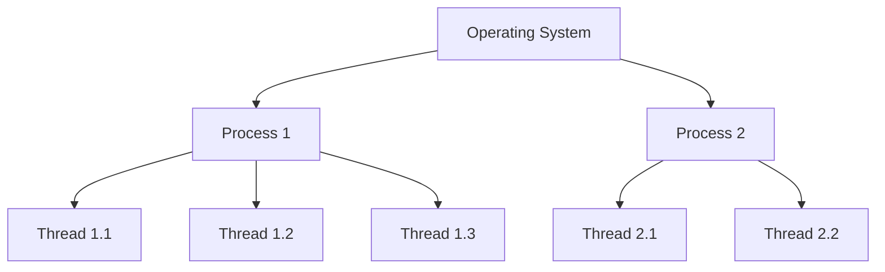
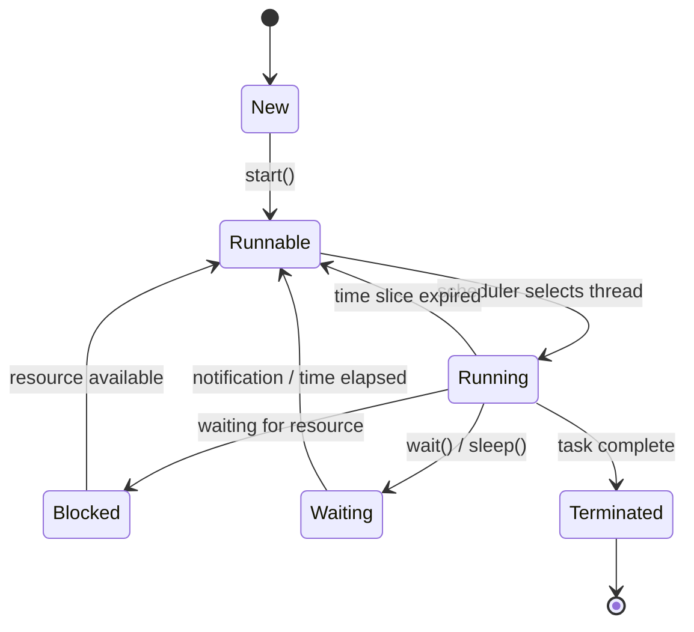

# Thread Concept

## Introduction

In the world of modern programming, you'll often hear about "threads" - but what exactly are they? Think of threads as lightweight workers within your program that can perform tasks simultaneously. Instead of your program doing one thing at a time (like a person who can only cook or clean, but not both), threads allow your program to multitask (like a team of people working together on different tasks).

Threads are fundamental to concurrent programming, which is increasingly important as we seek to maximize the performance of our applications. In this guide, we'll explore what threads are, how they work, and why they matter for even beginner programmers.

## What is a Thread?

A thread is the smallest unit of execution within a process. To understand threads properly, let's first understand what a process is:

- **Process**: A process is an independent program running on your computer. Each process has its own memory space and resources.
- **Thread**: A thread is a sequence of instructions within a process that can be executed independently of other code.

Think of a process as a container, and threads as workers within that container. While each process is isolated from other processes, threads within the same process share the same memory space and can communicate directly with each other.



### Key Characteristics of Threads

1. **Shared Resources**: Threads within the same process share memory and resources.
2. **Independent Execution**: Each thread has its own execution path.
3. **Lightweight**: Threads require fewer resources to create and terminate compared to processes.
4. **Communication**: Threads can easily communicate with other threads in the same process.

## Thread vs. Process

To clarify the difference between threads and processes, let's compare them:

| Feature | Process | Thread |
|---------|---------|--------|
| Definition | An executing program | A path of execution within a process |
| Memory | Has own memory space | Shares memory with other threads in the same process |
| Communication | Inter-process communication is complex | Direct communication through shared memory |
| Creation Time | Slower to create | Faster to create |
| Context Switching | More expensive | Less expensive |
| Isolation | Well isolated from other processes | Less isolated - issues in one thread can affect others |

## How Threads Work

When your program starts, it creates at least one thread - the main thread. This thread executes your code sequentially. To perform tasks concurrently, you can create additional threads.

### Thread States

A thread can exist in several states during its lifetime:

1. **New**: The thread has been created but hasn't started running yet.
2. **Runnable**: The thread is ready to run and waiting for CPU time.
3. **Running**: The thread is currently executing.
4. **Blocked/Waiting**: The thread is paused, waiting for a resource or event.
5. **Terminated**: The thread has completed its execution.



## Thread Creation in Different Languages

Let's look at how to create threads in a few popular programming languages:

### Python

Python provides threading through its `threading` module:

```python
import threading
import time

def print_numbers():
    for i in range(5):
        time.sleep(1)
        print(f"Number {i}")

def print_letters():
    for letter in 'ABCDE':
        time.sleep(1.5)
        print(f"Letter {letter}")

# Create threads
thread1 = threading.Thread(target=print_numbers)
thread2 = threading.Thread(target=print_letters)

# Start threads
thread1.start()
thread2.start()

# Wait for both threads to complete
thread1.join()
thread2.join()

print("Both threads have finished execution!")
```

**Output:**
```
Number 0
Letter A
Number 1
Number 2
Letter B
Number 3
Letter C
Number 4
Letter D
Letter E
Both threads have finished execution!
```

Notice how the numbers and letters are interleaved - this shows both functions running concurrently!

### Java

Java has built-in support for threads:

```java
class NumberPrinter extends Thread {
    public void run() {
        for (int i = 0; i < 5; i++) {
            try {
                Thread.sleep(1000); // Sleep for 1 second
                System.out.println("Number " + i);
            } catch (InterruptedException e) {
                System.out.println("Thread interrupted");
            }
        }
    }
}

class LetterPrinter extends Thread {
    public void run() {
        String letters = "ABCDE";
        for (int i = 0; i < letters.length(); i++) {
            try {
                Thread.sleep(1500); // Sleep for 1.5 seconds
                System.out.println("Letter " + letters.charAt(i));
            } catch (InterruptedException e) {
                System.out.println("Thread interrupted");
            }
        }
    }
}

public class ThreadDemo {
    public static void main(String[] args) {
        NumberPrinter np = new NumberPrinter();
        LetterPrinter lp = new LetterPrinter();
        
        np.start();
        lp.start();
        
        try {
            np.join();
            lp.join();
        } catch (InterruptedException e) {
            System.out.println("Main thread interrupted");
        }
        
        System.out.println("Both threads have finished execution!");
    }
}
```

### JavaScript (Node.js)

JavaScript is traditionally single-threaded, but Node.js provides the `worker_threads` module:

```javascript
const { Worker, isMainThread, parentPort } = require('worker_threads');

if (isMainThread) {
    // This code runs in the main thread
    
    // Create a worker
    const worker = new Worker(__filename);
    
    // Receive messages from the worker
    worker.on('message', (message) => {
        console.log(`Worker said: ${message}`);
    });
    
    // Send a message to the worker
    worker.postMessage('Hello from the main thread!');
} else {
    // This code runs in the worker thread
    
    // Receive messages from the parent
    parentPort.on('message', (message) => {
        console.log(`Main thread said: ${message}`);
        // Send a message back
        parentPort.postMessage('Hello from the worker thread!');
    });
}
```

## Benefits of Using Threads

There are several advantages to using threads in your applications:

### 1. Improved Performance

By executing tasks concurrently, threads can significantly speed up programs, especially on modern multi-core processors.

### 2. Responsiveness

Threads can help keep your application responsive. For example, in a GUI application, one thread can handle user interface interactions while another performs background tasks.

### 3. Resource Sharing

Threads within the same process can easily share data, making certain programming patterns more straightforward.

### 4. Simplified Program Structure

Some problems are naturally concurrent. Using threads can make your code closer to the problem's actual structure.

## Challenges with Threads

While threads are powerful, they come with challenges:

### 1. Race Conditions

When multiple threads access shared data simultaneously, they might interfere with each other, causing unexpected results.

Example:

```python
import threading

counter = 0

def increment_counter():
    global counter
    for _ in range(100000):
        # This operation is not atomic!
        counter += 1

# Create two threads
thread1 = threading.Thread(target=increment_counter)
thread2 = threading.Thread(target=increment_counter)

# Start both threads
thread1.start()
thread2.start()

# Wait for both threads to complete
thread1.join()
thread2.join()

print(f"Final counter value: {counter}")
# Expected: 200000
# Actual: Usually less than 200000 due to race conditions
```

### 2. Deadlocks

When two or more threads wait for each other to release resources, creating a situation where none can proceed.

```python
import threading

lock1 = threading.Lock()
lock2 = threading.Lock()

def task1():
    print("Task1: Acquiring lock1...")
    with lock1:
        print("Task1: Lock1 acquired!")
        print("Task1: Sleeping to simulate work...")
        # Sleep to make deadlock more likely
        import time
        time.sleep(0.5)
        
        print("Task1: Acquiring lock2...")
        with lock2:
            print("Task1: Lock2 acquired!")
            print("Task1: Work complete!")

def task2():
    print("Task2: Acquiring lock2...")
    with lock2:
        print("Task2: Lock2 acquired!")
        print("Task2: Sleeping to simulate work...")
        # Sleep to make deadlock more likely
        import time
        time.sleep(0.5)
        
        print("Task2: Acquiring lock1...")
        with lock1:
            print("Task2: Lock1 acquired!")
            print("Task2: Work complete!")

# Create threads
thread1 = threading.Thread(target=task1)
thread2 = threading.Thread(target=task2)

# Start threads
thread1.start()
thread2.start()

# Wait for both threads to complete
thread1.join()
thread2.join()

print("Program complete!")
```

This program will likely deadlock because each thread holds one lock and waits for the other.

### 3. Thread Synchronization

Coordinating thread execution to prevent race conditions and other concurrency issues.

## Practical Example: Web Server

Let's explore a real-world application of threads - a simple multithreaded web server:

```python
import socket
import threading

def handle_client(client_socket, address):
    print(f"Accepted connection from {address}")
    
    # Receive client request
    request = client_socket.recv(1024).decode()
    print(f"Received: {request}")
    
    # Send a simple HTTP response
    response = "HTTP/1.1 200 OK

Hello from a multithreaded server!"
    client_socket.send(response.encode())
    
    # Close client connection
    client_socket.close()

def start_server():
    server_socket = socket.socket(socket.AF_INET, socket.SOCK_STREAM)
    server_socket.bind(('localhost', 8080))
    server_socket.listen(5)
    print("Server listening on port 8080...")
    
    try:
        while True:
            # Accept client connection
            client, address = server_socket.accept()
            
            # Create a new thread to handle the client
            client_handler = threading.Thread(target=handle_client, args=(client, address))
            client_handler.daemon = True
            client_handler.start()
    finally:
        server_socket.close()

# Start the server
if __name__ == "__main__":
    start_server()
```

In this example:
1. The main thread accepts incoming connections.
2. For each new connection, a separate thread is created to handle that client.
3. This allows the server to handle multiple clients simultaneously.

Without threads, the server would have to finish processing one client before accepting another, severely limiting its throughput.

## Best Practices for Thread Programming

1. **Minimize Shared Data**: The less data shared between threads, the fewer synchronization problems you'll encounter.
2. **Use Thread Synchronization Mechanisms**: Locks, semaphores, and other synchronization tools protect shared resources.
3. **Avoid Deadlocks**: Be careful about the order in which locks are acquired and released.
4. **Thread Pooling**: Reuse threads rather than constantly creating and destroying them.
5. **Consider Alternatives**: In some cases, async I/O or event-driven programming might be more appropriate than threads.

## Thread Safety

Thread safety refers to code that functions correctly during simultaneous execution by multiple threads. Making code thread-safe often requires:

1. **Synchronization**: Using locks, semaphores, or other mechanisms to control access to shared resources.
2. **Immutable Objects**: Objects that cannot be changed after creation are inherently thread-safe.
3. **Thread-Local Storage**: Giving each thread its own private copy of variables.
4. **Atomic Operations**: Operations that appear to occur instantaneously from the perspective of other threads.

## Modern Approaches to Concurrency

While threads are fundamental, modern programming often uses higher-level abstractions:

1. **Thread Pools**: Managing a pool of worker threads to optimize resource usage.
2. **Futures and Promises**: Representing a value that may not yet be available.
3. **Async/Await**: Writing asynchronous code that looks synchronous.
4. **Actors**: Encapsulating state with threads and communicating through message-passing.

## Summary

Threads are a powerful tool for concurrent programming, allowing applications to perform multiple tasks simultaneously and take advantage of multi-core processors. They provide benefits in terms of performance, responsiveness, and program structure, but also bring challenges like race conditions and deadlocks.

Understanding threads is essential for modern programming, as they form the foundation for many higher-level concurrency patterns and frameworks. By mastering threads, you gain insights into how operating systems work and how to build more efficient applications.

## Exercises

1. Create a simple program that uses two threads to count from 1 to 10 simultaneously.
2. Modify the counter example to use proper synchronization to avoid race conditions.
3. Implement a producer-consumer pattern using threads and a shared queue.
4. Create a simple chat server that uses threads to handle multiple client connections.
5. Research thread pools in your preferred programming language and implement a simple example.

## Additional Resources

- **Books**:
  - "Java Concurrency in Practice" by Brian Goetz
  - "Python Parallel Programming Cookbook" by Giancarlo Zaccone
  - "C++ Concurrency in Action" by Anthony Williams

- **Online Resources**:
  - Threading documentation for your preferred programming language
  - Concurrency tutorials on platforms like Real Python, JavaWorld, or Microsoft Docs
  - University courses on operating systems and concurrent programming

Remember, the best way to learn about threads is through practice. Start with simple examples and gradually build up to more complex concurrent applications!