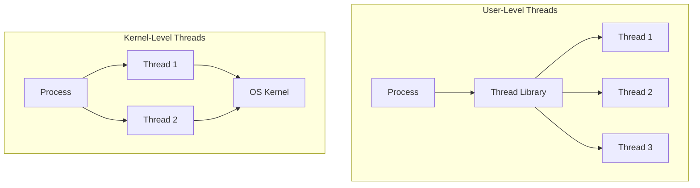
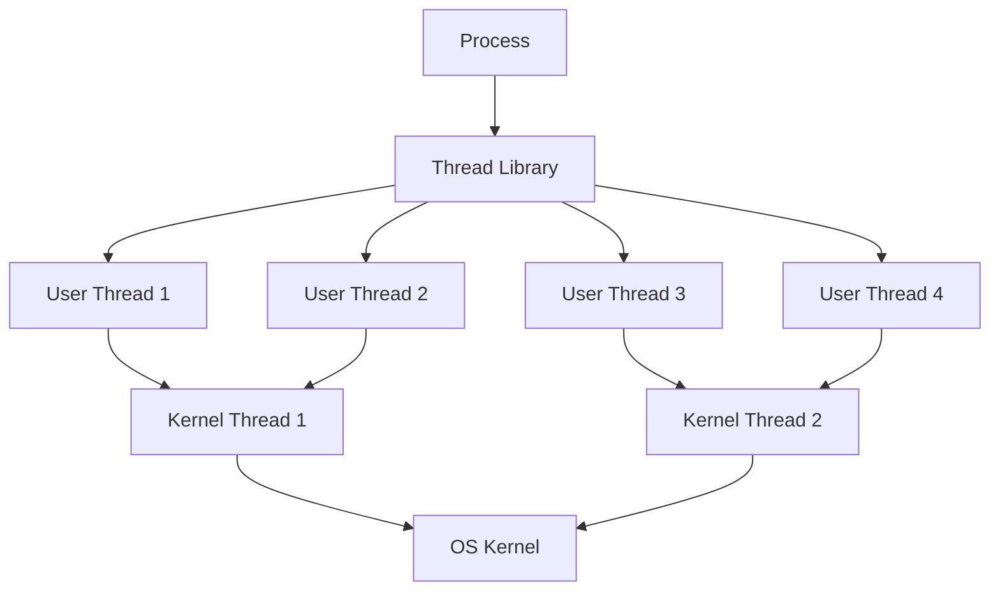

# User-Level vs Kernel-Level Threads

## Introduction

In modern computing, threads are the smallest units of execution within a process. They allow programs to perform multiple operations concurrently, improving performance and responsiveness. However, not all threads are created equal. Depending on where they're managed—either by the user application or by the operating system kernel—threads can behave quite differently.

This guide explores the key differences between **user-level threads** and **kernel-level threads**, helping you understand which approach is best for different programming scenarios.

## Understanding Thread Types

Before diving into the details, let's visualize the main difference between these two thread types:



## User-Level Threads

User-level threads (ULTs), also known as green threads or lightweight threads, are managed entirely by a user-space thread library without kernel involvement.

### Key Characteristics

- Implemented and managed in user space
- The operating system kernel is unaware of their existence
- Thread operations don't require system calls
- All thread management occurs within the application

### How User-Level Threads Work

When using user-level threads, the application creates and manages its own threading system. The thread library (such as GNU Portable Threads, POSIX Threads in user mode, or language-specific libraries) handles:

1. Thread creation and termination
2. Thread scheduling and context switching
3. Thread synchronization
4. Thread priority management

Here's a simple example of creating user-level threads using a hypothetical thread library:

```c
#include "user_thread_lib.h"

void* task1(void* arg) {
    for (int i = 0; i < 5; i++) {
        printf("Task 1: %d
", i);
        thread_yield(); // Voluntarily give up CPU
    }
    return NULL;
}

void* task2(void* arg) {
    for (int i = 0; i < 5; i++) {
        printf("Task 2: %d
", i);
        thread_yield(); // Voluntarily give up CPU
    }
    return NULL;
}

int main() {
    thread_t t1, t2;
    
    // Initialize the thread library
    thread_lib_init();
    
    // Create user-level threads
    thread_create(&t1, NULL, task1, NULL);
    thread_create(&t2, NULL, task2, NULL);
    
    // Wait for threads to complete
    thread_join(t1, NULL);
    thread_join(t2, NULL);
    
    // Clean up
    thread_lib_destroy();
    
    return 0;
}
```

### Advantages of User-Level Threads

1. **Fast thread operations**: Creating, switching, and synchronizing user-level threads is very efficient since it doesn't involve system calls.
2. **Portability**: Can be implemented on any operating system, even those without native thread support.
3. **Customizable scheduling**: Applications can implement their own scheduling algorithm tailored to their specific needs.
4. **Lower overhead**: Requires less memory and resources per thread compared to kernel threads.

### Disadvantages of User-Level Threads

1. **No true parallelism**: Since the kernel sees only a single process, all user-level threads within that process must share a single CPU core, limiting performance on multi-core systems.
2. **Blocking issues**: If one user-level thread makes a blocking system call, all threads in that process are blocked.
3. **Limited access to system resources**: Cannot directly utilize multiple CPUs or cores.

## Kernel-Level Threads

Kernel-level threads (KLTs) are implemented and managed directly by the operating system kernel.

### Key Characteristics

- Kernel is aware of and manages all threads
- Thread operations require system calls
- The kernel handles thread scheduling across CPU cores
- Each thread can be scheduled independently

### How Kernel-Level Threads Work

With kernel-level threads, the operating system kernel maintains information about each thread and handles their scheduling across available CPU cores. Thread creation and management typically occur through system calls.

Here's an example using POSIX threads (pthreads), which are implemented as kernel-level threads on most modern Unix-like systems:

```c
#include <stdio.h>
#include <pthread.h>

void* task1(void* arg) {
    for (int i = 0; i < 5; i++) {
        printf("Task 1: %d
", i);
        // No need for explicit yield, kernel handles scheduling
    }
    return NULL;
}

void* task2(void* arg) {
    for (int i = 0; i < 5; i++) {
        printf("Task 2: %d
", i);
        // No need for explicit yield, kernel handles scheduling
    }
    return NULL;
}

int main() {
    pthread_t t1, t2;
    
    // Create kernel-level threads
    pthread_create(&t1, NULL, task1, NULL);
    pthread_create(&t2, NULL, task2, NULL);
    
    // Wait for threads to complete
    pthread_join(t1, NULL);
    pthread_join(t2, NULL);
    
    return 0;
}
```

### Advantages of Kernel-Level Threads

1. **True parallelism**: The kernel can schedule different threads on different CPU cores, allowing for genuine parallel execution.
2. **Independent blocking**: If one thread blocks on I/O, other threads can continue execution.
3. **Direct access to system resources**: Can fully utilize multiple CPUs or cores.
4. **Better integration with system services**: Can interact more effectively with other kernel services.

### Disadvantages of Kernel-Level Threads

1. **Higher overhead**: Thread operations require system calls, which are more expensive than user-space function calls.
2. **More resource intensive**: Each thread requires kernel resources, leading to higher memory usage.
3. **Less flexible scheduling**: Applications must rely on the kernel's scheduling algorithm rather than implementing their own.

## Hybrid Approaches: The Best of Both Worlds

Many modern systems implement hybrid approaches that combine user-level and kernel-level threads:



### Many-to-One Model

Multiple user-level threads map to a single kernel thread. This model retains the efficiency of user-level threads but still suffers from the inability to achieve true parallelism.

### One-to-One Model

Each user-level thread maps directly to a kernel thread. This provides better concurrency but at the cost of higher resource usage.

### Many-to-Many Model

A hybrid approach where many user-level threads map to a smaller or equal number of kernel threads. This balances efficiency with the ability to achieve parallelism.

## Real-World Examples

### Java Threading Model

Early Java (Green Threads):
- Implemented as user-level threads
- Portable across platforms
- Limited by inability to use multiple cores

Modern Java (Native Threads):
- Uses native kernel threads
- Can fully utilize multi-core processors
- Thread management is abstracted away from the developer

Example Java code creating threads:

```java
public class ThreadExample {
    public static void main(String[] args) {
        // Create and start two threads
        Thread t1 = new Thread(() -> {
            for (int i = 0; i < 5; i++) {
                System.out.println("Thread 1: " + i);
                try {
                    Thread.sleep(100);
                } catch (InterruptedException e) {
                    e.printStackTrace();
                }
            }
        });
        
        Thread t2 = new Thread(() -> {
            for (int i = 0; i < 5; i++) {
                System.out.println("Thread 2: " + i);
                try {
                    Thread.sleep(100);
                } catch (InterruptedException e) {
                    e.printStackTrace();
                }
            }
        });
        
        t1.start();
        t2.start();
        
        try {
            t1.join();
            t2.join();
        } catch (InterruptedException e) {
            e.printStackTrace();
        }
        
        System.out.println("All threads completed");
    }
}
```

### Go Goroutines

Go language implements a sophisticated user-level threading model with its goroutines:

- Lightweight user-level threads managed by the Go runtime
- Multiple goroutines are multiplexed onto a smaller number of OS threads
- Achieves both efficiency and parallelism through a many-to-many model

Example Go code with goroutines:

```go
package main

import (
    "fmt"
    "time"
)

func task(id int) {
    for i := 0; i < 5; i++ {
        fmt.Printf("Task %d: %d
", id, i)
        time.Sleep(100 * time.Millisecond)
    }
}

func main() {
    // Start two goroutines
    go task(1)
    go task(2)
    
    // Wait to see the output (in real code, use proper synchronization)
    time.Sleep(1 * time.Second)
    
    fmt.Println("All tasks completed")
}
```

### Node.js Event Loop

Node.js uses a single-threaded event loop model with asynchronous I/O:

- Single main thread (in the traditional sense)
- Uses non-blocking I/O operations
- Offloads intensive operations to worker threads
- Excellent for I/O-bound applications but can struggle with CPU-intensive tasks

Example Node.js code demonstrating asynchronous execution:

```javascript
console.log("Start");

// Simulates an asynchronous operation
setTimeout(() => {
    console.log("Async operation completed");
}, 1000);

console.log("End");

// Output:
// Start
// End
// Async operation completed
```

## Choosing Between Thread Types

When designing multithreaded applications, consider these factors:

| Factor | User-Level Threads | Kernel-Level Threads |
|--------|-------------------|---------------------|
| Performance for thread operations | Faster | Slower |
| Ability to use multiple cores | Limited | Excellent |
| Memory overhead | Lower | Higher |
| Programming complexity | Can be higher | Usually lower |
| Blocking behavior | All threads block | Only affected thread blocks |
| Customizability | High | Low |

### When to Choose User-Level Threads:

- Applications requiring thousands of threads
- Situations where thread creation/destruction happens frequently
- When customized scheduling is needed
- When portability across different operating systems is important

### When to Choose Kernel-Level Threads:

- Applications requiring true parallelism
- Situations with frequent blocking operations
- When simplicity of programming model is preferred
- When threads need to interact with kernel services

## Summary

Understanding the difference between user-level and kernel-level threads is crucial for designing efficient concurrent applications:

- **User-level threads** are managed in user space, offering lightweight, fast operations but limited parallelism
- **Kernel-level threads** are managed by the OS kernel, providing true parallelism at the cost of higher overhead
- **Hybrid approaches** like many-to-many threading models aim to combine the advantages of both

Most modern programming languages and frameworks abstract away these details, but knowing what happens under the hood helps you make better design decisions and troubleshoot performance issues effectively.

## Additional Exercises

1. Compare thread creation time between a user-level thread library and kernel-level threads by writing a simple benchmark program.
2. Implement a simple user-level thread library with basic operations (create, yield, join).
3. Write a program that demonstrates the blocking issue with user-level threads.
4. Research how your favorite programming language implements its threading model.
5. Design a multithreaded application that would benefit from a hybrid threading approach and explain your reasoning.

## Further Reading

- Operating Systems textbooks like "Operating System Concepts" by Silberschatz, Galvin, and Gagne
- Documentation for POSIX Threads (pthreads)
- Java Concurrency in Practice by Brian Goetz
- The Go programming language documentation on goroutines and concurrency