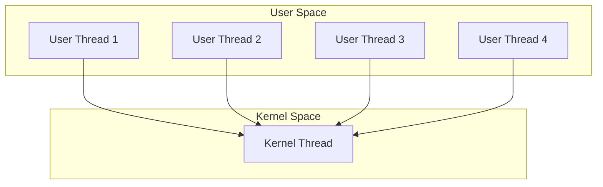
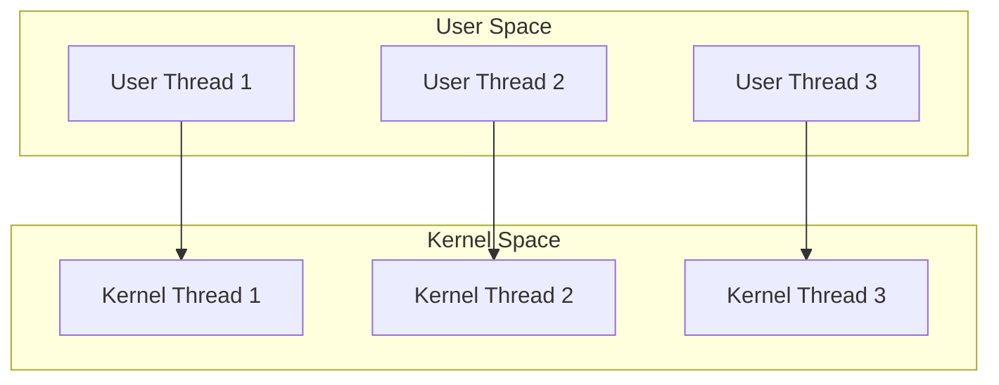
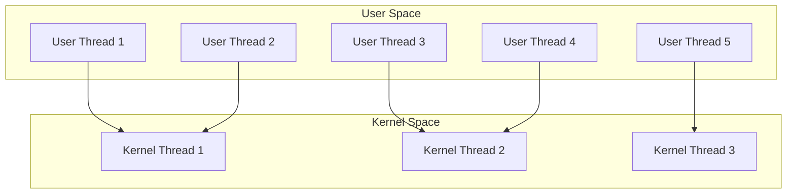
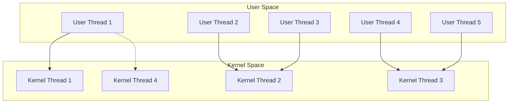

# Multithreading Models

## Introduction

Multithreading is a programming technique that allows multiple threads of execution to run concurrently within a single process. It enables developers to write programs that can perform multiple operations simultaneously, improving performance and responsiveness. However, to use multithreading effectively, it's important to understand the different models that govern how threads are created, managed, and synchronized.

This guide explores the main multithreading models used in modern programming, their characteristics, advantages, and practical applications.

## What are Multithreading Models?

Multithreading models define the relationship between application threads and kernel threads. They determine how user-level threads map to kernel-level threads, affecting aspects like performance, scalability, and resource utilization.

The three primary multithreading models are:

1. Many-to-One Model
2. One-to-One Model
3. Many-to-Many Model

Let's explore each one in detail.

## Many-to-One Model

The Many-to-One model maps many user-level threads to a single kernel thread. In this model, thread management is handled in user space by a thread library, not by the operating system.



### Characteristics:

- Thread management is efficient as it happens in user space
- Simple to implement
- Multiple threads cannot run in parallel on multiprocessor systems
- If one user thread performs a blocking system call, all threads get blocked

### Code Example:

```c
#include <stdio.h>
#include <pthread.h>
#include <unistd.h>

void* thread_function(void* arg) {
    int thread_id = *(int*)arg;
    printf("Thread %d is running
", thread_id);
    sleep(1);  // Simulating work
    printf("Thread %d finished
", thread_id);
    return NULL;
}

int main() {
    pthread_t threads[4];
    int thread_args[4];
    
    printf("Creating threads in Many-to-One model simulation
");
    
    // Create multiple user threads
    for (int i = 0; i < 4; i++) {
        thread_args[i] = i + 1;
        pthread_create(&threads[i], NULL, thread_function, &thread_args[i]);
    }
    
    // Wait for all threads to complete
    for (int i = 0; i < 4; i++) {
        pthread_join(threads[i], NULL);
    }
    
    printf("All threads have completed execution
");
    return 0;
}
```

**Output:**
```
Creating threads in Many-to-One model simulation
Thread 1 is running
Thread 1 finished
Thread 2 is running
Thread 2 finished
Thread 3 is running
Thread 3 finished
Thread 4 is running
Thread 4 finished
All threads have completed execution
```

> Note: The example above simulates the Many-to-One behavior; modern systems typically use One-to-One or Many-to-Many models.

### Real-world Applications:

- Legacy systems where kernel thread support is limited
- Applications with a large number of threads but limited concurrency needs
- Simple applications where thread management overhead needs to be minimized

## One-to-One Model

The One-to-One model maps each user thread to a kernel thread. This provides more concurrency than the Many-to-One model because the operating system can schedule multiple threads to run in parallel on multiprocessor systems.



### Characteristics:

- Better concurrency than Many-to-One model
- Blocking one thread doesn't affect others
- Higher overhead due to managing more kernel threads
- May impose a limit on the number of threads an application can create

### Code Example:

```java
public class OneToOneModelExample {
    public static void main(String[] args) {
        System.out.println("Main thread starting");
        
        // Create and start three threads
        for (int i = 1; i <= 3; i++) {
            Thread thread = new Thread(new WorkerThread(i));
            thread.start();
        }
        
        System.out.println("Main thread finished");
    }
    
    static class WorkerThread implements Runnable {
        private int threadId;
        
        public WorkerThread(int id) {
            this.threadId = id;
        }
        
        @Override
        public void run() {
            System.out.println("Thread " + threadId + " is running");
            
            // Perform some computation
            long sum = 0;
            for (int i = 0; i < 1000000 * threadId; i++) {
                sum += i;
            }
            
            System.out.println("Thread " + threadId + " finished. Sum = " + sum);
        }
    }
}
```

**Output:**
```
Main thread starting
Thread 1 is running
Thread 2 is running
Thread 3 is running
Main thread finished
Thread 1 finished. Sum = 499999500000
Thread 2 finished. Sum = 999999000000
Thread 3 finished. Sum = 1499998500000
```

> Notice how the threads execute concurrently and independently of each other.

### Real-world Applications:

- Modern desktop and server applications
- Performance-critical applications that benefit from parallel execution
- Applications running on multi-core processors
- Most Java applications (Java uses the One-to-One model)

## Many-to-Many Model

The Many-to-Many model multiplexes many user-level threads to a smaller or equal number of kernel threads. This combines the best features of both the Many-to-One and One-to-One models.



### Characteristics:

- Flexible and efficient
- Allows developers to create as many user threads as needed
- The OS can schedule multiple kernel threads to run on multiple processors
- Complex to implement and manage

### Code Example:

```python
import concurrent.futures
import time

def worker_function(id):
    print(f"Thread {id} is running")
    # Simulate some work
    time.sleep(1)
    result = sum(i for i in range(1000000 * id))
    print(f"Thread {id} finished. Result: {result}")
    return result

if __name__ == "__main__":
    print("Starting Many-to-Many model example with ThreadPoolExecutor")
    
    # Create a thread pool with 3 worker threads
    # Even if we submit 5 tasks, only 3 will run concurrently
    with concurrent.futures.ThreadPoolExecutor(max_workers=3) as executor:
        # Submit 5 tasks
        futures = [executor.submit(worker_function, i) for i in range(1, 6)]
        
        # Wait for all futures to complete
        for future in concurrent.futures.as_completed(futures):
            try:
                result = future.result()
                print(f"Got result: {result}")
            except Exception as e:
                print(f"Task generated an exception: {e}")
    
    print("All tasks completed")
```

**Output:**
```
Starting Many-to-Many model example with ThreadPoolExecutor
Thread 1 is running
Thread 2 is running
Thread 3 is running
Thread 1 finished. Result: 499999500000
Thread 4 is running
Got result: 499999500000
Thread 2 finished. Result: 999999000000
Thread 5 is running
Got result: 999999000000
Thread 3 finished. Result: 1499998500000
Got result: 1499998500000
Thread 4 finished. Result: 1999998000000
Got result: 1999998000000
Thread 5 finished. Result: 2499997500000
Got result: 2499997500000
All tasks completed
```

> Note how only 3 threads run at a time despite having 5 tasks, demonstrating the pool concept in the Many-to-Many model.

### Real-world Applications:

- Server applications handling many client connections
- Applications that need to create a large number of threads but have limited system resources
- High-performance computing applications that need fine-grained control over threading
- Database management systems

## Two-Level Model

The Two-Level model is a variation of the Many-to-Many model that allows a user thread to be bound to a kernel thread. This gives the application more control over specific threads that may benefit from dedicated kernel threads.



### Characteristics:

- Combines the flexibility of the Many-to-Many model with the ability to bind critical threads to kernel threads
- Allows for dedicated kernel resources for performance-critical threads
- More complex to implement than other models

## Choosing the Right Multithreading Model

Selecting the appropriate multithreading model depends on several factors:

1. **Application Requirements**:
   - Number of threads needed
   - Concurrency level required
   - CPU-bound vs. I/O-bound tasks

2. **Platform Support**:
   - Operating system capabilities
   - Available thread libraries and frameworks

3. **Resource Constraints**:
   - Memory limitations
   - CPU cores available

4. **Performance Considerations**:
   - Thread creation overhead
   - Context-switching costs
   - Scalability needs

Most modern programming languages and frameworks abstract the underlying threading model, but understanding these models helps you make better design decisions.

## Common Threading Libraries and Their Models

| Language/Framework | Common Threading Library | Typical Model Used |
|--------------------|--------------------------|-------------------|
| Java               | java.lang.Thread         | One-to-One        |
| Python             | threading                | Many-to-One (GIL) |
| Python             | concurrent.futures       | Many-to-Many     |
| C/C++              | POSIX Threads (pthreads) | One-to-One        |
| C#/.NET            | System.Threading         | One-to-One        |
| Go                 | Goroutines               | Many-to-Many      |
| Rust               | std::thread              | One-to-One        |

## Summary

Multithreading models define how user-level threads map to kernel-level threads:

- **Many-to-One**: Multiple user threads map to one kernel thread. Simple but limited concurrency.
- **One-to-One**: Each user thread maps to a kernel thread. Good concurrency but higher overhead.
- **Many-to-Many**: Multiple user threads map to a smaller number of kernel threads. Flexible and efficient but complex.
- **Two-Level**: A hybrid approach that allows both bound and unbound threads.

Understanding these models helps you make informed decisions about concurrent programming designs and better utilize your system's resources.

## Exercises

1. Write a program that creates 10 threads using a thread pool with a maximum of 3 concurrent threads, simulating the Many-to-Many model.

2. Compare the performance of a CPU-intensive task run with different numbers of threads on your system. At what point does adding more threads decrease performance?

3. Implement a simple multithreaded application and observe its behavior on different operating systems. Do you notice any differences?

4. Research how your favorite programming language implements multithreading underneath. Which model does it use by default?

## Additional Resources

- "Modern Operating Systems" by Andrew S. Tanenbaum
- "Java Concurrency in Practice" by Brian Goetz
- "Programming with POSIX Threads" by David R. Butenhof
- "Concurrency in Go" by Katherine Cox-Buday

Happy multithreading!