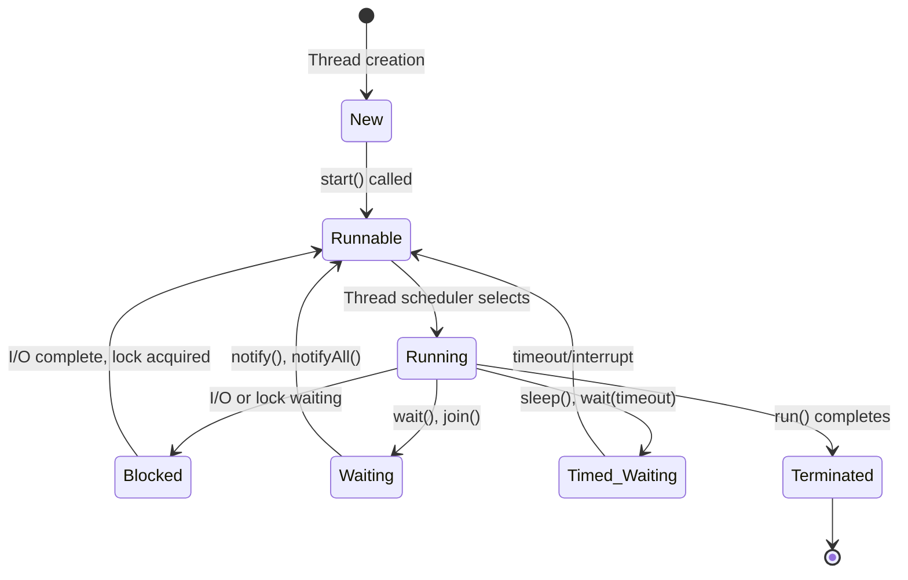

# Thread Libraries

## Introduction

Thread libraries provide a standardized way for programmers to create and manage threads in their applications. Threads allow programs to perform multiple tasks concurrently, improving efficiency and responsiveness, especially on multi-core processors. This guide will introduce you to the most common thread libraries, their features, and how to use them in your programs.

## What are Thread Libraries?

Thread libraries are sets of functions or classes that provide an interface for creating and managing threads. They abstract away the complex details of working directly with the operating system's threading mechanisms, making multithreaded programming more accessible.

The three primary thread libraries you'll encounter are:

1. **POSIX Threads (Pthreads)** - A standard C/C++ library for Unix-like systems
2. **Java Threads** - Built into the Java language
3. **C# Threading** - Part of the .NET Framework

Let's explore each of these libraries and learn how to use them.

## POSIX Threads (Pthreads)

POSIX Threads, commonly known as Pthreads, is a standardized C/C++ threading API for Unix-like operating systems.

### Basic Pthread Operations

```c
#include <stdio.h>
#include <pthread.h>

// Function to be executed by the thread
void* thread_function(void* arg) {
    int* thread_id = (int*)arg;
    printf("Hello from thread %d!
", *thread_id);
    return NULL;
}

int main() {
    pthread_t thread1, thread2;
    int id1 = 1, id2 = 2;
    
    // Create threads
    pthread_create(&thread1, NULL, thread_function, &id1);
    pthread_create(&thread2, NULL, thread_function, &id2);
    
    // Wait for threads to finish
    pthread_join(thread1, NULL);
    pthread_join(thread2, NULL);
    
    printf("All threads have completed execution
");
    return 0;
}
```

### Output:
```
Hello from thread 1!
Hello from thread 2!
All threads have completed execution
```

### Key Pthread Functions

- `pthread_create()`: Creates a new thread
- `pthread_join()`: Waits for a thread to terminate
- `pthread_exit()`: Terminates the calling thread
- `pthread_mutex_init()`: Initializes a mutex
- `pthread_mutex_lock()`: Locks a mutex
- `pthread_mutex_unlock()`: Unlocks a mutex

### Thread Synchronization with Pthreads

Mutexes (mutual exclusion) are used to protect shared resources:

```c
#include <stdio.h>
#include <pthread.h>

int counter = 0;
pthread_mutex_t mutex;

void* increment_counter(void* arg) {
    for (int i = 0; i < 1000000; i++) {
        pthread_mutex_lock(&mutex);
        counter++;
        pthread_mutex_unlock(&mutex);
    }
    return NULL;
}

int main() {
    pthread_t thread1, thread2;
    
    // Initialize mutex
    pthread_mutex_init(&mutex, NULL);
    
    // Create threads
    pthread_create(&thread1, NULL, increment_counter, NULL);
    pthread_create(&thread2, NULL, increment_counter, NULL);
    
    // Wait for threads to finish
    pthread_join(thread1, NULL);
    pthread_join(thread2, NULL);
    
    printf("Final counter value: %d
", counter);
    
    // Destroy mutex
    pthread_mutex_destroy(&mutex);
    
    return 0;
}
```

### Output:
```
Final counter value: 2000000
```

## Java Threads

Java has built-in support for threads as part of the language and standard library.

### Creating Threads in Java

In Java, you can create threads in two ways:
1. By extending the `Thread` class
2. By implementing the `Runnable` interface (preferred)

#### Using Thread Class:

```java
class MyThread extends Thread {
    private int threadId;
    
    public MyThread(int id) {
        this.threadId = id;
    }
    
    @Override
    public void run() {
        System.out.println("Thread " + threadId + " is running");
    }
}

public class ThreadExample {
    public static void main(String[] args) {
        MyThread thread1 = new MyThread(1);
        MyThread thread2 = new MyThread(2);
        
        thread1.start();
        thread2.start();
    }
}
```

#### Using Runnable Interface:

```java
class MyRunnable implements Runnable {
    private int threadId;
    
    public MyRunnable(int id) {
        this.threadId = id;
    }
    
    @Override
    public void run() {
        System.out.println("Thread " + threadId + " is running");
    }
}

public class RunnableExample {
    public static void main(String[] args) {
        Thread thread1 = new Thread(new MyRunnable(1));
        Thread thread2 = new Thread(new MyRunnable(2));
        
        thread1.start();
        thread2.start();
    }
}
```

### Java Thread Synchronization

Java provides the `synchronized` keyword to protect critical sections:

```java
public class Counter {
    private int count = 0;
    
    // Synchronized method
    public synchronized void increment() {
        count++;
    }
    
    public int getCount() {
        return count;
    }
}

public class SynchronizationExample {
    public static void main(String[] args) throws InterruptedException {
        Counter counter = new Counter();
        
        Thread thread1 = new Thread(() -> {
            for (int i = 0; i < 100000; i++) {
                counter.increment();
            }
        });
        
        Thread thread2 = new Thread(() -> {
            for (int i = 0; i < 100000; i++) {
                counter.increment();
            }
        });
        
        thread1.start();
        thread2.start();
        
        thread1.join();
        thread2.join();
        
        System.out.println("Final count: " + counter.getCount());
    }
}
```

### Output:
```
Final count: 200000
```

### Java's Executor Framework

Java provides a higher-level concurrency API with the Executor framework:

```java
import java.util.concurrent.ExecutorService;
import java.util.concurrent.Executors;

public class ExecutorExample {
    public static void main(String[] args) {
        // Create a fixed thread pool with 2 threads
        ExecutorService executor = Executors.newFixedThreadPool(2);
        
        for (int i = 1; i <= 5; i++) {
            final int taskId = i;
            executor.execute(() -> {
                System.out.println("Task " + taskId + " is running on thread " + 
                                   Thread.currentThread().getName());
            });
        }
        
        // Shut down the executor
        executor.shutdown();
    }
}
```

### Output:
```
Task 1 is running on thread pool-1-thread-1
Task 2 is running on thread pool-1-thread-2
Task 3 is running on thread pool-1-thread-1
Task 4 is running on thread pool-1-thread-2
Task 5 is running on thread pool-1-thread-1
```

## C# Threading

The .NET Framework provides several ways to work with threads in C#.

### Basic Thread Creation in C#

```csharp
using System;
using System.Threading;

class Program
{
    static void Main()
    {
        // Create threads
        Thread thread1 = new Thread(() => ThreadFunction(1));
        Thread thread2 = new Thread(() => ThreadFunction(2));
        
        // Start threads
        thread1.Start();
        thread2.Start();
        
        // Wait for threads to complete
        thread1.Join();
        thread2.Join();
        
        Console.WriteLine("All threads have completed");
    }
    
    static void ThreadFunction(int id)
    {
        Console.WriteLine($"Thread {id} is running");
        // Simulate work
        Thread.Sleep(1000);
        Console.WriteLine($"Thread {id} has finished");
    }
}
```

### Output:
```
Thread 1 is running
Thread 2 is running
Thread 1 has finished
Thread 2 has finished
All threads have completed
```

### Thread Synchronization in C#

C# provides several synchronization mechanisms, including `lock`, `Monitor`, and `Mutex`:

```csharp
using System;
using System.Threading;

class Counter
{
    private int count = 0;
    private object lockObj = new object();
    
    public void Increment()
    {
        lock (lockObj)
        {
            count++;
        }
    }
    
    public int Count
    {
        get { return count; }
    }
}

class Program
{
    static void Main()
    {
        Counter counter = new Counter();
        
        // Create and start threads
        Thread[] threads = new Thread[5];
        for (int i = 0; i < threads.Length; i++)
        {
            threads[i] = new Thread(() =>
            {
                for (int j = 0; j < 1000; j++)
                {
                    counter.Increment();
                }
            });
            threads[i].Start();
        }
        
        // Wait for all threads to complete
        foreach (Thread thread in threads)
        {
            thread.Join();
        }
        
        Console.WriteLine($"Final count: {counter.Count}");
    }
}
```

### Output:
```
Final count: 5000
```

### Task Parallel Library (TPL)

The Task Parallel Library is a modern way to handle concurrency in C#:

```csharp
using System;
using System.Threading.Tasks;

class Program
{
    static async Task Main()
    {
        // Create and start tasks
        Task task1 = Task.Run(() => DoWork(1));
        Task task2 = Task.Run(() => DoWork(2));
        
        // Wait for all tasks to complete
        await Task.WhenAll(task1, task2);
        
        Console.WriteLine("All tasks completed");
    }
    
    static void DoWork(int id)
    {
        Console.WriteLine($"Task {id} starting");
        // Simulate work
        Task.Delay(1000).Wait();
        Console.WriteLine($"Task {id} completed");
    }
}
```

### Output:
```
Task 1 starting
Task 2 starting
Task 1 completed
Task 2 completed
All tasks completed
```

## Thread States and Lifecycle

Threads go through various states during their lifecycle:



## Real-World Applications

### Web Server Request Handling

A web server can handle multiple client requests concurrently by assigning each request to a separate thread:

```java
public class SimpleWebServer {
    public static void main(String[] args) throws IOException {
        ServerSocket serverSocket = new ServerSocket(8080);
        System.out.println("Server started on port 8080");
        
        while (true) {
            // Accept client connection
            Socket clientSocket = serverSocket.accept();
            
            // Create and start a new thread to handle the client
            new Thread(() -> handleClient(clientSocket)).start();
        }
    }
    
    private static void handleClient(Socket clientSocket) {
        try {
            // Process client request
            BufferedReader in = new BufferedReader(
                new InputStreamReader(clientSocket.getInputStream()));
            PrintWriter out = new PrintWriter(clientSocket.getOutputStream(), true);
            
            // Read request
            String request = in.readLine();
            System.out.println("Received request: " + request);
            
            // Simulate processing time
            Thread.sleep(100);
            
            // Send response
            out.println("HTTP/1.1 200 OK");
            out.println("Content-Type: text/html");
            out.println();
            out.println("<html><body><h1>Hello from the web server!</h1></body></html>");
            
            // Close connection
            clientSocket.close();
        } catch (Exception e) {
            e.printStackTrace();
        }
    }
}
```

### Background Processing in GUI Applications

Threads are essential in GUI applications to keep the interface responsive while performing time-consuming operations:

```java
import javax.swing.*;
import java.awt.*;
import java.awt.event.*;

public class BackgroundTaskExample extends JFrame {
    private JButton startButton;
    private JProgressBar progressBar;
    private JLabel statusLabel;
    
    public BackgroundTaskExample() {
        setTitle("Background Task Demo");
        setSize(300, 150);
        setDefaultCloseOperation(JFrame.EXIT_ON_CLOSE);
        
        JPanel panel = new JPanel();
        panel.setLayout(new GridLayout(3, 1));
        
        startButton = new JButton("Start Task");
        progressBar = new JProgressBar(0, 100);
        statusLabel = new JLabel("Ready", JLabel.CENTER);
        
        panel.add(startButton);
        panel.add(progressBar);
        panel.add(statusLabel);
        
        add(panel);
        
        startButton.addActionListener(new ActionListener() {
            public void actionPerformed(ActionEvent e) {
                startButton.setEnabled(false);
                statusLabel.setText("Working...");
                
                // Create a new thread for the task
                new Thread(() -> {
                    try {
                        // Simulate a long-running task
                        for (int i = 0; i <= 100; i++) {
                            final int progressValue = i;
                            
                            // Update UI on the Event Dispatch Thread
                            SwingUtilities.invokeLater(() -> {
                                progressBar.setValue(progressValue);
                            });
                            
                            Thread.sleep(50);
                        }
                        
                        // Update UI when complete
                        SwingUtilities.invokeLater(() -> {
                            statusLabel.setText("Task completed!");
                            startButton.setEnabled(true);
                        });
                    } catch (InterruptedException ex) {
                        ex.printStackTrace();
                    }
                }).start();
            }
        });
    }
    
    public static void main(String[] args) {
        SwingUtilities.invokeLater(() -> {
            new BackgroundTaskExample().setVisible(true);
        });
    }
}
```

## Common Threading Issues

### Race Conditions

Race conditions occur when multiple threads access and modify shared data simultaneously:

```java
// Incorrect (race condition)
public class Counter {
    private int count = 0;
    
    public void increment() {
        count++; // This is not atomic!
    }
    
    public int getCount() {
        return count;
    }
}

// Correct (synchronized)
public class Counter {
    private int count = 0;
    
    public synchronized void increment() {
        count++;
    }
    
    public int getCount() {
        return count;
    }
}
```

### Deadlocks

Deadlocks occur when two or more threads are waiting for each other to release resources:

```java
public class DeadlockExample {
    private final Object resource1 = new Object();
    private final Object resource2 = new Object();
    
    public void method1() {
        synchronized (resource1) {
            System.out.println("Thread 1: Holding resource 1...");
            
            try { Thread.sleep(100); } catch (InterruptedException e) {}
            
            System.out.println("Thread 1: Waiting for resource 2...");
            synchronized (resource2) {
                System.out.println("Thread 1: Holding resource 1 and 2...");
            }
        }
    }
    
    public void method2() {
        synchronized (resource2) {
            System.out.println("Thread 2: Holding resource 2...");
            
            try { Thread.sleep(100); } catch (InterruptedException e) {}
            
            System.out.println("Thread 2: Waiting for resource 1...");
            synchronized (resource1) {
                System.out.println("Thread 2: Holding resource 2 and 1...");
            }
        }
    }
    
    public static void main(String[] args) {
        DeadlockExample deadlock = new DeadlockExample();
        
        new Thread(() -> deadlock.method1()).start();
        new Thread(() -> deadlock.method2()).start();
    }
}
```

The solution is to always acquire locks in the same order across all threads.

## Thread Performance Considerations

- **Thread Creation Overhead**: Creating threads is expensive, use thread pools for better performance
- **Context Switching**: Too many active threads can lead to excessive context switching
- **Thread Pool Sizing**: Typically, use a thread pool size close to the number of CPU cores for CPU-bound tasks
- **Memory Usage**: Each thread requires memory for its stack

## Summary

Thread libraries provide a standardized way to create and manage threads in multithreaded applications. In this guide, we covered:

- **POSIX Threads (Pthreads)** for C/C++ programming on Unix-like systems
- **Java Threads** built into the Java language and standard library
- **C# Threading** in the .NET Framework
- Common threading issues and best practices
- Real-world applications of threading

By understanding these thread libraries, you can develop more efficient and responsive applications that take advantage of modern multi-core processors.

## Exercises

1. Write a program using Pthreads that computes the sum of elements in an array by dividing the work among multiple threads.

2. Create a Java program that downloads multiple files concurrently using separate threads for each download.

3. Implement a producer-consumer pattern using C# threads and a thread-safe queue.

4. Modify the simple web server example to limit the maximum number of concurrent client threads using a thread pool.

5. Identify and fix the race condition in the following code:
   ```java
   public class Counter {
       private int value = 0;
       
       public void increment() { value++; }
       public void decrement() { value--; }
       public int getValue() { return value; }
   }
   ```

## Further Reading

- **POSIX Threads Programming**: [LLNL Pthreads Tutorial](https://computing.llnl.gov/tutorials/pthreads/)
- **Java Concurrency in Practice** by Brian Goetz
- **C# in Depth** by Jon Skeet (Chapters on Threading)
- **The Art of Multiprocessor Programming** by Maurice Herlihy and Nir Shavit