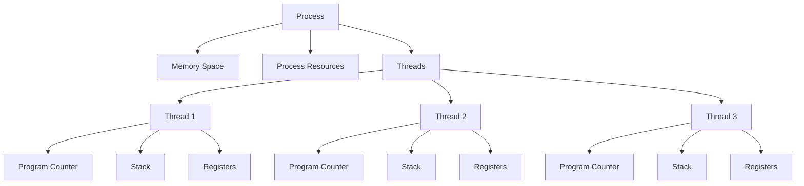
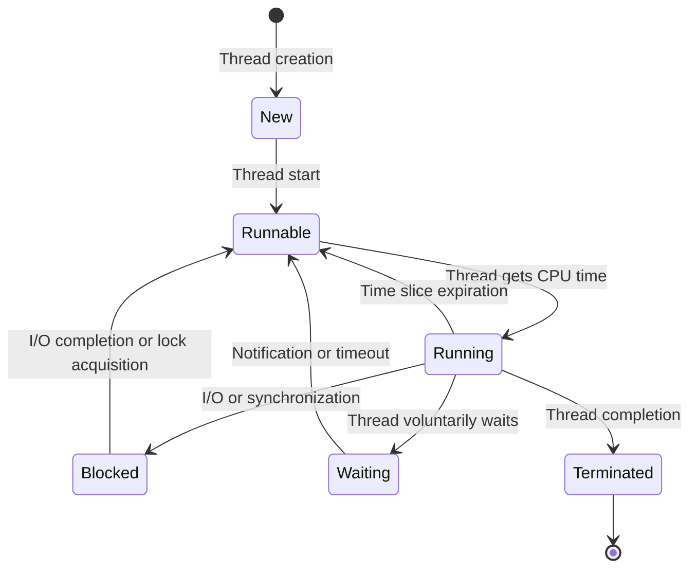

# Thread Creation and Termination

## Introduction

Threads are lightweight processes that allow a program to perform multiple operations concurrently within a single process. Thread management, specifically the creation and termination of threads, is a fundamental concept in concurrent programming that enables developers to build responsive, efficient applications that can take advantage of modern multi-core processors.

In this tutorial, we'll explore how threads work, how to create and terminate them properly across different programming languages, and best practices to avoid common pitfalls like resource leaks and race conditions.

## Understanding Threads

Before diving into thread creation and termination, let's understand what threads are and how they differ from processes:

- A **process** is an independent program running in its own memory space
- A **thread** is a sequence of execution within a process that shares the same memory space with other threads



Each thread has its own:
- Program counter
- Stack
- Set of registers

But all threads within a process share the same:
- Code section
- Data section
- Files and other OS resources

## Thread Lifecycle

Understanding the thread lifecycle is essential for proper thread management:



1. **New**: Thread object is created but not yet started
2. **Runnable**: Thread is ready to run but waiting for CPU time
3. **Running**: Thread is actively executing
4. **Blocked/Waiting**: Thread is waiting for a resource or event
5. **Terminated**: Thread has completed execution

## Thread Creation

Let's look at how to create threads in different programming languages:

### Java Thread Creation

In Java, there are two main ways to create threads:

#### Method 1: Extending the Thread class

```java
public class MyThread extends Thread {
    @Override
    public void run() {
        // Code to be executed in the thread
        System.out.println("Thread is running: " + Thread.currentThread().getName());
    }
    
    public static void main(String[] args) {
        MyThread thread = new MyThread();
        thread.start(); // Start the thread
        
        System.out.println("Main thread continues execution");
    }
}
```

**Output:**
```
Main thread continues execution
Thread is running: Thread-0
```

Note: The output order might vary as threads execute concurrently.

#### Method 2: Implementing the Runnable interface (Preferred)

```java
public class MyRunnable implements Runnable {
    @Override
    public void run() {
        // Code to be executed in the thread
        System.out.println("Thread is running: " + Thread.currentThread().getName());
    }
    
    public static void main(String[] args) {
        Thread thread = new Thread(new MyRunnable());
        thread.start(); // Start the thread
        
        System.out.println("Main thread continues execution");
    }
}
```

#### Method 3: Using Lambda Expressions (Java 8+)

```java
public class LambdaThread {
    public static void main(String[] args) {
        Thread thread = new Thread(() -> {
            System.out.println("Thread is running in lambda: " + Thread.currentThread().getName());
        });
        
        thread.start();
        System.out.println("Main thread continues execution");
    }
}
```

### Python Thread Creation

Python provides a `threading` module to create and manage threads:

```python
import threading
import time

def task(name):
    print(f"Thread {name} starting")
    time.sleep(1)  # Simulate work
    print(f"Thread {name} finishing")

if __name__ == "__main__":
    # Create two threads
    thread1 = threading.Thread(target=task, args=("A",))
    thread2 = threading.Thread(target=task, args=("B",))
    
    # Start the threads
    thread1.start()
    thread2.start()
    
    print("Main thread continues execution")
    
    # Wait for both threads to complete
    thread1.join()
    thread2.join()
    
    print("All threads completed")
```

**Output:**
```
Thread A starting
Thread B starting
Main thread continues execution
Thread A finishing
Thread B finishing
All threads completed
```

### C++ Thread Creation (C++11 and later)

Modern C++ provides a standard thread library:

```cpp
#include <iostream>
#include <thread>
#include <chrono>

void task(std::string name) {
    std::cout << "Thread " << name << " starting
";
    std::this_thread::sleep_for(std::chrono::seconds(1)); // Simulate work
    std::cout << "Thread " << name << " finishing
";
}

int main() {
    // Create two threads
    std::thread thread1(task, "A");
    std::thread thread2(task, "B");
    
    std::cout << "Main thread continues execution
";
    
    // Wait for threads to complete
    thread1.join();
    thread2.join();
    
    std::cout << "All threads completed
";
    return 0;
}
```

## Thread Termination

Proper thread termination is crucial to prevent resource leaks and unexpected behavior. Let's explore different ways to terminate threads:

### Natural Termination

The most straightforward way for a thread to terminate is to return from its execution method:

```java
public void run() {
    // Do some work
    System.out.println("Work completed, thread terminates naturally");
    return; // Thread terminates when run() method returns
}
```

### Java Thread Termination

#### Join Method

The `join()` method allows one thread to wait for another thread to complete:

```java
public class JoinExample {
    public static void main(String[] args) {
        Thread workerThread = new Thread(() -> {
            System.out.println("Worker thread started");
            try {
                Thread.sleep(2000); // Simulate work
            } catch (InterruptedException e) {
                System.out.println("Worker thread interrupted");
            }
            System.out.println("Worker thread finishing");
        });
        
        workerThread.start();
        
        System.out.println("Main thread waiting for worker to complete");
        try {
            workerThread.join(); // Main thread waits for workerThread to complete
        } catch (InterruptedException e) {
            System.out.println("Main thread interrupted");
        }
        
        System.out.println("Main thread continues after worker thread completion");
    }
}
```

**Output:**
```
Main thread waiting for worker to complete
Worker thread started
Worker thread finishing
Main thread continues after worker thread completion
```

#### Interrupting a Thread

The `interrupt()` method is used to signal a thread that it should stop:

```java
public class InterruptExample {
    public static void main(String[] args) {
        Thread thread = new Thread(() -> {
            try {
                System.out.println("Thread started, going to sleep");
                Thread.sleep(10000); // Sleep for 10 seconds
                System.out.println("Woke up naturally"); // This won't be printed if interrupted
            } catch (InterruptedException e) {
                System.out.println("Thread interrupted during sleep");
                return; // Exit the thread
            }
        });
        
        thread.start();
        
        // Let the thread run for 2 seconds then interrupt it
        try {
            Thread.sleep(2000);
        } catch (InterruptedException e) {
            e.printStackTrace();
        }
        
        thread.interrupt();
        System.out.println("Main thread sent interrupt signal");
    }
}
```

**Output:**
```
Thread started, going to sleep
Main thread sent interrupt signal
Thread interrupted during sleep
```

### Python Thread Termination

In Python, there's no direct way to forcefully terminate a thread, but you can use flags to signal a thread to stop:

```python
import threading
import time

# Flag to indicate whether the thread should run
running = True

def worker():
    print("Thread started")
    count = 0
    while running:
        count += 1
        print(f"Working... count={count}")
        time.sleep(1)
    print("Thread terminating gracefully")

if __name__ == "__main__":
    # Create and start the thread
    thread = threading.Thread(target=worker)
    thread.start()
    
    # Let it run for 5 seconds
    time.sleep(5)
    
    # Signal the thread to stop
    running = False
    print("Main thread signaled to stop")
    
    # Wait for the thread to finish
    thread.join()
    print("Thread has terminated")
```

**Output:**
```
Thread started
Working... count=1
Working... count=2
Working... count=3
Working... count=4
Working... count=5
Main thread signaled to stop
Thread terminating gracefully
Thread has terminated
```

### C++ Thread Termination

In C++, you can use either `join()` or `detach()` to handle thread termination:

```cpp
#include <iostream>
#include <thread>
#include <chrono>
#include <atomic>

std::atomic<bool> running(true);

void worker() {
    std::cout << "Thread started
";
    int count = 0;
    while (running) {
        count++;
        std::cout << "Working... count=" << count << std::endl;
        std::this_thread::sleep_for(std::chrono::seconds(1));
    }
    std::cout << "Thread terminating gracefully
";
}

int main() {
    // Create and start the thread
    std::thread thread(worker);
    
    // Let it run for 5 seconds
    std::this_thread::sleep_for(std::chrono::seconds(5));
    
    // Signal the thread to stop
    running = false;
    std::cout << "Main thread signaled to stop
";
    
    // Wait for the thread to finish
    thread.join();
    std::cout << "Thread has terminated
";
    
    return 0;
}
```

## Best Practices for Thread Creation and Termination

### Do's

1. **Use Thread Pools** for managing multiple threads efficiently
   ```java
   // Java Thread Pool example
   import java.util.concurrent.ExecutorService;
   import java.util.concurrent.Executors;
   
   public class ThreadPoolExample {
       public static void main(String[] args) {
           // Create a fixed thread pool with 5 threads
           ExecutorService executor = Executors.newFixedThreadPool(5);
           
           // Submit tasks to the pool
           for (int i = 0; i < 10; i++) {
               final int taskId = i;
               executor.submit(() -> {
                   System.out.println("Task " + taskId + " executed by " + 
                                     Thread.currentThread().getName());
               });
           }
           
           // Shut down the executor
           executor.shutdown();
       }
   }
   ```

2. **Always join threads** before program termination

3. **Handle InterruptedException** properly
   ```java
   public void run() {
       try {
           while (!Thread.currentThread().isInterrupted()) {
               // Do work...
           }
       } catch (InterruptedException e) {
           // Restore the interrupted status
           Thread.currentThread().interrupt();
           // Clean up code
       }
   }
   ```

4. **Use atomic variables or locks** for shared data

### Don'ts

1. **Don't use `Thread.stop()`, `Thread.suspend()`, or `Thread.resume()`** (deprecated in Java)

2. **Don't leave threads running** when they're no longer needed

3. **Don't ignore InterruptedException** without restoring the interrupted status

4. **Don't create too many threads** - use thread pools instead

5. **Don't rely on thread priority** for deterministic behavior

## Real-World Application: Parallel Web Scraper

Let's implement a simple parallel web scraper that downloads multiple web pages simultaneously:

```java
import java.io.BufferedReader;
import java.io.InputStreamReader;
import java.net.URL;
import java.util.ArrayList;
import java.util.List;
import java.util.concurrent.ExecutorService;
import java.util.concurrent.Executors;
import java.util.concurrent.TimeUnit;

public class ParallelWebScraper {
    
    static class WebPageDownloader implements Runnable {
        private final String url;
        
        public WebPageDownloader(String url) {
            this.url = url;
        }
        
        @Override
        public void run() {
            try {
                System.out.println("Downloading: " + url);
                URL website = new URL(url);
                BufferedReader reader = new BufferedReader(
                        new InputStreamReader(website.openStream()));
                
                StringBuilder content = new StringBuilder();
                String line;
                while ((line = reader.readLine()) != null) {
                    content.append(line);
                }
                reader.close();
                
                System.out.println("Downloaded " + url + ", size: " + 
                                  content.length() + " characters");
            } catch (Exception e) {
                System.out.println("Error downloading " + url + ": " + e.getMessage());
            }
        }
    }
    
    public static void main(String[] args) {
        // List of URLs to download
        List<String> urls = new ArrayList<>();
        urls.add("https://www.example.com");
        urls.add("https://www.example.org");
        urls.add("https://www.example.net");
        
        // Create a thread pool
        ExecutorService executor = Executors.newFixedThreadPool(3);
        
        // Submit tasks to the pool
        for (String url : urls) {
            executor.submit(new WebPageDownloader(url));
        }
        
        // Initiate an orderly shutdown
        executor.shutdown();
        
        try {
            // Wait for all tasks to complete or timeout after 60 seconds
            if (!executor.awaitTermination(60, TimeUnit.SECONDS)) {
                // Force shutdown if tasks don't complete in time
                executor.shutdownNow();
            }
        } catch (InterruptedException e) {
            // If the current thread is interrupted
            executor.shutdownNow();
            Thread.currentThread().interrupt();
        }
        
        System.out.println("All downloads completed");
    }
}
```

This example creates a thread pool to download multiple web pages concurrently. It demonstrates:
- Thread creation through an executor service
- Proper thread termination with shutdown and awaitTermination
- Error handling
- Resource cleanup

## Summary

Thread creation and termination are essential aspects of concurrent programming. In this guide, we've covered:

- The basics of threads and their lifecycle
- How to create threads in Java, Python, and C++
- Different methods for terminating threads safely
- Best practices for thread management
- A real-world application demonstrating thread creation and termination

Remember that proper thread management is crucial for building efficient and reliable concurrent applications. Always ensure that threads are terminated properly to avoid resource leaks, and use higher-level abstractions like thread pools when dealing with multiple threads.

## Exercises

1. Create a multi-threaded application that counts the number of words in multiple text files concurrently.
2. Implement a producer-consumer pattern using threads, where one thread produces data and another consumes it.
3. Write a program that downloads images from a list of URLs using a thread pool.
4. Modify the parallel web scraper example to limit the maximum number of concurrent downloads to prevent overloading the network.
5. Implement a task that can be canceled by the user after it has started execution.

## Additional Resources

- [Java Concurrency in Practice](https://jcip.net/) by Brian Goetz - A comprehensive book on Java concurrency
- [Python Threading Documentation](https://docs.python.org/3/library/threading.html)
- [C++ Thread Support Library](https://en.cppreference.com/w/cpp/thread)
- [Thread Pooling Patterns](https://www.baeldung.com/thread-pool-java-and-guava) - Different thread pool implementations