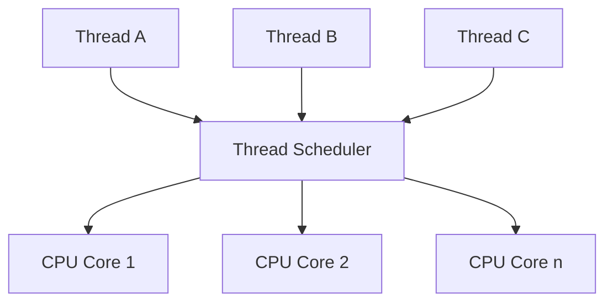
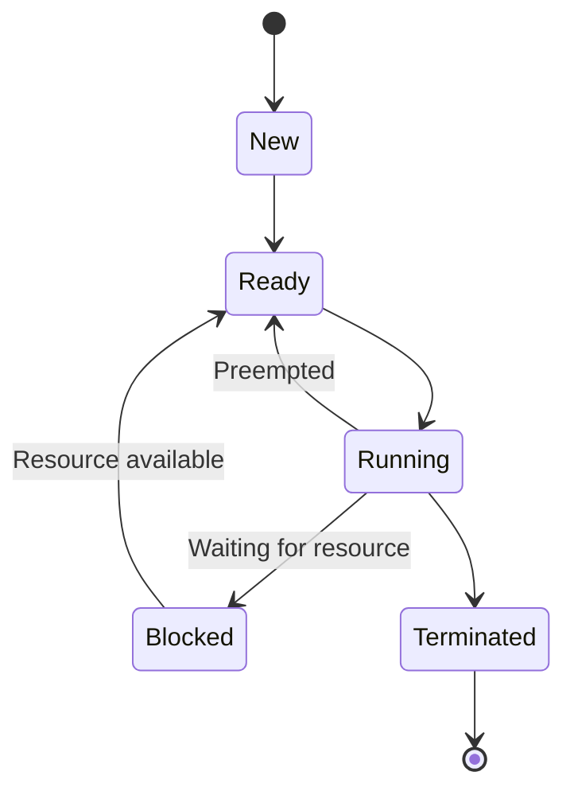

# Thread Scheduling

## Introduction

Thread scheduling is a fundamental concept in concurrent programming that determines how the CPU time is shared among multiple threads. When your program creates several threads, they don't all run simultaneously (even on multi-core systems with seemingly parallel execution). Instead, the operating system's scheduler decides which threads run, when they run, and for how long.

Understanding thread scheduling is crucial because it directly impacts your application's performance, responsiveness, and resource utilization. In this tutorial, we'll explore how thread scheduling works, common scheduling algorithms, and how you can influence scheduling decisions in your code.

## What is Thread Scheduling?

Thread scheduling refers to the process by which the operating system decides the order and duration for which threads execute on the available CPU cores. The component responsible for making these decisions is called the **thread scheduler**.

Let's visualize the basic concept:



Even when you have multiple CPU cores, if your program creates more threads than available cores, the scheduler must decide which threads get to run and which ones must wait.

## The Need for Scheduling

Why is scheduling necessary? Consider these scenarios:

1. Your dual-core laptop is running dozens of processes with hundreds of threads
2. A server application has 100 threads handling client requests but only 8 CPU cores
3. A game has threads for rendering, physics, AI, and input handling, all competing for CPU time

Without proper scheduling:
- Some threads might monopolize the CPU
- Critical tasks might not get the resources they need
- The system could become unresponsive
- Threads might starve and never get execution time

## Common Thread Scheduling Algorithms

Operating systems use various algorithms to determine which threads run next. Here are the most common ones:

### 1. First-Come, First-Served (FCFS)

The simplest scheduling algorithm runs threads in the order they request CPU time.

**Pros:**
- Simple to implement
- Fair in a basic sense

**Cons:**
- Can lead to the "convoy effect" where a single long-running thread blocks many short threads
- Poor for interactive systems

### 2. Round-Robin Scheduling

Each thread gets a small time slice (quantum) to execute before being preempted for the next thread.

**Pros:**
- Fair allocation of CPU time
- Good for time-sharing systems
- Prevents any thread from monopolizing the CPU

**Cons:**
- Context switching overhead
- Not optimal for threads with different priority needs


### 3. Priority-Based Scheduling

Threads are assigned priorities, and the highest priority ready thread executes first.

**Pros:**
- Allows important tasks to run first
- Can improve system responsiveness

**Cons:**
- Can lead to starvation of lower-priority threads
- Priority inversion problems

### 4. Multilevel Queue Scheduling

Threads are assigned to different queues based on their characteristics, with each queue possibly having a different scheduling algorithm.

**Pros:**
- Flexible for different thread types
- Can balance between different scheduling needs

**Cons:**
- More complex to implement
- May need tuning for optimal performance

## Thread States and Scheduling

To understand scheduling, you need to know the possible states of a thread:

1. **New**: Thread is being created
2. **Ready**: Thread is waiting to be scheduled
3. **Running**: Thread is currently executing
4. **Blocked/Waiting**: Thread is waiting for a resource or event
5. **Terminated**: Thread has completed execution

The scheduler primarily works with threads in the **Ready** state, deciding which one to transition to **Running**.



## Thread Priorities

Most threading APIs allow you to set thread priorities to influence the scheduler. Here's how you can do it in different languages:

### Java Example

```java
// Creating a thread with normal priority
Thread normalThread = new Thread(() -> {
    System.out.println("Normal priority thread running");
    // Thread code here
});

// Creating a high-priority thread
Thread highPriorityThread = new Thread(() -> {
    System.out.println("High priority thread running");
    // Thread code here
});

// Setting thread priorities
normalThread.setPriority(Thread.NORM_PRIORITY); // Default priority (5)
highPriorityThread.setPriority(Thread.MAX_PRIORITY); // Highest priority (10)

normalThread.start();
highPriorityThread.start();
```

**Output:**
```
High priority thread running
Normal priority thread running
```

Note: The actual output order may vary, as priorities are just hints to the scheduler, not guarantees.

### Python Example with the `threading` module

```python
import threading
import time
import os

def task(priority):
    print(f"Thread with priority {priority} starting")
    # On some platforms, we can set process priority
    if hasattr(os, "sched_setparam"):
        try:
            os.sched_setparam(0, os.sched_param(priority))
        except:
            print(f"Could not set priority to {priority}")
    
    # Simulate some work
    time.sleep(0.1)
    print(f"Thread with priority {priority} finished")

# Create threads
threads = []
for i in range(5, 0, -1):  # 5 to 1
    thread = threading.Thread(target=task, args=(i,))
    threads.append(thread)

# Start all threads
for thread in threads:
    thread.start()

# Wait for all threads to complete
for thread in threads:
    thread.join()
```

**Output:**
```
Thread with priority 5 starting
Thread with priority 4 starting
Thread with priority 3 starting
Thread with priority 2 starting
Thread with priority 1 starting
Thread with priority 5 finished
Thread with priority 4 finished
Thread with priority 3 finished
Thread with priority 2 finished
Thread with priority 1 finished
```

Note: Python's threading module itself doesn't support priorities directly - the above uses OS-level priorities where available.

## Time Slicing and Preemptive Scheduling

Modern operating systems use preemptive scheduling, where a thread can be interrupted and another thread scheduled, even if the first one hasn't finished its work. This is crucial for maintaining responsiveness.

The time each thread runs before being preempted is called a **time slice** or **quantum**. This is typically a few milliseconds, though the exact duration varies by OS and configuration.

## Thread Scheduling Challenges

### Priority Inversion

This occurs when a high-priority thread is indirectly blocked by a low-priority thread, such as when both need the same resource. This can lead to critical processes being delayed unexpectedly.

### Thread Starvation

When a thread never gets enough CPU time to complete its tasks because higher-priority threads are constantly running.

### Deadlocks

When two or more threads are blocked forever, each waiting for resources held by the other.

## Real-world Thread Scheduling Examples

### 1. Web Server Scenario

Imagine a web server handling multiple client requests:

```java
public class WebServer {
    private static final int PRIORITY_CLIENT_HANDLER = Thread.NORM_PRIORITY;
    private static final int PRIORITY_BACKGROUND_TASKS = Thread.MIN_PRIORITY;
    private static final int PRIORITY_ADMIN_REQUESTS = Thread.MAX_PRIORITY;
    
    public void handleRequest(Client client) {
        Runnable handler = () -> {
            // Determine the type of request
            if (client.isAdminUser()) {
                Thread.currentThread().setPriority(PRIORITY_ADMIN_REQUESTS);
            } else {
                Thread.currentThread().setPriority(PRIORITY_CLIENT_HANDLER);
            }
            
            processRequest(client);
        };
        
        Thread requestThread = new Thread(handler);
        requestThread.start();
    }
    
    public void startBackgroundTasks() {
        Thread backgroundThread = new Thread(() -> {
            Thread.currentThread().setPriority(PRIORITY_BACKGROUND_TASKS);
            while (serverIsRunning) {
                cleanupSessions();
                updateStatistics();
                try {
                    Thread.sleep(5000); // Run every 5 seconds
                } catch (InterruptedException e) {
                    break;
                }
            }
        });
        
        backgroundThread.setDaemon(true); // This makes it a background thread
        backgroundThread.start();
    }
    
    // Other methods...
}
```

In this example:
- Admin requests get high priority for quick responses
- Regular client requests get normal priority
- Background maintenance tasks get low priority to avoid interfering with client service

### 2. Real-time Processing System

For systems with strict timing requirements (like audio processing, games, or industrial control systems):

```cpp
#include <iostream>
#include <thread>
#include <chrono>
#include <vector>

// Different scheduling priorities for different tasks
enum class TaskPriority {
    CRITICAL,    // Must complete within strict deadlines
    HIGH,        // Important but can occasionally miss deadlines
    NORMAL,      // Regular processing tasks
    BACKGROUND   // Run when system is otherwise idle
};

void setThreadPriority(std::thread& thread, TaskPriority priority) {
    // Platform-specific code to set thread priority
    #ifdef _WIN32
        // Windows implementation
        int winPriority;
        switch (priority) {
            case TaskPriority::CRITICAL:
                winPriority = THREAD_PRIORITY_TIME_CRITICAL;
                break;
            case TaskPriority::HIGH:
                winPriority = THREAD_PRIORITY_HIGHEST;
                break;
            case TaskPriority::NORMAL:
                winPriority = THREAD_PRIORITY_NORMAL;
                break;
            case TaskPriority::BACKGROUND:
                winPriority = THREAD_PRIORITY_LOWEST;
                break;
        }
        SetThreadPriority(thread.native_handle(), winPriority);
    #else
        // POSIX implementation (Linux, macOS, etc.)
        struct sched_param param;
        int policy;
        
        switch (priority) {
            case TaskPriority::CRITICAL:
                policy = SCHED_FIFO;  // First-in, first-out real-time scheduling
                param.sched_priority = 99;  // Maximum priority
                break;
            case TaskPriority::HIGH:
                policy = SCHED_FIFO;
                param.sched_priority = 75;
                break;
            case TaskPriority::NORMAL:
                policy = SCHED_OTHER;  // Standard scheduling
                param.sched_priority = 0;
                break;
            case TaskPriority::BACKGROUND:
                policy = SCHED_IDLE;  // For very low priority background tasks
                param.sched_priority = 0;
                break;
        }
        
        pthread_setschedparam(thread.native_handle(), policy, &param);
    #endif
}

// Sample tasks with different priorities
void audioProcessingTask() {
    // Critical task that must run at precise intervals
    // for audio to sound correct
    while (true) {
        processAudioBuffer();
        // Precise sleep timing
        std::this_thread::sleep_for(std::chrono::milliseconds(5));
    }
}

void networkCommunicationTask() {
    // High priority but can tolerate some jitter
    while (true) {
        sendAndReceiveNetworkData();
        std::this_thread::sleep_for(std::chrono::milliseconds(50));
    }
}

void dataAnalysisTask() {
    // Normal priority task
    while (true) {
        analyzeIncomingData();
        std::this_thread::sleep_for(std::chrono::milliseconds(200));
    }
}

void loggingTask() {
    // Background task
    while (true) {
        writeLogsToStorage();
        std::this_thread::sleep_for(std::chrono::seconds(5));
    }
}

int main() {
    // Create threads for different tasks
    std::thread audioThread(audioProcessingTask);
    std::thread networkThread(networkCommunicationTask);
    std::thread analysisThread(dataAnalysisTask);
    std::thread loggingThread(loggingTask);
    
    // Set appropriate priorities
    setThreadPriority(audioThread, TaskPriority::CRITICAL);
    setThreadPriority(networkThread, TaskPriority::HIGH);
    setThreadPriority(analysisThread, TaskPriority::NORMAL);
    setThreadPriority(loggingThread, TaskPriority::BACKGROUND);
    
    // Join threads (in a real application, you might manage their lifecycle differently)
    audioThread.join();
    networkThread.join();
    analysisThread.join();
    loggingThread.join();
    
    return 0;
}
```

This example shows how different types of tasks might be assigned different priorities in a real-time system like audio processing software or a game engine.

## Best Practices for Thread Scheduling

1. **Be conservative with thread creation**: Creating too many threads can overwhelm the scheduler.

2. **Use thread pools**: Thread pools manage a set number of threads, reusing them for different tasks to reduce creation overhead.

3. **Be careful with priorities**: Use them sparingly and purposefully.

4. **Avoid busy waiting**: Don't have threads spin in tight loops consuming CPU time.

5. **Consider thread affinity**: For performance-critical applications, binding threads to specific CPU cores can improve cache efficiency.

6. **Be mindful of blocking operations**: I/O and other blocking calls cause the scheduler to switch threads, adding overhead.

7. **Test on different systems**: Scheduling behavior can vary significantly between different operating systems and even between versions.

## Thread Scheduling in Different Operating Systems

While the core concepts remain similar, thread scheduling implementations differ across operating systems:

### Windows

- Uses a priority-based, preemptive scheduling algorithm
- Has 32 priority levels (0-31)
- Employs priority boosting to prevent starvation
- Supports processor affinity

### Linux

- Uses the Completely Fair Scheduler (CFS) by default
- Also has real-time schedulers (SCHED_FIFO and SCHED_RR)
- Uses nice values (-20 to 19) to influence scheduling
- Implements various techniques to improve fairness and responsiveness

### macOS/iOS

- Based on Mach kernel with a priority-based preemptive scheduler
- Supports Quality of Service (QoS) classes to categorize work
- Implements a synchronized priority boosting mechanism

## Summary

Thread scheduling is the process by which operating systems determine which threads run on CPU cores and for how long. The scheduler uses algorithms like Round-Robin and Priority-Based scheduling to make these decisions.

Key takeaways:
- Threads transition between states (New, Ready, Running, Blocked, Terminated)
- Thread priorities can influence scheduling decisions but don't guarantee execution order
- Scheduling algorithms balance fairness, responsiveness, and throughput
- Different operating systems implement scheduling differently
- Careful management of threads and their priorities leads to more efficient applications

Understanding thread scheduling helps you design more efficient, responsive concurrent applications by working with the operating system rather than against it.

## Exercises

1. Write a program that creates three threads with different priorities and records which thread finishes first. Run it multiple times and observe the results.

2. Implement a simple round-robin scheduler that manages tasks in your application.

3. Research and compare the thread scheduling behavior on two different operating systems. What differences do you notice?

4. Create a scenario that demonstrates priority inversion and implement a solution to prevent it.

5. Modify the web server example to include a mechanism that temporarily boosts the priority of requests that have been waiting too long.

## Further Resources

- Operating Systems textbooks like "Operating System Concepts" by Silberschatz, Galvin, and Gagne
- [Oracle's Java Threading Documentation](https://docs.oracle.com/javase/tutorial/essential/concurrency/)
- [Microsoft's Threading in C# guide](https://docs.microsoft.com/en-us/dotnet/standard/threading/threads-and-threading)
- [The Linux Kernel documentation on the Completely Fair Scheduler](https://www.kernel.org/doc/Documentation/scheduler/sched-design-CFS.txt)
- [Python's threading module documentation](https://docs.python.org/3/library/threading.html)