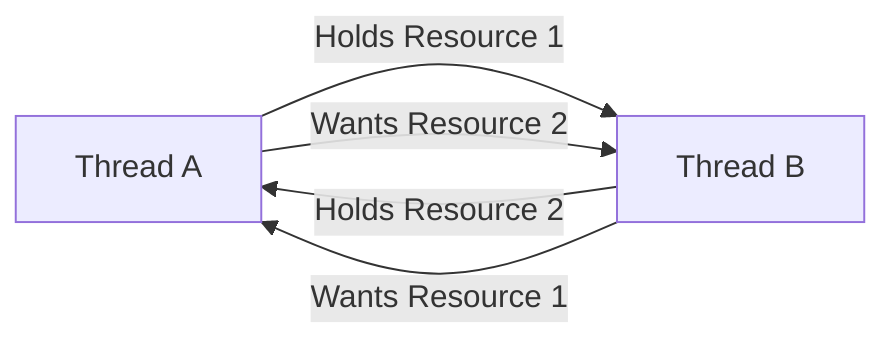

# Thread Synchronization

## Introduction

When your program uses multiple threads that access shared resources, you need to ensure they work together harmoniously. Thread synchronization refers to the techniques that coordinate the execution of multiple threads to prevent issues like race conditions, deadlocks, and data corruption.

Imagine several people trying to update a shared document at the same time—without proper coordination, their changes might conflict and corrupt the document. Thread synchronization is like establishing rules for when and how each person can make changes to avoid these conflicts.

## Why is Thread Synchronization Needed?

Let's look at a simple example to understand the problem:

```java
// Without synchronization
public class Counter {
    private int count = 0;
    
    public void increment() {
        count++;  // This is not atomic!
    }
    
    public int getCount() {
        return count;
    }
}
```

When multiple threads call the `increment()` method:

1. Thread A reads the value of count (e.g., 0)
2. Thread B reads the same value (0)
3. Thread A increments its copy to 1 and writes it back
4. Thread B increments its copy to 1 and writes it back

The final value of count is 1, not 2 as expected! This is called a **race condition**.

## Common Synchronization Mechanisms

### 1. Mutex (Mutual Exclusion)

A mutex is like a lock that only one thread can hold at a time. Other threads must wait until the lock is released.

#### Example in Java:

```java
public class SafeCounter {
    private int count = 0;
    private final Object lock = new Object();
    
    public void increment() {
        synchronized(lock) {
            count++;
        }
    }
    
    public int getCount() {
        synchronized(lock) {
            return count;
        }
    }
}
```

#### Example in Python:

```python
import threading

class SafeCounter:
    def __init__(self):
        self.count = 0
        self.lock = threading.Lock()
    
    def increment(self):
        with self.lock:
            self.count += 1
    
    def get_count(self):
        with self.lock:
            return self.count
```

#### Example in C++:

```cpp
#include <mutex>

class SafeCounter {
private:
    int count = 0;
    std::mutex mutex;
    
public:
    void increment() {
        std::lock_guard<std::mutex> lock(mutex);
        count++;
    }
    
    int getCount() {
        std::lock_guard<std::mutex> lock(mutex);
        return count;
    }
};
```

### 2. Semaphores

A semaphore is a counter that can allow a specific number of threads to access a resource simultaneously.

#### Example in Java:

```java
import java.util.concurrent.Semaphore;

public class Pool {
    private final Semaphore semaphore;
    
    public Pool(int size) {
        semaphore = new Semaphore(size);
    }
    
    public void useResource() throws InterruptedException {
        semaphore.acquire();  // Decrements the counter
        try {
            // Use the resource
            System.out.println("Resource in use by thread: " + Thread.currentThread().getName());
            Thread.sleep(1000); // Simulate work
        } finally {
            semaphore.release();  // Increments the counter
        }
    }
}
```

This example shows a resource pool with a fixed size. Only a limited number of threads can use the resource simultaneously.

### 3. Condition Variables

Condition variables allow threads to wait until a specific condition is met.

#### Example in Java:

```java
public class MessageQueue {
    private final LinkedList<String> queue = new LinkedList<>();
    private final int maxSize;
    private final Object lock = new Object();
    
    public MessageQueue(int maxSize) {
        this.maxSize = maxSize;
    }
    
    public void put(String message) throws InterruptedException {
        synchronized(lock) {
            while(queue.size() == maxSize) {
                // Queue is full, wait until a consumer removes an item
                lock.wait();
            }
            queue.add(message);
            System.out.println("Produced: " + message);
            // Notify consumers that a new message is available
            lock.notifyAll();
        }
    }
    
    public String take() throws InterruptedException {
        synchronized(lock) {
            while(queue.isEmpty()) {
                // Queue is empty, wait until a producer adds an item
                lock.wait();
            }
            String message = queue.removeFirst();
            System.out.println("Consumed: " + message);
            // Notify producers that there's space in the queue
            lock.notifyAll();
            return message;
        }
    }
}
```

This implements a classic producer-consumer pattern with a bounded queue.

## Common Synchronization Problems

### 1. Race Conditions

Race conditions occur when multiple threads access and modify shared data simultaneously, leading to unexpected results. The counter example above demonstrates a race condition.

### 2. Deadlocks

A deadlock happens when two or more threads are waiting for each other to release resources, resulting in all of them being stuck.



#### Example of a deadlock:

```java
public class DeadlockExample {
    private final Object resource1 = new Object();
    private final Object resource2 = new Object();
    
    public void method1() {
        synchronized(resource1) {
            System.out.println("Thread 1: Holding resource 1...");
            try { Thread.sleep(100); } catch (InterruptedException e) {}
            System.out.println("Thread 1: Waiting for resource 2...");
            
            synchronized(resource2) {
                System.out.println("Thread 1: Holding resource 1 and resource 2");
            }
        }
    }
    
    public void method2() {
        synchronized(resource2) {
            System.out.println("Thread 2: Holding resource 2...");
            try { Thread.sleep(100); } catch (InterruptedException e) {}
            System.out.println("Thread 2: Waiting for resource 1...");
            
            synchronized(resource1) {
                System.out.println("Thread 2: Holding resource 1 and resource 2");
            }
        }
    }
}
```

To prevent deadlocks, always:
- Acquire locks in a consistent order
- Use timeout when acquiring locks
- Detect and recover from deadlocks

### 3. Starvation

Starvation occurs when a thread is unable to gain regular access to shared resources and is unable to make progress.

### 4. Livelock

Similar to deadlock, but threads are actively trying to resolve the situation, yet they still make no progress.

## Advanced Synchronization Techniques

### 1. Read-Write Locks

When many threads need to read data but few need to write, using read-write locks can improve performance.

```java
import java.util.concurrent.locks.ReadWriteLock;
import java.util.concurrent.locks.ReentrantReadWriteLock;

public class SharedResource {
    private final ReadWriteLock lock = new ReentrantReadWriteLock();
    private int data = 0;
    
    public int readData() {
        lock.readLock().lock();
        try {
            // Multiple threads can read simultaneously
            return data;
        } finally {
            lock.readLock().unlock();
        }
    }
    
    public void writeData(int newValue) {
        lock.writeLock().lock();
        try {
            // Only one thread can write at a time
            data = newValue;
        } finally {
            lock.writeLock().unlock();
        }
    }
}
```

### 2. Atomic Operations

Modern programming languages provide atomic operations that execute as a single unit without interruption.

```java
import java.util.concurrent.atomic.AtomicInteger;

public class AtomicCounter {
    private final AtomicInteger count = new AtomicInteger(0);
    
    public void increment() {
        count.incrementAndGet(); // Atomic operation
    }
    
    public int getCount() {
        return count.get();
    }
}
```

## Real-World Application: Thread-Safe Database Connection Pool

Let's implement a simplified database connection pool as a practical example:

```java
import java.util.concurrent.BlockingQueue;
import java.util.concurrent.LinkedBlockingQueue;
import java.util.concurrent.Semaphore;
import java.util.concurrent.TimeUnit;

public class ConnectionPool {
    private final BlockingQueue<Connection> connections;
    private final Semaphore semaphore;
    
    public ConnectionPool(int poolSize) {
        connections = new LinkedBlockingQueue<>(poolSize);
        semaphore = new Semaphore(poolSize);
        
        // Initialize connections
        for (int i = 0; i < poolSize; i++) {
            connections.add(createConnection(i));
        }
    }
    
    private Connection createConnection(int id) {
        // In a real application, this would create an actual database connection
        return new Connection("Connection-" + id);
    }
    
    public Connection getConnection(long timeout, TimeUnit unit) throws InterruptedException {
        if (!semaphore.tryAcquire(timeout, unit)) {
            throw new InterruptedException("Timeout waiting for connection");
        }
        
        Connection connection = connections.poll();
        if (connection == null) {
            semaphore.release();
            throw new InterruptedException("Failed to get connection from pool");
        }
        
        return connection;
    }
    
    public void releaseConnection(Connection connection) {
        if (connection != null && connections.offer(connection)) {
            semaphore.release();
        }
    }
    
    // Simple Connection class for demonstration
    public static class Connection {
        private final String name;
        
        public Connection(String name) {
            this.name = name;
        }
        
        public String getName() {
            return name;
        }
        
        public void executeQuery(String query) {
            System.out.println(name + " executing: " + query);
            // Simulate query execution
            try { Thread.sleep(200); } catch (InterruptedException e) {}
        }
    }
}
```

Usage example:

```java
public class ConnectionPoolDemo {
    public static void main(String[] args) {
        final ConnectionPool pool = new ConnectionPool(3);
        
        Runnable task = () -> {
            try {
                String threadName = Thread.currentThread().getName();
                System.out.println(threadName + " is trying to get a connection");
                
                Connection conn = pool.getConnection(5, TimeUnit.SECONDS);
                System.out.println(threadName + " acquired " + conn.getName());
                
                // Use the connection
                conn.executeQuery("SELECT * FROM users WHERE id = " + threadName.hashCode());
                
                // Release the connection
                System.out.println(threadName + " is releasing " + conn.getName());
                pool.releaseConnection(conn);
            } catch (InterruptedException e) {
                System.out.println(Thread.currentThread().getName() + " was interrupted: " + e.getMessage());
            }
        };
        
        // Start multiple threads that try to use connections from the pool
        for (int i = 0; i < 10; i++) {
            new Thread(task, "Thread-" + i).start();
        }
    }
}
```

Output:
```
Thread-0 is trying to get a connection
Thread-0 acquired Connection-0
Thread-1 is trying to get a connection
Thread-1 acquired Connection-1
Thread-2 is trying to get a connection
Thread-2 acquired Connection-2
Thread-3 is trying to get a connection
Thread-0 is releasing Connection-0
Thread-3 acquired Connection-0
Thread-4 is trying to get a connection
Thread-1 is releasing Connection-1
Thread-4 acquired Connection-1
...
```

## Best Practices for Thread Synchronization

1. **Minimize the Scope of Synchronization**: Lock only what needs to be locked and for the shortest time possible.

2. **Use Higher-Level Concurrency Utilities**: Instead of using low-level `synchronized` blocks, prefer higher-level utilities such as `java.util.concurrent` in Java.

3. **Avoid Nested Locks**: Nested locks increase the risk of deadlocks.

4. **Document Your Synchronization Strategy**: Make it clear which methods are thread-safe and which aren't.

5. **Consider Immutability**: Immutable objects don't need synchronization because they can't be modified after creation.

6. **Use Thread-Local Storage**: When each thread needs its own copy of a variable, use thread-local storage to avoid synchronization.

## Summary

Thread synchronization is essential for writing reliable multithreaded programs. We've covered:

- Why synchronization is needed
- Basic synchronization mechanisms: mutexes, semaphores, and condition variables
- Common synchronization problems: race conditions, deadlocks, starvation, and livelocks
- Advanced techniques like read-write locks and atomic operations
- A real-world example of a thread-safe connection pool

Remember that while synchronization solves many problems, it can also introduce new ones like reduced performance and increased complexity. Always analyze your specific requirements and choose the most appropriate synchronization mechanism.

## Exercises

1. Implement a thread-safe singleton class that initializes lazily.
2. Create a bounded buffer that allows multiple producers and consumers.
3. Implement a thread-safe counter that provides methods to increment, decrement, and get the current value.
4. Modify the connection pool example to implement a timeout feature that automatically returns connections to the pool if they're held for too long.
5. Implement a reader-writer lock from scratch using basic synchronization primitives.

## Further Reading

- Java Concurrency in Practice by Brian Goetz
- The Art of Multiprocessor Programming by Maurice Herlihy and Nir Shavit
- Operating System Concepts by Abraham Silberschatz, Peter B. Galvin, and Greg Gagne