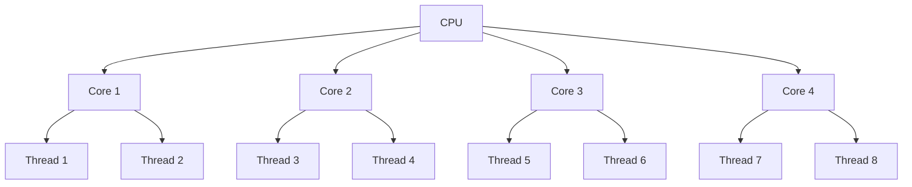

# Multicore Programming

## Introduction

Modern computers come equipped with processors that contain multiple cores, each capable of executing instructions independently. Multicore programming is the practice of writing code that can efficiently utilize these multiple cores to execute tasks in parallel, significantly improving performance for suitable workloads.

In traditional single-threaded applications, tasks execute sequentially, leaving many CPU cores idle. Multicore programming allows us to distribute work across multiple cores, enabling true parallelism and faster execution times.

<div className="info-box">
  <p><strong>Key Benefit:</strong> A well-designed multithreaded application on a quad-core processor can theoretically achieve up to 4x performance improvement for parallelizable tasks!</p>
</div>

## Understanding CPU Cores vs. Threads

Before diving into multicore programming, let's clarify the relationship between cores and threads:

- **CPU Core**: A physical processing unit within the CPU that can execute instructions independently.
- **Thread**: A sequence of programmed instructions that can be managed independently by the operating system scheduler.

Modern CPUs often feature technologies like Intel's Hyper-Threading or AMD's Simultaneous Multithreading (SMT), which allow a single physical core to run multiple threads simultaneously.



## Multicore Programming Approaches

### 1. Thread-Based Parallelism

The most common approach to multicore programming is creating and managing multiple threads manually. Here's a simple example in C++:

```cpp
#include <iostream>
#include <thread>
#include <vector>

void processData(int start, int end) {
    for (int i = start; i < end; i++) {
        // Process data element i
        std::cout << "Processing element " << i << " in thread " << std::this_thread::get_id() << std::endl;
    }
}

int main() {
    const int DATA_SIZE = 100;
    const int NUM_THREADS = 4;
    const int CHUNK_SIZE = DATA_SIZE / NUM_THREADS;
    
    std::vector<std::thread> threads;
    
    // Create threads and divide work
    for (int i = 0; i < NUM_THREADS; i++) {
        int start = i * CHUNK_SIZE;
        int end = (i == NUM_THREADS - 1) ? DATA_SIZE : (i + 1) * CHUNK_SIZE;
        
        threads.push_back(std::thread(processData, start, end));
    }
    
    // Wait for all threads to complete
    for (auto& thread : threads) {
        thread.join();
    }
    
    std::cout << "All data processed!" << std::endl;
    return 0;
}
```

**Output:**
```
Processing element 0 in thread 140173258146560
Processing element 1 in thread 140173258146560
...
Processing element 75 in thread 140173241361088
...
Processing element 99 in thread 140173232968384
All data processed!
```

### 2. Task-Based Parallelism

Task-based approaches abstract away direct thread management, focusing instead on dividing work into tasks that can be scheduled by a runtime system. Here's an example using C++17's parallel algorithms:

```cpp
#include <iostream>
#include <vector>
#include <algorithm>
#include <execution>
#include <chrono>

int main() {
    // Create a large vector
    std::vector<int> data(100000000);
    
    // Fill it with values
    for (int i = 0; i < data.size(); i++) {
        data[i] = i;
    }
    
    // Sequential sort
    auto start = std::chrono::high_resolution_clock::now();
    std::sort(data.begin(), data.end());
    auto end = std::chrono::high_resolution_clock::now();
    std::chrono::duration<double> seq_time = end - start;
    
    // Shuffle data again
    std::random_shuffle(data.begin(), data.end());
    
    // Parallel sort
    start = std::chrono::high_resolution_clock::now();
    std::sort(std::execution::par, data.begin(), data.end());
    end = std::chrono::high_resolution_clock::now();
    std::chrono::duration<double> par_time = end - start;
    
    std::cout << "Sequential sort took: " << seq_time.count() << " seconds" << std::endl;
    std::cout << "Parallel sort took: " << par_time.count() << " seconds" << std::endl;
    std::cout << "Speedup: " << seq_time.count() / par_time.count() << "x" << std::endl;
    
    return 0;
}
```

**Output (results will vary based on system):**
```
Sequential sort took: 12.5632 seconds
Parallel sort took: 3.4215 seconds
Speedup: 3.67x
```

### 3. Thread Pools

Thread pools provide a reusable set of threads for executing multiple tasks, reducing the overhead of thread creation and destruction:

```java
import java.util.concurrent.ExecutorService;
import java.util.concurrent.Executors;

public class ThreadPoolExample {
    public static void main(String[] args) {
        // Create a fixed thread pool with 4 threads
        ExecutorService executor = Executors.newFixedThreadPool(4);
        
        // Submit 10 tasks to the pool
        for (int i = 0; i < 10; i++) {
            final int taskId = i;
            executor.submit(() -> {
                System.out.println("Task " + taskId + " executed by " + 
                                  Thread.currentThread().getName());
                // Simulate work
                try {
                    Thread.sleep(500);
                } catch (InterruptedException e) {
                    e.printStackTrace();
                }
            });
        }
        
        // Shutdown the executor
        executor.shutdown();
    }
}
```

**Output:**
```
Task 0 executed by pool-1-thread-1
Task 1 executed by pool-1-thread-2
Task 2 executed by pool-1-thread-3
Task 3 executed by pool-1-thread-4
Task 4 executed by pool-1-thread-1
Task 5 executed by pool-1-thread-2
Task 6 executed by pool-1-thread-3
Task 7 executed by pool-1-thread-4
Task 8 executed by pool-1-thread-1
Task 9 executed by pool-1-thread-2
```

## Real-World Applications

### Image Processing

Image processing is a perfect candidate for multicore optimization since operations on pixels are often independent of each other. Consider this Python example using the `multiprocessing` module to apply a blur filter:

```python
import multiprocessing as mp
from PIL import Image, ImageFilter
import time
import os

def process_image_chunk(img_path, output_path, start_y, end_y):
    # Open the image
    img = Image.open(img_path)
    width, height = img.size
    
    # Create a crop of the chunk we need to process
    chunk = img.crop((0, start_y, width, end_y))
    
    # Apply blur filter
    processed_chunk = chunk.filter(ImageFilter.GaussianBlur(radius=5))
    
    # Save chunk for demonstration (not needed in production)
    processed_chunk.save(f"{output_path}_chunk_{start_y}_{end_y}.jpg")
    
    print(f"Processed chunk from y={start_y} to y={end_y}")
    return (start_y, end_y, processed_chunk)

def main():
    img_path = "large_image.jpg"
    output_path = "blurred_image"
    
    # Ensure the input image exists
    if not os.path.exists(img_path):
        print(f"Error: {img_path} does not exist")
        return
    
    # Open the image to get dimensions
    img = Image.open(img_path)
    width, height = img.size
    
    # Number of cores to use
    num_cores = mp.cpu_count()
    print(f"Using {num_cores} CPU cores")
    
    # Calculate chunk size
    chunk_size = height // num_cores
    
    # Create chunk boundaries
    chunks = []
    for i in range(num_cores):
        start_y = i * chunk_size
        end_y = height if i == num_cores - 1 else (i + 1) * chunk_size
        chunks.append((img_path, output_path, start_y, end_y))
    
    # Time sequential processing
    start_time = time.time()
    for chunk in chunks:
        process_image_chunk(*chunk)
    sequential_time = time.time() - start_time
    print(f"Sequential processing time: {sequential_time:.2f} seconds")
    
    # Time parallel processing
    start_time = time.time()
    with mp.Pool(processes=num_cores) as pool:
        results = pool.starmap(process_image_chunk, chunks)
    parallel_time = time.time() - start_time
    print(f"Parallel processing time: {parallel_time:.2f} seconds")
    print(f"Speedup: {sequential_time/parallel_time:.2f}x")

if __name__ == "__main__":
    main()
```

### Web Server Handling Multiple Requests

Web servers use multicore programming to handle multiple client requests simultaneously. Each request can be processed in its own thread, maximizing throughput.

```javascript
const cluster = require('cluster');
const http = require('http');
const numCPUs = require('os').cpus().length;

if (cluster.isMaster) {
  console.log(`Master ${process.pid} is running`);

  // Fork workers
  for (let i = 0; i < numCPUs; i++) {
    cluster.fork();
  }

  cluster.on('exit', (worker, code, signal) => {
    console.log(`Worker ${worker.process.pid} died`);
    // Restart the worker
    cluster.fork();
  });
} else {
  // Workers can share any TCP connection
  // In this case, it's an HTTP server
  http.createServer((req, res) => {
    // Simulate CPU-intensive work
    let result = 0;
    for (let i = 0; i < 10000000; i++) {
      result += i;
    }
    
    res.writeHead(200);
    res.end(`Hello from Worker ${process.pid}
`);
  }).listen(8000);

  console.log(`Worker ${process.pid} started`);
}
```

## Common Challenges and Solutions

### 1. Race Conditions

Race conditions occur when multiple threads access shared data simultaneously and at least one thread modifies the data.

```cpp
#include <iostream>
#include <thread>
#include <mutex>

int counter = 0;
std::mutex counter_mutex;

void increment_counter(int iterations) {
    for (int i = 0; i < iterations; i++) {
        // Unsafe, can cause race condition
        // counter++;
        
        // Safe, using mutex for synchronization
        counter_mutex.lock();
        counter++;
        counter_mutex.unlock();
        
        // Alternative using RAII (safer)
        // std::lock_guard<std::mutex> lock(counter_mutex);
        // counter++;
    }
}

int main() {
    const int NUM_THREADS = 4;
    const int ITERATIONS = 1000000;
    
    std::thread threads[NUM_THREADS];
    
    for (int i = 0; i < NUM_THREADS; i++) {
        threads[i] = std::thread(increment_counter, ITERATIONS);
    }
    
    for (int i = 0; i < NUM_THREADS; i++) {
        threads[i].join();
    }
    
    std::cout << "Expected: " << NUM_THREADS * ITERATIONS << std::endl;
    std::cout << "Actual: " << counter << std::endl;
    
    return 0;
}
```

### 2. Deadlocks

Deadlocks occur when two or more threads are blocked forever, waiting for each other.

```java
public class DeadlockExample {
    private static final Object resource1 = new Object();
    private static final Object resource2 = new Object();
    
    public static void main(String[] args) {
        Thread thread1 = new Thread(() -> {
            synchronized (resource1) {
                System.out.println("Thread 1: Holding resource 1...");
                try { Thread.sleep(100); } catch (Exception e) {}
                
                System.out.println("Thread 1: Waiting for resource 2...");
                synchronized (resource2) {
                    System.out.println("Thread 1: Holding resource 1 & 2");
                }
            }
        });
        
        Thread thread2 = new Thread(() -> {
            // To fix deadlock, change the order of lock acquisition
            // synchronized (resource1) {
            synchronized (resource2) {
                System.out.println("Thread 2: Holding resource 2...");
                try { Thread.sleep(100); } catch (Exception e) {}
                
                System.out.println("Thread 2: Waiting for resource 1...");
                synchronized (resource1) {
                    System.out.println("Thread 2: Holding resource 1 & 2");
                }
            }
        });
        
        thread1.start();
        thread2.start();
    }
}
```

### 3. Load Balancing

Ensuring work is evenly distributed across cores is crucial for optimal performance.

```python
import multiprocessing as mp
import numpy as np
import time

def process_chunk(chunk):
    """Process a chunk of data with simulated varying workload."""
    # Simulating varying computational complexity
    complexity = len(chunk) * (1 + chunk[0] % 5) 
    start = time.time()
    # Simulate work
    result = 0
    for _ in range(complexity * 1000000):
        result += 1
    end = time.time()
    return f"Processed chunk starting with {chunk[0]} in {end-start:.2f} seconds"

def static_division(data, num_processes):
    """Divide data into equal chunks (static scheduling)."""
    chunk_size = len(data) // num_processes
    chunks = []
    for i in range(num_processes):
        start_idx = i * chunk_size
        end_idx = len(data) if i == num_processes - 1 else (i + 1) * chunk_size
        chunks.append(data[start_idx:end_idx])
    return chunks

def dynamic_division(data):
    """Prepare data for dynamic scheduling."""
    # For dynamic scheduling, we'll create smaller chunks
    chunk_size = 1  # Process one item at a time for maximum flexibility
    chunks = []
    for i in range(0, len(data), chunk_size):
        chunks.append(data[i:i+chunk_size])
    return chunks

if __name__ == "__main__":
    # Generate sample data with varying complexity
    data = np.arange(16)
    np.random.shuffle(data)
    
    num_processes = 4
    
    # Static division (traditional approach)
    print("--- Static Division ---")
    chunks = static_division(data, num_processes)
    start = time.time()
    with mp.Pool(processes=num_processes) as pool:
        results = pool.map(process_chunk, chunks)
    end = time.time()
    print(f"Total time: {end-start:.2f} seconds")
    for result in results:
        print(result)
    
    # Dynamic division (better load balancing)
    print("
--- Dynamic Division ---")
    chunks = dynamic_division(data)
    start = time.time()
    with mp.Pool(processes=num_processes) as pool:
        results = pool.map(process_chunk, chunks)
    end = time.time()
    print(f"Total time: {end-start:.2f} seconds")
    for result in results[:5]:
        print(result)
    print("... (more results)")
```

## Best Practices for Multicore Programming

1. **Identify Parallelizable Sections**: Not all code can be parallelized. Look for independent operations that can run concurrently.

2. **Minimize Shared State**: Reduce the need for synchronization by minimizing shared data between threads.

3. **Use Thread-Safe Data Structures**: When sharing is necessary, use thread-safe collections and atomic operations.

4. **Consider Task Granularity**: 
   - Too fine-grained: Thread management overhead exceeds benefits
   - Too coarse-grained: Uneven workload distribution

5. **Avoid Oversubscription**: Creating more threads than available cores can lead to context switching overhead. Typically, use `number_of_cores + 1` threads for CPU-bound tasks.

6. **Measure Performance**: Always benchmark to ensure parallelization actually improves performance.

## Libraries and Frameworks

Different programming languages offer various libraries for multicore programming:

| Language | Libraries/Frameworks |
|----------|---------------------|
| C++ | std::thread, OpenMP, Intel TBB |
| Java | java.util.concurrent, Fork/Join Framework |
| Python | multiprocessing, concurrent.futures, Dask |
| C# | Task Parallel Library (TPL), Parallel LINQ |
| JavaScript | Web Workers, Node.js Worker Threads |

## Summary

Multicore programming leverages multiple CPU cores to execute tasks in parallel, significantly improving application performance. We've explored different approaches including:

- Thread-based parallelism with direct thread management
- Task-based parallelism that abstracts away threads
- Thread pools for efficiently managing multiple tasks

We've also examined common challenges like race conditions, deadlocks, and load balancing, along with their solutions.

The key to successful multicore programming is identifying parallelizable work, minimizing shared state, using appropriate synchronization mechanisms, and always measuring performance to ensure real improvements.

## Exercises

1. Modify the image processing example to combine the processed chunks back into a complete image.

2. Implement a multithreaded merge sort algorithm and compare its performance with a single-threaded version.

3. Create a thread-safe counter class that uses atomic operations instead of locks.

4. Implement a producer-consumer pattern using a thread-safe queue where multiple producer threads generate data that multiple consumer threads process.

5. Experiment with different load balancing techniques for a CPU-intensive task and measure how they affect overall execution time.

## Additional Resources

- **Books**:
  - "C++ Concurrency in Action" by Anthony Williams
  - "Java Concurrency in Practice" by Brian Goetz
  - "Programming with POSIX Threads" by David R. Butenhof

- **Online Courses**:
  - Parallel Programming in Java (Coursera)
  - Introduction to Parallel Programming (Udacity)
  - Parallel Programming in C++ (edX)

- **Documentation**:
  - OpenMP API Specification
  - Java Concurrency Utilities Documentation
  - Python Multiprocessing Library Documentation