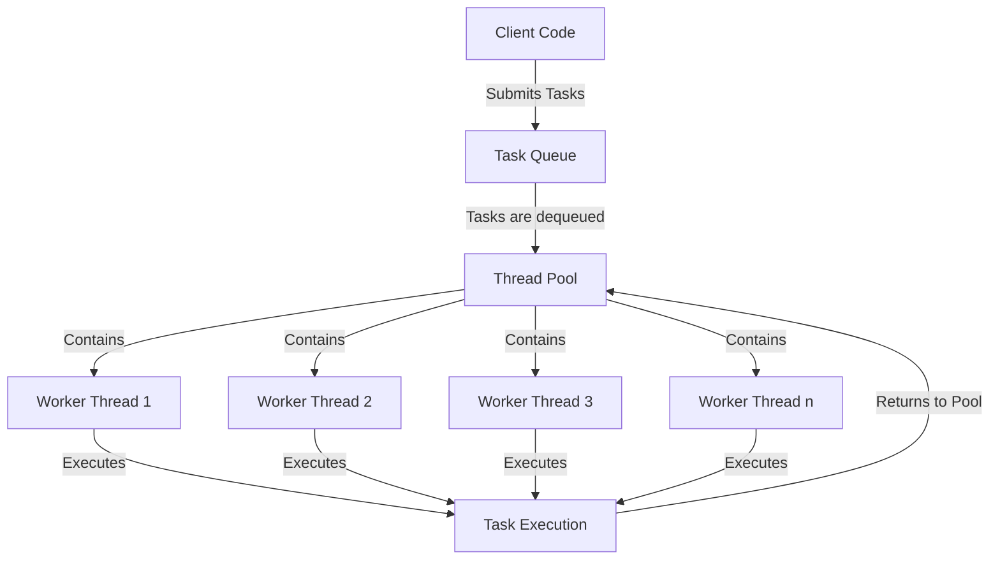

# Thread Pools

## Introduction

Thread pools are a fundamental concept in concurrent programming that help manage the creation, execution, and termination of threads in a controlled manner. Instead of creating new threads for every task, a thread pool maintains a collection of pre-created threads that can be reused to execute multiple tasks.

For beginners who are just starting with multithreading, think of a thread pool like a team of workers standing by, ready to handle tasks as they arrive. When you have work that needs to be done concurrently, instead of hiring (creating) a new worker for each job and then letting them go when they're done, you maintain a stable team that takes on new assignments as they become available.

## Why Use Thread Pools?

Creating and destroying threads is an expensive operation in terms of system resources and time. Thread pools solve several problems that arise with unrestricted thread creation:

1. **Performance Improvement**: Thread creation and destruction overhead is reduced.
2. **Resource Management**: Limits the number of threads that can exist at one time.
3. **Application Stability**: Prevents resource exhaustion by controlling the number of active threads.
4. **Improved Responsiveness**: Tasks can be executed immediately when a thread becomes available.

## Thread Pool Architecture

A typical thread pool consists of the following components:

1. **Pool of Worker Threads**: Pre-created threads waiting for tasks.
2. **Task Queue**: A queue of tasks waiting to be executed.
3. **Thread Pool Manager**: Controls the creation and management of threads.



## Basic Thread Pool Implementation

Let's look at how thread pools are implemented in different programming languages:

### Java Thread Pool Example

Java provides built-in thread pool support through the `ExecutorService` interface in the `java.util.concurrent` package:

```java
import java.util.concurrent.ExecutorService;
import java.util.concurrent.Executors;

public class ThreadPoolExample {
    public static void main(String[] args) {
        // Create a thread pool with 5 worker threads
        ExecutorService executor = Executors.newFixedThreadPool(5);
        
        // Submit tasks to the thread pool
        for (int i = 0; i < 10; i++) {
            final int taskId = i;
            executor.submit(() -> {
                String threadName = Thread.currentThread().getName();
                System.out.println("Task " + taskId + " is running on " + threadName);
                
                // Simulate work
                try {
                    Thread.sleep(500);
                } catch (InterruptedException e) {
                    e.printStackTrace();
                }
                
                System.out.println("Task " + taskId + " completed");
                return null;
            });
        }
        
        // Shutdown the thread pool
        executor.shutdown();
        
        System.out.println("All tasks submitted. Main thread continues...");
    }
}
```

**Output (may vary):**
```
All tasks submitted. Main thread continues...
Task 0 is running on pool-1-thread-1
Task 1 is running on pool-1-thread-2
Task 2 is running on pool-1-thread-3
Task 3 is running on pool-1-thread-4
Task 4 is running on pool-1-thread-5
Task 0 completed
Task 5 is running on pool-1-thread-1
Task 1 completed
Task 6 is running on pool-1-thread-2
Task 2 completed
Task 7 is running on pool-1-thread-3
Task 3 completed
Task 8 is running on pool-1-thread-4
Task 4 completed
Task 9 is running on pool-1-thread-5
Task 5 completed
Task 6 completed
Task 7 completed
Task 8 completed
Task 9 completed
```

Notice how only 5 threads are used to execute 10 tasks, with each thread picking up a new task once it completes its previous assignment.

### Python Thread Pool Example

In Python, you can use the `concurrent.futures` module for thread pool functionality:

```python
import concurrent.futures
import time
import threading

def task(task_id):
    thread_name = threading.current_thread().name
    print(f"Task {task_id} is running on {thread_name}")
    
    # Simulate work
    time.sleep(0.5)
    
    print(f"Task {task_id} completed")
    return f"Result of task {task_id}"

# Create a thread pool with 3 worker threads
with concurrent.futures.ThreadPoolExecutor(max_workers=3) as executor:
    # Submit tasks to the thread pool
    futures = [executor.submit(task, i) for i in range(6)]
    
    print("All tasks submitted. Main thread continues...")
    
    # Get results as they complete
    for future in concurrent.futures.as_completed(futures):
        result = future.result()
        print(f"Got result: {result}")
```

**Output (may vary):**
```
All tasks submitted. Main thread continues...
Task 0 is running on ThreadPoolExecutor-0_0
Task 1 is running on ThreadPoolExecutor-0_1
Task 2 is running on ThreadPoolExecutor-0_2
Task 0 completed
Task 3 is running on ThreadPoolExecutor-0_0
Task 1 completed
Got result: Result of task 0
Task 4 is running on ThreadPoolExecutor-0_1
Task 2 completed
Got result: Result of task 1
Task 5 is running on ThreadPoolExecutor-0_2
Got result: Result of task 2
Task 3 completed
Got result: Result of task 3
Task 4 completed
Got result: Result of task 4
Task 5 completed
Got result: Result of task 5
```

## Types of Thread Pools

There are several common types of thread pools, each designed for different use cases:

### Fixed Thread Pool

Maintains a fixed number of threads. If all threads are busy, new tasks must wait until a thread becomes available.

```java
ExecutorService fixedPool = Executors.newFixedThreadPool(5);
```

### Cached Thread Pool

Creates new threads as needed, but reuses previously constructed threads when they're available. Threads that remain idle for 60 seconds are terminated and removed from the pool.

```java
ExecutorService cachedPool = Executors.newCachedThreadPool();
```

### Scheduled Thread Pool

Allows tasks to run periodically or after a specified delay.

```java
ScheduledExecutorService scheduledPool = Executors.newScheduledThreadPool(3);
scheduledPool.scheduleAtFixedRate(myTask, initialDelay, period, TimeUnit.SECONDS);
```

### Single-Threaded Executor

Uses a single thread to execute tasks sequentially.

```java
ExecutorService singleThreadPool = Executors.newSingleThreadExecutor();
```

## Thread Pool Configuration

When configuring a thread pool, consider these important factors:

### Pool Size

The optimal size of a thread pool depends on:

1. **Nature of Tasks**: CPU-bound vs I/O-bound tasks
2. **System Resources**: Number of CPU cores, available memory
3. **Expected Load**: Number of concurrent tasks

For CPU-bound tasks, a good rule of thumb is to set the pool size to the number of available CPU cores:

```java
int processors = Runtime.getRuntime().availableProcessors();
ExecutorService pool = Executors.newFixedThreadPool(processors);
```

For I/O-bound tasks, a larger pool may be beneficial:

```java
// For I/O-bound tasks, more threads may help
ExecutorService pool = Executors.newFixedThreadPool(processors * 2);
```

### Queue Size and Policy

Thread pools typically use a queue to hold tasks waiting for execution. You can configure how the pool handles situations when the queue is full:

```java
// Create a bounded queue
BlockingQueue<Runnable> queue = new LinkedBlockingQueue<>(100);

// Create a thread pool with a custom rejection policy
ThreadPoolExecutor executor = new ThreadPoolExecutor(
    5, // Core pool size
    10, // Maximum pool size
    60L, // Keep-alive time
    TimeUnit.SECONDS,
    queue,
    new ThreadPoolExecutor.CallerRunsPolicy() // Rejection policy
);
```

Rejection policies determine what happens when both the pool and queue are full:

1. **AbortPolicy**: Throws an exception (default)
2. **CallerRunsPolicy**: Executes the task in the caller's thread
3. **DiscardPolicy**: Silently discards the task
4. **DiscardOldestPolicy**: Discards the oldest task and tries again

## Real-World Applications

Thread pools are used extensively in many applications:

### Web Servers

Web servers use thread pools to handle incoming HTTP requests concurrently.

```java
// Simplified web server with a thread pool
public class SimpleWebServer {
    private final ExecutorService threadPool;
    private final ServerSocket serverSocket;
    
    public SimpleWebServer(int port, int poolSize) throws IOException {
        this.serverSocket = new ServerSocket(port);
        this.threadPool = Executors.newFixedThreadPool(poolSize);
    }
    
    public void start() {
        while (true) {
            try {
                final Socket clientSocket = serverSocket.accept();
                threadPool.submit(() -> handleRequest(clientSocket));
            } catch (IOException e) {
                e.printStackTrace();
            }
        }
    }
    
    private void handleRequest(Socket clientSocket) {
        // Process the HTTP request
        try {
            // Read request, send response
            // ...
            clientSocket.close();
        } catch (IOException e) {
            e.printStackTrace();
        }
    }
}
```

### Image Processing Application

An image processing application might use a thread pool to process multiple images in parallel:

```java
public class ImageProcessor {
    private final ExecutorService threadPool;
    
    public ImageProcessor(int threads) {
        this.threadPool = Executors.newFixedThreadPool(threads);
    }
    
    public List<Future<ProcessedImage>> processImages(List<Image> images) {
        List<Future<ProcessedImage>> results = new ArrayList<>();
        
        for (Image image : images) {
            Future<ProcessedImage> future = threadPool.submit(() -> {
                // Apply filters, resize, etc.
                return applyProcessing(image);
            });
            results.add(future);
        }
        
        return results;
    }
    
    private ProcessedImage applyProcessing(Image image) {
        // Actually process the image
        // ...
        return new ProcessedImage(image);
    }
}
```

## Common Pitfalls and Best Practices

### Potential Issues

1. **Thread Starvation**: When all threads are blocked waiting for a resource, preventing progress.
2. **Thread Leakage**: Failing to properly shut down thread pools, causing resource leaks.
3. **Deadlocks**: Threads in the pool might deadlock if tasks depend on each other.

### Best Practices

1. **Always Shut Down Thread Pools**: Use `shutdown()` or `shutdownNow()` when done.

```java
ExecutorService executor = Executors.newFixedThreadPool(5);
try {
    // Use the executor
} finally {
    executor.shutdown();
    try {
        if (!executor.awaitTermination(60, TimeUnit.SECONDS)) {
            executor.shutdownNow();
        }
    } catch (InterruptedException e) {
        executor.shutdownNow();
    }
}
```

2. **Set Appropriate Pool Size**: Match your workload and available resources.
3. **Use Task Timeouts**: Prevent tasks from running indefinitely.

```java
Future<Result> future = executor.submit(longRunningTask);
try {
    Result result = future.get(10, TimeUnit.SECONDS);
} catch (TimeoutException e) {
    future.cancel(true); // Attempt to cancel the task
    // Handle timeout
}
```

4. **Monitor Pool Performance**: Collect metrics on task execution times and queue sizes.

## Thread Pool Monitoring

For production applications, it's important to monitor thread pool health:

```java
ThreadPoolExecutor executor = (ThreadPoolExecutor) Executors.newFixedThreadPool(10);

// Periodically log metrics
ScheduledExecutorService monitor = Executors.newSingleThreadScheduledExecutor();
monitor.scheduleAtFixedRate(() -> {
    System.out.println("Pool size: " + executor.getPoolSize());
    System.out.println("Active threads: " + executor.getActiveCount());
    System.out.println("Task count: " + executor.getTaskCount());
    System.out.println("Completed tasks: " + executor.getCompletedTaskCount());
    System.out.println("Queue size: " + executor.getQueue().size());
}, 0, 10, TimeUnit.SECONDS);
```

## Summary

Thread pools are a powerful technique for managing concurrent execution in applications. By reusing threads rather than creating new ones for each task, thread pools improve performance, manage system resources, and help maintain application stability.

Key points to remember:

1. Thread pools maintain a collection of worker threads that process tasks from a queue.
2. They reduce the overhead of thread creation and destruction.
3. Different types of thread pools serve different use cases (fixed, cached, scheduled).
4. Proper configuration is essential for optimal performance.
5. Always properly shut down thread pools to avoid resource leaks.

Thread pools strike a balance between the benefits of concurrent execution and the costs of creating too many threads, making them an essential tool in any concurrent programming toolkit.

## Exercises

1. Create a simple thread pool implementation that processes a list of integers and calculates their squares.
2. Modify a thread pool to log the start and completion time of each task.
3. Implement a thread pool that prioritizes tasks based on a given priority value.
4. Create an application that downloads multiple files concurrently using a thread pool.
5. Compare the performance of different thread pool configurations (fixed vs. cached) for a CPU-intensive task.

## Additional Resources

- Java Concurrency in Practice by Brian Goetz
- [Oracle's Java Tutorial on Executors](https://docs.oracle.com/javase/tutorial/essential/concurrency/executors.html)
- [Python's concurrent.futures Documentation](https://docs.python.org/3/library/concurrent.futures.html)
- [C# Task Parallel Library (TPL) Documentation](https://docs.microsoft.com/en-us/dotnet/standard/parallel-programming/task-parallel-library-tpl)