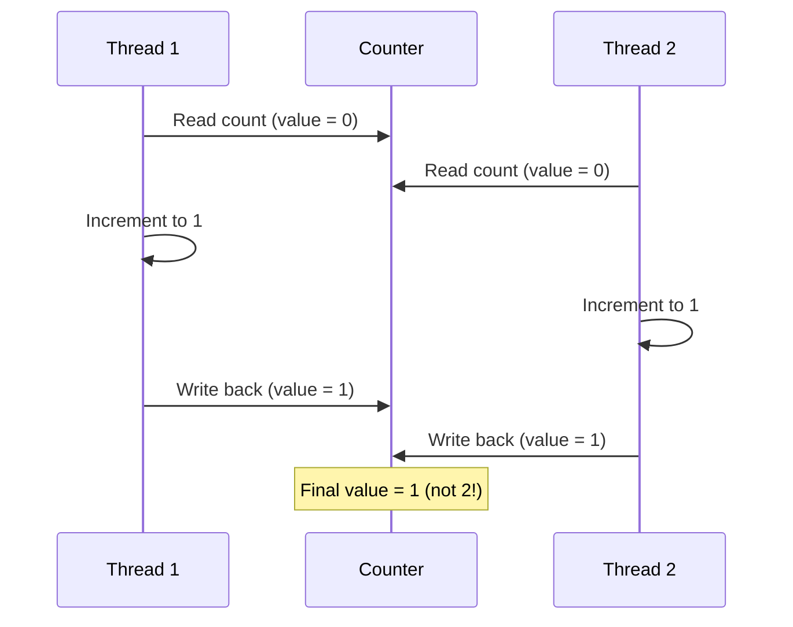
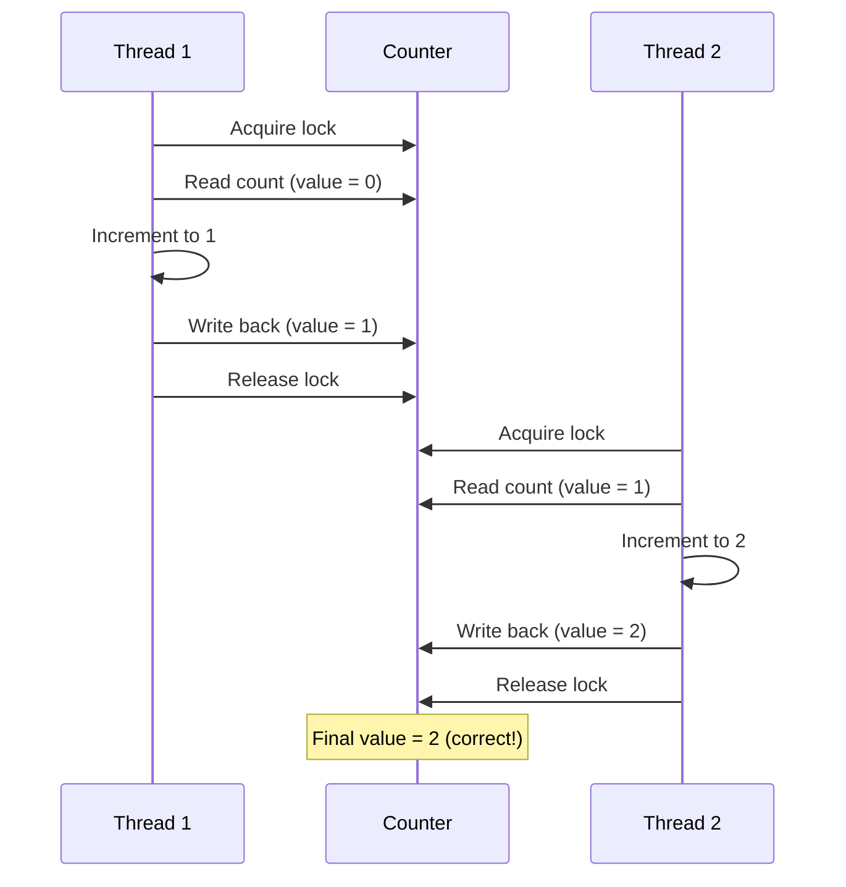

# Thread Safety

## Introduction

Thread safety is a critical concept in concurrent programming that ensures your program behaves correctly when multiple threads are accessing and modifying shared data simultaneously. When a program is thread-safe, it means that it will continue to function correctly even when executed by multiple threads at the same time.

In this guide, we'll explore what thread safety is, common problems that arise in multi-threaded programs, and techniques to ensure your code remains thread-safe.

## What is Thread Safety?

Thread safety refers to the property of code that ensures it functions correctly during simultaneous execution by multiple threads. A thread-safe piece of code will maintain data consistency and produce expected results regardless of how many threads are interacting with it.

Let's break down what makes something thread-safe:

1. **Data Consistency**: The data remains in a consistent state regardless of thread operations
2. **Predictable Results**: The outcome is the same as if operations were performed in a sequential manner
3. **No Race Conditions**: Multiple threads don't interfere with each other's operations

## Why Thread Safety Matters

Consider this simple counter example in Java:

```java
public class Counter {
    private int count = 0;
    
    public void increment() {
        count++;
    }
    
    public int getCount() {
        return count;
    }
}
```

This code looks innocent, but it's not thread-safe. The `count++` operation actually involves three steps:
1. Read the current value of `count`
2. Add 1 to the value
3. Store the new value back to `count`

If two threads execute this method simultaneously, they might both read the same initial value, both increment it to the same new value, and both write that same new value. As a result, one of the increments would be lost!

## Common Thread Safety Problems

### Race Conditions

A race condition occurs when the behavior of a program depends on the relative timing of events, such as the order in which threads execute.

```java
// Example of a race condition
public class BankAccount {
    private int balance = 0;
    
    public void deposit(int amount) {
        int newBalance = balance + amount;
        // Imagine a context switch happens here
        balance = newBalance;
    }
}
```

If two threads call `deposit()` at nearly the same time, one deposit might be lost.

### Deadlocks

A deadlock occurs when two or more threads are waiting for each other to release locks, resulting in all threads being blocked indefinitely.

```java
// Potential deadlock situation
public class ResourceManager {
    private final Object resource1 = new Object();
    private final Object resource2 = new Object();
    
    public void process1() {
        synchronized(resource1) {
            // Do something
            synchronized(resource2) {
                // Use both resources
            }
        }
    }
    
    public void process2() {
        synchronized(resource2) {
            // Do something
            synchronized(resource1) {
                // Use both resources
            }
        }
    }
}
```

If one thread calls `process1()` and another calls `process2()` simultaneously, they might end up waiting for each other forever.

### Visibility Problems

In multithreaded environments, changes made by one thread might not be immediately visible to other threads due to CPU caching or compiler optimizations.

```java
public class StopFlag {
    private boolean stopped = false;
    
    public void stop() {
        stopped = true;
    }
    
    public void runLoop() {
        while (!stopped) {
            // Do work
        }
    }
}
```

Without proper visibility guarantees, the worker thread running `runLoop()` might never see the update to `stopped` made by another thread.

## Thread Safety Techniques

### Synchronization

The `synchronized` keyword in Java provides exclusive access to a block of code or a method:

```java
public class ThreadSafeCounter {
    private int count = 0;
    
    public synchronized void increment() {
        count++;
    }
    
    public synchronized int getCount() {
        return count;
    }
}
```

With synchronization, only one thread can execute a synchronized method on the same object at a time.

### The `volatile` Keyword

The `volatile` keyword ensures that a variable is always read from and written to main memory, providing visibility guarantees:

```java
public class StopFlag {
    private volatile boolean stopped = false;
    
    public void stop() {
        stopped = true;
    }
    
    public void runLoop() {
        while (!stopped) {
            // Do work
        }
    }
}
```

Now when one thread updates `stopped`, other threads are guaranteed to see the change.

### Atomic Classes

Java provides atomic classes in the `java.util.concurrent.atomic` package that support lock-free, thread-safe operations on single variables:

```java
import java.util.concurrent.atomic.AtomicInteger;

public class AtomicCounter {
    private AtomicInteger count = new AtomicInteger(0);
    
    public void increment() {
        count.incrementAndGet();
    }
    
    public int getCount() {
        return count.get();
    }
}
```

Atomic operations are indivisible - they complete in a single step without interference from other threads.

### Thread-Local Storage

When you need thread isolation rather than shared data, `ThreadLocal` provides a way for each thread to have its own separate instance of a variable:

```java
public class ThreadSafeFormatter {
    private static ThreadLocal<SimpleDateFormat> dateFormatter = 
        ThreadLocal.withInitial(() -> new SimpleDateFormat("yyyy-MM-dd"));
    
    public String formatDate(Date date) {
        return dateFormatter.get().format(date);
    }
}
```

Each thread that accesses `dateFormatter.get()` will have its own `SimpleDateFormat` instance.

### Immutable Objects

Objects that cannot be modified after creation are inherently thread-safe because there's no risk of concurrent modification:

```java
public final class ImmutablePoint {
    private final int x;
    private final int y;
    
    public ImmutablePoint(int x, int y) {
        this.x = x;
        this.y = y;
    }
    
    public int getX() {
        return x;
    }
    
    public int getY() {
        return y;
    }
}
```

Since the state of an immutable object cannot change, it's safe to share it between multiple threads.

## Thread Safety in Practice

Let's look at a more complex example that demonstrates thread safety issues and solutions.

Imagine we're building a simple web server that counts page views:

```java
// Non-thread-safe implementation
public class PageViewCounter {
    private Map<String, Integer> pageViews = new HashMap<>();
    
    public void incrementPageView(String page) {
        Integer count = pageViews.get(page);
        if (count == null) {
            pageViews.put(page, 1);
        } else {
            pageViews.put(page, count + 1);
        }
    }
    
    public int getPageViews(String page) {
        Integer count = pageViews.get(page);
        return count == null ? 0 : count;
    }
}
```

This implementation has multiple thread safety issues. Let's fix it:

```java
// Thread-safe implementation
import java.util.concurrent.ConcurrentHashMap;

public class ThreadSafePageViewCounter {
    private ConcurrentHashMap<String, Integer> pageViews = new ConcurrentHashMap<>();
    
    public void incrementPageView(String page) {
        pageViews.compute(page, (key, value) -> value == null ? 1 : value + 1);
    }
    
    public int getPageViews(String page) {
        return pageViews.getOrDefault(page, 0);
    }
}
```

We've made two important changes:
1. Used `ConcurrentHashMap` instead of `HashMap`
2. Used the atomic `compute()` method to update values

## Visualizing Thread Safety Issues

To better understand thread interleaving and race conditions, let's use a diagram:



And here's how it would look with proper synchronization:



## Testing Thread Safety

Testing multithreaded code is notoriously difficult because thread-related bugs often depend on specific timing that's hard to reproduce. Here are some approaches:

1. **Stress Testing**: Run many threads that access the same resources concurrently
2. **Thread Analysis Tools**: Use tools like Java Flight Recorder or thread analyzers
3. **Code Review**: Carefully review code for potential thread safety issues

Here's an example of a simple stress test for our counter:

```java
import java.util.concurrent.ExecutorService;
import java.util.concurrent.Executors;
import java.util.concurrent.TimeUnit;

public class CounterTest {
    public static void main(String[] args) throws InterruptedException {
        final int NUM_THREADS = 100;
        final int INCREMENTS_PER_THREAD = 1000;
        
        // Test non-thread-safe counter
        Counter unsafeCounter = new Counter();
        stressTest(unsafeCounter, NUM_THREADS, INCREMENTS_PER_THREAD);
        System.out.println("Unsafe counter final value: " + unsafeCounter.getCount());
        System.out.println("Expected value: " + (NUM_THREADS * INCREMENTS_PER_THREAD));
        
        // Test thread-safe counter
        ThreadSafeCounter safeCounter = new ThreadSafeCounter();
        stressTest(safeCounter, NUM_THREADS, INCREMENTS_PER_THREAD);
        System.out.println("Thread-safe counter final value: " + safeCounter.getCount());
        System.out.println("Expected value: " + (NUM_THREADS * INCREMENTS_PER_THREAD));
    }
    
    private static void stressTest(Counter counter, int numThreads, int incrementsPerThread) 
            throws InterruptedException {
        ExecutorService executor = Executors.newFixedThreadPool(numThreads);
        
        for (int i = 0; i < numThreads; i++) {
            executor.submit(() -> {
                for (int j = 0; j < incrementsPerThread; j++) {
                    counter.increment();
                }
            });
        }
        
        executor.shutdown();
        executor.awaitTermination(1, TimeUnit.MINUTES);
    }
}
```

Output:
```
Unsafe counter final value: 57234
Expected value: 100000
Thread-safe counter final value: 100000
Expected value: 100000
```

The non-thread-safe counter's final value is significantly less than the expected value, confirming the race condition.

## Best Practices for Thread Safety

1. **Minimize Shared Mutable State**: The less shared state you have, the fewer opportunities for thread safety issues.
2. **Use Immutable Objects**: When possible, design your objects to be immutable.
3. **Use Thread-Safe Collections**: Use collections from the `java.util.concurrent` package when multiple threads will access a collection.
4. **Keep Synchronized Blocks Small**: Large synchronized blocks reduce concurrency.
5. **Prefer Higher-Level Concurrency Utilities**: Instead of dealing with locks directly, use concurrent collections, executors, and atomic variables.
6. **Document Thread Safety**: Clearly document whether your classes and methods are thread-safe.
7. **Avoid Double-Checked Locking**: It's easy to get wrong and has subtle issues.
8. **Be Wary of Static Fields**: They're shared across all instances and can lead to unexpected thread safety issues.

## Summary

Thread safety is essential for reliable concurrent programming. The key points to remember are:

- Thread safety issues arise when multiple threads access and modify shared data
- Common problems include race conditions, deadlocks, and visibility issues
- Techniques for thread safety include synchronization, atomic operations, thread-local storage, and immutable objects
- Always test your code thoroughly in a multithreaded environment

By understanding and applying these concepts, you'll be able to write more reliable and efficient concurrent programs.

## Exercises

1. Modify the `Counter` class to be thread-safe using different approaches:
   - Using synchronization
   - Using AtomicInteger
   - Using read-write locks

2. Implement a thread-safe cache with a timeout feature (items expire after a certain period).

3. Identify and fix the thread safety issues in this code:
   ```java
   public class UserDatabase {
       private Map<String, User> users = new HashMap<>();
       private int userCount = 0;
       
       public void addUser(String id, User user) {
           users.put(id, user);
           userCount++;
       }
       
       public User getUser(String id) {
           return users.get(id);
       }
       
       public int getUserCount() {
           return userCount;
       }
   }
   ```

## Additional Resources

- [Java Concurrency in Practice](https://jcip.net/) - The definitive guide to writing thread-safe Java code
- [Oracle's Tutorial on Concurrency](https://docs.oracle.com/javase/tutorial/essential/concurrency/)
- [Java Memory Model](https://docs.oracle.com/javase/specs/jls/se8/html/jls-17.html) - For a deeper understanding of how Java handles memory in multithreaded programs