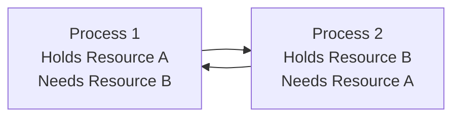

# Critical Section Problem

## Introduction

When multiple processes or threads execute simultaneously in a concurrent programming environment, they often need to access and modify shared resources. The **Critical Section Problem** addresses the fundamental challenge of ensuring that these concurrent processes can coordinate their actions to access shared resources without interference.

A **critical section** is a segment of code that accesses shared resources (such as variables, data structures, files, or devices) which should not be simultaneously accessed by more than one process. Without proper coordination, concurrent access to these shared resources can lead to race conditions, data corruption, and unpredictable program behavior.

## Understanding the Critical Section Problem

### What is a Critical Section?

Consider this simple example where two processes increment a shared counter:

```java
// This is a critical section
void incrementCounter() {
    counter = counter + 1; // Read, modify, write operation
}
```

If two processes execute this code simultaneously without any coordination:
1. Both might read the initial value (e.g., 5)
2. Both might increment it to 6
3. Both might write 6 back to memory
4. Result: counter = 6 (instead of the expected 7)

This type of bug is called a **race condition** because the outcome depends on the "race" between processes.

### Requirements for a Valid Solution

Any valid solution to the critical section problem must satisfy three key requirements:

1. **Mutual Exclusion**: Only one process can execute in its critical section at any given time.
2. **Progress**: If no process is executing in its critical section and some processes wish to enter their critical section, only processes not in their remainder section can participate in the decision, and the decision cannot be postponed indefinitely.
3. **Bounded Waiting**: There must be a bound on the number of times other processes can enter their critical sections after a process has made a request to enter its critical section and before that request is granted.

## Visualizing Process Execution

A process in a concurrent system typically follows this pattern:


- **Entry Section**: Code that requests permission to enter the critical section
- **Critical Section**: Code that accesses shared resources
- **Exit Section**: Code that releases access to the critical section
- **Remainder Section**: Rest of the code

## Solutions to the Critical Section Problem

### 1. Software Solutions

#### Peterson's Algorithm

Peterson's algorithm is a classic software solution for two processes:

```c
// Shared variables
bool flag[2] = {false, false};
int turn = 0;

// Process i (where i is 0 or 1)
void process_i() {
    int j = 1 - i; // The other process
    
    // Entry section
    flag[i] = true; // Indicate interest
    turn = j;       // Give priority to the other process
    while (flag[j] && turn == j); // Wait if necessary
    
    // Critical section
    // ... (access shared resources)
    
    // Exit section
    flag[i] = false; // No longer interested
    
    // Remainder section
    // ... (other code)
}
```

#### Dekker's Algorithm

Another classic solution for two processes that ensures mutual exclusion.

### 2. Hardware Solutions

Modern processors provide atomic instructions that help solve the critical section problem:

#### Test-and-Set

```c
bool TestAndSet(bool *target) {
    bool rv = *target;
    *target = true;
    return rv;
}

// Usage:
bool lock = false;

// Entry section
while (TestAndSet(&lock));

// Critical section
// ... (access shared resources)

// Exit section
lock = false;
```

#### Compare-and-Swap

```c
int CompareAndSwap(int *value, int expected, int new_value) {
    int temp = *value;
    if (temp == expected)
        *value = new_value;
    return temp;
}

// Usage:
int lock = 0;

// Entry section
while (CompareAndSwap(&lock, 0, 1) != 0);

// Critical section
// ... (access shared resources)

// Exit section
lock = 0;
```

### 3. Higher-Level Synchronization Constructs

#### Mutex Locks

```java
mutex_lock mutex; // Shared lock object

// Process code
void process() {
    // Entry section
    acquire(mutex);
    
    // Critical section
    // ... (access shared resources)
    
    // Exit section
    release(mutex);
    
    // Remainder section
    // ... (other code)
}
```

#### Semaphores

```c
semaphore S = 1; // Binary semaphore initialized to 1

// Process code
void process() {
    // Entry section
    wait(S);  // Decrement semaphore
    
    // Critical section
    // ... (access shared resources)
    
    // Exit section
    signal(S);  // Increment semaphore
    
    // Remainder section
    // ... (other code)
}
```

## Common Issues in Critical Section Solutions

### 1. Deadlock

A deadlock occurs when two or more processes are waiting indefinitely for each other to release resources.



### 2. Livelock

A livelock occurs when processes continuously change their states in response to each other without making progress.

### 3. Starvation

Starvation happens when a process is indefinitely denied access to resources it needs.

## Real-World Applications

### 1. Database Transaction Systems

```java
Connection conn = getConnection();
try {
    conn.setAutoCommit(false); // Begin transaction
    
    // Critical section
    Statement stmt = conn.createStatement();
    stmt.executeUpdate("UPDATE accounts SET balance = balance - 100 WHERE account_id = 123");
    stmt.executeUpdate("UPDATE accounts SET balance = balance + 100 WHERE account_id = 456");
    
    conn.commit(); // Commit transaction
} catch (SQLException e) {
    conn.rollback(); // Rollback if an error occurs
} finally {
    conn.close();
}
```

### 2. Operating System Resource Allocation

```c
// Example: File access in an operating system
lock_file(file_descriptor);

// Critical section - write to file
write(file_descriptor, buffer, size);

unlock_file(file_descriptor);
```

### 3. Web Applications Handling Multiple Requests

```javascript
// Node.js example with a shared counter
const express = require('express');
const app = express();
let counter = 0;
const mutex = require('async-mutex').Mutex;
const counterMutex = new mutex();

app.get('/increment', async (req, res) => {
    // Critical section
    const release = await counterMutex.acquire();
    try {
        counter++;
        res.send(`Counter: ${counter}`);
    } finally {
        release();
    }
});

app.listen(3000);
```

## Implementation Example: Producer-Consumer Problem

The producer-consumer problem is a classic example that demonstrates the critical section problem:

```java
class BoundedBuffer {
    private final int[] buffer = new int[BUFFER_SIZE];
    private int in = 0, out = 0, count = 0;
    private final Object lock = new Object();
    
    public void produce(int item) throws InterruptedException {
        synchronized (lock) {
            while (count == BUFFER_SIZE) {
                lock.wait(); // Buffer full, wait
            }
            
            // Critical section
            buffer[in] = item;
            in = (in + 1) % BUFFER_SIZE;
            count++;
            
            lock.notifyAll(); // Notify waiting consumers
        }
    }
    
    public int consume() throws InterruptedException {
        int item;
        synchronized (lock) {
            while (count == 0) {
                lock.wait(); // Buffer empty, wait
            }
            
            // Critical section
            item = buffer[out];
            out = (out + 1) % BUFFER_SIZE;
            count--;
            
            lock.notifyAll(); // Notify waiting producers
        }
        return item;
    }
}
```

## Practical Exercise: Implementing a Thread-Safe Counter

Here's a step-by-step implementation of a thread-safe counter class in Java:

```java
public class ThreadSafeCounter {
    private int count = 0;
    
    // Method 1: Using synchronized keyword
    public synchronized void incrementSync() {
        count++;
    }
    
    // Method 2: Using explicit lock
    private final Object lock = new Object();
    public void incrementWithLock() {
        synchronized (lock) {
            count++;
        }
    }
    
    // Method 3: Using AtomicInteger
    private java.util.concurrent.atomic.AtomicInteger atomicCount = 
        new java.util.concurrent.atomic.AtomicInteger(0);
    
    public void incrementAtomic() {
        atomicCount.incrementAndGet();
    }
    
    public int getCount() {
        return count;
    }
    
    public int getAtomicCount() {
        return atomicCount.get();
    }
}
```

Let's test our thread-safe counter with multiple threads:

```java
public class CounterTest {
    public static void main(String[] args) throws InterruptedException {
        final int NUM_THREADS = 10;
        final int ITERATIONS = 1000;
        
        // Create a shared counter
        ThreadSafeCounter counter = new ThreadSafeCounter();
        
        // Create and start threads
        Thread[] threads = new Thread[NUM_THREADS];
        for (int i = 0; i < NUM_THREADS; i++) {
            threads[i] = new Thread(() -> {
                for (int j = 0; j < ITERATIONS; j++) {
                    counter.incrementSync();
                    counter.incrementAtomic();
                }
            });
            threads[i].start();
        }
        
        // Wait for all threads to complete
        for (Thread thread : threads) {
            thread.join();
        }
        
        // Verify results
        System.out.println("Expected count: " + (NUM_THREADS * ITERATIONS));
        System.out.println("Actual synchronized count: " + counter.getCount());
        System.out.println("Actual atomic count: " + counter.getAtomicCount());
    }
}
```

**Output:**
```
Expected count: 10000
Actual synchronized count: 10000
Actual atomic count: 10000
```

## Summary

The Critical Section Problem is fundamental to concurrent programming. It addresses how to coordinate access to shared resources among multiple processes or threads. We've explored:

1. The definition and importance of the critical section problem
2. Key requirements for valid solutions (mutual exclusion, progress, bounded waiting)
3. Various solution approaches:
   - Software-based solutions (Peterson's and Dekker's algorithms)
   - Hardware support (atomic instructions like Test-and-Set)
   - Higher-level constructs (mutexes and semaphores)
4. Common issues: deadlock, livelock, and starvation
5. Real-world applications and practical implementations

Understanding and correctly implementing solutions to the critical section problem is crucial for building reliable concurrent programs that can take advantage of modern multi-core processors while avoiding race conditions and data corruption.

## Further Exercises

1. Implement Peterson's algorithm in your preferred programming language and verify it works correctly with two threads.
2. Create a thread-safe object pool that can be used by multiple threads concurrently.
3. Solve the readers-writers problem, where multiple readers can access a resource simultaneously, but writers need exclusive access.
4. Implement a simple bank account class that allows concurrent deposits and withdrawals while maintaining consistent account balance.
5. Research and compare the performance of different synchronization mechanisms (synchronized methods, ReentrantLock, Semaphores, AtomicIntegers) in a high-concurrency environment.

## Additional Resources

- "Operating System Concepts" by Silberschatz, Galvin, and Gagne
- "Java Concurrency in Practice" by Brian Goetz
- "The Art of Multiprocessor Programming" by Maurice Herlihy and Nir Shavit
- [Concurrency Concepts in Java](https://docs.oracle.com/javase/tutorial/essential/concurrency/)
- [C++ Thread Support Library](https://en.cppreference.com/w/cpp/thread)