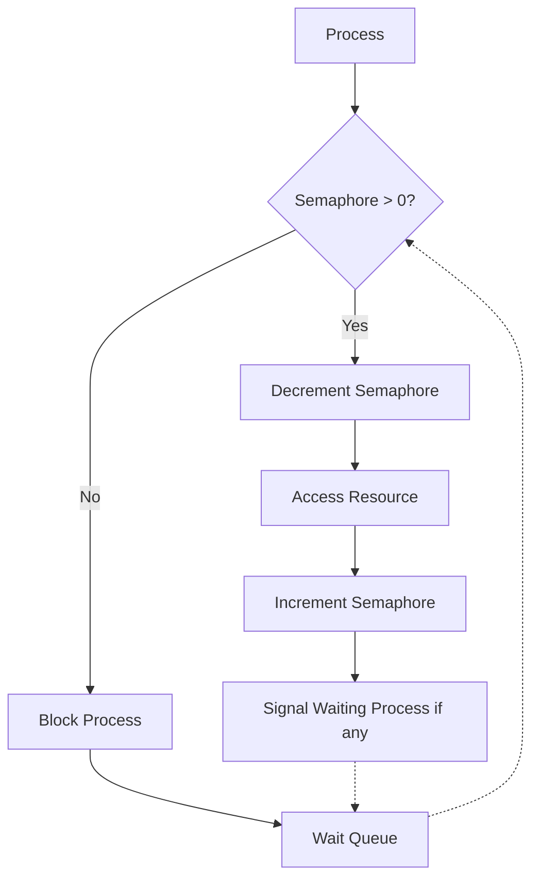

# Semaphores

## Introduction

When multiple parts of a program run simultaneously (concurrently), they often need to access the same resources. Without proper coordination, this can lead to problems like race conditions and data corruption. **Semaphores** are one of the most fundamental synchronization tools that help manage these concurrent accesses.

A semaphore is essentially a counter that helps control access to a shared resource. Think of it as a traffic light system for your code - it signals when it's safe for a process to proceed and when it should wait.

## What is a Semaphore?

A semaphore is a variable or abstract data type that is used for controlling access to a common resource by multiple processes in a concurrent system. Semaphores were invented by Dutch computer scientist Edsger Dijkstra in 1965 and remain a fundamental concept in concurrent programming.

Semaphores maintain a count and provide two main operations:

1. **wait** (sometimes called P, acquire, or down): Decrements the semaphore count. If the count becomes negative, the process is blocked and put into a waiting queue.

2. **signal** (sometimes called V, release, or up): Increments the semaphore count. If there are blocked processes, one is unblocked.

The count represents how many more resources are available or how many more processes can acquire the semaphore.

## Types of Semaphores

There are two main types of semaphores:

### 1. Binary Semaphores (Mutex)

A binary semaphore can only have values 0 or 1. It's equivalent to a mutex (mutual exclusion) lock that allows only one process to access a resource at a time.

### 2. Counting Semaphores

A counting semaphore can have arbitrary non-negative values. It controls access to a resource that has multiple instances. The count represents how many instances are available.

## How Semaphores Work

Let's understand the basic mechanism with pseudocode:

```
// Semaphore operations
procedure wait(S):
    while S ≤ 0:
        // Process is blocked
    S = S - 1

procedure signal(S):
    S = S + 1
    // If processes are waiting, wake one up
```

In practice, these operations are atomic, meaning they execute without interruption, which is essential for their correctness.

## Semaphores in Action: Solving the Producer-Consumer Problem

One classic problem in concurrent programming is the Producer-Consumer problem. Let's see how semaphores can solve it:

```java
// Java example of producer-consumer using semaphores
import java.util.concurrent.Semaphore;

public class ProducerConsumer {
    private static final int BUFFER_SIZE = 5;
    private static final Semaphore emptySlots = new Semaphore(BUFFER_SIZE);
    private static final Semaphore filledSlots = new Semaphore(0);
    private static final Semaphore mutex = new Semaphore(1);
    private static int[] buffer = new int[BUFFER_SIZE];
    private static int inIndex = 0;
    private static int outIndex = 0;

    static class Producer implements Runnable {
        @Override
        public void run() {
            for (int i = 0; i < 10; i++) {
                try {
                    // Wait if buffer is full
                    emptySlots.acquire();
                    // Ensure mutual exclusion for buffer access
                    mutex.acquire();
                    
                    // Critical section: produce item
                    buffer[inIndex] = i;
                    System.out.println("Produced: " + i + " at position " + inIndex);
                    inIndex = (inIndex + 1) % BUFFER_SIZE;
                    
                    // Release mutex and signal that a slot is filled
                    mutex.release();
                    filledSlots.release();
                    
                    Thread.sleep(100); // Simulate work
                } catch (InterruptedException e) {
                    Thread.currentThread().interrupt();
                }
            }
        }
    }

    static class Consumer implements Runnable {
        @Override
        public void run() {
            for (int i = 0; i < 10; i++) {
                try {
                    // Wait if buffer is empty
                    filledSlots.acquire();
                    // Ensure mutual exclusion for buffer access
                    mutex.acquire();
                    
                    // Critical section: consume item
                    int item = buffer[outIndex];
                    System.out.println("Consumed: " + item + " from position " + outIndex);
                    outIndex = (outIndex + 1) % BUFFER_SIZE;
                    
                    // Release mutex and signal that a slot is empty
                    mutex.release();
                    emptySlots.release();
                    
                    Thread.sleep(200); // Simulate work
                } catch (InterruptedException e) {
                    Thread.currentThread().interrupt();
                }
            }
        }
    }

    public static void main(String[] args) {
        Thread producerThread = new Thread(new Producer());
        Thread consumerThread = new Thread(new Consumer());
        
        producerThread.start();
        consumerThread.start();
    }
}
```

**Output (sample):**
```
Produced: 0 at position 0
Produced: 1 at position 1
Consumed: 0 from position 0
Produced: 2 at position 2
Consumed: 1 from position 1
Produced: 3 at position 3
Consumed: 2 from position 2
Produced: 4 at position 4
Consumed: 3 from position 3
Produced: 5 at position 0
Consumed: 4 from position 4
Produced: 6 at position 1
Consumed: 5 from position 0
Produced: 7 at position 2
Consumed: 6 from position 1
Produced: 8 at position 3
Consumed: 7 from position 2
Produced: 9 at position 4
Consumed: 8 from position 3
Consumed: 9 from position 4
```

In this example:
- `emptySlots` tracks available buffer slots (initially BUFFER_SIZE)
- `filledSlots` tracks filled buffer slots (initially 0)
- `mutex` ensures that only one thread modifies the buffer at a time

## Understanding Semaphore Flow with a Diagram

Let's visualize the semaphore mechanism:



## Common Semaphore Use Cases

### 1. Resource Counting

When you have a fixed number of resources (like database connections or thread pool workers), a counting semaphore can manage access:

```python
# Python example using semaphores for a connection pool
import threading
import time
from concurrent.futures import ThreadPoolExecutor

# Simulating a pool of 3 database connections
connection_pool = threading.Semaphore(3)

def access_database(user_id):
    connection_pool.acquire()
    try:
        print(f"User {user_id} acquired a database connection")
        # Simulate database work
        time.sleep(2)
        print(f"User {user_id} completed database work")
    finally:
        # Always release the connection
        connection_pool.release()
        print(f"User {user_id} released the connection")

# Simulate 10 concurrent users trying to access the database
with ThreadPoolExecutor(max_workers=10) as executor:
    for i in range(10):
        executor.submit(access_database, i)
```

**Output (sample):**
```
User 0 acquired a database connection
User 1 acquired a database connection
User 2 acquired a database connection
User 0 completed database work
User 0 released the connection
User 3 acquired a database connection
User 1 completed database work
User 1 released the connection
User 4 acquired a database connection
User 2 completed database work
User 2 released the connection
User 5 acquired a database connection
...
```

### 2. Signaling Between Threads

Semaphores can be used to signal between threads when a certain condition is met:

```java
// Java example using semaphore for thread signaling
import java.util.concurrent.Semaphore;

public class ThreadSignaling {
    private static Semaphore semaphore = new Semaphore(0);
    
    static class WorkerThread implements Runnable {
        @Override
        public void run() {
            try {
                System.out.println("Worker: Starting work...");
                Thread.sleep(2000); // Simulate long operation
                System.out.println("Worker: Work complete, signaling main thread");
                semaphore.release();
            } catch (InterruptedException e) {
                Thread.currentThread().interrupt();
            }
        }
    }
    
    public static void main(String[] args) throws InterruptedException {
        System.out.println("Main: Starting worker thread");
        Thread worker = new Thread(new WorkerThread());
        worker.start();
        
        System.out.println("Main: Waiting for worker to complete");
        semaphore.acquire(); // Will block until worker releases
        System.out.println("Main: Received signal, continuing execution");
    }
}
```

**Output:**
```
Main: Starting worker thread
Main: Waiting for worker to complete
Worker: Starting work...
Worker: Work complete, signaling main thread
Main: Received signal, continuing execution
```

## Common Pitfalls with Semaphores

### Deadlocks

A deadlock occurs when processes are waiting indefinitely for resources held by each other.

```java
// Potential deadlock example
public void method1() {
    semaphore1.acquire();
    semaphore2.acquire();
    // Use resources
    semaphore2.release();
    semaphore1.release();
}

public void method2() {
    semaphore2.acquire();
    semaphore1.acquire();
    // Use resources
    semaphore1.release();
    semaphore2.release();
}
```

If thread A calls `method1()` and thread B calls `method2()` simultaneously, they might deadlock.

### Starvation

Starvation happens when a process is perpetually denied necessary resources.

### Priority Inversion

Priority inversion occurs when a higher-priority process is indirectly preempted by a lower-priority process.

## Best Practices for Using Semaphores

1. **Always release acquired semaphores**: Use try-finally blocks to ensure semaphores are released even if exceptions occur.

2. **Avoid nested semaphore acquisitions**: When possible, acquire all needed semaphores at once to prevent deadlocks.

3. **Consider using higher-level abstractions**: Modern programming languages often offer higher-level synchronization constructs that are safer to use.

4. **Document your semaphore usage**: Clear documentation helps maintain and debug concurrent code.

## Implementing Your Own Semaphore

While most languages provide semaphore implementations, understanding how to implement one is valuable:

```java
// Simple semaphore implementation in Java
public class SimpleSemaphore {
    private int value;
    
    public SimpleSemaphore(int initialValue) {
        if (initialValue < 0) {
            throw new IllegalArgumentException("Semaphore value cannot be negative");
        }
        this.value = initialValue;
    }
    
    public synchronized void acquire() throws InterruptedException {
        while (value == 0) {
            wait(); // Block until someone signals
        }
        value--;
    }
    
    public synchronized void release() {
        value++;
        notify(); // Wake up one waiting thread
    }
    
    public synchronized int availablePermits() {
        return value;
    }
}
```

## Semaphores vs. Other Synchronization Primitives

| Primitive | Purpose | Use When |
|-----------|---------|----------|
| Semaphore | Control access to multiple resources | You need to limit access to a fixed number of resources |
| Mutex | Provide exclusive access to a single resource | You need simple mutual exclusion |
| Monitor | Combine mutex and condition variables | You need more complex synchronization with condition checking |
| Read-Write Lock | Allow multiple readers but exclusive writers | You have a resource with frequent reads but infrequent writes |

## Summary

Semaphores are powerful synchronization primitives that help control access to shared resources in concurrent systems. They can be used to implement mutual exclusion, resource counting, and thread signaling.

Key points to remember:
- A semaphore maintains a counter that represents available resources
- The wait operation decrements the counter and may block if resources aren't available
- The signal operation increments the counter and may unblock waiting processes
- Binary semaphores (with values 0 or 1) are equivalent to mutex locks
- Counting semaphores can manage multiple resource instances

When used correctly, semaphores help prevent race conditions, deadlocks, and other concurrency issues. However, they require careful implementation to avoid pitfalls like deadlocks and starvation.

## Exercises

1. Implement a solution to the readers-writers problem using semaphores.
2. Modify the producer-consumer example to handle multiple producers and consumers.
3. Implement a thread-safe bounded buffer using semaphores.
4. Design a resource allocation system for a simulated operating system using semaphores.
5. Debug and fix the deadlock example provided in the Common Pitfalls section.

## Additional Resources

- "The Little Book of Semaphores" by Allen B. Downey
- "Operating System Concepts" by Silberschatz, Galvin, and Gagne
- Java Concurrency in Practice by Brian Goetz
- The Go Programming Language documentation on synchronization primitives
- Python threading module documentation