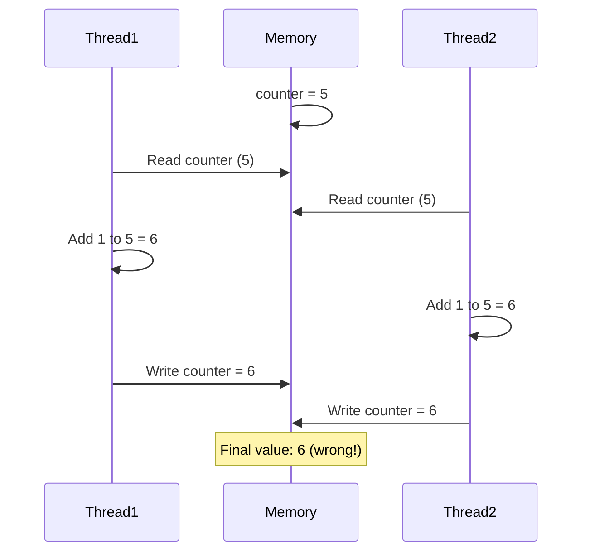
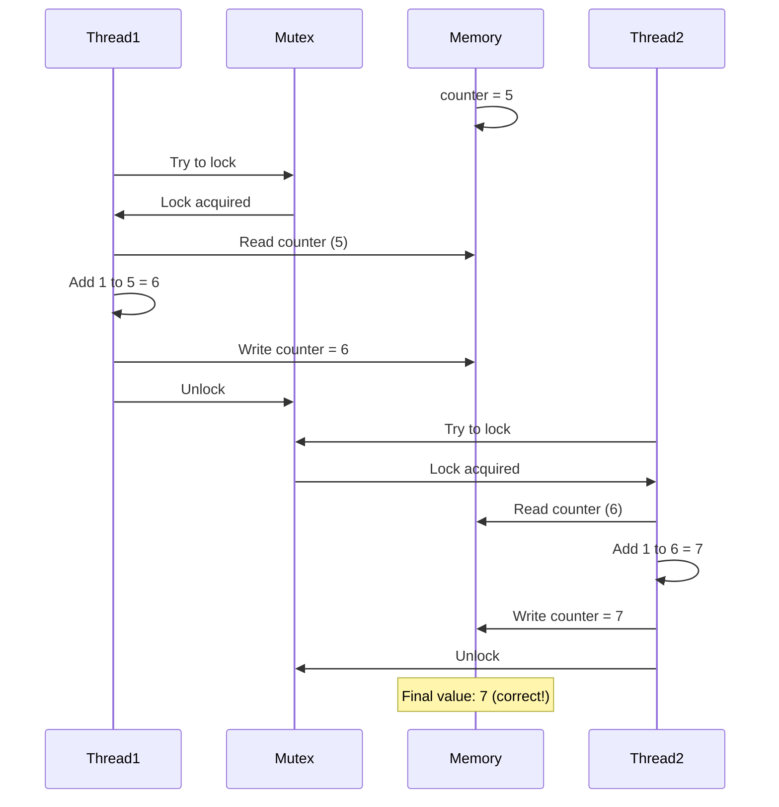
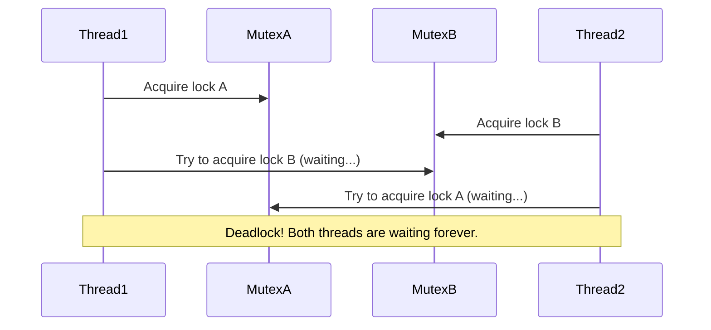

# Mutex Locks

## Introduction

Have you ever had to share a single bathroom with multiple family members? The classic solution is to lock the door while you're inside, preventing anyone else from entering until you're done. This everyday concept is exactly how **mutex locks** work in programming!

A mutex (short for "mutual exclusion") is a synchronization primitive that prevents multiple threads from accessing a shared resource simultaneously. In concurrent programming, mutex locks are essential tools that help developers avoid race conditions and ensure data consistency.

## Why Do We Need Mutex Locks?

Imagine two threads trying to increment a counter variable at the same time:

```java
// Initial value of counter = 5
// Thread 1 wants to do: counter = counter + 1
// Thread 2 wants to do: counter = counter + 1
```

Without proper synchronization, both threads might read the value `5` simultaneously, increment it to `6`, and write it back. The final result would be `6` instead of the expected `7`. This is called a **race condition**.

Let's visualize this problem:



A mutex lock solves this by allowing only one thread to access the shared resource at a time.

## How Mutex Locks Work

A mutex has two main operations:
- **Lock (or acquire)**: A thread attempts to acquire the lock. If the lock is available, the thread gets it and can proceed. If another thread already holds the lock, the requesting thread is blocked (waits) until the lock becomes available.
- **Unlock (or release)**: The thread that owns the lock releases it when it's done, allowing other waiting threads to acquire it.

Let's visualize correct behavior with mutex locks:



## Basic Mutex Implementation in Different Languages

### C++ Example

```cpp
#include <iostream>
#include <thread>
#include <mutex>

int counter = 0;
std::mutex mtx;  // Create a mutex

void increment() {
    // Lock the mutex before accessing the shared resource
    mtx.lock();
    
    // Critical section (protected by mutex)
    counter++;
    std::cout << "Counter value: " << counter << std::endl;
    
    // Unlock the mutex when done
    mtx.unlock();
}

int main() {
    std::thread t1(increment);
    std::thread t2(increment);
    
    t1.join();
    t2.join();
    
    return 0;
}
```

**Output:**
```
Counter value: 1
Counter value: 2
```

### Java Example

```java
import java.util.concurrent.locks.Lock;
import java.util.concurrent.locks.ReentrantLock;

public class MutexExample {
    private static int counter = 0;
    private static final Lock mutex = new ReentrantLock();
    
    public static void main(String[] args) throws InterruptedException {
        Thread t1 = new Thread(MutexExample::increment);
        Thread t2 = new Thread(MutexExample::increment);
        
        t1.start();
        t2.start();
        
        t1.join();
        t2.join();
    }
    
    private static void increment() {
        // Lock the mutex
        mutex.lock();
        try {
            // Critical section (protected by mutex)
            counter++;
            System.out.println("Counter value: " + counter);
        } finally {
            // Always unlock in a finally block to ensure it's released
            mutex.unlock();
        }
    }
}
```

**Output:**
```
Counter value: 1
Counter value: 2
```

### Python Example

```python
import threading

counter = 0
mutex = threading.Lock()

def increment():
    global counter
    # Acquire the lock
    mutex.acquire()
    try:
        # Critical section (protected by mutex)
        global counter
        counter += 1
        print(f"Counter value: {counter}")
    finally:
        # Release the lock in a finally block
        mutex.release()
        
# Alternatively, you can use a context manager
def increment_with_context():
    global counter
    with mutex:  # Automatically acquires and releases the lock
        counter += 1
        print(f"Counter value: {counter}")

# Create and start threads
t1 = threading.Thread(target=increment)
t2 = threading.Thread(target=increment_with_context)

t1.start()
t2.start()

t1.join()
t2.join()
```

**Output:**
```
Counter value: 1
Counter value: 2
```

## Best Practices for Using Mutex Locks

1. **Keep Critical Sections Small**: Lock only when necessary and for as short a time as possible.
2. **Always Release Locks**: Use try-finally blocks or equivalent constructs to ensure locks are always released.
3. **Avoid Nested Locks**: Beware of deadlocks when acquiring multiple locks.
4. **Use Lock Hierarchies**: If you must acquire multiple locks, always acquire them in the same order.
5. **Consider Lock-Free Alternatives**: For simple operations, atomic variables might be more efficient.

## Common Pitfalls

### Deadlocks

A deadlock occurs when two or more threads are blocked forever, each waiting for the other to release a lock.



### Priority Inversion

A low-priority thread holds a lock needed by a high-priority thread, but a medium-priority thread prevents the low-priority thread from releasing the lock.

### Livelock

Similar to deadlock, but threads keep changing their state without making progress.

## Real-World Applications

### Banking Transactions

When multiple transactions try to modify an account balance:

```java
public class BankAccount {
    private double balance;
    private final Lock accountLock = new ReentrantLock();
    
    public void deposit(double amount) {
        accountLock.lock();
        try {
            balance += amount;
            System.out.println("Deposited: " + amount + ", New balance: " + balance);
        } finally {
            accountLock.unlock();
        }
    }
    
    public boolean withdraw(double amount) {
        accountLock.lock();
        try {
            if (balance >= amount) {
                balance -= amount;
                System.out.println("Withdrew: " + amount + ", New balance: " + balance);
                return true;
            }
            return false;
        } finally {
            accountLock.unlock();
        }
    }
}
```

### File Access

When multiple threads need to write to the same file:

```python
import threading

class LogFile:
    def __init__(self, filename):
        self.filename = filename
        self.file_mutex = threading.Lock()
        
    def write_log(self, message):
        with self.file_mutex:
            with open(self.filename, 'a') as f:
                f.write(message + '
')
                
    def read_logs(self):
        with self.file_mutex:
            try:
                with open(self.filename, 'r') as f:
                    return f.readlines()
            except FileNotFoundError:
                return []
```

### Web Server Request Handling

When a web server processes requests that modify shared data:

```javascript
const express = require('express');
const app = express();
const { Mutex } = require('async-mutex');

// Shared data
let activeUsers = 0;
const userMutex = new Mutex();

app.post('/user/login', async (req, res) => {
    // Acquire the lock
    const release = await userMutex.acquire();
    
    try {
        // Critical section
        activeUsers++;
        console.log(`User logged in. Active users: ${activeUsers}`);
        
        // Process login...
        res.send({ success: true, activeUsers });
    } finally {
        // Release the lock
        release();
    }
});

app.post('/user/logout', async (req, res) => {
    const release = await userMutex.acquire();
    
    try {
        if (activeUsers > 0) {
            activeUsers--;
        }
        console.log(`User logged out. Active users: ${activeUsers}`);
        
        // Process logout...
        res.send({ success: true, activeUsers });
    } finally {
        release();
    }
});

app.listen(3000, () => {
    console.log('Server running on port 3000');
});
```

## Advanced Concepts

### Read-Write Locks

A more sophisticated lock that allows multiple readers but only one writer:

```java
import java.util.concurrent.locks.ReadWriteLock;
import java.util.concurrent.locks.ReentrantReadWriteLock;

public class ReadWriteLockExample {
    private final ReadWriteLock rwLock = new ReentrantReadWriteLock();
    private int data = 0;
    
    public int readData() {
        rwLock.readLock().lock();  // Multiple threads can read simultaneously
        try {
            return data;
        } finally {
            rwLock.readLock().unlock();
        }
    }
    
    public void writeData(int newValue) {
        rwLock.writeLock().lock();  // Only one thread can write at a time
        try {
            data = newValue;
        } finally {
            rwLock.writeLock().unlock();
        }
    }
}
```

### Spinlocks

A lock implementation where the thread doesn't sleep but keeps checking if the lock is available:

```cpp
#include <atomic>
#include <thread>

class SpinLock {
private:
    std::atomic<bool> locked{false};

public:
    void lock() {
        while (locked.exchange(true, std::memory_order_acquire)) {
            // Spin until we get the lock
        }
    }

    void unlock() {
        locked.store(false, std::memory_order_release);
    }
};
```

## Summary

Mutex locks are essential tools in concurrent programming that help protect shared resources from simultaneous access by multiple threads. They provide mutual exclusion, ensuring that only one thread can execute a critical section of code at a time.

Key takeaways:
- Mutex locks prevent race conditions and maintain data consistency
- The basic operations are lock (acquire) and unlock (release)
- Always release locks in finally blocks to prevent deadlocks
- Keep critical sections small to improve performance
- Beware of common issues like deadlocks and priority inversion

By mastering mutex locks, you'll have a solid foundation for building thread-safe applications and handling more complex synchronization challenges.

## Exercises

1. Implement a thread-safe counter class in your preferred language.
2. Create a simulation of multiple ATMs accessing a single bank account and ensure all transactions are properly synchronized.
3. Modify the file access example to use a read-write lock instead of a mutex.
4. Implement a solution to the classic "dining philosophers" problem using mutex locks.
5. Create a thread-safe singleton pattern implementation using mutex locks.

## Additional Resources

- [Operating Systems: Three Easy Pieces](http://pages.cs.wisc.edu/~remzi/OSTEP/) - Chapter on Locks
- [The Art of Multiprocessor Programming](https://dl.acm.org/doi/book/10.5555/2385452) by Maurice Herlihy
- [Java Concurrency in Practice](https://jcip.net/) by Brian Goetz
- [C++ Concurrency in Action](https://www.manning.com/books/c-plus-plus-concurrency-in-action-second-edition) by Anthony Williams