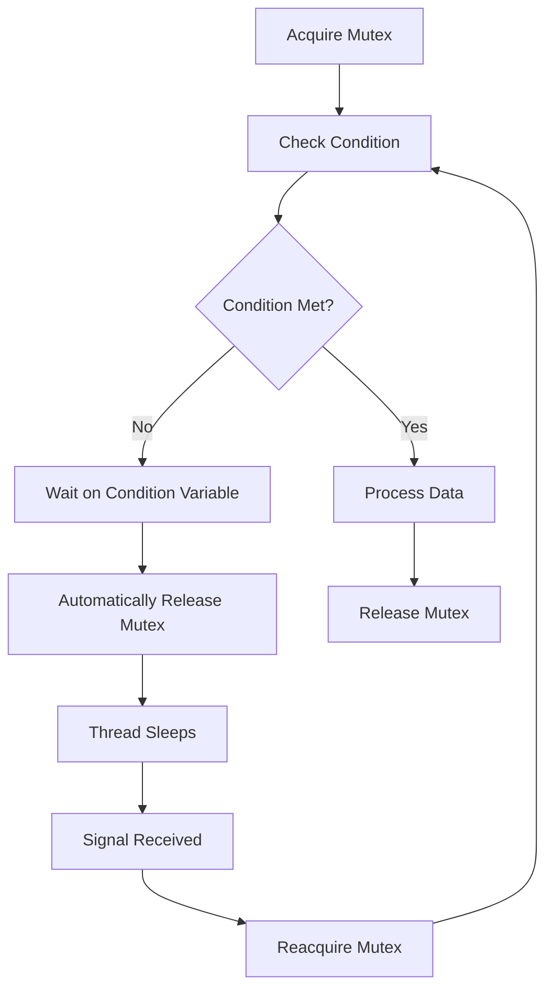

# Condition Variables

## Introduction

When writing multi-threaded programs, threads often need to coordinate with each other. Sometimes a thread needs to wait until a specific condition becomes true before it can proceed. This is where **condition variables** come in.

A condition variable is a synchronization primitive that enables threads to wait until a particular condition occurs. Unlike mutexes which are used for mutual exclusion, condition variables are specifically designed for signaling between threads when certain conditions change.

## Understanding Condition Variables

### The Basic Concept

At its core, a condition variable is an object that allows a thread to:
1. **Wait** until a condition becomes true
2. **Signal** other waiting threads when a condition changes

Think of condition variables like a notification system between threads. One thread can say "wake me up when X happens" and another thread can send that notification when appropriate.

### Why Not Just Use Polling?

You might wonder why we need condition variables when a thread could just repeatedly check a condition in a loop (polling). Consider this naive approach:

```c
// Problematic polling approach
while (!condition_is_true) {
    // Keep checking
}
// Proceed when condition is true
```

This approach has several problems:
- It wastes CPU cycles continuously checking the condition
- It doesn't release the lock while waiting, blocking other threads
- It can lead to priority inversion and starvation issues

Condition variables solve these problems by allowing threads to sleep efficiently until notified.

## How Condition Variables Work

Condition variables are always used with a mutex (lock) to prevent race conditions. The typical pattern follows these steps:

1. Acquire a mutex lock
2. Check if the condition is met
3. If not met, wait on the condition variable (which automatically releases the mutex)
4. When signaled, the thread reacquires the mutex and checks the condition again
5. If condition is met, proceed and release mutex
6. If not met, go back to waiting

Let's visualize this flow:



## Condition Variable Operations

Condition variables typically support these basic operations:

### 1. Wait

Puts the current thread to sleep until signaled. This operation:
- Releases the associated mutex
- Blocks the thread
- Automatically reacquires the mutex when awakened

### 2. Signal (or Notify)

Wakes up at least one thread waiting on the condition variable.

### 3. Broadcast (or NotifyAll)

Wakes up all threads waiting on the condition variable.

## Implementation in Different Languages

### C/C++ (using POSIX threads)

```cpp
#include <pthread.h>
#include <stdio.h>
#include <stdlib.h>

pthread_mutex_t mutex = PTHREAD_MUTEX_INITIALIZER;
pthread_cond_t cond = PTHREAD_COND_INITIALIZER;
int data_ready = 0;

void* producer(void* arg) {
    // Simulate work
    sleep(1);
    
    // Acquire lock
    pthread_mutex_lock(&mutex);
    
    // Update shared data
    data_ready = 1;
    printf("Producer: Data is ready
");
    
    // Signal waiting thread
    pthread_cond_signal(&cond);
    
    // Release lock
    pthread_mutex_unlock(&mutex);
    
    return NULL;
}

void* consumer(void* arg) {
    // Acquire lock
    pthread_mutex_lock(&mutex);
    
    // Wait until data is ready
    while (!data_ready) {
        printf("Consumer: Waiting for data...
");
        pthread_cond_wait(&cond, &mutex);
    }
    
    // Process data
    printf("Consumer: Processing data
");
    
    // Release lock
    pthread_mutex_unlock(&mutex);
    
    return NULL;
}

int main() {
    pthread_t prod_thread, cons_thread;
    
    // Create threads
    pthread_create(&cons_thread, NULL, consumer, NULL);
    pthread_create(&prod_thread, NULL, producer, NULL);
    
    // Wait for threads to finish
    pthread_join(prod_thread, NULL);
    pthread_join(cons_thread, NULL);
    
    return 0;
}
```

**Output:**
```
Consumer: Waiting for data...
Producer: Data is ready
Consumer: Processing data
```

### Java

```java
import java.util.concurrent.locks.Condition;
import java.util.concurrent.locks.Lock;
import java.util.concurrent.locks.ReentrantLock;

public class ConditionVariableDemo {
    private Lock lock = new ReentrantLock();
    private Condition dataReady = lock.newCondition();
    private boolean isDataReady = false;
    
    public void produceData() throws InterruptedException {
        lock.lock();
        try {
            // Simulate work
            Thread.sleep(1000);
            
            // Update shared state
            isDataReady = true;
            System.out.println("Producer: Data is ready");
            
            // Signal waiting thread
            dataReady.signal();
        } finally {
            lock.unlock();
        }
    }
    
    public void consumeData() throws InterruptedException {
        lock.lock();
        try {
            // Wait until data is ready
            while (!isDataReady) {
                System.out.println("Consumer: Waiting for data...");
                dataReady.await();
            }
            
            // Process data
            System.out.println("Consumer: Processing data");
        } finally {
            lock.unlock();
        }
    }
    
    public static void main(String[] args) {
        ConditionVariableDemo demo = new ConditionVariableDemo();
        
        Thread consumer = new Thread(() -> {
            try {
                demo.consumeData();
            } catch (InterruptedException e) {
                e.printStackTrace();
            }
        });
        
        Thread producer = new Thread(() -> {
            try {
                demo.produceData();
            } catch (InterruptedException e) {
                e.printStackTrace();
            }
        });
        
        consumer.start();
        producer.start();
    }
}
```

**Output:**
```
Consumer: Waiting for data...
Producer: Data is ready
Consumer: Processing data
```

### Python (using threading module)

```python
import threading
import time

class SharedResource:
    def __init__(self):
        self.condition = threading.Condition()
        self.data_ready = False
    
    def produce(self):
        # Simulate work
        time.sleep(1)
        
        # Acquire lock and notify
        with self.condition:
            self.data_ready = True
            print("Producer: Data is ready")
            self.condition.notify()
    
    def consume(self):
        # Acquire lock and wait
        with self.condition:
            while not self.data_ready:
                print("Consumer: Waiting for data...")
                self.condition.wait()
            
            # Process data
            print("Consumer: Processing data")

# Create the shared resource
resource = SharedResource()

# Create and start threads
consumer = threading.Thread(target=resource.consume)
producer = threading.Thread(target=resource.produce)

consumer.start()
producer.start()

# Wait for threads to finish
consumer.join()
producer.join()
```

**Output:**
```
Consumer: Waiting for data...
Producer: Data is ready
Consumer: Processing data
```

## Common Pitfalls

### 1. Spurious Wakeups

Threads might wake up even when no signal was sent. Always check the condition in a loop:

```cpp
// Good practice - always use a loop
while (!condition_met) {
    condition.wait(mutex);
}

// Bad practice - might proceed when condition isn't met
if (!condition_met) {
    condition.wait(mutex);
}
```

### 2. Signal and Continue vs. Signal and Wait

When signaling, the signaling thread typically keeps the mutex locked:

```cpp
// Typical signaling pattern
mutex.lock();
data_ready = true;
condition.signal();
mutex.unlock();
```

This means that by the time the waiting thread wakes up, the signaling thread might have already changed conditions further.

### 3. Using the Wrong Mutex

Always use the same mutex for protecting the condition and for the condition variable:

```cpp
// Wrong - using different mutexes
mutex1.lock();
while (!ready) {
    condition.wait(mutex2);  // BUG! Wrong mutex
}
mutex1.unlock();

// Correct - same mutex
mutex.lock();
while (!ready) {
    condition.wait(mutex);  // Correct
}
mutex.unlock();
```

## Real-World Example: Producer-Consumer Queue

Let's implement a thread-safe queue with condition variables:

```cpp
#include <pthread.h>
#include <queue>
#include <iostream>

template<typename T>
class ThreadSafeQueue {
private:
    std::queue<T> queue;
    pthread_mutex_t mutex;
    pthread_cond_t not_empty;
    pthread_cond_t not_full;
    size_t capacity;

public:
    ThreadSafeQueue(size_t max_size) : capacity(max_size) {
        pthread_mutex_init(&mutex, NULL);
        pthread_cond_init(&not_empty, NULL);
        pthread_cond_init(&not_full, NULL);
    }
    
    ~ThreadSafeQueue() {
        pthread_mutex_destroy(&mutex);
        pthread_cond_destroy(&not_empty);
        pthread_cond_destroy(&not_full);
    }
    
    void push(T item) {
        pthread_mutex_lock(&mutex);
        
        // Wait until there's space in the queue
        while (queue.size() >= capacity) {
            std::cout << "Queue full, waiting..." << std::endl;
            pthread_cond_wait(&not_full, &mutex);
        }
        
        // Add the item
        queue.push(item);
        std::cout << "Pushed item: " << item << std::endl;
        
        // Signal that the queue is not empty
        pthread_cond_signal(&not_empty);
        
        pthread_mutex_unlock(&mutex);
    }
    
    T pop() {
        pthread_mutex_lock(&mutex);
        
        // Wait until there's an item to get
        while (queue.empty()) {
            std::cout << "Queue empty, waiting..." << std::endl;
            pthread_cond_wait(&not_empty, &mutex);
        }
        
        // Get the item
        T item = queue.front();
        queue.pop();
        std::cout << "Popped item: " << item << std::endl;
        
        // Signal that the queue is not full
        pthread_cond_signal(&not_full);
        
        pthread_mutex_unlock(&mutex);
        
        return item;
    }
};

// Usage example
void* producer_func(void* arg) {
    ThreadSafeQueue<int>* queue = static_cast<ThreadSafeQueue<int>*>(arg);
    
    for (int i = 0; i < 10; i++) {
        queue->push(i);
        // Random delay
        usleep(rand() % 100000);
    }
    
    return NULL;
}

void* consumer_func(void* arg) {
    ThreadSafeQueue<int>* queue = static_cast<ThreadSafeQueue<int>*>(arg);
    
    for (int i = 0; i < 10; i++) {
        int item = queue->pop();
        // Process item
        usleep(rand() % 200000);
    }
    
    return NULL;
}
```

This example shows a bounded queue where:
- Producers wait when the queue is full
- Consumers wait when the queue is empty
- Signaling happens in both directions to maintain efficient flow

## Applications of Condition Variables

Condition variables are used in many real-world scenarios:

1. **Thread Pools**: Workers wait for tasks using condition variables
2. **Blocking Queues**: Used in producer-consumer patterns
3. **Resource Management**: Waiting for resources to become available
4. **Task Completion**: Main thread waiting for worker threads to complete
5. **User Interface**: Event handling systems often use similar patterns

## When to Use Condition Variables

Use condition variables when:
- Threads need to wait for a specific condition before proceeding
- You want to avoid CPU-intensive polling
- Multiple threads need to be coordinated based on shared state changes
- You need to implement blocking operations efficiently

## Summary

Condition variables are powerful synchronization primitives that allow threads to efficiently wait for specific conditions to occur. They work in tandem with mutexes to provide a complete solution for thread coordination.

Key points to remember:
- Always use condition variables with a mutex
- Always check conditions in a while loop to handle spurious wakeups
- Use `signal()` to wake one waiting thread and `broadcast()` to wake all waiting threads
- Condition variables optimize waiting by allowing the thread to sleep

## Exercises

1. Implement a simple barrier that allows N threads to synchronize at a specific point before any can proceed.
2. Modify the producer-consumer example to handle multiple producers and consumers.
3. Implement a reader-writer lock using condition variables where multiple readers can access a resource simultaneously, but writers need exclusive access.
4. Create a resource pool where threads can request and release resources using condition variables.
5. Implement a simple job scheduler that assigns tasks to worker threads using condition variables.

## Additional Resources

- [POSIX Threads Programming Guide](https://pubs.opengroup.org/onlinepubs/9699919799/basedefs/pthread.h.html)
- [C++ Concurrency in Action](https://www.manning.com/books/c-plus-plus-concurrency-in-action) by Anthony Williams
- [Java Concurrency in Practice](https://jcip.net/) by Brian Goetz
- [The Little Book of Semaphores](https://greenteapress.com/wp/semaphores/) by Allen B. Downey