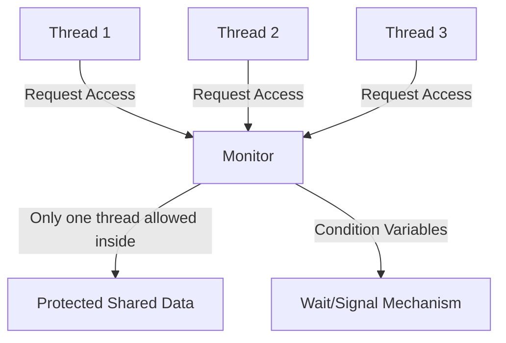

# Monitors

## Introduction

When multiple threads or processes work with shared resources, we need mechanisms to coordinate their access and prevent race conditions, deadlocks, and data corruption. **Monitors** are one such high-level synchronization construct that encapsulate:

1. Shared data structures
2. Procedures that operate on those data structures
3. Synchronization between concurrent threads accessing this data

Monitors provide a way to ensure that only one thread can be active within the monitor at a time, making them an elegant solution for handling concurrency issues.

## What is a Monitor?

A monitor is a synchronization construct that allows threads to have both **mutual exclusion** (via a built-in lock) and the ability to **wait** for a certain condition to become true. Monitors protect shared data from concurrent access by multiple threads.

The key characteristics of monitors include:

- **Data encapsulation**: Variables that need synchronized access are kept within the monitor
- **Mutual exclusion**: Only one thread can execute within the monitor at any time
- **Condition synchronization**: Threads can wait for specific conditions and be notified when those conditions change



## Monitor Components

A typical monitor consists of:

1. **Shared variables**: The data that needs protection
2. **Entry procedures**: Methods that threads can call to access shared data
3. **Condition variables**: Special variables for thread coordination
4. **Queue management**: Mechanisms for threads to wait and be signaled

### Condition Variables

Condition variables allow threads to:
- **Wait**: When a required condition isn't met
- **Signal/Notify**: When a condition changes, allowing waiting threads to proceed

## Implementing Monitors

Different languages implement monitors in various ways:

### Java's Implementation

In Java, every object has an intrinsic lock, and the `synchronized` keyword is used to implement monitor behavior:

```java
public class BoundedBuffer {
    private final int[] buffer = new int[10];
    private int count = 0, in = 0, out = 0;
    
    public synchronized void produce(int value) throws InterruptedException {
        while (count == buffer.length) {
            // Buffer is full, wait until space is available
            wait();
        }
        
        buffer[in] = value;
        in = (in + 1) % buffer.length;
        count++;
        
        // Notify consumer that data is available
        notify();
    }
    
    public synchronized int consume() throws InterruptedException {
        while (count == 0) {
            // Buffer is empty, wait until data is available
            wait();
        }
        
        int value = buffer[out];
        out = (out + 1) % buffer.length;
        count--;
        
        // Notify producer that space is available
        notify();
        
        return value;
    }
}
```

Let's trace through an example execution:

```
// Initially: empty buffer, count = 0

Thread A calls produce(42):
  - Enters monitor (acquires lock)
  - count == 0, buffer not full
  - Adds 42 to buffer[0]
  - in = 1, count = 1
  - Calls notify()
  - Exits monitor (releases lock)

Thread B calls consume():
  - Enters monitor (acquires lock)
  - count == 1, buffer not empty
  - Gets value 42 from buffer[0]
  - out = 1, count = 0
  - Calls notify()
  - Returns 42
  - Exits monitor (releases lock)

Thread C calls consume():
  - Enters monitor (acquires lock)
  - count == 0, buffer is empty
  - Calls wait() (releases lock and suspends)
  
Thread D calls produce(100):
  - Enters monitor (acquires lock)
  - count == 0, buffer not full
  - Adds 100 to buffer[0]
  - in = 1, count = 1
  - Calls notify() (Thread C is awakened)
  - Exits monitor (releases lock)

Thread C (resuming):
  - Re-acquires lock
  - Continues from wait()
  - Gets value 100 from buffer[0]
  - out = 1, count = 0
  - Calls notify()
  - Returns 100
  - Exits monitor (releases lock)
```

### Python's Implementation

Python provides a similar mechanism through the `threading` module:

```python
import threading

class BoundedBuffer:
    def __init__(self, size):
        self.buffer = [0] * size
        self.count = 0
        self.in_idx = 0
        self.out_idx = 0
        self.mutex = threading.Lock()
        self.not_full = threading.Condition(self.mutex)
        self.not_empty = threading.Condition(self.mutex)
    
    def produce(self, value):
        with self.mutex:
            while self.count == len(self.buffer):
                self.not_full.wait()
            
            self.buffer[self.in_idx] = value
            self.in_idx = (self.in_idx + 1) % len(self.buffer)
            self.count += 1
            
            self.not_empty.notify()
    
    def consume(self):
        with self.mutex:
            while self.count == 0:
                self.not_empty.wait()
            
            value = self.buffer[self.out_idx]
            self.out_idx = (self.out_idx + 1) % len(self.buffer)
            self.count -= 1
            
            self.not_full.notify()
            return value
```

## Real-world Applications of Monitors

Monitors are widely used in many practical scenarios:

### 1. Database Connection Pools

Connection pools manage a limited set of database connections shared among multiple clients:

```java
public class ConnectionPool {
    private final List<Connection> availableConnections;
    private final int maxConnections;
    
    public ConnectionPool(int maxConnections) {
        this.maxConnections = maxConnections;
        this.availableConnections = new ArrayList<>(maxConnections);
        // Initialize connections...
    }
    
    public synchronized Connection getConnection() throws InterruptedException {
        while (availableConnections.isEmpty()) {
            // No connections available, wait
            wait();
        }
        
        Connection connection = availableConnections.remove(0);
        return connection;
    }
    
    public synchronized void releaseConnection(Connection connection) {
        availableConnections.add(connection);
        // Notify waiting threads that a connection is available
        notify();
    }
}
```

### 2. Thread-safe Caches

A monitor-protected cache ensures consistent access to cached items:

```java
public class SimpleCache<K, V> {
    private final Map<K, V> cache = new HashMap<>();
    private final int capacity;
    
    public SimpleCache(int capacity) {
        this.capacity = capacity;
    }
    
    public synchronized V get(K key) {
        return cache.get(key);
    }
    
    public synchronized void put(K key, V value) {
        if (cache.size() >= capacity && !cache.containsKey(key)) {
            // Remove an entry if full
            Iterator<K> it = cache.keySet().iterator();
            if (it.hasNext()) {
                it.next();
                it.remove();
            }
        }
        cache.put(key, value);
    }
}
```

### 3. Job Queue Processor

A job queue that allows tasks to be added and processed:

```java
public class JobQueue {
    private final Queue<Runnable> jobs = new LinkedList<>();
    private boolean isShutdown = false;
    
    public synchronized void addJob(Runnable job) {
        if (isShutdown) {
            throw new IllegalStateException("Queue is shutdown");
        }
        
        jobs.add(job);
        notify(); // Wake up a worker if any are waiting
    }
    
    public synchronized Runnable getJob() throws InterruptedException {
        while (jobs.isEmpty() && !isShutdown) {
            wait(); // Wait for a job to be added
        }
        
        if (jobs.isEmpty()) {
            return null; // Queue is empty and shutdown
        }
        
        return jobs.remove();
    }
    
    public synchronized void shutdown() {
        isShutdown = true;
        notifyAll(); // Wake up all waiting threads
    }
}
```

## Advantages and Limitations of Monitors

### Advantages

1. **Encapsulation**: Data and the operations on it are bundled together
2. **Simplicity**: Easier to use correctly than lower-level primitives
3. **Structured approach**: Clear boundaries for critical sections
4. **Condition synchronization**: Built-in mechanism for threads to wait for conditions

### Limitations

1. **Potential for deadlocks**: If monitors are nested improperly
2. **Performance overhead**: Due to lock acquisition/release
3. **Limited expressiveness**: Some complex synchronization patterns can be cumbersome
4. **Nested monitor problem**: Issues with waiting in nested monitor calls

## Monitor vs. Semaphores

| Feature | Monitors | Semaphores |
|---------|----------|------------|
| Level | High-level construct | Relatively lower-level primitive |
| Encapsulation | Encapsulates data and operations | Just a synchronization mechanism |
| Usage complexity | Generally easier to use correctly | Easier to make mistakes |
| Condition variables | Built-in wait/notify mechanism | Must be built using semaphores |
| Error-proneness | Less error-prone | More error-prone |

## Common Issues and Best Practices

### Deadlock Prevention

To avoid deadlocks when using monitors:

1. **Avoid nested monitor calls**: Minimize calling a monitor method from within another
2. **Maintain consistent lock ordering**: If multiple monitors must be acquired, always acquire them in the same order
3. **Use timeouts**: Consider using timed waits to prevent indefinite blocking

### Performance Considerations

To optimize monitor performance:

1. **Minimize critical section length**: Keep synchronized blocks as short as possible
2. **Use fine-grained locking**: Lock at the smallest scope necessary
3. **Consider read/write locks**: For read-heavy workloads
4. **Be careful with notifyAll()**: Use notify() when only one thread needs to be awakened

## Summary

Monitors are a powerful synchronization mechanism that combines mutual exclusion with condition synchronization. They encapsulate data with the operations that manipulate it, ensuring thread-safe access.

Key points to remember:

- Monitors enforce mutual exclusion automatically
- Condition variables allow threads to wait for specific conditions
- Monitors are implemented in various languages (synchronized in Java, with statements in Python)
- Common applications include connection pools, caches, and job queues
- Care must be taken to avoid deadlocks and performance issues

## Exercises

1. Implement a monitor-based solution for the readers-writers problem, where multiple readers can access a resource simultaneously, but writers need exclusive access.

2. Create a thread-safe counter class using monitor principles that supports increment, decrement, and getValue operations.

3. Modify the BoundedBuffer example to include a timeout when waiting, to prevent indefinite blocking.

4. Implement a monitor-based solution for the dining philosophers problem to prevent deadlocks.

## Additional Resources

- Operating Systems Concepts by Silberschatz, Galvin, and Gagne
- Java Concurrency in Practice by Brian Goetz
- The Art of Multiprocessor Programming by Maurice Herlihy and Nir Shavit

These resources will help you deepen your understanding of monitors and concurrent programming in general.