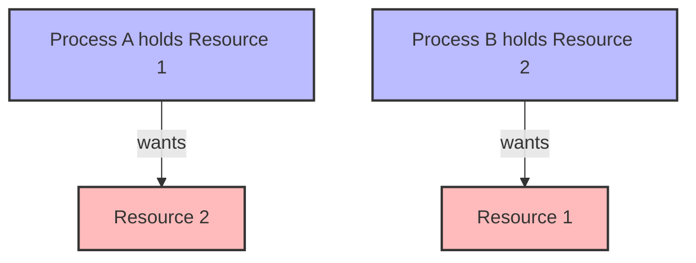
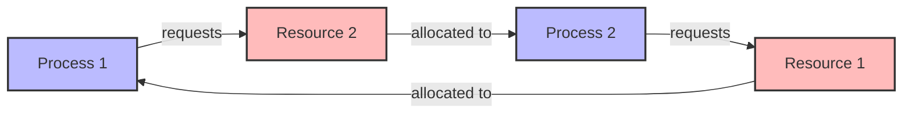

# Understanding Deadlocks

## Introduction

Imagine two people standing in a narrow hallway, each needing to pass by the other, but neither willing to step aside first. They're stuck in a standoff where neither can progress. In computer programming, we call this situation a **deadlock**.

A deadlock occurs when two or more processes are unable to proceed because each is waiting for resources held by another process. This creates a circular waiting condition where none of the processes can continue execution. Deadlocks are particularly common in concurrent programming environments where multiple processes or threads compete for shared resources.

## What Causes a Deadlock?

For a deadlock to occur, four conditions (known as the Coffman conditions) must be present simultaneously:

1. **Mutual Exclusion**: At least one resource must be held in a non-sharable mode, meaning that only one process can use the resource at a time.

2. **Hold and Wait**: A process must be holding at least one resource while waiting to acquire additional resources held by other processes.

3. **No Preemption**: Resources cannot be forcibly taken away from a process; they must be released voluntarily.

4. **Circular Wait**: A circular chain of processes exists, where each process holds resources that are requested by the next process in the chain.

Let's visualize these conditions with a diagram:



## A Simple Deadlock Example

Here's a classic example using two threads and two locks:

```java
// Two resources (locks)
Object lock1 = new Object();
Object lock2 = new Object();

// Thread 1
Thread thread1 = new Thread(() -> {
    synchronized (lock1) {
        System.out.println("Thread 1: Holding lock 1...");
        
        try { Thread.sleep(100); }
        catch (InterruptedException e) {}
        
        System.out.println("Thread 1: Waiting for lock 2...");
        
        synchronized (lock2) {
            System.out.println("Thread 1: Holding lock 1 and lock 2...");
        }
    }
});

// Thread 2
Thread thread2 = new Thread(() -> {
    synchronized (lock2) {
        System.out.println("Thread 2: Holding lock 2...");
        
        try { Thread.sleep(100); }
        catch (InterruptedException e) {}
        
        System.out.println("Thread 2: Waiting for lock 1...");
        
        synchronized (lock1) {
            System.out.println("Thread 2: Holding lock 1 and lock 2...");
        }
    }
});

thread1.start();
thread2.start();
```

Output (When a deadlock occurs):
```
Thread 1: Holding lock 1...
Thread 2: Holding lock 2...
Thread 1: Waiting for lock 2...
Thread 2: Waiting for lock 1...
```

Notice how the program never completes - both threads are stuck waiting for a resource the other thread holds.

## Real-World Examples of Deadlocks

### Database Transactions

Consider two database transactions:

```sql
-- Transaction 1
BEGIN TRANSACTION;
UPDATE accounts SET balance = balance - 100 WHERE account_id = 1;
-- Transaction 1 now holds a lock on account 1
-- Some processing time...
UPDATE accounts SET balance = balance + 100 WHERE account_id = 2;
COMMIT;

-- Transaction 2 (executing concurrently)
BEGIN TRANSACTION;
UPDATE accounts SET balance = balance - 200 WHERE account_id = 2;
-- Transaction 2 now holds a lock on account 2
-- Some processing time...
UPDATE accounts SET balance = balance + 200 WHERE account_id = 1;
COMMIT;
```

If both transactions execute the first UPDATE statement before either reaches the second UPDATE, we have a deadlock:
- Transaction 1 holds a lock on account 1 and needs account 2
- Transaction 2 holds a lock on account 2 and needs account 1

### Operating System Resource Allocation

Consider processes requesting access to devices:

```
Process A holds Printer and requests Scanner
Process B holds Scanner and requests Printer
```

Neither process can continue, resulting in a deadlock.

## Deadlock Detection

How can we detect if a deadlock has occurred? One common approach is to use a **resource allocation graph**:



If a cycle exists in this graph, a deadlock may exist.

Here's a simple algorithm in pseudocode to detect deadlocks:

```python
def detect_deadlock(resources, processes):
    # Create an array to track which processes are finished
    finished = [False] * len(processes)
    
    # Find an unfinished process that can have all its resource needs satisfied
    work = available_resources.copy()
    
    while True:
        found = False
        
        for i in range(len(processes)):
            if not finished[i] and can_finish(processes[i], work):
                # Process can complete
                finished[i] = True
                found = True
                
                # Release its resources
                work += allocated_resources[i]
        
        if not found:
            break
    
    # If any process is not finished, we have a deadlock
    return any(not f for f in finished)
```

## Deadlock Prevention Strategies

### 1. Prevent Mutual Exclusion

- When possible, use resources that can be shared (like read-only files).
- This is often impossible for many resources.

### 2. Prevent Hold and Wait

Require processes to request all resources before starting execution:

```java
public void process() {
    // Request all resources at once
    synchronized(lock1) {
        synchronized(lock2) {
            // Use both resources
        }
    }
}
```

### 3. Allow Preemption

Design the system to allow resources to be forcibly taken from processes:

```java
public void tryOperation() {
    boolean getLock1 = false;
    boolean getLock2 = false;
    
    try {
        getLock1 = lock1.tryLock(100, TimeUnit.MILLISECONDS);
        if (getLock1) {
            getLock2 = lock2.tryLock(100, TimeUnit.MILLISECONDS);
        }
        
        if (getLock1 && getLock2) {
            // Perform the operation with both resources
        }
    } catch (InterruptedException e) {
        // Handle exception
    } finally {
        // Release any acquired locks
        if (getLock2) lock2.unlock();
        if (getLock1) lock1.unlock();
    }
}
```

### 4. Prevent Circular Wait

Establish a global ordering of resources and require processes to request resources in that order:

```java
// Assuming lock1 has a "lower" order than lock2
public void process() {
    synchronized(lock1) {
        synchronized(lock2) {
            // Use both resources
        }
    }
}

// All threads must follow the same order
public void anotherProcess() {
    // This maintains the same order: lock1 first, then lock2
    synchronized(lock1) {
        synchronized(lock2) {
            // Use both resources
        }
    }
}
```

## Deadlock Avoidance

We can also use algorithms to avoid deadlocks at runtime. The most famous is the **Banker's Algorithm**, which decides whether granting a resource request might lead to a deadlock.

Here's a simplified pseudocode explanation:

```python
def is_safe_state(available, max_need, allocation):
    # Check if the system is in a safe state
    
    # Calculate remaining need for each process
    need = max_need - allocation
    
    # Create working copy of available resources
    work = available.copy()
    
    # Track which processes can finish
    finish = [False] * num_processes
    
    # Find an unfinished process that can have its needs met
    while True:
        found = False
        
        for p in range(num_processes):
            if not finish[p] and need[p] <= work:
                # Process p can complete with available resources
                work += allocation[p]  # Release its resources
                finish[p] = True
                found = True
                break
        
        if not found:
            break
    
    # If all processes can finish, the state is safe
    return all(finish)
```

## Best Practices to Avoid Deadlocks

1. **Consistent Lock Ordering**: Always acquire locks in the same order in all threads.

2. **Lock Timeouts**: Use lock acquisition with timeouts instead of indefinite waiting.

3. **Single-Thread Ownership**: Design components so only one thread needs to lock multiple resources.

4. **Fine-Grained Locking**: Lock at the smallest scope possible.

5. **Deadlock Detection**: Implement runtime deadlock detection in critical systems.

6. **Lock-Free Algorithms**: When possible, use lock-free algorithms and data structures.

## Example: Fixing Our Deadlock

Let's fix our earlier Java example by enforcing a consistent lock order:

```java
// Two resources (locks)
Object lock1 = new Object();
Object lock2 = new Object();

// Thread 1 - now acquires locks in order: lock1 then lock2
Thread thread1 = new Thread(() -> {
    synchronized (lock1) {
        System.out.println("Thread 1: Holding lock 1...");
        
        try { Thread.sleep(100); }
        catch (InterruptedException e) {}
        
        System.out.println("Thread 1: Waiting for lock 2...");
        
        synchronized (lock2) {
            System.out.println("Thread 1: Holding lock 1 and lock 2...");
        }
    }
});

// Thread 2 - now acquires locks in the SAME order: lock1 then lock2
Thread thread2 = new Thread(() -> {
    synchronized (lock1) {
        System.out.println("Thread 2: Holding lock 1...");
        
        try { Thread.sleep(100); }
        catch (InterruptedException e) {}
        
        System.out.println("Thread 2: Waiting for lock 2...");
        
        synchronized (lock2) {
            System.out.println("Thread 2: Holding lock 1 and lock 2...");
        }
    }
});

thread1.start();
thread2.start();
```

Output (With fixed code):
```
Thread 1: Holding lock 1...
Thread 1: Waiting for lock 2...
Thread 1: Holding lock 1 and lock 2...
Thread 2: Holding lock 1...
Thread 2: Waiting for lock 2...
Thread 2: Holding lock 1 and lock 2...
```

Now both threads complete because they acquire locks in the same order, preventing the circular wait condition.

## Summary

Deadlocks occur when processes get stuck waiting for resources held by each other, creating a circular dependency where no progress is possible. The four conditions necessary for a deadlock are mutual exclusion, hold and wait, no preemption, and circular wait.

We can prevent deadlocks through careful resource allocation strategies, detect them using resource allocation graphs, and avoid them with algorithms like the Banker's Algorithm.

In practice, consistent lock ordering, timeouts, and fine-grained locking are effective strategies to minimize deadlock risk in concurrent programs.

## Exercises

1. Identify the four necessary conditions for a deadlock in the following scenarios:
   - Two database transactions updating the same two rows
   - Multiple threads acquiring locks on shared resources
   - Processes waiting for file access

2. Modify the deadlock example code to use `tryLock()` with a timeout to prevent indefinite waiting.

3. Design a system that transfers money between accounts while avoiding deadlocks.

4. Implement a simplified version of the Banker's Algorithm to determine if a given resource allocation state is safe.

## Additional Resources

- "Operating System Concepts" by Silberschatz, Galvin, and Gagne
- "Java Concurrency in Practice" by Brian Goetz
- "The Art of Multiprocessor Programming" by Maurice Herlihy and Nir Shavit