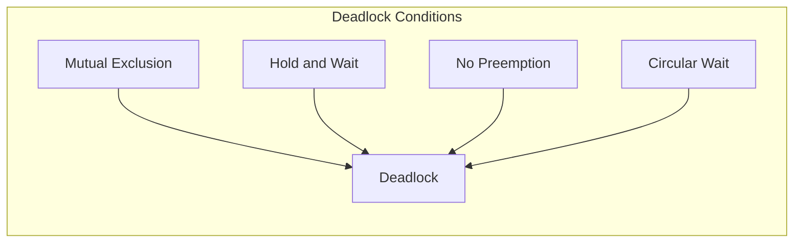

# Deadlock Avoidance

## Introduction

When multiple processes or threads compete for limited resources in a concurrent system, a critical problem can arise: **deadlock**. A deadlock occurs when two or more processes are unable to proceed because each is waiting for resources held by another. Like a traffic gridlock where no car can move forward, deadlocked processes remain frozen indefinitely without external intervention.

Deadlock avoidance is a proactive strategy that prevents deadlocks from occurring in the first place. Unlike deadlock detection (which identifies deadlocks after they've occurred) or deadlock recovery (which breaks deadlocks after detection), avoidance techniques ensure that the system never enters an unsafe state where deadlocks become possible.

## Understanding Deadlock Conditions

For a deadlock to occur, four conditions must be present simultaneously:

1. **Mutual Exclusion**: At least one resource must be held in a non-sharable mode, meaning only one process can use it at a time.
2. **Hold and Wait**: Processes already holding resources can request additional resources.
3. **No Preemption**: Resources cannot be forcibly taken away from processes; they must be released voluntarily.
4. **Circular Wait**: A circular chain of two or more processes exists, where each process is waiting for a resource held by the next process in the chain.

To visualize these conditions, let's use a diagram:



## Banker's Algorithm: A Key Deadlock Avoidance Technique

The Banker's Algorithm, proposed by Edsger Dijkstra, is the most famous deadlock avoidance algorithm. It works by simulating the allocation of resources to processes and checking if the resulting state is safe.

### Key Concepts

- **Available Resources**: The number of available instances for each resource type
- **Maximum Demand**: The maximum number of resources each process might request
- **Allocation**: The number of resources currently allocated to each process
- **Need**: The remaining resources each process might request (Maximum - Allocation)

### How the Banker's Algorithm Works

1. When a process requests resources, the system pretends to allocate them
2. It then checks if the resulting state is "safe" (can all processes finish?)
3. If safe, the allocation proceeds; if unsafe, the process waits

A state is considered **safe** if there exists a sequence in which all processes can complete without causing deadlock.

### Example Implementation

Let's implement the Banker's Algorithm in Python:

```python
def bankers_algorithm(available, maximum, allocation):
    # Calculate need matrix
    n_processes = len(maximum)
    n_resources = len(available)
    need = []
    for i in range(n_processes):
        process_need = []
        for j in range(n_resources):
            process_need.append(maximum[i][j] - allocation[i][j])
        need.append(process_need)
    
    # Initialize variables for the safety algorithm
    work = available.copy()
    finish = [False] * n_processes
    safe_sequence = []
    
    # Find a safe sequence
    while True:
        found = False
        for i in range(n_processes):
            if not finish[i]:
                # Check if all needs can be satisfied
                if all(need[i][j] <= work[j] for j in range(n_resources)):
                    # Process can complete, add its resources back to work
                    for j in range(n_resources):
                        work[j] += allocation[i][j]
                    safe_sequence.append(i)
                    finish[i] = True
                    found = True
        
        if not found:
            break
    
    # If all processes are in the safe sequence, the state is safe
    if len(safe_sequence) == n_processes:
        return True, safe_sequence
    else:
        return False, []

# Example usage
available = [3, 3, 2]  # Available instances of resources A, B, C
maximum = [
    [7, 5, 3],  # Maximum resources Process 0 might request
    [3, 2, 2],  # Maximum resources Process 1 might request
    [9, 0, 2],  # Maximum resources Process 2 might request
    [2, 2, 2],  # Maximum resources Process 3 might request
    [4, 3, 3]   # Maximum resources Process 4 might request
]
allocation = [
    [0, 1, 0],  # Resources currently allocated to Process 0
    [2, 0, 0],  # Resources currently allocated to Process 1
    [3, 0, 2],  # Resources currently allocated to Process 2
    [2, 1, 1],  # Resources currently allocated to Process 3
    [0, 0, 2]   # Resources currently allocated to Process 4
]

is_safe, sequence = bankers_algorithm(available, maximum, allocation)
if is_safe:
    print(f"System is in a safe state with safe sequence: {sequence}")
else:
    print("System is in an unsafe state!")
```

**Output:**
```
System is in a safe state with safe sequence: [1, 3, 4, 0, 2]
```

This output means the system can safely complete all processes without deadlock if it executes them in the order: Process 1 → Process 3 → Process 4 → Process 0 → Process 2.

## Resource Allocation Graph

Another approach to deadlock avoidance involves using a resource allocation graph with a "claim edge" extension.

- **Request Edge**: Process → Resource (P → R)
- **Assignment Edge**: Resource → Process (R → P)
- **Claim Edge**: Dotted edge showing future requests (P ⇢ R)

The system maintains the graph and only grants requests if they won't create cycles that include claim edges.

## Practical Implementation Strategies

### 1. Lock Hierarchies

Establish a global ordering of resources and require that processes request them in ascending order.

```java
public class BankAccount {
    private final int id;
    private double balance;
    private final Object lock = new Object();
    
    public BankAccount(int id, double initialBalance) {
        this.id = id;
        this.balance = initialBalance;
    }
    
    public void transferTo(BankAccount destination, double amount) {
        // Always lock accounts in order of their ID to prevent deadlock
        BankAccount firstLock = this.id < destination.id ? this : destination;
        BankAccount secondLock = this.id < destination.id ? destination : this;
        
        synchronized(firstLock.lock) {
            System.out.println("Acquired lock on " + firstLock.id);
            synchronized(secondLock.lock) {
                System.out.println("Acquired lock on " + secondLock.id);
                
                if (this.balance >= amount) {
                    this.balance -= amount;
                    destination.balance += amount;
                    System.out.println("Transferred " + amount + " from " + this.id + " to " + destination.id);
                } else {
                    System.out.println("Insufficient funds in account " + this.id);
                }
            }
        }
    }
}
```

### 2. Timeout-Based Acquisition

Set timeouts when acquiring locks to break potential deadlocks.

```python
import threading
import time

class Resource:
    def __init__(self, name):
        self.name = name
        self.lock = threading.RLock()
    
    def acquire(self, timeout=1.0):
        result = self.lock.acquire(timeout=timeout)
        if result:
            print(f"Acquired {self.name}")
        else:
            print(f"Failed to acquire {self.name}")
        return result
    
    def release(self):
        self.lock.release()
        print(f"Released {self.name}")

def worker(resource1, resource2):
    if resource1.acquire():
        time.sleep(0.2)  # Simulate work
        if not resource2.acquire():
            print("Potential deadlock detected, releasing first resource")
            resource1.release()
            return
        
        # Do work with both resources
        print(f"Working with {resource1.name} and {resource2.name}")
        time.sleep(0.5)
        
        # Release in reverse order
        resource2.release()
        resource1.release()

# Create resources
resource_a = Resource("Resource A")
resource_b = Resource("Resource B")

# Create threads
thread1 = threading.Thread(target=worker, args=(resource_a, resource_b))
thread2 = threading.Thread(target=worker, args=(resource_b, resource_a))

# Start threads
thread1.start()
thread2.start()

# Wait for threads to finish
thread1.join()
thread2.join()
```

### 3. Try-Lock Pattern

Attempt to acquire all locks before proceeding, and release all if any acquisition fails.

```java
import java.util.concurrent.locks.Lock;
import java.util.concurrent.locks.ReentrantLock;

public class TryLockExample {
    public static void transferMoney(Account fromAccount, Account toAccount, double amount) {
        Lock fromLock = fromAccount.getLock();
        Lock toLock = toAccount.getLock();
        
        while (true) {
            // Try to acquire both locks
            boolean fromLockAcquired = false;
            boolean toLockAcquired = false;
            
            try {
                fromLockAcquired = fromLock.tryLock();
                toLockAcquired = toLock.tryLock();
                
                if (fromLockAcquired && toLockAcquired) {
                    // We have both locks, perform the transfer
                    if (fromAccount.getBalance() < amount) {
                        System.out.println("Insufficient funds");
                        return;
                    }
                    
                    fromAccount.debit(amount);
                    toAccount.credit(amount);
                    System.out.println("Transfer successful");
                    return;  // Exit the method after successful transfer
                }
            } finally {
                // Release any acquired locks
                if (fromLockAcquired) fromLock.unlock();
                if (toLockAcquired) toLock.unlock();
            }
            
            // If we couldn't get both locks, wait briefly and retry
            try {
                Thread.sleep(100);  // Add randomization in real applications
            } catch (InterruptedException e) {
                Thread.currentThread().interrupt();
                return;
            }
        }
    }
}

class Account {
    private double balance;
    private final Lock lock = new ReentrantLock();
    
    public Account(double initialBalance) {
        this.balance = initialBalance;
    }
    
    public Lock getLock() {
        return lock;
    }
    
    public double getBalance() {
        return balance;
    }
    
    public void debit(double amount) {
        balance -= amount;
    }
    
    public void credit(double amount) {
        balance += amount;
    }
}
```

## Real-World Applications

### 1. Database Transaction Management

Database systems use deadlock avoidance techniques to manage concurrent transactions. For example, PostgreSQL employs timeout-based deadlock detection and resolution.

```sql
-- Setting a transaction timeout
SET statement_timeout = '5s';

-- Begin transaction
BEGIN;

-- Lock a table
LOCK TABLE accounts IN EXCLUSIVE MODE;

-- Perform operations
UPDATE accounts SET balance = balance - 100 WHERE id = 1;
UPDATE accounts SET balance = balance + 100 WHERE id = 2;

-- Commit transaction
COMMIT;
```

### 2. Operating System Resource Management

Operating systems must carefully manage resources like memory, file handles, and I/O devices among competing processes.

### 3. Distributed Systems

In distributed systems, deadlock avoidance becomes even more critical as resources are spread across multiple nodes.

```python
import redis
import time

class DistributedLock:
    def __init__(self, redis_client, lock_name, expiry=10):
        self.redis = redis_client
        self.lock_name = lock_name
        self.expiry = expiry
        self._lock_value = str(time.time())
    
    def acquire(self, timeout=5):
        end_time = time.time() + timeout
        while time.time() < end_time:
            # Try to acquire the lock with an expiration
            if self.redis.set(self.lock_name, self._lock_value, nx=True, ex=self.expiry):
                return True
            time.sleep(0.1)
        return False
    
    def release(self):
        # Only release the lock if we own it
        script = """
        if redis.call('get', KEYS[1]) == ARGV[1] then
            return redis.call('del', KEYS[1])
        else
            return 0
        end
        """
        self.redis.eval(script, 1, self.lock_name, self._lock_value)
```

## Best Practices for Deadlock Avoidance

1. **Request all resources at once** when possible to prevent hold-and-wait.
2. **Release resources quickly** after use.
3. **Use resource ordering** to prevent circular wait.
4. **Implement timeouts** on resource acquisitions.
5. **Design for independence** by minimizing shared resources.
6. **Use higher-level abstractions** like thread pools or work queues that handle synchronization internally.
7. **Monitor and detect** potential deadlock situations in production.

## Summary

Deadlock avoidance is a critical concept in concurrent programming that prevents processes from entering states that could lead to deadlocks. The key approaches include:

- The Banker's Algorithm for checking if resource allocations maintain a safe state
- Resource ordering techniques to prevent circular wait
- Timeout and try-lock patterns to avoid indefinite blocking
- Practical implementations in various real-world scenarios

These techniques ensure that concurrent systems can operate efficiently without experiencing the catastrophic effects of deadlocks. By understanding and applying these concepts, you can develop robust concurrent applications that make effective use of system resources.

## Exercises

1. Implement the Banker's Algorithm and test it with different resource allocation scenarios.
2. Modify the lock hierarchy example to handle transfers between three accounts.
3. Create a simulation that demonstrates how timeouts can prevent deadlocks in a system with multiple resources.
4. Design a database schema and transactions that might be prone to deadlocks, then implement safeguards against them.
5. Research and compare deadlock avoidance strategies used in different database management systems.

## Additional Resources

- "Operating System Concepts" by Silberschatz, Galvin, and Gagne
- "Java Concurrency in Practice" by Brian Goetz
- "The Art of Multiprocessor Programming" by Maurice Herlihy and Nir Shavit
- Online documentation for concurrent programming in your favorite language