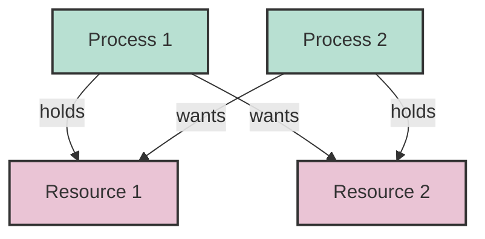
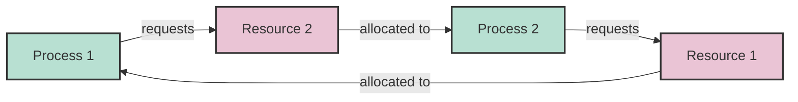
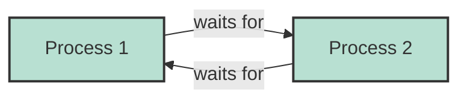

# Deadlock Detection

## Introduction

Imagine four cars arriving at a four-way intersection at the same time. Each driver wants to turn left, so they pull into the intersection and wait for the car on their left to move. But since everyone is waiting, nobody can move! This is a real-world deadlock - a situation where two or more processes are unable to proceed because each is waiting for resources held by another.

In concurrent programming, deadlocks occur when multiple threads or processes are waiting for each other to release resources, creating a circular wait condition. Deadlock detection is the process of identifying these situations so they can be resolved, allowing your program to continue execution.

## Understanding Deadlocks

### What Causes Deadlocks?

For a deadlock to occur, four conditions (known as the Coffman conditions) must be present simultaneously:

1. **Mutual Exclusion**: At least one resource must be held in a non-sharable mode.
2. **Hold and Wait**: Processes hold resources while waiting for additional ones.
3. **No Preemption**: Resources cannot be forcibly taken from processes.
4. **Circular Wait**: A circular chain of processes exists, where each process holds resources needed by the next.

### Visualizing a Deadlock

Let's visualize a simple deadlock scenario with a diagram:



In this scenario:
- Process 1 holds Resource 1 and needs Resource 2 to proceed
- Process 2 holds Resource 2 and needs Resource 1 to proceed
- Neither process can continue, resulting in a deadlock

## Deadlock Detection Techniques

### 1. Resource Allocation Graph

One of the simplest ways to detect deadlocks is using a Resource Allocation Graph (RAG). This directed graph represents the relationships between processes and resources.

- Vertices represent processes and resources
- Edges represent request and allocation relationships
- A cycle in the graph may indicate a deadlock



### 2. Wait-For Graph

A wait-for graph simplifies the resource allocation graph by only showing relationships between processes.



### 3. Banker's Algorithm

The Banker's Algorithm is a more sophisticated approach that can help prevent deadlocks by determining if a system state is safe or unsafe. It's based on the idea of having enough resources to satisfy at least one process's maximum needs.

## Implementing Deadlock Detection

Let's look at how to implement a simple deadlock detection system in Java using a resource allocation graph approach:

```java
class DeadlockDetector {
    private boolean[][] allocationMatrix; // Resources allocated to processes
    private boolean[][] requestMatrix;    // Resources requested by processes
    private int numProcesses;
    private int numResources;
    
    public DeadlockDetector(int numProcesses, int numResources) {
        this.numProcesses = numProcesses;
        this.numResources = numResources;
        allocationMatrix = new boolean[numProcesses][numResources];
        requestMatrix = new boolean[numProcesses][numResources];
    }
    
    // Record that process p has been allocated resource r
    public void allocate(int p, int r) {
        allocationMatrix[p][r] = true;
    }
    
    // Record that process p has requested resource r
    public void request(int p, int r) {
        requestMatrix[p][r] = true;
    }
    
    // Release a resource previously allocated to a process
    public void release(int p, int r) {
        allocationMatrix[p][r] = false;
        requestMatrix[p][r] = false;
    }
    
    // Check if the system is in a deadlocked state
    public boolean hasDeadlock() {
        // Build wait-for graph
        boolean[][] waitForGraph = new boolean[numProcesses][numProcesses];
        
        // For each process p1 that's requesting a resource r...
        for (int p1 = 0; p1 < numProcesses; p1++) {
            for (int r = 0; r < numResources; r++) {
                if (requestMatrix[p1][r]) {
                    // Find all processes p2 that have been allocated this resource
                    for (int p2 = 0; p2 < numProcesses; p2++) {
                        if (allocationMatrix[p2][r]) {
                            // p1 is waiting for p2
                            waitForGraph[p1][p2] = true;
                        }
                    }
                }
            }
        }
        
        // Check for cycles in the wait-for graph
        return hasCycle(waitForGraph);
    }
    
    // Check if there's a cycle in the wait-for graph
    private boolean hasCycle(boolean[][] graph) {
        boolean[] visited = new boolean[numProcesses];
        boolean[] recursionStack = new boolean[numProcesses];
        
        // Start DFS from each process
        for (int i = 0; i < numProcesses; i++) {
            if (detectCycleUtil(graph, i, visited, recursionStack)) {
                return true;
            }
        }
        
        return false;
    }
    
    private boolean detectCycleUtil(boolean[][] graph, int v, boolean[] visited, boolean[] recursionStack) {
        // Mark the current node as visited and part of recursion stack
        if (recursionStack[v]) {
            return true;
        }
        
        if (visited[v]) {
            return false;
        }
        
        visited[v] = true;
        recursionStack[v] = true;
        
        // Recur for all neighbors
        for (int i = 0; i < numProcesses; i++) {
            if (graph[v][i] && detectCycleUtil(graph, i, visited, recursionStack)) {
                return true;
            }
        }
        
        recursionStack[v] = false;
        return false;
    }
}
```

### Example Usage

Let's see how we might use this detector:

```java
public class DeadlockExample {
    public static void main(String[] args) {
        // Create a detector with 3 processes and 2 resources
        DeadlockDetector detector = new DeadlockDetector(3, 2);
        
        // Process 0 is allocated Resource 0
        detector.allocate(0, 0);
        // Process 1 is allocated Resource 1
        detector.allocate(1, 1);
        
        // Process 0 requests Resource 1
        detector.request(0, 1);
        // Process 1 requests Resource 0
        detector.request(1, 0);
        
        // Check for deadlock
        if (detector.hasDeadlock()) {
            System.out.println("Deadlock detected!");
        } else {
            System.out.println("No deadlock.");
        }
    }
}
```

**Output:**
```
Deadlock detected!
```

## Practical Example: Database Transaction Deadlocks

Database management systems often encounter deadlocks when multiple transactions are competing for the same resources. Here's a real-world example with SQL transactions:

### Scenario:
- Transaction A updates row 1, then tries to update row 2
- Transaction B updates row 2, then tries to update row 1

```sql
-- Transaction A
BEGIN TRANSACTION;
UPDATE accounts SET balance = balance - 100 WHERE id = 1;
-- At this point, Transaction A holds a lock on row 1
-- Meanwhile, Transaction B has locked row 2
UPDATE accounts SET balance = balance + 100 WHERE id = 2;
-- This will wait for Transaction B to release the lock on row 2
COMMIT;

-- Transaction B (running concurrently)
BEGIN TRANSACTION;
UPDATE accounts SET balance = balance - 200 WHERE id = 2;
-- At this point, Transaction B holds a lock on row 2
UPDATE accounts SET balance = balance + 200 WHERE id = 1;
-- This will wait for Transaction A to release the lock on row 1
COMMIT;
```

This creates a classic deadlock. Most databases have built-in deadlock detection that will automatically roll back one of the transactions after a timeout period.

## Resolving Deadlocks

Once a deadlock is detected, several strategies can be employed to resolve it:

1. **Process Termination**: Terminate one or more processes involved in the deadlock
2. **Resource Preemption**: Temporarily take resources away from processes
3. **Rollback**: Return the system to a previous safe state
4. **Timeout**: Set timeouts for resource requests

### Example: Java's Deadlock Detection

Java provides tools like jstack and jconsole to detect deadlocks in running applications.

```java
public class DeadlockDemo {
    private static final Object lock1 = new Object();
    private static final Object lock2 = new Object();
    
    public static void main(String[] args) {
        Thread thread1 = new Thread(() -> {
            synchronized (lock1) {
                System.out.println("Thread 1: Holding lock 1...");
                try { Thread.sleep(100); } catch (InterruptedException e) {}
                System.out.println("Thread 1: Waiting for lock 2...");
                synchronized (lock2) {
                    System.out.println("Thread 1: Holding lock 1 & 2...");
                }
            }
        });
        
        Thread thread2 = new Thread(() -> {
            synchronized (lock2) {
                System.out.println("Thread 2: Holding lock 2...");
                try { Thread.sleep(100); } catch (InterruptedException e) {}
                System.out.println("Thread 2: Waiting for lock 1...");
                synchronized (lock1) {
                    System.out.println("Thread 2: Holding lock 1 & 2...");
                }
            }
        });
        
        thread1.start();
        thread2.start();
    }
}
```

To detect this deadlock, you could use `jstack <pid>` in the terminal, which would show you the threads involved in the deadlock.

## Preventing Deadlocks

Preventing deadlocks is often better than detecting and resolving them. Prevention strategies include:

1. **Resource Ordering**: Always request resources in a consistent order
2. **Lock Timeouts**: Set timeouts when acquiring locks
3. **Lock Hierarchy**: Establish a hierarchy for lock acquisition
4. **Lock-Free Algorithms**: Use lock-free data structures when possible
5. **Avoiding Nested Locks**: Minimize the number of locks held simultaneously

### Example: Resource Ordering

```java
public class DeadlockPrevention {
    private static final Object lock1 = new Object();
    private static final Object lock2 = new Object();
    
    public static void main(String[] args) {
        Thread thread1 = new Thread(() -> {
            // Both threads acquire locks in the same order: lock1 then lock2
            synchronized (lock1) {
                System.out.println("Thread 1: Holding lock 1...");
                try { Thread.sleep(100); } catch (InterruptedException e) {}
                synchronized (lock2) {
                    System.out.println("Thread 1: Holding lock 1 & 2...");
                }
            }
        });
        
        Thread thread2 = new Thread(() -> {
            // Thread 2 follows the same order: lock1 then lock2
            synchronized (lock1) {
                System.out.println("Thread 2: Holding lock 1...");
                try { Thread.sleep(100); } catch (InterruptedException e) {}
                synchronized (lock2) {
                    System.out.println("Thread 2: Holding lock 1 & 2...");
                }
            }
        });
        
        thread1.start();
        thread2.start();
    }
}
```

In this example, deadlock is prevented because both threads try to acquire the locks in the same order.

## Summary

Deadlock detection is a crucial aspect of concurrent programming that helps identify situations where processes are stuck waiting for each other's resources. Key points to remember:

- Deadlocks occur when the four Coffman conditions are met simultaneously
- Detection techniques include resource allocation graphs, wait-for graphs, and the Banker's Algorithm
- Once detected, deadlocks can be resolved through process termination, resource preemption, or rollbacks
- Prevention is better than cure - use resource ordering, timeouts, and other techniques
- Real-world systems like databases have built-in deadlock detection and resolution mechanisms

## Exercises

1. Implement a wait-for graph detection algorithm in a programming language of your choice.
2. Create a multithreaded application that demonstrates a deadlock, then modify it to prevent the deadlock.
3. Research how your favorite database system handles deadlocks and write a short report.
4. Use Java's management tools (jstack, jconsole) to detect a deadlock in a running application.
5. Implement the Banker's Algorithm for deadlock avoidance.

## Additional Resources

- Operating Systems textbooks, particularly those covering concurrency and synchronization
- Java Concurrency in Practice by Brian Goetz
- Database management system documentation for specific deadlock handling approaches
- The Art of Multiprocessor Programming by Maurice Herlihy and Nir Shavit