# Starvation and Priority Inversion

## Introduction

When multiple processes or threads compete for limited resources in a concurrent system, several challenging problems can emerge. Two important issues that every programmer should understand are **starvation** and **priority inversion**. These problems can lead to serious performance degradation or even system failures if not properly addressed.

In this tutorial, we'll explore both concepts, understand why they occur, examine their consequences, and learn techniques to prevent or mitigate them.

## What is Starvation?

Starvation occurs when a process or thread is perpetually denied the resources it needs to execute. Unlike deadlock (where processes are permanently blocked waiting for each other), in starvation scenarios, a process is technically able to proceed but is never given the chance to execute.

### Common Causes of Starvation

1. **Unfair scheduling algorithms**: When certain processes are consistently given preference over others.
2. **Resource hogging**: When a process or group of processes monopolize a shared resource.
3. **Poor priority management**: Low-priority processes may never get CPU time if there are always higher-priority processes ready to run.

### Example: Starvation in Action

Consider a scenario with three threads trying to access a shared resource:

```java
public class StarvationExample {
    private static final Object sharedResource = new Object();
    
    public static void main(String[] args) {
        // High-priority threads
        Thread thread1 = new Thread(() -> {
            while (true) {
                synchronized (sharedResource) {
                    System.out.println("Thread 1 is using the resource");
                    try {
                        Thread.sleep(100);
                    } catch (InterruptedException e) {
                        e.printStackTrace();
                    }
                }
            }
        });
        
        Thread thread2 = new Thread(() -> {
            while (true) {
                synchronized (sharedResource) {
                    System.out.println("Thread 2 is using the resource");
                    try {
                        Thread.sleep(100);
                    } catch (InterruptedException e) {
                        e.printStackTrace();
                    }
                }
            }
        });
        
        // Low-priority thread
        Thread thread3 = new Thread(() -> {
            while (true) {
                synchronized (sharedResource) {
                    System.out.println("Thread 3 finally got the resource!");
                    try {
                        Thread.sleep(100);
                    } catch (InterruptedException e) {
                        e.printStackTrace();
                    }
                }
            }
        });
        
        // Set priorities
        thread1.setPriority(Thread.MAX_PRIORITY);
        thread2.setPriority(Thread.MAX_PRIORITY);
        thread3.setPriority(Thread.MIN_PRIORITY);
        
        thread3.start();
        thread1.start();
        thread2.start();
    }
}
```

**Potential Output:**
```
Thread 1 is using the resource
Thread 2 is using the resource
Thread 1 is using the resource
Thread 2 is using the resource
...
```

Notice how Thread 3 might never get to execute because the higher-priority Threads 1 and 2 continuously preempt it. This is starvation in action.

### Preventing Starvation

Several techniques can help prevent starvation:

1. **Fair locks**: Use lock implementations that guarantee fairness, where threads acquire the lock in the order they requested it.

```java
// Using a fair lock in Java
ReentrantLock fairLock = new ReentrantLock(true); // true indicates a fair lock

fairLock.lock();
try {
    // Access shared resource
} finally {
    fairLock.unlock();
}
```

2. **Aging**: Gradually increase the priority of processes that have been waiting for a long time.

3. **Resource limits**: Set limits on how long a process can hold a resource.

4. **Round-robin scheduling**: Ensure each process gets a fair time slice.

## What is Priority Inversion?

Priority inversion is a scenario where a high-priority task is indirectly preempted by a lower-priority task, effectively "inverting" the expected priority scheduling.

This typically happens when:
1. A high-priority process H is waiting for a resource R
2. A low-priority process L is currently using resource R
3. A medium-priority process M preempts L
4. Now H is effectively waiting for M to complete, even though H has higher priority than M

### Visualizing Priority Inversion

```mermaid
gantt
    title Priority Inversion Scenario
    dateFormat s
    axisFormat %S
    
    section Priority High
    Waiting for Resource           :h1, 0, 6
    Execution                      :h2, 6, 2
    
    section Priority Medium
    Executing (Preempting Low)     :m1, 3, 3
    
    section Priority Low
    Has Resource                   :l1, 0, 3
    Preempted by Medium            :l2, 3, 3
    Finishes & Releases Resource   :l3, 6, 1
```



### Real-World Example: Mars Pathfinder Mission

One of the most famous examples of priority inversion occurred during NASA's Mars Pathfinder mission in 1997. The spacecraft experienced frequent resets due to a priority inversion problem in the VxWorks operating system:

1. A high-priority task waited for data from a low-priority task
2. A medium-priority task preempted the low-priority task
3. This caused system watchdog timeouts and resets

The fix was to enable priority inheritance in the operating system.

### Example: Priority Inversion in Code

Here's a simplified demonstration of priority inversion:

```java
public class PriorityInversionExample {
    private static final Object sharedResource = new Object();
    
    public static void main(String[] args) throws InterruptedException {
        // Low-priority thread that holds a resource
        Thread lowPriorityThread = new Thread(() -> {
            synchronized (sharedResource) {
                System.out.println("Low-priority thread acquired the resource");
                try {
                    // Simulate work
                    Thread.sleep(5000);
                    System.out.println("Low-priority thread releasing the resource");
                } catch (InterruptedException e) {
                    e.printStackTrace();
                }
            }
        });
        
        // High-priority thread that needs the same resource
        Thread highPriorityThread = new Thread(() -> {
            System.out.println("High-priority thread waiting for the resource");
            synchronized (sharedResource) {
                System.out.println("High-priority thread acquired the resource");
            }
        });
        
        // Medium-priority thread that just consumes CPU
        Thread mediumPriorityThread = new Thread(() -> {
            System.out.println("Medium-priority thread started (consuming CPU)");
            // Simulate CPU-intensive work
            long startTime = System.currentTimeMillis();
            while (System.currentTimeMillis() - startTime < 4000) {
                // Busy waiting/computing
                for (long i = 0; i < 10000000; i++) {
                    Math.sqrt(i);
                }
            }
            System.out.println("Medium-priority thread finished");
        });
        
        // Set thread priorities
        lowPriorityThread.setPriority(Thread.MIN_PRIORITY);
        mediumPriorityThread.setPriority(Thread.NORM_PRIORITY);
        highPriorityThread.setPriority(Thread.MAX_PRIORITY);
        
        // Start the threads (in a specific order to demonstrate priority inversion)
        lowPriorityThread.start();
        Thread.sleep(100); // Ensure low-priority thread gets the resource first
        highPriorityThread.start();
        Thread.sleep(100); // Ensure high-priority thread starts waiting
        mediumPriorityThread.start();
    }
}
```

**Expected Output:**
```
Low-priority thread acquired the resource
High-priority thread waiting for the resource
Medium-priority thread started (consuming CPU)
Medium-priority thread finished
Low-priority thread releasing the resource
High-priority thread acquired the resource
```

Notice how the high-priority thread must wait for both the medium-priority thread (which preempts the low-priority thread) and the low-priority thread to complete before it can acquire the resource.

### Solutions to Priority Inversion

#### 1. Priority Inheritance

The most common solution is **priority inheritance**, where a lower-priority task temporarily inherits the priority of the highest-priority task waiting for the resource it holds.

```java
// In Java, ReentrantLock with fairness policy can help
ReentrantLock lockWithInheritance = new ReentrantLock(true);
```

#### 2. Priority Ceiling Protocol

With the **priority ceiling protocol**, each shared resource is assigned a priority ceiling equal to the highest priority of any task that might use it. When a task acquires the resource, its priority is temporarily raised to this ceiling.

#### 3. Avoid Blocking

Design systems to minimize blocking on shared resources, for example by using non-blocking algorithms and data structures.

```java
// Example: Using an atomic counter instead of a lock
import java.util.concurrent.atomic.AtomicInteger;

AtomicInteger counter = new AtomicInteger(0);
counter.incrementAndGet(); // Thread-safe increment without locking
```

## Real-World Applications

### Operating Systems

Both starvation and priority inversion are critical concerns in operating system design:

- **Process Schedulers**: Modern OS schedulers use techniques like aging and fair queuing to prevent starvation
- **Interrupt Handling**: Priority inheritance is often employed in kernel-level mutex implementations

### Databases

Database systems use various techniques to prevent transaction starvation:

```sql
-- Setting transaction priority in PostgreSQL
SET LOCAL transaction_priority = 'HIGH';
BEGIN;
-- Transaction operations
COMMIT;
```

### Embedded Systems

In embedded systems, priority inversion can have serious consequences:

- **Medical Devices**: Could lead to delayed critical alerts
- **Automotive Systems**: Could affect braking or steering response times
- **Industrial Controllers**: Could cause manufacturing defects or safety issues

## Common Tools and Libraries

Many modern programming languages and libraries provide tools to address these issues:

### Java
```java
// Fair lock to prevent starvation
ReentrantLock fairLock = new ReentrantLock(true);

// Priority inheritance in Java concurrent util
// (built into the Java concurrency utilities)
```

### POSIX Threads (C/C++)
```c
// Initialize mutex with priority inheritance
pthread_mutexattr_t attr;
pthread_mutexattr_init(&attr);
pthread_mutexattr_setprotocol(&attr, PTHREAD_PRIO_INHERIT);

pthread_mutex_t mutex;
pthread_mutex_init(&mutex, &attr);
```

## Summary

Starvation and priority inversion are subtle but significant challenges in concurrent programming:

- **Starvation** occurs when processes are indefinitely denied resources they need
- **Priority inversion** happens when high-priority tasks are indirectly preempted by lower-priority ones
- Both can be prevented with proper design and synchronization techniques
- Solutions include fair locks, priority inheritance, aging, and non-blocking algorithms

Understanding these concepts helps develop robust, efficient concurrent systems that avoid these pitfalls.

## Exercises

1. Modify the starvation example to use a fair lock. Compare the execution results.
2. Implement the priority inheritance protocol in a simple mutex class.
3. Design a scheduling algorithm that prevents starvation while maintaining good throughput.
4. Analyze a real-world application for potential priority inversion issues.
5. Compare the performance overhead of fair locks versus standard locks in a high-contention scenario.

## Additional Resources

- **Books**:
  - "Java Concurrency in Practice" by Brian Goetz
  - "Operating Systems: Three Easy Pieces" - Concurrency chapters
  
- **Papers**:
  - "Priority Inheritance Protocols: An Approach to Real-Time Synchronization" by Sha, Rajkumar, and Lehoczky
  
- **Online Courses**:
  - Operating Systems courses on MIT OpenCourseWare
  - Concurrency courses on platforms like Coursera and edX