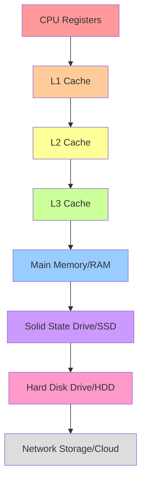

# Memory Hierarchy

## Introduction

Memory hierarchy is one of the fundamental concepts in computer architecture that directly impacts how efficiently your programs run. It refers to the organization of different types of memory in a computer system, arranged in a hierarchical structure based on speed, capacity, and cost.

Think of memory hierarchy like organizing your own workspace: you keep the most frequently used items (like your keyboard and mouse) closest to you, less frequently used items (like reference books) on a nearby shelf, and rarely used items (like archived files) in a distant storage cabinet. Computers use a similar strategy to balance speed and capacity constraints.

## The Pyramid of Memory

The memory hierarchy in modern computers typically looks like a pyramid:



Let's explore each layer from top to bottom:

## CPU Registers

At the very top of the hierarchy are CPU registers - the fastest memory locations available in a computer.

### Key characteristics:
- Extremely fast access (typically single CPU cycle)
- Very limited in number (usually a few dozen)
- Directly manipulated by CPU instructions
- Typically hold values currently being processed

Here's a simple example of how registers are used in low-level programming:

```c
// Assembly-like pseudocode showing register usage
function add(a, b) {
    // Values loaded into registers
    register1 = a
    register2 = b
    // Operation performed using registers
    register3 = register1 + register2
    // Result returned from register
    return register3
}
```

As a programmer, you generally don't directly manage registers (unless writing assembly code) - the compiler handles this optimization for you.

## Cache Memory

The next level in the hierarchy is cache memory, which itself is divided into multiple levels (L1, L2, and L3).

### L1 Cache
- Extremely fast (3-4 CPU cycles)
- Small (typically 32KB to 64KB per core)
- Often split into instruction cache (for code) and data cache (for data)
- Located directly on the CPU core

### L2 Cache
- Fast but slower than L1 (10-20 CPU cycles)
- Larger than L1 (typically 256KB to 512KB per core)
- May be shared between multiple cores in some architectures

### L3 Cache
- Slower than L2 (40-60 CPU cycles)
- Much larger (several MB, often 4MB to 50MB)
- Shared among all cores on a CPU

Cache memory works on the principle of **locality**:
- **Temporal locality**: If data is accessed once, it's likely to be accessed again soon
- **Spatial locality**: If one memory location is accessed, nearby locations are likely to be accessed soon

### Cache Line Example

Let's see how cache lines affect performance:

```c
// This array traversal is cache-friendly
int sum = 0;
int array[1000];
// Fill array with values...

// Access elements sequentially
for (int i = 0; i < 1000; i++) {
    sum += array[i];
}
```

```c
// This array traversal is NOT cache-friendly
int sum = 0;
int array[1000][1000];
// Fill array with values...

// Access elements column-by-column
for (int j = 0; j < 1000; j++) {
    for (int i = 0; i < 1000; i++) {
        sum += array[i][j]; // Not following memory layout!
    }
}
```

The second example is slower because it doesn't leverage spatial locality. In C/C++, 2D arrays are stored in row-major order, so jumping between columns means jumping across memory, causing frequent cache misses.

## Main Memory (RAM)

RAM (Random Access Memory) is the primary working memory of a computer.

### Key characteristics:
- Much slower than cache (100-200 CPU cycles)
- Much larger capacity (typically 8GB to 64GB in modern computers)
- Volatile (contents lost when power is turned off)
- Shared resource used by all programs and the operating system

Here's how you might allocate memory in different programming languages:

```c
// C language
int* array = (int*)malloc(100 * sizeof(int));
// Use the array
free(array); // Don't forget to free!
```

```java
// Java
int[] array = new int[100];
// Java handles memory deallocation automatically
```

```python
# Python
array = [0] * 100
# Python handles memory management automatically
```

## Secondary Storage

### Solid State Drives (SSDs)
- Much slower than RAM (thousands of CPU cycles)
- Much larger capacity (hundreds of GB to several TB)
- Non-volatile (retains data without power)
- Uses flash memory for storage

### Hard Disk Drives (HDDs)
- Even slower than SSDs (millions of CPU cycles)
- Very large capacity (often several TB)
- Non-volatile
- Mechanical with moving parts (spinning platters, moving heads)

Both SSDs and HDDs are used for persistent storage of files, programs, and data that needs to be preserved when the computer is turned off.

## Remote/Network Storage

At the bottom of the hierarchy is remote storage (like network drives or cloud storage).

### Key characteristics:
- Extremely slow compared to local storage (depends on network speed)
- Virtually unlimited capacity
- Accessed over a network connection
- Shared among many users

## How Memory Hierarchy Affects Your Code

Understanding memory hierarchy can help you write more efficient code. Here are some practical examples:

### Example 1: Array Traversal Direction

```c
// Assume we have a 1000x1000 2D array
int matrix[1000][1000];

// Method 1: Row-by-row traversal
for (int i = 0; i < 1000; i++) {
    for (int j = 0; j < 1000; j++) {
        matrix[i][j] = i + j;
    }
}

// Method 2: Column-by-column traversal
for (int j = 0; j < 1000; j++) {
    for (int i = 0; i < 1000; i++) {
        matrix[i][j] = i + j;
    }
}
```

Method 1 is significantly faster because it accesses memory sequentially, taking advantage of spatial locality and cache lines.

### Example 2: Data Structures and Locality

```c
// Structure of Arrays (SoA)
struct DataSoA {
    int x[1000];
    int y[1000];
    int z[1000];
};

// Array of Structures (AoS)
struct PointAoS {
    int x;
    int y;
    int z;
};
struct DataAoS {
    struct PointAoS points[1000];
};
```

If your code frequently accesses all fields of each element:
```c
// AoS is better for this access pattern
for (int i = 0; i < 1000; i++) {
    process(dataAoS.points[i].x, dataAoS.points[i].y, dataAoS.points[i].z);
}
```

If your code frequently accesses just one field for all elements:
```c
// SoA is better for this access pattern
for (int i = 0; i < 1000; i++) {
    processX(dataSoA.x[i]);
}
```

## Memory Hierarchy in Action: A Complete Example

Let's look at a real-world example of matrix multiplication and how its implementation can affect performance due to memory hierarchy:

```c
#include <stdio.h>
#include <stdlib.h>
#include <time.h>

#define SIZE 1024

void multiply_naive(double A[SIZE][SIZE], double B[SIZE][SIZE], double C[SIZE][SIZE]) {
    for (int i = 0; i < SIZE; i++) {
        for (int j = 0; j < SIZE; j++) {
            C[i][j] = 0;
            for (int k = 0; k < SIZE; k++) {
                C[i][j] += A[i][k] * B[k][j];
            }
        }
    }
}

void multiply_optimized(double A[SIZE][SIZE], double B[SIZE][SIZE], double C[SIZE][SIZE]) {
    // Transpose B to improve cache locality
    double B_transposed[SIZE][SIZE];
    for (int i = 0; i < SIZE; i++) {
        for (int j = 0; j < SIZE; j++) {
            B_transposed[j][i] = B[i][j];
        }
    }
    
    // Now multiply with better cache usage
    for (int i = 0; i < SIZE; i++) {
        for (int j = 0; j < SIZE; j++) {
            C[i][j] = 0;
            for (int k = 0; k < SIZE; k++) {
                C[i][j] += A[i][k] * B_transposed[j][k];
            }
        }
    }
}
```

In this example:
- The naive implementation accesses B in a column-wise manner, causing cache misses
- The optimized version transposes B first, then accesses all data in a row-wise manner
- The optimized version can be 2-3 times faster on large matrices despite doing more work upfront

The performance difference occurs because the optimized version makes better use of the memory hierarchy, especially the cache levels.

## Memory Hierarchy Optimizations in Modern Programming

Modern programming languages and compilers incorporate various techniques to optimize memory usage:

1. **Automatic Prefetching**: CPUs try to predict what data will be needed next and load it into cache proactively.

2. **Loop Unrolling**: Compilers transform loops to reduce branch predictions and better utilize cache.
   ```c
   // Before unrolling
   for (int i = 0; i < 100; i++) {
       array[i] = i * 2;
   }
   
   // After unrolling (conceptual example)
   for (int i = 0; i < 100; i += 4) {
       array[i] = i * 2;
       array[i+1] = (i+1) * 2;
       array[i+2] = (i+2) * 2;
       array[i+3] = (i+3) * 2;
   }
   ```

3. **Memory Pooling**: Allocating memory in blocks to reduce fragmentation and improve cache usage.

4. **Data-Oriented Design**: Organizing data based on access patterns rather than object-oriented principles.

## Summary

Memory hierarchy is a critical concept in computer systems that affects program performance:

- Memory is organized in levels from fastest/smallest (CPU registers) to slowest/largest (network storage)
- Each level serves as a cache for the level below it
- Performance benefits come from principles of temporal and spatial locality
- Understanding memory hierarchy helps you write more efficient code
- Data structure layout and access patterns significantly impact performance
- Modern hardware and compilers implement various optimizations to improve memory usage

By writing code that takes advantage of memory hierarchy, you can achieve significant performance improvements without changing your algorithms.

## Additional Resources and Exercises

### Exercises

1. Write a program that measures the performance difference between row-major and column-major traversal of a large 2D array.

2. Experiment with different array sizes to find where cache effects become noticeable on your system.

3. Implement a matrix multiplication algorithm with blocking (tiling) to improve cache usage.

4. Profile a real application to identify memory access patterns that could be optimized.

### Further Learning

- Computer Architecture: A Quantitative Approach by Hennessy and Patterson
- What Every Programmer Should Know About Memory by Ulrich Drepper
- Online courses on computer architecture and systems programming