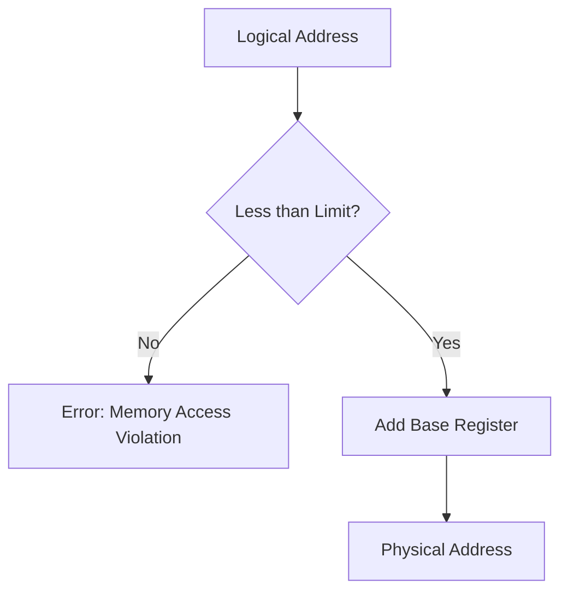

# Address Binding

## Introduction

When you write and run a program, have you ever wondered how the computer knows where to store it in memory? Your code doesn't include specific physical memory addresses like "store variable x at memory location 74FC20." Instead, there's a fascinating process called **address binding** that handles this translation behind the scenes.

Address binding is the mechanism that maps program addresses to actual physical memory locations. It's a fundamental concept in memory management that enables multiple programs to run simultaneously without interfering with each other's memory space.

## What is Address Binding?

Address binding is the process of mapping addresses from one address space to another. Specifically, it maps the logical addresses used in a program to the physical addresses in computer memory where the program is actually stored.

This binding can occur at different stages of a program's lifecycle:

1. **Compile time**: During compilation
2. **Load time**: When a program is loaded into memory
3. **Execution time**: While the program is running

Let's explore each of these binding types in detail.

## Types of Address Binding

### Compile-Time Binding

In compile-time binding, the compiler translates logical addresses directly into absolute physical addresses.


**Characteristics:**
- Programs must be loaded at the exact memory location specified during compilation
- If the memory location changes, recompilation is necessary
- No relocation is possible without recompilation

**Example:**

```c
// In early systems, memory addresses might be hardcoded
// This is rarely used in modern systems
int main() {
    // Imagine compiler knows this program will ALWAYS load at address 5000
    int x = 10; // Will be placed at address 5000
    int y = 20; // Will be placed at address 5004
    return 0;
}
```

**Drawbacks:**
- Extremely inflexible
- Cannot run multiple copies of the same program
- Not used in modern operating systems

### Load-Time Binding

In load-time binding, the compiler generates relocatable code with relative addresses. The actual binding to physical addresses happens when the program is loaded into memory.


**Characteristics:**
- Program contains relocatable addresses (relative to start of program)
- Final binding is delayed until load time
- Program can be loaded anywhere in available memory
- Entire program must be in memory at once

**Example:**

```c
int main() {
    int x = 10; // Address will be: (Base Address) + 0
    int y = 20; // Address will be: (Base Address) + 4
    return 0;
}
```

When the program is loaded:
1. The loader finds a free memory region (e.g., starting at address 8000)
2. It calculates absolute addresses by adding the base address to relative addresses
3. So `x` is at 8000 + 0 = 8000, and `y` is at 8000 + 4 = 8004

### Execution-Time Binding (Dynamic Binding)

In execution-time binding, address binding is delayed until runtime. The program can be moved between different memory locations even during execution.


**Characteristics:**
- Program contains logical addresses
- Hardware support (Memory Management Unit) translates addresses during execution
- Program can be moved between memory areas during execution
- Enables virtual memory systems

**Example:**

```c
int main() {
    int x = 10; // Logical address: 0
    int y = 20; // Logical address: 4
    return 0;
}
```

During execution:
1. CPU generates logical addresses (0, 4)
2. MMU translates these to physical addresses using base register
3. If program moves in memory, only base register is updated

## Address Binding in Modern Systems

Modern operating systems primarily use execution-time binding with virtual memory. Here's how it typically works:

1. Programs use logical addresses in a virtual address space
2. The Memory Management Unit (MMU) translates these to physical addresses
3. Translation is aided by page tables or segment tables
4. The OS can move programs in memory by updating translation tables

Let's see a simplified example of how this works:

```c
#include <stdio.h>
#include <stdlib.h>

int main() {
    // Allocate memory
    int *array = (int*)malloc(10 * sizeof(int));
    
    // Fill the array
    for (int i = 0; i < 10; i++) {
        array[i] = i * 100;
    }
    
    // Print array values and their addresses
    for (int i = 0; i < 10; i++) {
        printf("Value at index %d: %d, Logical Address: %p
", 
               i, array[i], &array[i]);
    }
    
    free(array);
    return 0;
}
```

**Output (example):**
```
Value at index 0: 0, Logical Address: 0x55d7c9b8e6c0
Value at index 1: 100, Logical Address: 0x55d7c9b8e6c4
Value at index 2: 200, Logical Address: 0x55d7c9b8e6c8
...
```

The addresses printed are virtual addresses. The MMU transparently translates these to physical memory locations.

## Practical Importance of Address Binding

Understanding address binding is crucial for several reasons:

1. **Process Isolation**: Ensures that processes don't interfere with each other's memory space

2. **Memory Utilization**: Enables efficient use of available memory

3. **Memory Protection**: Prevents unauthorized access to memory regions

4. **Memory Sharing**: Allows controlled sharing of memory between processes when needed

5. **Virtual Memory**: Forms the foundation for implementing virtual memory systems

## Implementation Details

### Base and Limit Registers

A simple approach to dynamic relocation uses:

- **Base Register**: Contains the starting physical address where the program is loaded
- **Limit Register**: Contains the size of the program

For every memory access:
1. CPU generates a logical address
2. Hardware adds the base register value to get the physical address
3. Hardware checks if the logical address is less than the limit register value
4. If not, generates a trap (memory access violation)



### Page Tables

Modern systems use more complex mechanisms like paging:

1. Logical address is divided into page number and offset
2. Page number is used to index into a page table
3. Page table entry contains the frame number in physical memory
4. Frame number combined with offset gives the physical address

```mermaid
graph LR
    A[Logical Address] --> B[Page # | Offset]
    B --> C[Page Table]
    C --> D[Frame # | Offset]
    D --> E[Physical Address]
```

## Summary

Address binding is the crucial process that connects the addresses in your code to actual physical memory locations. It occurs at different stages:

- **Compile-time binding**: Fixed addresses decided during compilation
- **Load-time binding**: Relative addresses resolved when program is loaded
- **Execution-time binding**: Dynamic address translation during program execution

Modern operating systems primarily use execution-time binding with virtual memory, allowing for flexible, secure, and efficient memory management. 

This foundational concept enables many of the features we take for granted: running multiple programs simultaneously, memory protection, and efficient memory utilization.

## Additional Resources

To deepen your understanding of address binding and memory management:

- Experiment with memory allocation in C/C++ programs
- Learn about virtual memory implementation in different operating systems
- Study page replacement algorithms
- Explore memory management visualization tools

## Practice Exercises

1. Write a small program that allocates memory and prints the addresses of variables
2. Calculate the physical address for a logical address given a base register value
3. Trace the address binding process for a simple program through compilation, loading, and execution
4. Compare the memory management approaches of different operating systems