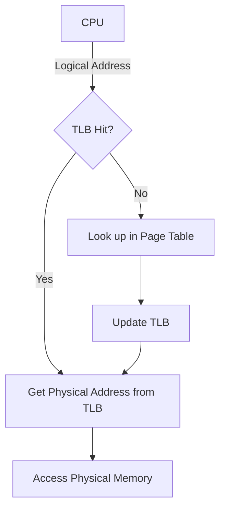

# Logical vs Physical Address Space

## Introduction

When you run a program on your computer, it needs memory to store data and instructions. But how does your computer manage memory for multiple programs running simultaneously? The answer lies in understanding the difference between **logical address space** and **physical address space** - a fundamental concept in memory management.

In simple terms:
- **Logical address space** (also called virtual address space) is what your program "sees" and works with
- **Physical address space** is the actual location in the physical RAM where data is stored

This distinction allows modern operating systems to run multiple programs efficiently and securely, each believing it has the entire computer memory to itself.

## The Difference Between Logical and Physical Addresses

### Logical Address Space

The logical address space is the set of addresses that a program can use to reference memory. These addresses are generated by the CPU during program execution but don't directly correspond to actual physical memory locations.

Key characteristics of logical addresses:
- Generated by the CPU during program execution
- Used by the program for memory references
- Independent of physical memory allocation
- Provides memory isolation between processes
- Typically starts from zero for each process

### Physical Address Space

The physical address space represents the actual physical memory locations available in your computer's RAM.

Key characteristics of physical addresses:
- Actual locations in physical memory (RAM)
- Limited by the amount of RAM installed
- Directly accessed by the memory controller
- Not directly visible to user programs
- Shared among all processes in the system

## Address Translation Process

Converting logical addresses to physical addresses is called **address translation**. This is typically handled by a hardware component called the **Memory Management Unit (MMU)**.

Here's a simplified explanation of how address translation works:


The MMU uses mapping tables maintained by the operating system to perform this translation. These tables are often organized in a structure called a **page table**.

## Page Tables and Address Translation

One common method for address translation is **paging**. In this approach:

1. Logical address space is divided into fixed-size blocks called **pages**
2. Physical address space is divided into fixed-size blocks called **frames**
3. Pages are mapped to frames using a page table

For example, a logical address might be divided into:
- A page number (p) - used as an index into the page table
- A page offset (d) - combined with the physical frame number to get the exact byte

```
Logical Address: [Page Number (p) | Page Offset (d)]
                        ↓               ↓
                  ┌─────────────┐       │
                  │ Page Table  │       │
                  │ ┌───────┐   │       │
                  │ │Frame 0│   │       │
                  │ │Frame 1│   │       │
                  │ │   ⋮   │   │       │
              p → │ │Frame f│ → f       │
                  │ │   ⋮   │           │
                  │ └───────┘           │
                  └─────────────┘       │
                        ↓               ↓
Physical Address: [Frame Number (f) | Page Offset (d)]
```

Let's look at a practical example of address translation with page tables:

```c
// Logical address: 0x3204
// Assuming 4KB page size (offset: 12 bits)

// Step 1: Split the logical address
page_number = 0x3204 >> 12  // => 0x3 (page 3)
page_offset = 0x3204 & 0xFFF // => 0x204 (offset 516)

// Step 2: Look up in page table
// Assuming page table contains: [0x7, 0x2, 0xA, 0x5, ...]
frame_number = page_table[page_number] // => 0x5

// Step 3: Construct physical address
physical_address = (frame_number << 12) | page_offset
// => (0x5 << 12) | 0x204
// => 0x5000 | 0x204
// => 0x5204
```

## Real-World Applications

### 1. Memory Protection

By using separate logical address spaces, the operating system can prevent one program from accessing another program's memory, thereby improving security and stability.

```c
// Program A tries to access memory address 0x1000 in its logical space
int *ptr = (int *)0x1000;
*ptr = 42; // This works fine

// Without address translation, Program B could also access 0x1000
// With address translation, 0x1000 in Program A might be physical location 0x7F001000
// while 0x1000 in Program B might be physical location 0x83004000
```

### 2. Memory Overcommitment

The operating system can allocate more logical memory than there is physical memory available, using techniques like swapping to disk.

```c
// Allocating a large array
int *bigArray = malloc(1024 * 1024 * 1024); // 1GB of memory

// The OS might not actually allocate 1GB of physical RAM
// Instead, it maps the logical addresses and only allocates
// physical memory when the program writes to it
```

### 3. Shared Memory

Multiple programs can share the same physical memory by mapping different logical addresses to the same physical address.

```c
// In Process A:
// Logical address 0x2000 -> Physical address 0x5A000

// In Process B:
// Logical address 0x8000 -> Physical address 0x5A000

// Both processes see their own address, but they're writing
// to the same physical location
```

### 4. Memory-Mapped Files

Files can be mapped directly into logical address space, allowing programs to access file data as if it were in memory.

```c
// Instead of using read():
// file = open("data.bin", O_RDONLY);
// read(file, buffer, size);

// Use memory mapping:
void *addr = mmap(
    NULL,                    // Let the OS choose the logical address
    file_size,               // Size of the mapping
    PROT_READ,               // Read-only permission
    MAP_PRIVATE,             // Changes are private to the process
    file_descriptor,         // File to map
    0                        // Offset in the file
);

// Now we can access the file as if it were an array in memory
int value = ((int *)addr)[10]; // Read the 11th integer from the file
```

## Address Translation in Modern Processors

Modern processors have sophisticated MMUs that include a **Translation Lookaside Buffer (TLB)** to speed up address translation. The TLB caches recent translations, reducing the need to access the page table for every memory reference.



## Practical Example: Understanding Memory Errors

Many common programming errors involve address space issues:

### Segmentation Fault

When a program tries to access a logical address that is not mapped to any physical address:

```c
int main() {
    int *ptr = NULL;  // 0x0 in logical address space
    *ptr = 42;        // Tries to write to address 0x0
                     // This address is not mapped to physical memory
                     // Result: Segmentation fault
    return 0;
}
```

### Memory Leaks

When logical addresses remain allocated but are no longer accessible:

```c
void memoryLeak() {
    int *array = malloc(1000 * sizeof(int));
    
    // Do something with array
    
    // Forgot to free the memory
    // The logical addresses allocated to 'array' remain mapped
    // but we have no way to access or free them
}
```

## Operating System Support

Different operating systems handle address translation in similar ways but with some variations:

### Linux Virtual Memory System

Linux uses a multi-level page table structure to efficiently translate addresses in large address spaces:

```c
// Example of accessing the Linux page tables (simplified)
// Note: This is kernel code, not user code
pgd_t *pgd;
pud_t *pud;
pmd_t *pmd;
pte_t *pte;

pgd = pgd_offset(mm, address);
pud = pud_offset(pgd, address);
pmd = pmd_offset(pud, address);
pte = pte_offset_map(pmd, address);
```

### Windows Virtual Memory Manager

Windows uses a similar paging mechanism with some specific features like the working set (the set of pages a process is actively using).

## Summary

Understanding the difference between logical and physical address spaces is fundamental to modern computing:

1. **Logical address space** is what programs see and use
2. **Physical address space** refers to actual memory locations in RAM
3. The **MMU** translates between logical and physical addresses
4. This separation enables:
   - Memory protection between processes
   - Efficient memory utilization
   - Advanced features like shared memory and memory-mapped files

By abstracting physical memory, operating systems provide each program with the illusion of having its own complete memory space, making programming easier and systems more reliable.

## Exercises

1. Calculate the physical address for logical address 0x2340 if:
   - Page size is 4KB (4096 bytes)
   - Page table entry for page 2 contains frame number 6

2. If a system has 8GB of RAM and 4KB pages, how many page table entries would be needed to map the entire physical memory?

3. Write a simple C program that allocates memory and prints both the logical address (the pointer value) and attempt to determine which physical page it might be on (note: this is an exercise; user programs typically cannot directly access physical addresses).

## Additional Resources

- Modern Operating Systems by Andrew S. Tanenbaum
- Operating System Concepts by Silberschatz, Galvin, and Gagne
- [MIT Operating Systems Engineering course](https://ocw.mit.edu/courses/electrical-engineering-and-computer-science/6-828-operating-system-engineering-fall-2012/)
- Linux source code: mm/ directory for memory management implementation