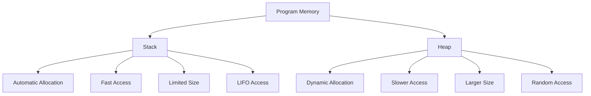

# Memory Allocation

## Introduction

Memory allocation is a fundamental concept in programming that deals with how programs request, use, and release memory resources. Understanding memory allocation is crucial for writing efficient, bug-free code, especially when working with languages that give you direct control over memory like C and C++.

When you run a program, the operating system allocates memory for it to use. The program then manages this memory through various allocation techniques. Incorrect memory management can lead to issues like memory leaks, crashes, and inefficient performance.

## Types of Memory Allocation

There are two primary types of memory allocation:

1. **Static Allocation**: Memory is allocated at compile time
2. **Dynamic Allocation**: Memory is allocated at runtime

Let's explore each type in detail.

## Static Memory Allocation

Static memory allocation happens during compile time. The compiler determines how much memory a variable needs and allocates it before the program runs.

### Characteristics of Static Allocation

- Memory size must be known at compile time
- Memory persists for the lifetime of the program or scope
- Typically stored in the stack memory region
- Fast allocation and deallocation

### Example of Static Allocation

```c
#include <stdio.h>

int main() {
    // Static allocation - array size is fixed
    int numbers[5] = {10, 20, 30, 40, 50};
    
    printf("Static Array Contents:
");
    for (int i = 0; i < 5; i++) {
        printf("%d ", numbers[i]);
    }
    
    return 0;
}
```

**Output:**
```
Static Array Contents:
10 20 30 40 50
```

In this example, an array of 5 integers is statically allocated. The size of the array is fixed and cannot be changed during program execution.

## Dynamic Memory Allocation

Dynamic memory allocation allows programs to request memory during runtime. This provides flexibility when the required memory size isn't known at compile time.

### Characteristics of Dynamic Allocation

- Memory size can be determined at runtime
- Memory persists until explicitly freed
- Typically stored in the heap memory region
- Slower than static allocation but more flexible

### Common Dynamic Allocation Functions

Different programming languages have different ways to handle dynamic memory allocation:

#### In C:
- `malloc()`: Allocates a block of memory
- `calloc()`: Allocates and initializes memory to zero
- `realloc()`: Resizes previously allocated memory
- `free()`: Releases allocated memory

#### In C++:
- `new`: Allocates memory
- `delete`: Frees memory for a single object
- `new[]`: Allocates memory for an array
- `delete[]`: Frees memory for an array

#### In higher-level languages:
Languages like Python, JavaScript, and Java handle memory allocation automatically through garbage collection.

### Example of Dynamic Allocation in C

```c
#include <stdio.h>
#include <stdlib.h>

int main() {
    int size, i;
    int* dynamicArray;
    
    // Get size input from user
    printf("Enter the size of the array: ");
    scanf("%d", &size);
    
    // Dynamically allocate memory
    dynamicArray = (int*)malloc(size * sizeof(int));
    
    // Check if memory allocation was successful
    if (dynamicArray == NULL) {
        printf("Memory allocation failed!
");
        return 1;
    }
    
    // Initialize the array with values
    for (i = 0; i < size; i++) {
        dynamicArray[i] = i * 10;
    }
    
    // Print the array contents
    printf("
Dynamic Array Contents:
");
    for (i = 0; i < size; i++) {
        printf("%d ", dynamicArray[i]);
    }
    
    // Free the allocated memory when done
    free(dynamicArray);
    
    return 0;
}
```

**Sample Output (for input size 4):**
```
Enter the size of the array: 4

Dynamic Array Contents:
0 10 20 30
```

In this example, we:
1. Ask the user for an array size
2. Allocate memory using `malloc()`
3. Check if allocation was successful
4. Use the allocated memory
5. Free the memory when done

### Example with calloc() and realloc()

```c
#include <stdio.h>
#include <stdlib.h>

int main() {
    int *numbers;
    int *moreNumbers;
    int i;
    
    // Allocate and initialize memory for 5 integers
    numbers = (int*)calloc(5, sizeof(int));
    
    if (numbers == NULL) {
        printf("Memory allocation failed!
");
        return 1;
    }
    
    // calloc initializes all values to 0
    printf("Initial values after calloc:
");
    for (i = 0; i < 5; i++) {
        printf("%d ", numbers[i]);
    }
    
    // Set some values
    for (i = 0; i < 5; i++) {
        numbers[i] = (i + 1) * 5;
    }
    
    printf("

Values after modification:
");
    for (i = 0; i < 5; i++) {
        printf("%d ", numbers[i]);
    }
    
    // Resize the array to hold 8 integers
    moreNumbers = (int*)realloc(numbers, 8 * sizeof(int));
    
    if (moreNumbers == NULL) {
        printf("
Memory reallocation failed!
");
        free(numbers);
        return 1;
    }
    
    // The original data is preserved
    // Initialize new elements
    for (i = 5; i < 8; i++) {
        moreNumbers[i] = (i + 1) * 5;
    }
    
    printf("

Values after realloc:
");
    for (i = 0; i < 8; i++) {
        printf("%d ", moreNumbers[i]);
    }
    
    // Free the reallocated memory
    free(moreNumbers);
    
    return 0;
}
```

**Output:**
```
Initial values after calloc:
0 0 0 0 0 

Values after modification:
5 10 15 20 25 

Values after realloc:
5 10 15 20 25 30 35 40
```

## Stack vs. Heap Memory

Understanding the difference between stack and heap memory is crucial for effective memory management.



### Stack Memory

- Used for static memory allocation
- Managed automatically by the program
- LIFO (Last In, First Out) data structure
- Variables are allocated and deallocated as they enter and exit scope
- Fast allocation and access
- Limited in size
- Used for local variables and function calls

### Heap Memory

- Used for dynamic memory allocation
- Managed manually by the programmer (in languages like C/C++)
- Requires explicit allocation and deallocation
- Larger size compared to stack
- Slower access than stack
- Can lead to memory fragmentation
- Used for data that needs to persist beyond the scope of a function

### Example Demonstrating Stack and Heap

```c
#include <stdio.h>
#include <stdlib.h>

void demonstrateStackAndHeap() {
    // Stack allocation
    int stackVar = 10;                 // Stored on the stack
    
    // Heap allocation
    int* heapVar = (int*)malloc(sizeof(int));  // Stored on the heap
    *heapVar = 20;
    
    printf("Stack variable value: %d
", stackVar);
    printf("Heap variable value: %d
", *heapVar);
    printf("Stack variable address: %p
", (void*)&stackVar);
    printf("Heap variable address: %p
", (void*)heapVar);
    
    // Free heap memory
    free(heapVar);
    
    // stackVar is automatically deallocated when function returns
}

int main() {
    demonstrateStackAndHeap();
    return 0;
}
```

**Sample Output:**
```
Stack variable value: 10
Heap variable value: 20
Stack variable address: 0x7ffeeb3b3a1c
Heap variable address: 0x55f681a2d2a0
```

Notice how the stack address and heap address are in completely different ranges of memory.

## Common Memory Allocation Issues

### Memory Leaks

A memory leak occurs when allocated memory is not freed, causing the program to consume more and more memory over time.

```c
// Example of a memory leak
void memoryLeakExample() {
    int* data = (int*)malloc(100 * sizeof(int));
    
    // Use data...
    
    // Forgot to free data! This causes a memory leak
    // free(data); - This line should be here
}
```

### Dangling Pointers

A dangling pointer occurs when a pointer still references memory that has been freed.

```c
// Example of a dangling pointer
void danglingPointerExample() {
    int* ptr = (int*)malloc(sizeof(int));
    *ptr = 10;
    
    free(ptr);  // Memory is freed
    
    // Danger! ptr is now a dangling pointer
    // Accessing it is undefined behavior
    *ptr = 20;  // This could crash your program or cause corruption
}
```

### Buffer Overflow

A buffer overflow happens when a program writes data beyond the allocated memory.

```c
// Example of a buffer overflow
void bufferOverflowExample() {
    int* array = (int*)malloc(5 * sizeof(int));
    
    // This loop writes beyond the allocated memory
    for (int i = 0; i < 10; i++) {
        array[i] = i;  // Overflow when i >= 5
    }
    
    free(array);
}
```

## Best Practices for Memory Allocation

1. **Always free dynamically allocated memory** to prevent memory leaks
2. **Set pointers to NULL after freeing** to avoid dangling pointer issues
3. **Check for allocation failures** by verifying return values of allocation functions
4. **Be mindful of buffer sizes** to prevent buffer overflows
5. **Consider using smart pointers** (in C++) or memory management tools
6. **Minimize allocation in performance-critical sections** of code
7. **Batch allocations** when possible instead of making many small allocations

### Example With Best Practices

```c
#include <stdio.h>
#include <stdlib.h>

int* createArray(int size) {
    // Check for invalid size
    if (size <= 0) {
        return NULL;
    }
    
    // Allocate memory
    int* array = (int*)malloc(size * sizeof(int));
    
    // Check for allocation failure
    if (array == NULL) {
        printf("Memory allocation failed!
");
        return NULL;
    }
    
    // Initialize the array
    for (int i = 0; i < size; i++) {
        array[i] = i * 2;
    }
    
    return array;
}

void processArray(int* array, int size) {
    if (array == NULL || size <= 0) {
        printf("Invalid array or size
");
        return;
    }
    
    printf("Array contents:
");
    for (int i = 0; i < size; i++) {
        printf("%d ", array[i]);
    }
    printf("
");
}

void cleanupArray(int** arrayPtr) {
    if (arrayPtr == NULL || *arrayPtr == NULL) {
        return;
    }
    
    free(*arrayPtr);  // Free the memory
    *arrayPtr = NULL; // Set pointer to NULL to avoid dangling pointer
}

int main() {
    int size = 5;
    int* myArray = createArray(size);
    
    if (myArray != NULL) {
        processArray(myArray, size);
        cleanupArray(&myArray);
        
        // Verify the pointer is NULL
        if (myArray == NULL) {
            printf("Memory successfully freed
");
        }
    }
    
    return 0;
}
```

**Output:**
```
Array contents:
0 2 4 6 8
Memory successfully freed
```

## Memory Allocation in Different Languages

### C++

C++ provides the `new` and `delete` operators for dynamic memory allocation.

```cpp
#include <iostream>

int main() {
    // Allocate a single integer
    int* num = new int;
    *num = 42;
    
    std::cout << "Value: " << *num << std::endl;
    
    // Clean up
    delete num;
    
    // Allocate an array
    int* arr = new int[5];
    
    for (int i = 0; i < 5; i++) {
        arr[i] = i * 10;
    }
    
    std::cout << "Array values: ";
    for (int i = 0; i < 5; i++) {
        std::cout << arr[i] << " ";
    }
    std::cout << std::endl;
    
    // Clean up array
    delete[] arr;
    
    return 0;
}
```

### Modern C++ Smart Pointers

Modern C++ provides smart pointers that automatically manage memory:

```cpp
#include <iostream>
#include <memory>
#include <vector>

class Resource {
public:
    Resource(int id) : id_(id) {
        std::cout << "Resource " << id_ << " created" << std::endl;
    }
    
    ~Resource() {
        std::cout << "Resource " << id_ << " destroyed" << std::endl;
    }
    
    void use() {
        std::cout << "Using resource " << id_ << std::endl;
    }
    
private:
    int id_;
};

int main() {
    // unique_ptr - exclusive ownership
    std::unique_ptr<Resource> res1 = std::make_unique<Resource>(1);
    res1->use();
    
    // shared_ptr - shared ownership
    std::shared_ptr<Resource> res2 = std::make_shared<Resource>(2);
    {
        std::shared_ptr<Resource> res2_copy = res2;  // Reference count increases
        res2_copy->use();
    }  // res2_copy goes out of scope, but res2 still exists
    
    res2->use();
    
    // Vector of smart pointers
    std::vector<std::shared_ptr<Resource>> resources;
    
    for (int i = 3; i < 6; i++) {
        resources.push_back(std::make_shared<Resource>(i));
    }
    
    for (const auto& res : resources) {
        res->use();
    }
    
    return 0;
}
```

## Memory Management in Higher-Level Languages

Higher-level languages like Python, JavaScript, and Java use automatic memory management techniques like garbage collection.

### Python Example

```python
def create_list(size):
    # Memory is automatically allocated
    my_list = [i * 2 for i in range(size)]
    return my_list

# Create and use a list
numbers = create_list(5)
print("List contents:", numbers)

# No need to free memory, Python's garbage collector handles it
```

While you don't need to manually manage memory in these languages, understanding memory principles still helps you write more efficient code.

## Real-World Applications

### Image Processing

Image processing often requires large amounts of memory to store pixel data. Dynamic allocation is crucial for handling images of varying sizes.

```c
#include <stdio.h>
#include <stdlib.h>

typedef struct {
    unsigned char red;
    unsigned char green;
    unsigned char blue;
} Pixel;

typedef struct {
    int width;
    int height;
    Pixel* data;
} Image;

// Allocate memory for an image
Image* createImage(int width, int height) {
    Image* img = (Image*)malloc(sizeof(Image));
    if (img == NULL) return NULL;
    
    img->width = width;
    img->height = height;
    img->data = (Pixel*)malloc(width * height * sizeof(Pixel));
    
    if (img->data == NULL) {
        free(img);
        return NULL;
    }
    
    return img;
}

// Free image memory
void destroyImage(Image* img) {
    if (img == NULL) return;
    
    if (img->data != NULL) {
        free(img->data);
    }
    
    free(img);
}

int main() {
    // Create a 640x480 image
    Image* myImage = createImage(640, 480);
    
    if (myImage == NULL) {
        printf("Failed to create image
");
        return 1;
    }
    
    // Fill with red pixels as an example
    for (int y = 0; y < myImage->height; y++) {
        for (int x = 0; x < myImage->width; x++) {
            int index = y * myImage->width + x;
            myImage->data[index].red = 255;
            myImage->data[index].green = 0;
            myImage->data[index].blue = 0;
        }
    }
    
    printf("Created and filled a %dx%d image
", 
           myImage->width, myImage->height);
    
    // Clean up
    destroyImage(myImage);
    
    return 0;
}
```

### Data Structures

Dynamic memory allocation is essential for implementing data structures like linked lists, trees, and hash tables.

```c
#include <stdio.h>
#include <stdlib.h>

// Node for a linked list
typedef struct Node {
    int data;
    struct Node* next;
} Node;

// Create a new node
Node* createNode(int data) {
    Node* newNode = (Node*)malloc(sizeof(Node));
    if (newNode == NULL) return NULL;
    
    newNode->data = data;
    newNode->next = NULL;
    return newNode;
}

// Add a node to the end of a list
void appendNode(Node** head, int data) {
    Node* newNode = createNode(data);
    if (newNode == NULL) return;
    
    // If list is empty
    if (*head == NULL) {
        *head = newNode;
        return;
    }
    
    // Find the last node
    Node* current = *head;
    while (current->next != NULL) {
        current = current->next;
    }
    
    // Add the new node at the end
    current->next = newNode;
}

// Print the list
void printList(Node* head) {
    Node* current = head;
    
    printf("List contents: ");
    while (current != NULL) {
        printf("%d -> ", current->data);
        current = current->next;
    }
    printf("NULL
");
}

// Free all nodes in the list
void freeList(Node** head) {
    Node* current = *head;
    Node* next;
    
    while (current != NULL) {
        next = current->next;
        free(current);
        current = next;
    }
    
    *head = NULL;
}

int main() {
    Node* myList = NULL;
    
    // Add nodes to the list
    for (int i = 1; i <= 5; i++) {
        appendNode(&myList, i * 10);
    }
    
    printList(myList);
    
    // Clean up
    freeList(&myList);
    
    if (myList == NULL) {
        printf("List successfully freed
");
    }
    
    return 0;
}
```

## Summary

Memory allocation is a fundamental concept in programming that determines how programs use computer memory. The two main types are static allocation (determined at compile time) and dynamic allocation (determined at runtime).

Key points to remember:

1. **Static allocation** is fast but inflexible, with memory size fixed at compile time
2. **Dynamic allocation** provides flexibility by allowing memory requests at runtime
3. **Stack memory** is used for static allocation and is automatically managed
4. **Heap memory** is used for dynamic allocation and requires manual management in some languages
5. Common memory issues include **memory leaks**, **dangling pointers**, and **buffer overflows**
6. Different languages handle memory differently:
   - C/C++ require manual memory management
   - Modern C++ provides smart pointers for safer memory management
   - Higher-level languages use garbage collection for automatic management

Proper memory management is essential for creating efficient, reliable software that makes good use of system resources.

## Practice Exercises

1. Write a program that dynamically allocates memory for a string, copies a message into it, and then properly frees the memory.

2. Create a function that takes an array of integers and its size, then returns a new array with only the even numbers.

3. Implement a simple "memory pool" that pre-allocates a large block of memory and then manages smaller allocations from that block.

4. Create a program that demonstrates a memory leak and then fix it.

5. Implement a basic data structure (like a stack or queue) using dynamic memory allocation.

## Additional Resources

- [C Programming: Dynamic Memory Allocation](https://www.learn-c.org/en/Dynamic_allocation)
- [C++ Smart Pointers](https://en.cppreference.com/w/cpp/memory)
- [Memory Management in Python](https://docs.python.org/3/c-api/memory.html)
- Books: "Expert C Programming: Deep C Secrets" by Peter van der Linden
- Tools: Valgrind for memory leak detection
- Courses: Computer Systems and Memory Management courses available on platforms like Coursera and edX