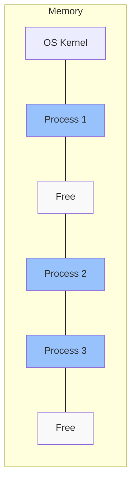
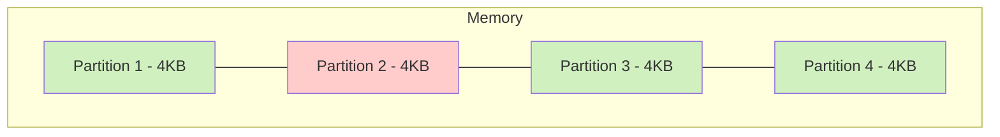
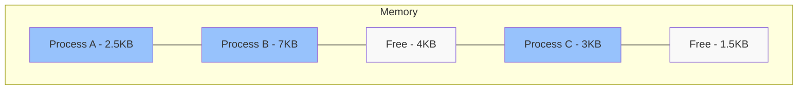
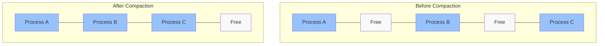

# Contiguous Memory Allocation

## Introduction

Memory management is a critical aspect of any computing system, ensuring that programs have the resources they need to run efficiently. **Contiguous memory allocation** is one of the fundamental approaches to managing computer memory, where each process receives a single continuous block of memory.

This approach served as the foundation for early memory management systems and still influences modern designs. Understanding contiguous memory allocation provides crucial insights into how computers organize and utilize memory resources.

## What is Contiguous Memory Allocation?

Contiguous memory allocation is a memory management technique where the operating system allocates a single continuous block of memory to a process. This means all the memory a program needs is provided in one uninterrupted chunk.



In this model:
- Each process occupies a continuous section of memory
- The process must fit entirely within the available space
- The system tracks which memory regions are in use and which are free

## Memory Partitioning Methods

Contiguous memory allocation typically uses one of two partitioning approaches:

### 1. Fixed Partitioning

With fixed partitioning, memory is divided into fixed-size blocks called partitions.



**Advantages:**
- Simple to implement
- Little computational overhead
- No external fragmentation

**Disadvantages:**
- Causes internal fragmentation (wasted space within partitions)
- Cannot accommodate processes larger than the partition size
- Number of active processes is limited to the number of partitions

### 2. Variable Partitioning

Variable partitioning allocates exactly as much memory as a process requires:



**Advantages:**
- Better memory utilization
- No internal fragmentation
- Can accommodate processes of various sizes

**Disadvantages:**
- More complex to implement
- Leads to external fragmentation
- Requires memory compaction or clever allocation strategies

## Allocation Strategies

When using variable partitioning, the system must decide which available memory block to allocate. Here are the common strategies:

### First-Fit

Allocates the first free block that is large enough to accommodate the process.

```javascript
function firstFit(blocks, processSize) {
  for (let i = 0; i < blocks.length; i++) {
    if (blocks[i].size >= processSize) {
      return i; // Allocate this block
    }
  }
  return -1; // No suitable block found
}
```

**Pros:** Fast allocation, minimal search time
**Cons:** May leave small, unusable fragments at the beginning of memory

### Best-Fit

Searches all free blocks and chooses the smallest block that is large enough.

```javascript
function bestFit(blocks, processSize) {
  let bestIdx = -1;
  let bestSize = Infinity;
  
  for (let i = 0; i < blocks.length; i++) {
    if (blocks[i].size >= processSize && blocks[i].size < bestSize) {
      bestIdx = i;
      bestSize = blocks[i].size;
    }
  }
  
  return bestIdx; // Returns -1 if no block fits
}
```

**Pros:** Minimizes wasted space (smallest leftover fragment)
**Cons:** Slower than first-fit, can create many tiny unusable fragments

### Worst-Fit

Allocates the largest available block to leave the largest leftover fragment.

```javascript
function worstFit(blocks, processSize) {
  let worstIdx = -1;
  let worstSize = -1;
  
  for (let i = 0; i < blocks.length; i++) {
    if (blocks[i].size >= processSize && blocks[i].size > worstSize) {
      worstIdx = i;
      worstSize = blocks[i].size;
    }
  }
  
  return worstIdx; // Returns -1 if no block fits
}
```

**Pros:** Creates larger free blocks that may be useful for future allocations
**Cons:** Uses large blocks quickly, potentially wasteful

## Memory Fragmentation

Fragmentation is a critical challenge in contiguous memory allocation:

### Internal Fragmentation

Internal fragmentation occurs when allocated memory is slightly larger than requested memory, resulting in wasted space inside allocated regions.

```
┌─────────────────────┐
│ Process A (4KB)     │
│ ┌───────────────┐   │
│ │ Used: 3.2KB   │   │
│ ├───────────────┤   │
│ │ Wasted: 0.8KB │   │
│ └───────────────┘   │
└─────────────────────┘
```

### External Fragmentation

External fragmentation occurs when free memory is broken into small blocks that are not contiguous, making it impossible to allocate a large block even when the total free memory is sufficient.

```
┌────────┐┌───────┐┌────────┐┌─────────┐
│Process A││  Free  ││Process B││   Free   │
│  (4KB)  ││ (2KB)  ││  (6KB)  ││  (3KB)   │
└────────┘└───────┘└────────┘└─────────┘
```

In this example, there's 5KB of free memory in total (2KB + 3KB), but it's not possible to allocate a 4KB process because the free memory is not contiguous.

## Practical Implementation Example

Let's implement a simple contiguous memory allocator in JavaScript:

```javascript
class MemoryAllocator {
  constructor(totalSize) {
    this.memory = {
      size: totalSize,
      allocated: false,
      process: null,
      start: 0,
      next: null
    };
  }
  
  allocate(processId, size, strategy = 'firstFit') {
    // Find a suitable block based on selected strategy
    let current = this.memory;
    let selected = null;
    
    if (strategy === 'firstFit') {
      // First-fit strategy
      while (current) {
        if (!current.allocated && current.size >= size) {
          selected = current;
          break;
        }
        current = current.next;
      }
    } else if (strategy === 'bestFit') {
      // Best-fit strategy
      let bestFitSize = Infinity;
      current = this.memory;
      
      while (current) {
        if (!current.allocated && current.size >= size && current.size < bestFitSize) {
          selected = current;
          bestFitSize = current.size;
        }
        current = current.next;
      }
    }
    
    // If no suitable block found
    if (!selected) {
      return { success: false, message: "Not enough contiguous memory available" };
    }
    
    // If selected block size equals requested size, allocate the entire block
    if (selected.size === size) {
      selected.allocated = true;
      selected.process = processId;
      return { success: true, address: selected.start };
    }
    
    // If selected block is larger, split it
    const remainingBlock = {
      size: selected.size - size,
      allocated: false,
      process: null,
      start: selected.start + size,
      next: selected.next
    };
    
    selected.size = size;
    selected.allocated = true;
    selected.process = processId;
    selected.next = remainingBlock;
    
    return { success: true, address: selected.start };
  }
  
  deallocate(processId) {
    let current = this.memory;
    let found = false;
    
    // Find the block allocated to the process
    while (current) {
      if (current.allocated && current.process === processId) {
        current.allocated = false;
        current.process = null;
        found = true;
        break;
      }
      current = current.next;
    }
    
    if (!found) {
      return { success: false, message: "Process not found" };
    }
    
    // Perform coalescing (merge adjacent free blocks)
    this.coalesce();
    return { success: true };
  }
  
  coalesce() {
    let current = this.memory;
    
    while (current && current.next) {
      // If current block and next block are both free, merge them
      if (!current.allocated && !current.next.allocated) {
        current.size += current.next.size;
        current.next = current.next.next;
        // Continue checking after merging
        continue;
      }
      current = current.next;
    }
  }
  
  status() {
    let current = this.memory;
    const status = [];
    
    while (current) {
      status.push({
        start: current.start,
        end: current.start + current.size - 1,
        size: current.size,
        status: current.allocated ? `Process ${current.process}` : 'Free'
      });
      current = current.next;
    }
    
    return status;
  }
}
```

Let's see it in action:

```javascript
// Example usage
const allocator = new MemoryAllocator(64);
console.log("Initial memory state:");
console.log(allocator.status());

// Allocate memory for Process 1 (size 10)
allocator.allocate("P1", 10);
console.log("
After allocating 10 units to P1:");
console.log(allocator.status());

// Allocate memory for Process 2 (size 20)
allocator.allocate("P2", 20);
console.log("
After allocating 20 units to P2:");
console.log(allocator.status());

// Deallocate Process 1
allocator.deallocate("P1");
console.log("
After deallocating P1:");
console.log(allocator.status());

// Allocate memory for Process 3 (size 15)
allocator.allocate("P3", 15, "bestFit");
console.log("
After allocating 15 units to P3 using best-fit:");
console.log(allocator.status());
```

**Output:**
```
Initial memory state:
[{ start: 0, end: 63, size: 64, status: 'Free' }]

After allocating 10 units to P1:
[
  { start: 0, end: 9, size: 10, status: 'Process P1' },
  { start: 10, end: 63, size: 54, status: 'Free' }
]

After allocating 20 units to P2:
[
  { start: 0, end: 9, size: 10, status: 'Process P1' },
  { start: 10, end: 29, size: 20, status: 'Process P2' },
  { start: 30, end: 63, size: 34, status: 'Free' }
]

After deallocating P1:
[
  { start: 0, end: 9, size: 10, status: 'Free' },
  { start: 10, end: 29, size: 20, status: 'Process P2' },
  { start: 30, end: 63, size: 34, status: 'Free' }
]

After allocating 15 units to P3 using best-fit:
[
  { start: 0, end: 9, size: 10, status: 'Process P3' },
  { start: 10, end: 29, size: 20, status: 'Process P2' },
  { start: 30, end: 63, size: 34, status: 'Free' }
]
```

## Real-World Applications

Contiguous memory allocation concepts appear in many modern computing systems:

1. **Loading Executable Files**: When you run a program, the operating system must load the executable into memory. Often, this requires a contiguous section of memory.

2. **Graphics Memory**: GPU memory often uses contiguous allocation for framebuffers and textures to ensure fast, sequential access.

3. **Embedded Systems**: Many embedded systems with limited resources and no virtual memory use contiguous allocation for simplicity and performance.

4. **Memory Pools**: Applications often implement custom memory allocators that pre-allocate large contiguous blocks and subdivide them to avoid frequent system calls.

5. **Disk Allocation**: File systems like FAT historically used contiguous allocation for files (though most modern systems use more sophisticated approaches).

## Limitations and Solutions

While contiguous memory allocation is conceptually simple, it has significant limitations:

1. **External Fragmentation**: As processes come and go, memory becomes fragmented, making it difficult to allocate large contiguous blocks.

   **Solution**: Memory compaction (defragmentation) - relocating processes to create larger contiguous free spaces.

2. **Process Size Constraints**: A process must fit entirely within available memory, which can be problematic for large applications.

   **Solution**: Virtual memory and paging systems that allow non-contiguous physical allocation while maintaining the illusion of contiguous address spaces.

3. **Memory Utilization**: Fixed partitioning can waste significant memory due to internal fragmentation.

   **Solution**: Dynamic partitioning and more sophisticated allocation algorithms.

## Memory Compaction

Memory compaction is the process of rearranging memory contents to eliminate external fragmentation:



While effective, compaction has significant drawbacks:
- Requires relocatable code or complex address translation
- Consumes CPU time for the compaction process
- Introduces latency as processes are temporarily paused

## Summary

Contiguous memory allocation represents one of the foundational approaches to memory management in computing systems. While simple to understand and implement, it faces challenges with fragmentation and efficient space utilization.

Key points to remember:
- Contiguous allocation assigns a single continuous block of memory to each process
- It can use either fixed or variable partitioning
- Common allocation strategies include first-fit, best-fit, and worst-fit
- External and internal fragmentation are significant challenges
- Memory compaction can help with external fragmentation but has performance costs
- Modern systems often use virtual memory and paging to overcome the limitations of purely contiguous allocation

## Exercises

1. Implement a memory allocator that uses the worst-fit strategy and compare its performance with first-fit and best-fit strategies.

2. Modify the example allocator to include a compaction method that consolidates free space by moving allocated blocks.

3. Create a visualization that shows memory allocation and fragmentation over time as processes are created and terminated.

4. Design a memory allocation scenario where best-fit performs better than first-fit, and another where first-fit outperforms best-fit.

5. Research and write a short report on how modern operating systems have evolved beyond simple contiguous allocation.

## Additional Resources

- Operating System Concepts by Silberschatz, Galvin, and Gagne
- Modern Operating Systems by Andrew S. Tanenbaum
- The Art of Computer Programming, Volume 1: Fundamental Algorithms by Donald Knuth (specifically the sections on memory allocation)
- MIT OpenCourseWare: Operating System Engineering