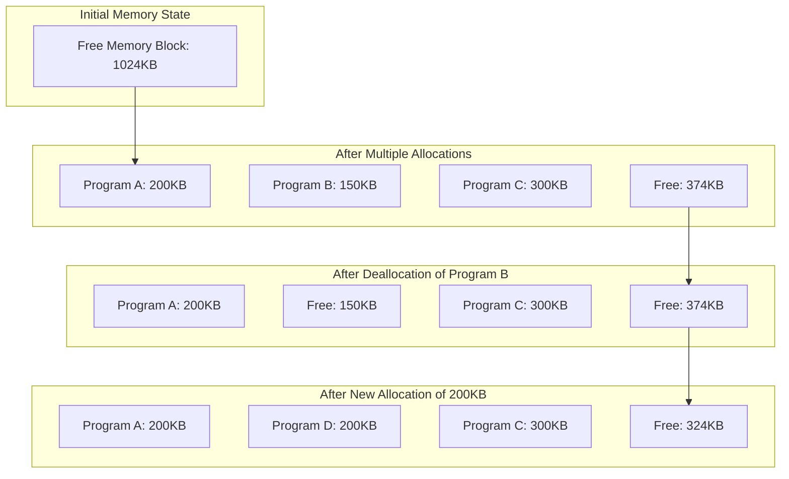
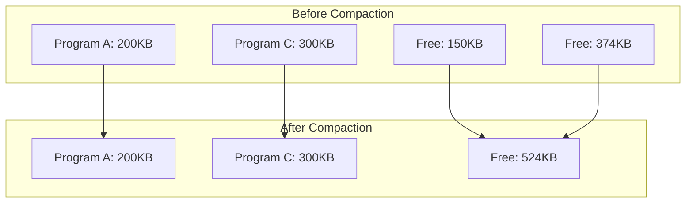
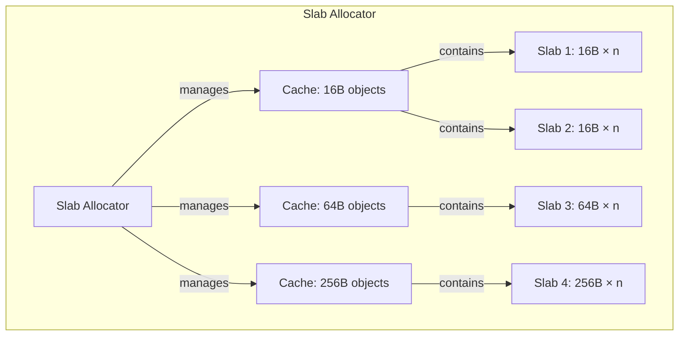

# Memory Fragmentation

## Introduction

Memory fragmentation is a condition that occurs in computer systems when memory allocations and deallocations leave the available memory space divided into small, non-contiguous blocks. This phenomenon is similar to having many small empty parking spaces throughout a parking lot, but none large enough to fit a bus—even though the total free space would be sufficient.

For beginner programmers, understanding memory fragmentation is crucial because it can significantly impact program performance and stability, especially in long-running applications or systems with limited resources.

## What is Memory Fragmentation?

Memory fragmentation occurs when the free memory space becomes divided into small, scattered chunks rather than one contiguous block. This happens over time as memory is repeatedly allocated and deallocated during program execution.

There are two main types of memory fragmentation:

### External Fragmentation

External fragmentation occurs when free memory space is available in small, non-contiguous blocks. While the total free memory might be sufficient for a request, no single block is large enough to fulfill it.

### Internal Fragmentation

Internal fragmentation happens when memory is allocated in fixed-size blocks, and the requested amount doesn't perfectly match the block size. The unused portion of the allocated block becomes wasted space.

## Visualizing Fragmentation

Let's visualize how memory fragmentation develops over time:



In this example, even though we have 150KB + 374KB = 524KB of free memory after Program B is deallocated, we can't allocate a contiguous 400KB block because the free memory is fragmented.

## Code Example: Demonstrating Fragmentation

Let's see how memory fragmentation might manifest in C programming:

```c
#include <stdio.h>
#include <stdlib.h>

int main() {
    const int ALLOC_SIZE = 100;
    const int NUM_ALLOCS = 10;
    
    // Array to store pointers to allocated memory
    void *pointers[NUM_ALLOCS];
    
    // Allocate memory blocks
    printf("Allocating %d blocks of %d bytes...
", NUM_ALLOCS, ALLOC_SIZE);
    for (int i = 0; i < NUM_ALLOCS; i++) {
        pointers[i] = malloc(ALLOC_SIZE);
        printf("Block %d allocated at address: %p
", i, pointers[i]);
    }
    
    // Free every other block to create fragmentation
    printf("
Freeing every other block to create fragmentation...
");
    for (int i = 0; i < NUM_ALLOCS; i += 2) {
        printf("Freeing block %d at address: %p
", i, pointers[i]);
        free(pointers[i]);
        pointers[i] = NULL;
    }
    
    // Try to allocate a larger block
    int large_size = ALLOC_SIZE * (NUM_ALLOCS / 2 + 1);
    printf("
Attempting to allocate a large block of %d bytes...
", large_size);
    void *large_block = malloc(large_size);
    
    if (large_block != NULL) {
        printf("Successfully allocated large block at address: %p
", large_block);
        free(large_block);
    } else {
        printf("Failed to allocate large block despite having enough total free memory!
");
        printf("This demonstrates the impact of memory fragmentation.
");
    }
    
    // Clean up remaining blocks
    for (int i = 1; i < NUM_ALLOCS; i += 2) {
        if (pointers[i] != NULL) {
            free(pointers[i]);
        }
    }
    
    return 0;
}
```

Possible Output:
```
Allocating 10 blocks of 100 bytes...
Block 0 allocated at address: 0x55a3e4dbc2a0
Block 1 allocated at address: 0x55a3e4dbc310
Block 2 allocated at address: 0x55a3e4dbc380
Block 3 allocated at address: 0x55a3e4dbc3f0
Block 4 allocated at address: 0x55a3e4dbc460
Block 5 allocated at address: 0x55a3e4dbc4d0
Block 6 allocated at address: 0x55a3e4dbc540
Block 7 allocated at address: 0x55a3e4dbc5b0
Block 8 allocated at address: 0x55a3e4dbc620
Block 9 allocated at address: 0x55a3e4dbc690

Freeing every other block to create fragmentation...
Freeing block 0 at address: 0x55a3e4dbc2a0
Freeing block 2 at address: 0x55a3e4dbc380
Freeing block 4 at address: 0x55a3e4dbc460
Freeing block 6 at address: 0x55a3e4dbc540
Freeing block 8 at address: 0x55a3e4dbc620

Attempting to allocate a large block of 600 bytes...
Failed to allocate large block despite having enough total free memory!
This demonstrates the impact of memory fragmentation.
```

Note: The actual output may vary depending on the system's memory allocator. Some modern allocators have sophisticated strategies to minimize fragmentation and might actually succeed in allocating the large block in this simple example.

## Causes of Memory Fragmentation

1. **Variable-Sized Allocations**: When programs allocate memory blocks of different sizes.
2. **Random Deallocation Order**: When memory is not freed in the same order it was allocated.
3. **Long-Running Programs**: Applications that run for extended periods accumulate more fragmentation.
4. **Inefficient Memory Allocation Algorithms**: Some algorithms are more prone to fragmentation than others.

## Impact of Memory Fragmentation

Memory fragmentation can lead to several problems:

1. **Memory Allocation Failures**: Programs may fail to allocate memory despite sufficient total free memory.
2. **Performance Degradation**: The system spends more time searching for suitable memory blocks.
3. **Increased Memory Usage**: Internal fragmentation wastes memory that could be used for other purposes.
4. **System Instability**: Severe fragmentation can lead to system crashes or unpredictable behavior.

## Practical Example: Memory Fragmentation in a Game

Consider a simple game that allocates and deallocates memory for game objects:

```cpp
#include <iostream>
#include <vector>
#include <cstdlib>
#include <ctime>

class GameObject {
private:
    char* data;
    size_t size;

public:
    GameObject(size_t objSize) : size(objSize) {
        data = new char[size];
        std::cout << "Created object of size " << size << " bytes at " << (void*)data << std::endl;
    }

    ~GameObject() {
        std::cout << "Destroyed object at " << (void*)data << std::endl;
        delete[] data;
    }

    size_t getSize() const { return size; }
};

int main() {
    srand(time(NULL));
    std::vector<GameObject*> gameObjects;
    
    std::cout << "--- Game Starting ---" << std::endl;
    
    // Simulate game loop with object creation and destruction
    for (int frame = 0; frame < 10; frame++) {
        std::cout << "
Frame " << frame << ":" << std::endl;
        
        // Create 1-3 new objects with random sizes
        int newObjects = rand() % 3 + 1;
        for (int i = 0; i < newObjects; i++) {
            size_t objSize = (rand() % 100 + 1) * 1024; // 1KB to 100KB
            gameObjects.push_back(new GameObject(objSize));
        }
        
        // Randomly destroy some objects
        if (frame > 0 && !gameObjects.empty()) {
            int objectsToRemove = rand() % std::min(3, static_cast<int>(gameObjects.size()));
            for (int i = 0; i < objectsToRemove; i++) {
                int index = rand() % gameObjects.size();
                delete gameObjects[index];
                gameObjects.erase(gameObjects.begin() + index);
            }
        }
        
        // Calculate total memory used
        size_t totalMemory = 0;
        for (const auto& obj : gameObjects) {
            totalMemory += obj->getSize();
        }
        std::cout << "Active objects: " << gameObjects.size() 
                  << ", Total memory: " << totalMemory / 1024 << "KB" << std::endl;
    }
    
    // Cleanup
    for (auto obj : gameObjects) {
        delete obj;
    }
    
    std::cout << "
--- Game Ended ---" << std::endl;
    return 0;
}
```

This example demonstrates how a game might create and destroy objects of varying sizes, potentially leading to memory fragmentation over time.

## Techniques to Manage Memory Fragmentation

### 1. Memory Pools

Memory pools pre-allocate a large block of memory and divide it into fixed-size chunks. This eliminates external fragmentation within the pool.

```c
#include <stdio.h>
#include <stdlib.h>
#include <stdbool.h>

#define POOL_SIZE 1024
#define CHUNK_SIZE 64
#define NUM_CHUNKS (POOL_SIZE / CHUNK_SIZE)

typedef struct {
    char memory[POOL_SIZE];
    bool used[NUM_CHUNKS];
} MemoryPool;

MemoryPool* createPool() {
    MemoryPool* pool = (MemoryPool*)malloc(sizeof(MemoryPool));
    for (int i = 0; i < NUM_CHUNKS; i++) {
        pool->used[i] = false;
    }
    return pool;
}

void* poolAlloc(MemoryPool* pool) {
    for (int i = 0; i < NUM_CHUNKS; i++) {
        if (!pool->used[i]) {
            pool->used[i] = true;
            return &pool->memory[i * CHUNK_SIZE];
        }
    }
    return NULL; // Pool is full
}

void poolFree(MemoryPool* pool, void* ptr) {
    if (ptr == NULL) return;
    
    // Calculate chunk index
    ptrdiff_t offset = (char*)ptr - pool->memory;
    int index = offset / CHUNK_SIZE;
    
    if (index >= 0 && index < NUM_CHUNKS) {
        pool->used[index] = false;
    }
}

void destroyPool(MemoryPool* pool) {
    free(pool);
}

int main() {
    MemoryPool* pool = createPool();
    
    // Allocate some chunks
    void* chunk1 = poolAlloc(pool);
    void* chunk2 = poolAlloc(pool);
    void* chunk3 = poolAlloc(pool);
    
    printf("Allocated chunks at: %p, %p, %p
", chunk1, chunk2, chunk3);
    
    // Free middle chunk
    poolFree(pool, chunk2);
    printf("Freed chunk at: %p
", chunk2);
    
    // Allocate a new chunk - will reuse the freed space
    void* chunk4 = poolAlloc(pool);
    printf("New allocation at: %p
", chunk4);
    
    // Clean up
    destroyPool(pool);
    
    return 0;
}
```

### 2. Object Pooling

Object pooling is a higher-level technique that reuses objects instead of destroying and recreating them.

```cpp
#include <iostream>
#include <vector>
#include <memory>

class Particle {
private:
    float x, y;
    float velocity;
    bool active;

public:
    Particle() : x(0), y(0), velocity(0), active(false) {}
    
    void initialize(float startX, float startY, float vel) {
        x = startX;
        y = startY;
        velocity = vel;
        active = true;
    }
    
    void update() {
        if (active) {
            y += velocity;
            
            // Deactivate if it goes off screen
            if (y > 100.0f) {
                active = false;
            }
        }
    }
    
    bool isActive() const { return active; }
    
    void reset() { active = false; }
};

class ParticlePool {
private:
    std::vector<std::unique_ptr<Particle>> particles;
    size_t poolSize;

public:
    ParticlePool(size_t size) : poolSize(size) {
        // Pre-allocate all particles
        particles.reserve(poolSize);
        for (size_t i = 0; i < poolSize; i++) {
            particles.push_back(std::make_unique<Particle>());
        }
        std::cout << "Created pool with " << poolSize << " particles" << std::endl;
    }
    
    Particle* getParticle() {
        // Find an inactive particle
        for (auto& particle : particles) {
            if (!particle->isActive()) {
                return particle.get();
            }
        }
        std::cout << "Warning: No free particles available!" << std::endl;
        return nullptr;
    }
    
    void updateAll() {
        int active = 0;
        for (auto& particle : particles) {
            if (particle->isActive()) {
                particle->update();
                active++;
            }
        }
        std::cout << "Active particles: " << active << "/" << poolSize << std::endl;
    }
};

int main() {
    // Create a particle pool
    ParticlePool pool(100);
    
    // Simulate a game loop
    for (int frame = 0; frame < 5; frame++) {
        std::cout << "
Frame " << frame << ":" << std::endl;
        
        // Create some new particles
        for (int i = 0; i < 10; i++) {
            Particle* p = pool.getParticle();
            if (p) {
                p->initialize(i * 10.0f, 0.0f, 1.0f + (i % 5));
            }
        }
        
        // Update all particles
        pool.updateAll();
    }
    
    return 0;
}
```

### 3. Memory Compaction

Memory compaction involves moving allocated blocks to create contiguous free space.



This technique is commonly used in garbage-collected languages like Java and C#.

### 4. Slab Allocation

Slab allocation divides memory into caches of fixed-size objects, reducing internal fragmentation.



### 5. Buddy Allocation System

The buddy system divides memory into blocks of power-of-two sizes, making it easier to find the right-sized block.

```c
#include <stdio.h>
#include <stdlib.h>
#include <stdbool.h>

#define MIN_BLOCK_SIZE 16
#define MAX_BLOCK_SIZE 1024
#define NUM_LEVELS (5) // 16, 32, 64, 128, 256

typedef struct Block {
    size_t size;
    bool used;
    struct Block* buddy;
    struct Block* next;
} Block;

typedef struct {
    Block* free_lists[NUM_LEVELS];
} BuddyAllocator;

int log2(size_t size) {
    int power = 0;
    while (size > 1) {
        size >>= 1;
        power++;
    }
    return power;
}

BuddyAllocator* createBuddyAllocator() {
    BuddyAllocator* allocator = (BuddyAllocator*)malloc(sizeof(BuddyAllocator));
    
    // Initialize free lists
    for (int i = 0; i < NUM_LEVELS; i++) {
        allocator->free_lists[i] = NULL;
    }
    
    // Create the initial block
    Block* block = (Block*)malloc(sizeof(Block) + MAX_BLOCK_SIZE);
    block->size = MAX_BLOCK_SIZE;
    block->used = false;
    block->buddy = NULL;
    block->next = NULL;
    
    // Add to the appropriate free list
    int level = log2(MAX_BLOCK_SIZE / MIN_BLOCK_SIZE);
    allocator->free_lists[level] = block;
    
    return allocator;
}

void* buddyAlloc(BuddyAllocator* allocator, size_t size) {
    // Round up to the next power of 2
    size_t actual_size = MIN_BLOCK_SIZE;
    while (actual_size < size && actual_size < MAX_BLOCK_SIZE) {
        actual_size *= 2;
    }
    
    // Find the appropriate level
    int level = log2(actual_size / MIN_BLOCK_SIZE);
    
    // Find a free block
    Block* block = NULL;
    
    // Look for a block at the requested level
    if (allocator->free_lists[level] != NULL) {
        block = allocator->free_lists[level];
        allocator->free_lists[level] = block->next;
    } else {
        // Look for a larger block to split
        for (int i = level + 1; i < NUM_LEVELS; i++) {
            if (allocator->free_lists[i] != NULL) {
                // Found a larger block
                Block* larger_block = allocator->free_lists[i];
                allocator->free_lists[i] = larger_block->next;
                
                // Split the block and add one half to the free list
                size_t new_size = larger_block->size / 2;
                Block* buddy = (Block*)((char*)(larger_block + 1) + new_size);
                
                buddy->size = new_size;
                buddy->used = false;
                buddy->buddy = larger_block;
                buddy->next = allocator->free_lists[i - 1];
                allocator->free_lists[i - 1] = buddy;
                
                larger_block->size = new_size;
                larger_block->buddy = buddy;
                
                // Continue splitting if needed
                if (i - 1 > level) {
                    allocator->free_lists[i - 1] = larger_block;
                    continue;
                } else {
                    block = larger_block;
                    break;
                }
            }
        }
    }
    
    if (block) {
        block->used = true;
        return (void*)(block + 1); // Return pointer to the memory after the header
    }
    
    return NULL; // No suitable block found
}

void buddyFree(BuddyAllocator* allocator, void* ptr) {
    if (ptr == NULL) return;
    
    // Get the block header
    Block* block = ((Block*)ptr) - 1;
    block->used = false;
    
    // Check if we can merge with the buddy
    Block* buddy = block->buddy;
    
    if (buddy != NULL && !buddy->used) {
        // Remove buddy from its free list
        int buddy_level = log2(buddy->size / MIN_BLOCK_SIZE);
        Block** list = &allocator->free_lists[buddy_level];
        
        while (*list != NULL) {
            if (*list == buddy) {
                *list = buddy->next;
                break;
            }
            list = &((*list)->next);
        }
        
        // Merge blocks
        Block* merged = (block < buddy) ? block : buddy;
        merged->size *= 2;
        merged->buddy = NULL; // Will be set when we add to free list
        
        // Recursively free the merged block
        int merged_level = log2(merged->size / MIN_BLOCK_SIZE);
        merged->next = allocator->free_lists[merged_level];
        allocator->free_lists[merged_level] = merged;
    } else {
        // Add to appropriate free list
        int level = log2(block->size / MIN_BLOCK_SIZE);
        block->next = allocator->free_lists[level];
        allocator->free_lists[level] = block;
    }
}

void destroyBuddyAllocator(BuddyAllocator* allocator) {
    // This is simplified - a real implementation would track and free all blocks
    free(allocator);
}

int main() {
    BuddyAllocator* allocator = createBuddyAllocator();
    
    // Allocate memory
    void* ptr1 = buddyAlloc(allocator, 30);  // Will use a 32-byte block
    void* ptr2 = buddyAlloc(allocator, 64);  // Will use a 64-byte block
    void* ptr3 = buddyAlloc(allocator, 128); // Will use a 128-byte block
    
    printf("Allocated memory at: %p, %p, %p
", ptr1, ptr2, ptr3);
    
    // Free memory
    buddyFree(allocator, ptr2);
    printf("Freed memory at: %p
", ptr2);
    
    // Allocate again - should reuse the freed 64-byte block
    void* ptr4 = buddyAlloc(allocator, 64);
    printf("Reallocated at: %p
", ptr4);
    
    // Clean up
    buddyFree(allocator, ptr1);
    buddyFree(allocator, ptr3);
    buddyFree(allocator, ptr4);
    destroyBuddyAllocator(allocator);
    
    return 0;
}
```

## Real-World Applications

Memory fragmentation is a critical concern in various computing environments:

1. **Embedded Systems**: Limited memory resources make fragmentation management essential.
2. **Game Development**: Games need to maintain smooth performance over long play sessions.
3. **Server Applications**: High-traffic servers need efficient memory management for stability.
4. **Mobile Applications**: Mobile devices have limited resources and need to avoid excessive memory usage.

## Summary

Memory fragmentation is a common issue in computer systems where memory becomes divided into small, non-contiguous blocks. It occurs in two main forms:

1. **External fragmentation**: Free memory exists in scattered blocks that are too small individually.
2. **Internal fragmentation**: Fixed-size allocations waste space when the requested size is smaller than the block.

To combat fragmentation, programmers can employ several techniques:
- Memory pools and object pools
- Memory compaction (often in garbage-collected languages)
- Specialized allocation algorithms like the buddy system or slab allocator
- Careful design of memory allocation patterns

Understanding memory fragmentation is essential for writing efficient and stable programs, especially for systems with limited resources or long-running applications.

## Exercises

1. Implement a simple memory pool allocator that can allocate fixed-size objects and measure its performance against standard `malloc` and `free`.

2. Write a program that demonstrates the difference between internal and external fragmentation using visual representation.

3. Research and compare how different programming languages and their runtime environments handle memory fragmentation.

4. Modify the buddy allocation system example to include better error handling and debugging capabilities.

5. Benchmark a real application before and after implementing anti-fragmentation techniques.

## Additional Resources

- **Books**:
  - "The Art of Computer Programming, Volume 1: Fundamental Algorithms" by Donald E. Knuth
  - "Modern Operating Systems" by Andrew S. Tanenbaum

- **Online Resources**:
  - The [GNU C Library](https://www.gnu.org/software/libc/manual/html_node/Memory-Allocation.html) documentation on memory allocation
  - [Memory Pool System](https://www.ravenbrook.com/project/mps/) - An open-source memory management system

- **Academic Papers**:
  - "Dynamic Storage Allocation: A Survey and Critical Review" by Paul R. Wilson et al.
  - "A Memory Allocator" by Doug Lea