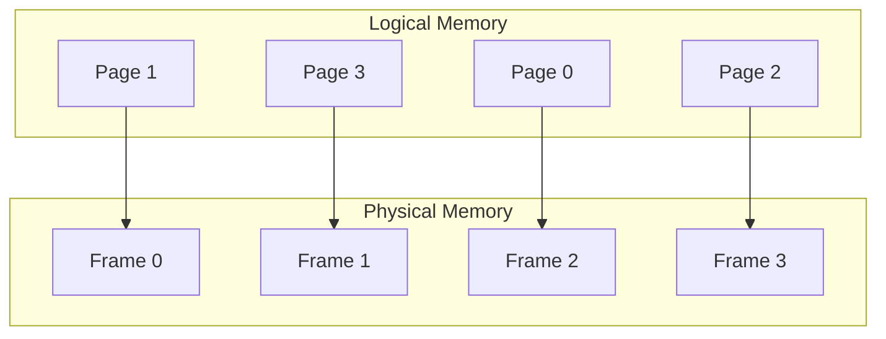

# Paging

## Introduction

Paging is a memory management scheme that eliminates the need for contiguous allocation of physical memory. It is one of the most important concepts in modern operating systems, allowing programs to use more memory than physically available and providing protection between different processes.

In a paging system, the computer's physical memory is divided into fixed-size blocks called **frames**, while the program's logical memory is divided into blocks of the same size called **pages**. When a program needs to be executed, its pages are loaded into available frames in physical memory, not necessarily in a contiguous manner.

## How Paging Works

### Basic Concept

The core idea of paging is to break memory into fixed-size chunks, which simplifies memory allocation and reduces external fragmentation.



### Address Translation

In a paging system, every address generated by the CPU is divided into two parts:
- **Page number (p)**: Used as an index to the page table to find the corresponding frame
- **Page offset (d)**: Combined with the frame number to define the physical memory address

```
Logical Address = Page Number (p) + Page Offset (d)
Physical Address = Frame Number (f) + Page Offset (d)
```

Let's work through a simple example:

- Assume a logical address space of 32 bytes with page size of 4 bytes
- This gives us 8 pages (0-7)
- If logical address 13 is accessed, we calculate:
  - Page number = 13 ÷ 4 = 3 (integer division)
  - Page offset = 13 % 4 = 1

- If page 3 is mapped to frame 1:
  - Physical address = (1 × 4) + 1 = 5

### Page Table

The page table maintains the mapping between pages and frames. Each entry in the page table contains:

1. **Frame number**: The physical frame where the page is stored
2. **Present/absent bit**: Indicates if the page is in memory or on disk
3. **Protection bits**: Control read/write/execute permissions
4. **Modified bit (dirty bit)**: Indicates if the page has been modified
5. **Referenced bit**: Tracks if the page has been accessed

## Implementation in Code

Let's look at a simplified implementation of address translation in C:

```c
#include <stdio.h>
#include <stdlib.h>

#define PAGE_SIZE 1024        // 1KB page size
#define NUM_PAGES 10          // Total pages in logical address space
#define NUM_FRAMES 8          // Total frames in physical memory

// Page table structure
typedef struct {
    int frame_number;         // Frame number where the page is stored
    int present;              // 1 if in memory, 0 if on disk
    int modified;             // 1 if modified since loaded
    int referenced;           // 1 if accessed recently
} PageTableEntry;

PageTableEntry page_table[NUM_PAGES];

// Initialize page table (normally done by OS)
void initialize_page_table() {
    // Set up a sample mapping
    page_table[0] = (PageTableEntry){2, 1, 0, 0};
    page_table[1] = (PageTableEntry){4, 1, 0, 0};
    page_table[2] = (PageTableEntry){-1, 0, 0, 0}; // Not in memory
    page_table[3] = (PageTableEntry){0, 1, 0, 0};
    page_table[4] = (PageTableEntry){6, 1, 1, 1};
    page_table[5] = (PageTableEntry){-1, 0, 0, 0}; // Not in memory
    page_table[6] = (PageTableEntry){1, 1, 0, 1};
    page_table[7] = (PageTableEntry){5, 1, 1, 0};
    page_table[8] = (PageTableEntry){7, 1, 0, 0};
    page_table[9] = (PageTableEntry){3, 1, 0, 1};
}

// Translate logical address to physical address
int translate_address(int logical_address) {
    // Extract page number and offset
    int page_number = logical_address / PAGE_SIZE;
    int offset = logical_address % PAGE_SIZE;
    
    printf("Logical address %d contains:
", logical_address);
    printf("  Page number = %d
", page_number);
    printf("  Offset = %d
", offset);
    
    // Check if page is in memory
    if (page_number >= NUM_PAGES) {
        printf("Error: Page number exceeds address space
");
        return -1;
    }
    
    if (!page_table[page_number].present) {
        printf("Page fault! Page %d is not in memory
", page_number);
        // Here, the OS would typically handle the page fault
        // by loading the page from disk
        return -1;
    }
    
    // Get frame number from page table
    int frame_number = page_table[page_number].frame_number;
    
    // Calculate physical address
    int physical_address = frame_number * PAGE_SIZE + offset;
    
    // Mark as referenced
    page_table[page_number].referenced = 1;
    
    return physical_address;
}

int main() {
    initialize_page_table();
    
    // Test some address translations
    int test_addresses[] = {500, 1500, 2500, 9876};
    
    for (int i = 0; i < 4; i++) {
        printf("
--- Address Translation Example %d ---
", i+1);
        int physical = translate_address(test_addresses[i]);
        if (physical != -1) {
            printf("Physical address = %d
", physical);
        }
    }
    
    return 0;
}
```

**Output:**
```
--- Address Translation Example 1 ---
Logical address 500 contains:
  Page number = 0
  Offset = 500
Physical address = 2500

--- Address Translation Example 2 ---
Logical address 1500 contains:
  Page number = 1
  Offset = 476
Physical address = 4476

--- Address Translation Example 3 ---
Logical address 2500 contains:
  Page number = 2
  Offset = 452
Page fault! Page 2 is not in memory

--- Address Translation Example 4 ---
Logical address 9876 contains:
  Page number = 9
  Offset = 628
Physical address = 3700
```

## Page Faults and Page Replacement

When a process tries to access a page that is not in memory (present bit = 0), a **page fault** occurs. The operating system must:

1. Find the page on disk
2. Find a free frame (or make one free by page replacement)
3. Load the page into the frame
4. Update the page table
5. Restart the instruction that caused the page fault

When physical memory is full, the operating system must choose which page to replace using a page replacement algorithm. Common algorithms include:

- **First-In-First-Out (FIFO)**: Replace the oldest page
- **Least Recently Used (LRU)**: Replace the page that hasn't been used for the longest time
- **Least Frequently Used (LFU)**: Replace the page with the smallest reference count

## Advantages of Paging

1. **Eliminates External Fragmentation**: Physical memory doesn't need to be contiguous
2. **Simplifies Memory Allocation**: Fixed-size pages are easier to manage
3. **Supports Virtual Memory**: Allows programs to use more memory than physically available
4. **Memory Protection**: Each process can only access its own pages

## Disadvantages of Paging

1. **Internal Fragmentation**: The last page of a process might not be fully utilized
2. **Page Table Overhead**: Page tables consume memory
3. **Performance Impact**: Address translation adds processing overhead

## Practical Example: Paging in Modern Operating Systems

Modern operating systems like Linux, Windows, and macOS all use paging for memory management. Let's look at how you might observe paging in action on Linux:

```bash
# View memory statistics including paging information
$ free -m
              total        used        free      shared  buff/cache   available
Mem:          15895        5623        2305         815        7967        9049
Swap:          8191           0        8191

# View detailed paging statistics
$ vmstat
procs -----------memory---------- ---swap-- -----io---- -system-- ------cpu-----
 r  b   swpd   free   buff  cache   si   so    bi    bo   in   cs us sy id wa st
 1  0      0 2361940 589172 7568024    0    0     3     5   96  226  2  1 97  0  0

# Check page faults for a process
$ ps -o pid,min_flt,maj_flt -p 1234
  PID  MINFL  MAJFL
 1234   1250      7
```

In this example:
- `free -m` shows memory usage including swap space (used for paging to disk)
- `vmstat` shows swap in (si) and swap out (so) statistics, representing pages moved between memory and disk
- `ps` with min_flt and maj_flt shows minor and major page faults for process 1234

## Optimizing for Paging Systems

When developing applications for systems that use paging, consider these best practices:

1. **Improve Locality of Reference**: Keep related data close together to minimize page faults
2. **Be Mindful of Memory Access Patterns**: Sequential access is often more efficient than random access
3. **Consider Page Sizes**: Align data structures to page boundaries for critical sections
4. **Manage Working Set Size**: Try to keep the active memory footprint within available physical memory

## Summary

Paging is a fundamental memory management mechanism that divides physical memory into fixed-size frames and logical memory into pages of the same size. This approach enables:

- Non-contiguous memory allocation
- Virtual memory implementation
- Memory protection between processes
- Efficient memory utilization

The key components of a paging system include the page table, address translation mechanism, and page replacement algorithms. While paging introduces some overhead for address translation and can cause internal fragmentation, its benefits for memory management far outweigh these drawbacks in modern computing systems.

## Additional Resources

To deepen your understanding of paging:

1. Try implementing a simple page replacement algorithm simulator
2. Experiment with different page sizes and observe the effects on fragmentation and performance
3. Research how modern processors use Translation Lookaside Buffers (TLBs) to speed up page table lookups
4. Explore how operating systems handle large page tables through hierarchical or inverted page tables

## Exercises

1. Calculate the physical address for logical address 5432 in a system with 1KB page size and the following page table: Page 5 → Frame 3
2. If a 32-bit system uses 4KB pages, how many bits are used for the page number and offset?
3. Implement a simple FIFO page replacement algorithm in the language of your choice
4. Compare the page fault rates of FIFO and LRU algorithms with a given memory access pattern