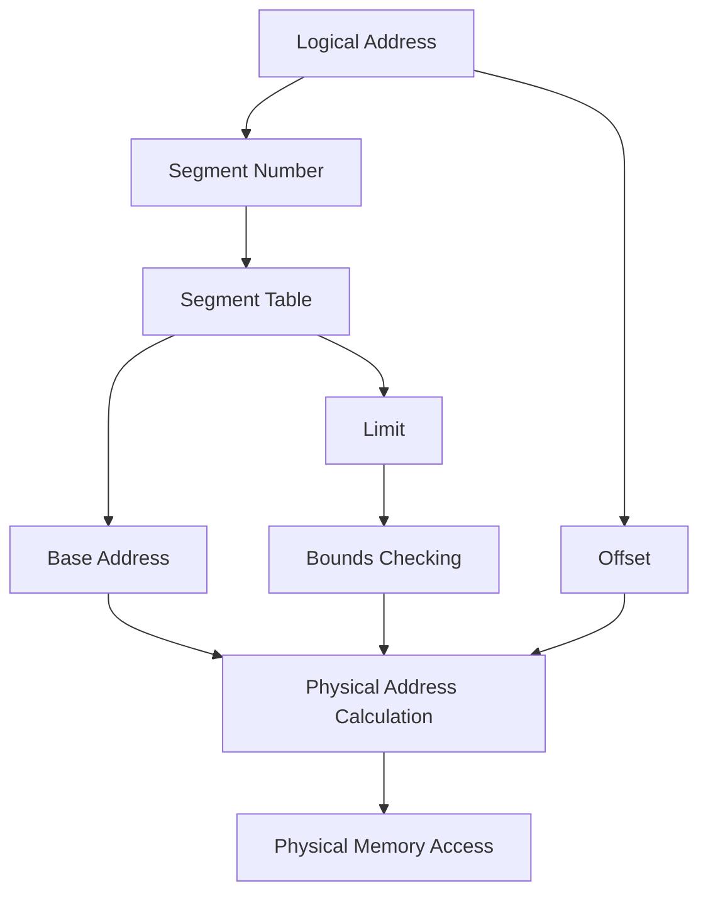
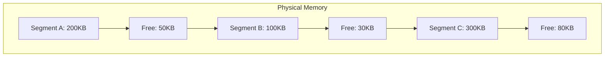

# Segmentation

## Introduction

Segmentation is a memory management technique that divides the computer's memory into segments of varying sizes. Unlike paging (which splits memory into fixed-size blocks), segmentation divides memory based on the logical structure of programs and data. Each segment represents a specific type of data or code, such as the stack, heap, code segment, or data segment.

This approach allows the operating system to manage memory more flexibly by allocating space that matches the actual needs of different program components rather than forcing everything into fixed-size frames.

## How Segmentation Works

In a segmented memory system, memory references consist of two parts:
- **Segment identifier** (or segment number)
- **Offset** within the segment

The system maintains a **segment table** that maps segment identifiers to physical memory locations.



### Addressing Mechanism

When a program references memory, the following happens:

1. The memory reference is split into a segment number and an offset
2. The segment number is used as an index into the segment table
3. The system retrieves the base address of the segment
4. The system checks if the offset is within the segment's limits
5. If valid, the physical address is calculated by adding the base address to the offset
6. The memory access proceeds using the calculated physical address

Let's look at a concrete example:

```c
// Logical memory reference
// Segment 2, Offset 74

// Segment table lookup
Segment 2: Base = 4000, Limit = 200

// Check if offset is valid
if (Offset 74 < Limit 200) {
    // Valid access, calculate physical address
    Physical address = Base + Offset = 4000 + 74 = 4074
} else {
    // Invalid access, generate segmentation fault
    raise SegmentationFault;
}
```

## Segment Table Structure

A segment table entry typically contains:

- **Base address**: The starting physical address of the segment
- **Limit**: The length of the segment
- **Protection bits**: Read/write/execute permissions
- **Presence bit**: Indicates if the segment is in physical memory
- **Other information**: Sharing, caching policy, etc.

```c
struct SegmentTableEntry {
    unsigned int base_address;  // Starting physical address
    unsigned int limit;         // Length of segment
    bool present;               // Is segment in memory?
    bool readable;              // Can be read?
    bool writable;              // Can be written?
    bool executable;            // Can be executed?
    // Other management bits
};
```

## Advantages of Segmentation

### 1. Logical Division of Memory

Segmentation aligns with how programmers think about their programs. Common segments include:

- **Code segment (text)**: Contains executable instructions
- **Data segment**: Contains initialized global variables
- **BSS segment**: Contains uninitialized global variables
- **Stack segment**: Contains function call frames, local variables
- **Heap segment**: Contains dynamically allocated memory

### 2. Protection and Sharing

Segmentation facilitates memory protection and sharing:

- Different protection levels can be set for different segments (read-only code, read-write data)
- Segments can be shared between processes (e.g., shared libraries)
- Memory isolation becomes more natural and efficient

### 3. Dynamic Growth

Some segments (like stack and heap) need to grow dynamically:

- Segmentation allows segments to grow up to their maximum limit
- No need to allocate the maximum size upfront, saving memory

## Disadvantages of Segmentation

### 1. External Fragmentation

The primary disadvantage of segmentation is external fragmentation:



When segments of different sizes are allocated and deallocated over time, small, unusable gaps form between segments. A new segment might not fit in any single free space, even though the total free memory is sufficient.

### 2. Complexity

- More complex than simple contiguous allocation
- Requires hardware support for efficient implementation
- Memory allocation algorithms need to find suitable spaces for segments

## Implementation Example

Let's implement a simple segmentation system in C:

```c
#define MAX_SEGMENTS 10

// Structure representing physical memory
typedef struct {
    char* memory;
    int size;
} PhysicalMemory;

// Structure representing a segment
typedef struct {
    int base;       // Base address
    int limit;      // Segment size
    bool allocated; // Is this segment allocated?
} Segment;

// Structure representing the segment table
typedef struct {
    Segment segments[MAX_SEGMENTS];
    int count;      // Number of segments in use
} SegmentTable;

// Initialize physical memory
PhysicalMemory initMemory(int size) {
    PhysicalMemory mem;
    mem.size = size;
    mem.memory = (char*)malloc(size);
    return mem;
}

// Initialize segment table
SegmentTable initSegmentTable() {
    SegmentTable table;
    table.count = 0;
    for (int i = 0; i < MAX_SEGMENTS; i++) {
        table.segments[i].allocated = false;
    }
    return table;
}

// Allocate a new segment
int allocateSegment(SegmentTable* table, PhysicalMemory* memory, int size) {
    // Simple first-fit algorithm
    int currentPos = 0;
    
    while (currentPos < memory->size) {
        // Check if we can fit a segment here
        int freeSpace = 0;
        int startPos = currentPos;
        
        // Count contiguous free space
        while (currentPos < memory->size && isFree(memory, currentPos)) {
            freeSpace++;
            currentPos++;
        }
        
        // If we found enough space
        if (freeSpace >= size) {
            // Create a new segment
            int segmentId = table->count++;
            table->segments[segmentId].base = startPos;
            table->segments[segmentId].limit = size;
            table->segments[segmentId].allocated = true;
            
            // Mark memory as used
            markUsed(memory, startPos, size);
            
            return segmentId;
        }
        
        // Skip over used memory
        while (currentPos < memory->size && !isFree(memory, currentPos)) {
            currentPos++;
        }
    }
    
    // No suitable space found
    return -1;
}

// Access memory using segmentation
char readMemory(SegmentTable* table, PhysicalMemory* memory, int segment, int offset) {
    // Check if segment exists
    if (segment >= table->count || !table->segments[segment].allocated) {
        printf("Invalid segment access
");
        exit(1);
    }
    
    // Check if offset is within segment bounds
    if (offset >= table->segments[segment].limit) {
        printf("Segmentation fault: offset beyond segment limit
");
        exit(1);
    }
    
    // Calculate physical address
    int physicalAddress = table->segments[segment].base + offset;
    
    // Return memory content
    return memory->memory[physicalAddress];
}
```

## Real-World Applications

### 1. Intel x86 Segmentation

The Intel x86 architecture has hardware support for segmentation:

- Segment selectors (16-bit values) identify segments
- Global Descriptor Table (GDT) and Local Descriptor Table (LDT) store segment descriptors
- Each segment has base address, limit, and protection flags

```c
// Simplified x86 segment descriptor structure
struct x86SegmentDescriptor {
    uint16_t limit_low;      // Lower 16 bits of limit
    uint16_t base_low;       // Lower 16 bits of base address
    uint8_t base_middle;     // Next 8 bits of base address
    uint8_t access;          // Access flags (readable, writable, etc.)
    uint8_t granularity;     // Granularity and upper 4 bits of limit
    uint8_t base_high;       // Upper 8 bits of base address
};
```

### 2. Modern Use of Segmentation

While pure segmentation is less common in modern systems, hybrid approaches exist:

- Many modern operating systems use a flat memory model with segments that overlap
- Segmentation is often used alongside paging for memory protection
- In protected mode, segments provide an additional layer of protection

## Segmentation vs. Paging

Let's compare segmentation with another common memory management technique, paging:

| Feature | Segmentation | Paging |
|---------|--------------|--------|
| Division basis | Logical structure | Fixed-size blocks |
| Size | Variable | Fixed |
| Fragmentation | External | Internal |
| Address structure | Segment + offset | Page number + offset |
| Hardware needs | Segment table | Page table |
| Program view | Visible to programmer | Transparent |
| Sharing | Segment level | Page level |
| Protection | Segment level | Page level |

## Summary

Segmentation is a memory management technique that:

- Divides memory into variable-sized segments based on logical program structure
- Uses a segment table to map segment numbers and offsets to physical addresses
- Provides natural protection and sharing at the segment level
- Suffers from external fragmentation as a primary drawback
- Is often used in combination with other memory management techniques like paging

Through segmentation, operating systems can better match memory allocation to the logical structure of programs, potentially reducing wasted space while providing appropriate protection mechanisms.

## Exercises

1. Implement a memory allocator that uses segmentation to track and allocate blocks of memory.
2. Design a segment table structure that includes additional protection bits and access tracking.
3. Compare the memory efficiency of a segmented memory system versus a paged memory system for a program with varying allocation sizes.
4. Trace through the execution of a program in a segmented memory system, showing how addresses are translated and how protection faults might occur.
5. Research how modern operating systems use segmentation concepts even in predominantly paged memory systems.

## Additional Resources

- Operating Systems: Three Easy Pieces (Chapter on Segmentation)
- Modern Operating Systems by Andrew S. Tanenbaum
- Intel x86 Architecture Manuals for details on hardware-supported segmentation
- Linux and Windows kernel documentation on memory management