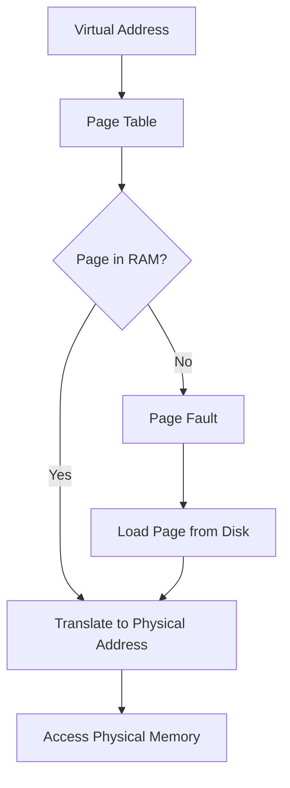
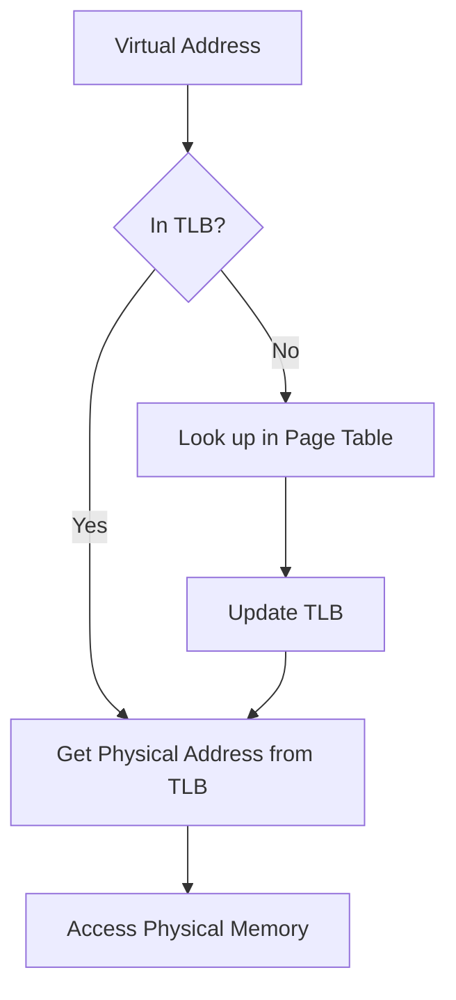

# Virtual Memory

## Introduction

Virtual memory is one of the most important concepts in modern operating systems, yet it often remains mysterious to beginning programmers. At its core, virtual memory is a memory management technique that provides an idealized abstraction of the storage resources that are actually available on a given machine. This allows developers to use a "virtual" address space that is larger than the actual physical RAM in the computer.

When you run a program on your computer, it doesn't directly access the physical memory. Instead, it uses virtual addresses that the operating system and hardware translate to physical addresses in real-time. This indirection provides numerous benefits which we'll explore throughout this guide.

## Why Virtual Memory Exists

Before diving into how virtual memory works, let's understand why operating systems implement it:

1. **Program Isolation**: Each process believes it has access to a complete memory space, preventing one program from accidentally accessing another program's data.

2. **Overcoming Physical Memory Limitations**: Programs can use more memory than physically available through paging or swapping.

3. **Memory Protection**: The operating system can control access rights to different memory regions.

4. **Memory Sharing**: Multiple processes can access the same physical memory while appearing to have their own copy.

## How Virtual Memory Works

Virtual memory works through a mechanism called **paging**. Here's how it functions:

1. The virtual address space is divided into fixed-size blocks called **pages**.
2. The physical memory is divided into same-sized blocks called **frames**.
3. The operating system maintains a **page table** for each process to map virtual pages to physical frames.
4. When a program accesses memory, the address undergoes translation using the page table.

Let's visualize this with a diagram:



### Address Translation

When a program references a memory location, the CPU needs to translate the virtual address to a physical address. This process typically works as follows:

1. The virtual address is split into a virtual page number and an offset.
2. The page table is consulted to find the corresponding physical frame number.
3. The physical address is formed by combining the frame number with the offset.

Here's a simple example in pseudocode:

```
// Given a virtual address
virtual_address = 0x3FA92

// Split into page number and offset
// Assuming page size is 4KB (2^12 bytes)
page_number = virtual_address >> 12  // 0x3FA92 >> 12 = 0x3FA
page_offset = virtual_address & 0xFFF // 0x3FA92 & 0xFFF = 0x92

// Look up physical frame in page table
physical_frame = page_table[page_number]  // Let's say it's 0x27B

// Combine frame and offset to get physical address
physical_address = (physical_frame << 12) | page_offset
// (0x27B << 12) | 0x92 = 0x27B000 | 0x92 = 0x27B092
```

## Page Faults and Swapping

One of the key advantages of virtual memory is its ability to use more memory than physically available. This is accomplished through a mechanism called **swapping** or **paging to disk**.

When a program tries to access a page that isn't currently in physical memory, a **page fault** occurs:

1. The CPU traps to the operating system.
2. The operating system finds a free frame in physical memory (possibly by evicting another page).
3. It loads the required page from the disk into the frame.
4. The page table is updated to reflect the new mapping.
5. The instruction that caused the fault is restarted.

Let's see a simplified C example that demonstrates what happens behind the scenes when a page fault occurs (note that this is illustrative code - actual page fault handling is done by the OS):

```c
// This is a simplified illustration of what happens during a page fault
// Not actual executable code
void handle_page_fault(void* virtual_address) {
    // Find the page number from the faulting address
    page_t page_num = GET_PAGE_NUMBER(virtual_address);
    
    // Find a free frame or select a victim frame to evict
    frame_t free_frame = find_free_frame();
    if (free_frame == NO_FREE_FRAME) {
        // Select a victim page to replace using a replacement algorithm
        frame_t victim_frame = select_victim_frame();
        
        // If the victim page is dirty (modified), write it back to disk
        if (is_dirty(victim_frame)) {
            write_to_disk(victim_frame);
        }
        
        free_frame = victim_frame;
    }
    
    // Load the requested page from disk into the free frame
    load_from_disk(page_num, free_frame);
    
    // Update the page table to map the virtual page to the physical frame
    update_page_table(page_num, free_frame);
    
    // Mark the page as present in memory
    set_present_bit(page_num);
}
```

### Page Replacement Algorithms

When physical memory is full and a new page needs to be brought in, the operating system must decide which existing page to evict. Various algorithms exist for this purpose:

1. **Least Recently Used (LRU)**: Replaces the page that hasn't been accessed for the longest time.
2. **First-In-First-Out (FIFO)**: Replaces the oldest page in memory.
3. **Clock Algorithm**: A more efficient approximation of LRU.
4. **Not Recently Used (NRU)**: Uses reference and modified bits to categorize pages.

## The Translation Lookaside Buffer (TLB)

Looking up addresses in the page table for every memory access would be extremely slow. To speed this up, computers use a special cache called the **Translation Lookaside Buffer (TLB)**.

The TLB is a small, fast cache that stores recent translations from virtual to physical addresses. Here's how it works:

1. When a virtual address needs translation, the TLB is checked first.
2. If the translation is found (TLB hit), it's used directly, avoiding a slow page table lookup.
3. If the translation isn't in the TLB (TLB miss), the page table is consulted, and the result is added to the TLB.



## Practical Example: Memory Usage in a Program

Let's see a practical example of how virtual memory affects a C program:

```c
#include <stdio.h>
#include <stdlib.h>
#include <unistd.h>
#include <sys/resource.h>

// Function to print current memory usage
void print_memory_usage() {
    struct rusage r_usage;
    getrusage(RUSAGE_SELF, &r_usage);
    printf("Memory usage: %ld KB
", r_usage.ru_maxrss);
}

int main() {
    // Print initial memory usage
    printf("Initial ");
    print_memory_usage();
    
    // Allocate 100 MB of memory
    const size_t SIZE = 100 * 1024 * 1024; // 100 MB
    char* buffer = (char*)malloc(SIZE);
    
    if (buffer == NULL) {
        printf("Memory allocation failed
");
        return 1;
    }
    
    printf("After allocation ");
    print_memory_usage();
    
    // Touch each page to force physical allocation
    // Assuming 4 KB pages (4096 bytes)
    for (size_t i = 0; i < SIZE; i += 4096) {
        buffer[i] = 1;
    }
    
    printf("After touching pages ");
    print_memory_usage();
    
    // Free the memory
    free(buffer);
    
    printf("After freeing ");
    print_memory_usage();
    
    return 0;
}
```

Example output:
```
Initial Memory usage: 3584 KB
After allocation Memory usage: 3584 KB
After touching pages Memory usage: 105984 KB
After freeing Memory usage: 3584 KB
```

Notice how memory isn't actually committed until we touch the pages! This is virtual memory and lazy allocation at work. The operating system doesn't assign physical memory until the program actually tries to use it.

## Benefits of Virtual Memory in Modern Systems

Virtual memory provides several important benefits for modern computing:

1. **Efficient Memory Utilization**: Only actively used portions of programs need to be in memory.

2. **Simplification of Programming**: Programmers don't need to worry about physical memory constraints or overlays.

3. **Process Isolation**: Crashes in one program won't affect others.

4. **Memory Sharing**: The same physical memory can be mapped to multiple virtual addresses, enabling efficient inter-process communication.

5. **Memory Protection**: The operating system can mark pages as read-only, read-write, or execute-only.

## Common Virtual Memory Issues

Understanding virtual memory can help diagnose common problems:

### Memory Fragmentation

Over time, memory can become fragmented, with free blocks scattered between allocated blocks. This can lead to situations where there's enough total free memory, but not enough contiguous space for a large allocation.

### Thrashing

When the system spends more time swapping pages in and out than doing useful work, it's called thrashing. This happens when physical memory is severely overcommitted.


### Out of Memory (OOM) Conditions

When the system runs out of both physical memory and swap space, the operating system may need to terminate processes. In Linux, this is handled by the OOM Killer, which selects and terminates processes based on a heuristic.

## Summary

Virtual memory is a powerful abstraction that separates the memory a process uses from the physical memory of the computer. Through paging, address translation, and the TLB, virtual memory provides the illusion of a large, contiguous address space regardless of physical memory constraints or fragmentation.

Key takeaways:
- Virtual memory maps virtual addresses to physical addresses
- Paging allows unused portions of programs to be stored on disk
- Page faults occur when accessing memory not currently in RAM
- The TLB accelerates address translation
- Virtual memory enables process isolation, memory protection, and efficient utilization

## Exercises

1. **Calculation Exercise**: If a system has 32-bit virtual addresses and uses 4 KB pages, how many entries are in each process's page table?

2. **Thought Exercise**: Why do modern operating systems use demand paging (loading pages only when accessed) rather than loading the entire program at once?

3. **Research Exercise**: Investigate the difference between swapping and paging in various operating systems.

4. **Programming Exercise**: Write a program that allocates a large array and measures the time to access it sequentially vs. randomly. Can you explain the difference in performance based on virtual memory concepts?

## Further Resources

- **Operating System Concepts** by Silberschatz, Galvin, and Gagne
- **Modern Operating Systems** by Andrew Tanenbaum
- The Linux kernel documentation on memory management
- Your operating system's manual pages for functions like `mmap`, `malloc`, and `vmstat`

Happy learning as you explore the fascinating world of virtual memory and memory management!