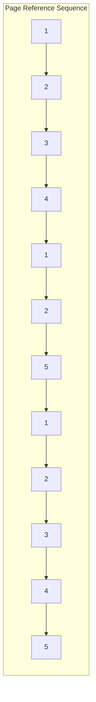
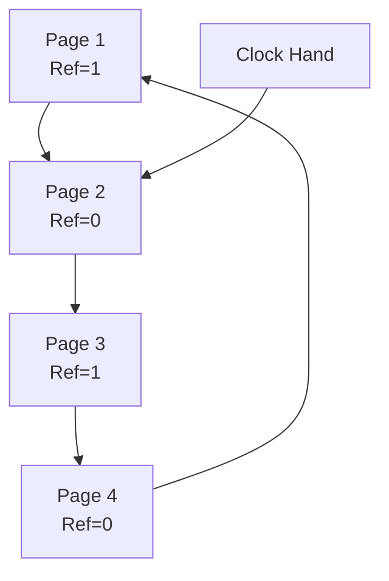

# Page Replacement Algorithms

## Introduction

When a computer runs programs, it uses a technique called **paging** to manage memory efficiently. Pages are fixed-size blocks of memory that get swapped between the main memory (RAM) and secondary storage (disk). When the system needs to load a new page but the main memory is full, it must decide which existing page to remove - this is where **page replacement algorithms** come into play.

These algorithms determine which pages to keep in memory and which to swap out, with the goal of minimizing the number of page faults (instances when a program accesses a page that's not in memory).

## Why Page Replacement Matters

Efficient page replacement directly impacts system performance:

- **Reduced page faults** = faster program execution
- **Better memory utilization** = more applications running simultaneously
- **Less disk I/O** = extended SSD/hard drive lifespan

## Common Page Replacement Algorithms

Let's explore the most important page replacement algorithms used in modern operating systems.

### 1. First-In-First-Out (FIFO)

FIFO is the simplest page replacement algorithm - it treats the page frames like a queue, removing the oldest page first.

#### How FIFO Works:

1. When a page needs to be replaced, the system selects the page that was loaded first
2. New pages are added to the end of the queue
3. The oldest page (at the front of the queue) is removed when space is needed

#### FIFO Example:

Let's consider a system with 3 page frames and the following page reference sequence:
`1, 2, 3, 4, 1, 2, 5, 1, 2, 3, 4, 5`



Let's trace through this sequence:

| Reference | Page Frames | Page Fault? |
|-----------|-------------|-------------|
| 1         | [1, -, -]   | Yes         |
| 2         | [1, 2, -]   | Yes         |
| 3         | [1, 2, 3]   | Yes         |
| 4         | [4, 2, 3]   | Yes (replaces 1) |
| 1         | [4, 1, 3]   | Yes (replaces 2) |
| 2         | [4, 1, 2]   | Yes (replaces 3) |
| 5         | [5, 1, 2]   | Yes (replaces 4) |
| 1         | [5, 1, 2]   | No          |
| 2         | [5, 1, 2]   | No          |
| 3         | [3, 1, 2]   | Yes (replaces 5) |
| 4         | [3, 4, 2]   | Yes (replaces 1) |
| 5         | [3, 4, 5]   | Yes (replaces 2) |

Total page faults: 10

#### FIFO Implementation:

```javascript
function fifo(pageSequence, frameCount) {
    const frames = [];
    let pageFaults = 0;
    
    for (const page of pageSequence) {
        // Check if page is already in frames
        if (!frames.includes(page)) {
            // Page fault occurs
            pageFaults++;
            
            if (frames.length < frameCount) {
                // If there's empty space, add the page
                frames.push(page);
            } else {
                // Replace the oldest page (first in the queue)
                frames.shift();
                frames.push(page);
            }
        }
        
        console.log(`Reference ${page}: Frames=[${frames}], Fault=${!frames.includes(page)}`);
    }
    
    return pageFaults;
}

// Example usage
const sequence = [1, 2, 3, 4, 1, 2, 5, 1, 2, 3, 4, 5];
console.log(`Total page faults: ${fifo(sequence, 3)}`);
```

#### FIFO Limitations:

FIFO suffers from **Belady's anomaly** - a phenomenon where increasing the number of page frames can sometimes increase the number of page faults, contrary to what we would expect.

### 2. Optimal Page Replacement

The optimal algorithm (also called OPT or MIN) replaces the page that will not be used for the longest period in the future. This algorithm is theoretically perfect but impossible to implement in practice because it requires knowledge of future page requests.

#### How Optimal Works:

1. When a page fault occurs, look at all pages currently in memory
2. Identify which page won't be accessed for the longest time in the future
3. Replace that page

#### Optimal Example:

Using the same sequence: `1, 2, 3, 4, 1, 2, 5, 1, 2, 3, 4, 5`

| Reference | Page Frames | Page Fault? | Reason for selection |
|-----------|-------------|-------------|----------------------|
| 1         | [1, -, -]   | Yes         | Empty frame          |
| 2         | [1, 2, -]   | Yes         | Empty frame          |
| 3         | [1, 2, 3]   | Yes         | Empty frame          |
| 4         | [1, 2, 4]   | Yes         | Replace 3 (accessed later than 1 and 2) |
| 1         | [1, 2, 4]   | No          |                      |
| 2         | [1, 2, 4]   | No          |                      |
| 5         | [1, 2, 5]   | Yes         | Replace 4 (accessed later than 1 and 2) |
| 1         | [1, 2, 5]   | No          |                      |
| 2         | [1, 2, 5]   | No          |                      |
| 3         | [1, 3, 5]   | Yes         | Replace 2 (not used again) |
| 4         | [1, 3, 4]   | Yes         | Replace 5 (accessed later than 1 and 3) |
| 5         | [1, 3, 5]   | Yes         | Replace 4 (not used again) |

Total page faults: 8

#### Implementation (Simulated):

```javascript
function optimal(pageSequence, frameCount) {
    const frames = [];
    let pageFaults = 0;
    
    for (let i = 0; i < pageSequence.length; i++) {
        const currentPage = pageSequence[i];
        
        // Check if page is already in frames
        if (!frames.includes(currentPage)) {
            pageFaults++;
            
            if (frames.length < frameCount) {
                // If there's empty space, add the page
                frames.push(currentPage);
            } else {
                // Find the page that won't be used for the longest time
                let farthestPageIndex = -1;
                let farthestDistance = -1;
                
                for (let j = 0; j < frames.length; j++) {
                    let nextOccurrence = pageSequence.indexOf(frames[j], i + 1);
                    
                    // If page isn't used again, replace it immediately
                    if (nextOccurrence === -1) {
                        farthestPageIndex = j;
                        break;
                    }
                    
                    // Find the page with the farthest next use
                    if (nextOccurrence > farthestDistance) {
                        farthestDistance = nextOccurrence;
                        farthestPageIndex = j;
                    }
                }
                
                // Replace the page
                frames[farthestPageIndex] = currentPage;
            }
        }
    }
    
    return pageFaults;
}
```

### 3. Least Recently Used (LRU)

LRU replaces the page that hasn't been used for the longest time. It's based on the principle of temporal locality: if a page hasn't been accessed recently, it's likely it won't be accessed in the near future.

#### How LRU Works:

1. Track when each page was last accessed
2. When a page fault occurs, replace the page with the oldest "last access" timestamp

#### LRU Example:

Using our sequence: `1, 2, 3, 4, 1, 2, 5, 1, 2, 3, 4, 5`

| Reference | Page Frames | Page Fault? | Least Recently Used |
|-----------|-------------|-------------|---------------------|
| 1         | [1, -, -]   | Yes         | Empty frame         |
| 2         | [1, 2, -]   | Yes         | Empty frame         |
| 3         | [1, 2, 3]   | Yes         | Empty frame         |
| 4         | [4, 2, 3]   | Yes         | Replace 1 (LRU)     |
| 1         | [4, 1, 3]   | Yes         | Replace 2 (LRU)     |
| 2         | [4, 1, 2]   | Yes         | Replace 3 (LRU)     |
| 5         | [5, 1, 2]   | Yes         | Replace 4 (LRU)     |
| 1         | [5, 1, 2]   | No          |                     |
| 2         | [5, 1, 2]   | No          |                     |
| 3         | [3, 1, 2]   | Yes         | Replace 5 (LRU)     |
| 4         | [3, 4, 2]   | Yes         | Replace 1 (LRU)     |
| 5         | [3, 4, 5]   | Yes         | Replace 2 (LRU)     |

Total page faults: 10

#### LRU Implementation:

```javascript
function lru(pageSequence, frameCount) {
    const frames = [];
    const lastUsed = {}; // Maps page numbers to their last access time
    let pageFaults = 0;
    
    for (let i = 0; i < pageSequence.length; i++) {
        const currentPage = pageSequence[i];
        
        // Check if page is already in frames
        if (!frames.includes(currentPage)) {
            pageFaults++;
            
            if (frames.length < frameCount) {
                // If there's empty space, add the page
                frames.push(currentPage);
            } else {
                // Find the least recently used page
                let lruPage = frames[0];
                let lruTime = lastUsed[lruPage];
                
                for (const frame of frames) {
                    if (lastUsed[frame] < lruTime) {
                        lruTime = lastUsed[frame];
                        lruPage = frame;
                    }
                }
                
                // Replace the LRU page
                const lruIndex = frames.indexOf(lruPage);
                frames[lruIndex] = currentPage;
            }
        }
        
        // Update the last used time for the current page
        lastUsed[currentPage] = i;
    }
    
    return pageFaults;
}
```

#### Practical Implementation of LRU:

In real operating systems, maintaining a precise timestamp for each page access would be inefficient. Instead, approximate LRU algorithms are often used:

1. **Second-Chance Algorithm** (Clock Algorithm)
2. **Not Recently Used (NRU)** Algorithm

### 4. Clock Algorithm (Second-Chance)

The Clock algorithm is a widely-used approximation of LRU that has lower overhead.

#### How Clock Works:

1. Organize page frames in a circular list
2. Each page has a "referenced" bit (initially set to 0)
3. When a page is accessed, its reference bit is set to 1
4. When replacing pages:
   - Check the current page's reference bit
   - If it's 1, set it to 0 and move to the next page
   - If it's 0, replace this page

#### Clock Algorithm Visualization:



#### Clock Algorithm Implementation:

```javascript
function clockAlgorithm(pageSequence, frameCount) {
    const frames = new Array(frameCount).fill(-1); // Initialize with empty frames
    const referenceBits = new Array(frameCount).fill(0);
    let pointer = 0;
    let pageFaults = 0;
    
    for (const page of pageSequence) {
        // Check if page is already in frames
        const frameIndex = frames.indexOf(page);
        
        if (frameIndex !== -1) {
            // Page hit: set reference bit to 1
            referenceBits[frameIndex] = 1;
        } else {
            // Page fault
            pageFaults++;
            
            // Find a page to replace using clock algorithm
            while (true) {
                if (frames[pointer] === -1) {
                    // Empty frame
                    frames[pointer] = page;
                    referenceBits[pointer] = 1;
                    pointer = (pointer + 1) % frameCount;
                    break;
                } else if (referenceBits[pointer] === 0) {
                    // Found a page with reference bit 0
                    frames[pointer] = page;
                    referenceBits[pointer] = 1;
                    pointer = (pointer + 1) % frameCount;
                    break;
                } else {
                    // Give a second chance
                    referenceBits[pointer] = 0;
                    pointer = (pointer + 1) % frameCount;
                }
            }
        }
    }
    
    return pageFaults;
}
```

### 5. Least Frequently Used (LFU)

LFU replaces the page with the lowest frequency of access.

#### How LFU Works:

1. Maintain a counter for each page that tracks how many times it's been accessed
2. When a replacement is needed, remove the page with the lowest counter value
3. In case of a tie, typically the least recently used page among those with the lowest frequency is chosen

#### LFU Implementation:

```javascript
function lfu(pageSequence, frameCount) {
    const frames = [];
    const frequency = {}; // Track how many times each page has been accessed
    const lastUsed = {}; // Track when each page was last used
    let pageFaults = 0;
    
    for (let i = 0; i < pageSequence.length; i++) {
        const page = pageSequence[i];
        
        // Initialize or increment frequency counter
        frequency[page] = (frequency[page] || 0) + 1;
        lastUsed[page] = i;
        
        // Check if page is already in frames
        if (!frames.includes(page)) {
            pageFaults++;
            
            if (frames.length < frameCount) {
                // If there's empty space, add the page
                frames.push(page);
            } else {
                // Find page with minimum frequency
                let minFreq = Infinity;
                let lfuPage = null;
                let lruTime = Infinity;
                
                for (const frame of frames) {
                    if (frequency[frame] < minFreq) {
                        minFreq = frequency[frame];
                        lfuPage = frame;
                        lruTime = lastUsed[frame];
                    } else if (frequency[frame] === minFreq && lastUsed[frame] < lruTime) {
                        // Tie-breaker: choose the least recently used
                        lfuPage = frame;
                        lruTime = lastUsed[frame];
                    }
                }
                
                // Replace the LFU page
                const lfuIndex = frames.indexOf(lfuPage);
                frames[lfuIndex] = page;
            }
        }
    }
    
    return pageFaults;
}
```

## Comparing Page Replacement Algorithms

Let's compare the performance of these algorithms on our example sequence:

| Algorithm | Page Faults | Strengths | Weaknesses |
|-----------|-------------|-----------|------------|
| FIFO      | 10          | Simple to implement | Suffers from Belady's anomaly; doesn't consider frequency or recency |
| Optimal   | 8           | Fewest page faults | Requires future knowledge; not implementable in practice |
| LRU       | 10          | Good performance; exploits temporal locality | Expensive to implement precisely |
| Clock     | ~9-10       | Good approximation of LRU with less overhead | Not as effective as pure LRU |
| LFU       | ~9-10       | Works well for stable access patterns | Doesn't consider recency; favors historically popular pages |

## Real-World Usage

### Operating Systems

Different operating systems use different page replacement strategies:

- **Linux**: Uses a modified Clock algorithm with additional "active" and "inactive" lists
- **Windows**: Uses a combination of FIFO and LRU with working set monitoring
- **macOS**: Uses a hybrid approach based on activity levels

### Tuning Memory Management

Modern systems allow customization of memory management parameters:

```bash
# Linux: View current swappiness value (how aggressively the system swaps pages)
cat /proc/sys/vm/swappiness

# Linux: Set a new swappiness value (temporarily)
sudo sysctl vm.swappiness=10

# Windows: View current page file settings
wmic pagefile list /format:list
```

## Implementing a Simple Page Replacement Simulator

Let's build a simple simulator to compare different page replacement algorithms:

```javascript
function simulatePageReplacement(pageSequence, frameCount, algorithm) {
    let frames, pageFaults;
    
    switch(algorithm.toLowerCase()) {
        case 'fifo':
            return fifo(pageSequence, frameCount);
        case 'lru':
            return lru(pageSequence, frameCount);
        case 'optimal':
            return optimal(pageSequence, frameCount);
        case 'clock':
            return clockAlgorithm(pageSequence, frameCount);
        case 'lfu':
            return lfu(pageSequence, frameCount);
        default:
            throw new Error(`Unknown algorithm: ${algorithm}`);
    }
}

// Example usage
const pageSequence = [1, 2, 3, 4, 1, 2, 5, 1, 2, 3, 4, 5];
const frameCount = 3;

console.log(`FIFO: ${simulatePageReplacement(pageSequence, frameCount, 'fifo')} page faults`);
console.log(`LRU: ${simulatePageReplacement(pageSequence, frameCount, 'lru')} page faults`);
console.log(`Optimal: ${simulatePageReplacement(pageSequence, frameCount, 'optimal')} page faults`);
console.log(`Clock: ${simulatePageReplacement(pageSequence, frameCount, 'clock')} page faults`);
console.log(`LFU: ${simulatePageReplacement(pageSequence, frameCount, 'lfu')} page faults`);
```

Output:
```
FIFO: 10 page faults
LRU: 10 page faults
Optimal: 8 page faults
Clock: 10 page faults
LFU: 9 page faults
```

## Summary

Page replacement algorithms are crucial components of operating system memory management:

- **FIFO** replaces the oldest page - simple but not very efficient
- **Optimal** replaces the page that won't be used for the longest future time - theoretical best
- **LRU** replaces the least recently used page - good but expensive to implement
- **Clock** (Second-Chance) approximates LRU with lower overhead - widely used in practice
- **LFU** replaces the least frequently used page - good for stable access patterns

The choice of algorithm significantly impacts system performance, with trade-offs between implementation complexity and effectiveness at reducing page faults.

## Additional Resources

- [Operating System Concepts](http://os-book.com/) by Silberschatz, Galvin, and Gagne (Chapter 10)
- [Modern Operating Systems](https://www.pearson.com/us/higher-education/program/Tanenbaum-Modern-Operating-Systems-4th-Edition/PGM80736.html) by Andrew S. Tanenbaum (Chapter 3)

## Exercises

1. Trace the execution of the Clock algorithm on the sequence `1, 2, 3, 4, 1, 2, 5, 1, 2, 3, 4, 5` with 3 page frames.

2. Modify the LRU implementation to use a more efficient data structure (hint: consider using a Map to store both presence and ordering).

3. Implement a page replacement simulator that visualizes the state of memory after each reference.

4. Research and explain how Linux's page replacement algorithm works in more detail.

5. Design a new page replacement algorithm that combines the strengths of multiple existing algorithms.