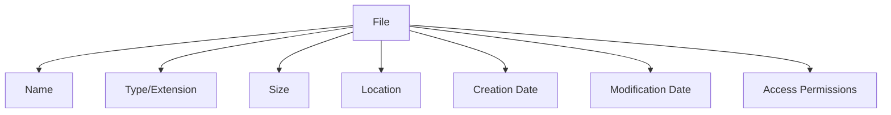

# File Concept

## Introduction

Files are among the most fundamental concepts in computing. Whether you're saving a document, loading an application, or storing data, you're working with files. In this guide, we'll explore what files are, how they're structured, and how operating systems manage them.

A file is a named collection of related data that exists on storage media like a hard drive, SSD, or USB flash drive. Files serve as the basic unit of storage in computer systems, allowing us to organize, access, and manipulate data efficiently.

## What is a File?

At its core, a file is a sequence of bytes stored as a single unit. These bytes are interpreted differently depending on the file type and the application processing them. For example:

- Text files contain readable characters
- Image files contain pixel data
- Executable files contain machine instructions

### File Attributes

Every file in a system has several attributes:

- **Name**: A human-readable identifier
- **Type/Extension**: Indicates the file's format (e.g., `.txt`, `.jpg`, `.exe`)
- **Size**: The amount of space the file occupies
- **Location**: Where the file is stored on the disk
- **Creation date**: When the file was created
- **Modification date**: When the file was last changed
- **Access permissions**: Who can read, write, or execute the file



## File Types

Files can be categorized into several types:

### Text Files

Text files contain human-readable characters encoded using ASCII, UTF-8, or other encoding standards. Examples include:

- Source code (`.c`, `.py`, `.js`)
- Configuration files (`.ini`, `.conf`)
- Markdown files (`.md`)
- Simple text documents (`.txt`)

### Binary Files

Binary files contain data that isn't meant to be interpreted as text. They store information in the binary format that computers can process directly. Examples include:

- Executables (`.exe`, `.dll`)
- Images (`.jpg`, `.png`)
- Audio files (`.mp3`, `.wav`)
- Video files (`.mp4`, `.avi`)
- Documents (`.pdf`, `.docx`)

## File Operations

Operating systems provide several fundamental operations for working with files:

### Creating Files

When you create a file, the operating system:
1. Allocates space for the file
2. Creates an entry in the file system
3. Records the file's metadata

### Opening Files

Before you can work with a file, you need to open it, which:
1. Verifies the file exists
2. Checks if you have permission to access it
3. Creates a file descriptor or handle to reference the file

### Reading Files

Reading a file involves:
1. Determining the current position in the file
2. Transferring data from the file to memory
3. Updating the file position

### Writing Files

Writing to a file involves:
1. Determining where to write in the file
2. Transferring data from memory to the file
3. Updating the file's size if necessary

### Closing Files

After you're done with a file, you should close it to:
1. Flush any buffered data to disk
2. Release the file handle
3. Free up system resources

## File Systems and Files

Files don't exist in isolation; they're organized within file systems. File systems provide:

- A hierarchy of directories/folders to organize files
- Methods to allocate and track disk space
- Mechanisms to protect files
- Algorithms to optimize file access

## Practical Examples

Let's see how files are handled in different programming languages:

### Working with Files in Python

```python
# Creating and writing to a file
with open('example.txt', 'w') as file:
    file.write('Hello, World!
')
    file.write('This is a simple text file.')

# Reading from a file
with open('example.txt', 'r') as file:
    content = file.read()
    print(content)

# Output:
# Hello, World!
# This is a simple text file.
```

### Working with Files in JavaScript (Node.js)

```javascript
const fs = require('fs');

// Creating and writing to a file
fs.writeFileSync('example.txt', 'Hello, World!
This is a simple text file.');

// Reading from a file
const content = fs.readFileSync('example.txt', 'utf-8');
console.log(content);

// Output:
// Hello, World!
// This is a simple text file.
```

### Working with Files in C

```c
#include <stdio.h>

int main() {
    FILE *file;
    
    // Creating and writing to a file
    file = fopen("example.txt", "w");
    if (file != NULL) {
        fprintf(file, "Hello, World!
");
        fprintf(file, "This is a simple text file.");
        fclose(file);
    }
    
    // Reading from a file
    char buffer[100];
    file = fopen("example.txt", "r");
    if (file != NULL) {
        while (fgets(buffer, sizeof(buffer), file) != NULL) {
            printf("%s", buffer);
        }
        fclose(file);
    }
    
    return 0;
}

// Output:
// Hello, World!
// This is a simple text file.
```

## File Paths

Files are identified by paths, which can be:

### Absolute Paths

An absolute path starts from the root directory and specifies the complete location of a file.

Examples:
- Windows: `C:\Users\username\Documents\example.txt`
- Unix-like: `/home/username/Documents/example.txt`

### Relative Paths

A relative path specifies a file location relative to the current working directory.

Examples:
- `Documents/example.txt` (a subdirectory of the current directory)
- `../example.txt` (one directory up from the current directory)

## Real-World Applications

Files are fundamental to many real-world applications:

### Persistence of Application Data

Applications use files to store:
- User preferences and settings
- Application state
- User-created content
- Cached data for faster loading

### Configuration Management

System and application settings are often stored in configuration files, allowing for:
- Easy modification of behavior
- Portability across systems
- Backup and restoration of settings

### Data Exchange

Files provide a common format for exchanging data between:
- Different applications
- Different systems
- Different users

## Common File-Related Issues

### File Not Found

This error occurs when you try to access a file that doesn't exist or isn't in the expected location.

```python
try:
    with open('nonexistent.txt', 'r') as file:
        content = file.read()
except FileNotFoundError:
    print("The file doesn't exist!")

# Output:
# The file doesn't exist!
```

### Permission Denied

This error occurs when you try to access a file without the appropriate permissions.

```python
try:
    with open('/system/protected.txt', 'w') as file:
        file.write('This will not work!')
except PermissionError:
    print("You don't have permission to write to this file!")

# Output (on most systems):
# You don't have permission to write to this file!
```

## Summary

Files are the fundamental units of storage in computer systems, providing a way to organize, store, and retrieve data. Understanding how files work is essential for programmers, as almost all applications interact with files in some way.

Key points to remember:
- A file is a named collection of related data
- Files have attributes like name, type, size, and permissions
- Common file operations include creating, opening, reading, writing, and closing
- File paths can be absolute (from the root) or relative (from the current location)
- Different programming languages provide various ways to work with files
- Files are crucial for data persistence, configuration, and exchange

## Exercises

1. Write a program that creates a text file containing your name and reads it back.
2. Create a program that copies the contents of one file to another.
3. Write a program that counts the number of words in a text file.
4. Create a simple "note-taking" application that can save and load notes from files.
5. Explore how your operating system organizes files by examining its directory structure.

## Additional Resources

- File System books and documentation for your specific operating system
- Programming language documentation on file handling
- Advanced topics: file locking, memory-mapped files, and asynchronous I/O