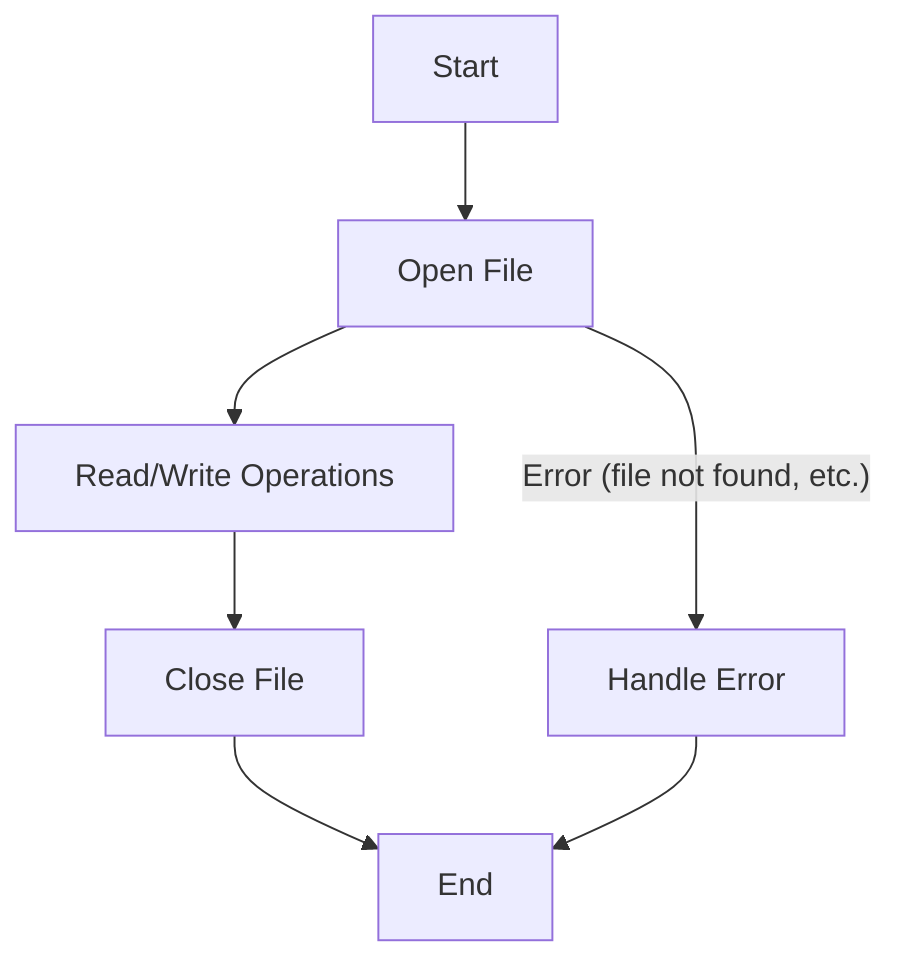

# File Operations

## Introduction

File operations are fundamental tasks that allow programs to interact with files stored on a computer. These operations include creating, reading, writing, appending, and deleting files. Understanding file operations is essential for any programmer as most applications require some form of data persistence or exchange through files.

In this tutorial, we'll explore the most common file operations, their syntax, and practical applications across different programming languages. We'll focus on text files for simplicity, but these concepts extend to binary files as well.

## Basic File Operations

The most fundamental file operations that you'll encounter in programming are:

1. Opening a file
2. Reading from a file
3. Writing to a file
4. Appending to a file
5. Closing a file
6. Deleting a file

Let's look at each operation in detail with examples.

## File Operation Workflow

Before diving into individual operations, let's understand the typical workflow when working with files:



## Opening a File

Before you can read from or write to a file, you need to open it. Opening a file establishes a connection between your program and the file on disk.

Most programming languages use a similar concept of "file modes" when opening files:

- `r` - Read mode (default): Opens a file for reading
- `w` - Write mode: Opens a file for writing (creates a new file or truncates an existing one)
- `a` - Append mode: Opens a file for appending data
- `b` - Binary mode: Opens a file in binary mode (can be combined with other modes)
- `x` - Exclusive creation: Opens a file for exclusive creation, failing if the file already exists
- `+` - Plus: Opens a file for updating (both reading and writing)

### Python Example

```python
# Opening a file for reading
file = open('example.txt', 'r')

# Opening a file for writing
file = open('example.txt', 'w')

# Opening a file for appending
file = open('example.txt', 'a')

# Don't forget to close the file when done
file.close()
```

### JavaScript (Node.js) Example

```javascript
const fs = require('fs');

// Opening a file for reading
const readStream = fs.createReadStream('example.txt');

// Opening a file for writing
const writeStream = fs.createWriteStream('example.txt');

// Files are automatically closed when the streams end
```

## Reading from a File

Once a file is open, you can read its contents. There are several ways to read from a file:

1. Read the entire file at once
2. Read line by line
3. Read a specific number of characters or bytes

### Python Example

```python
# Reading an entire file
with open('example.txt', 'r') as file:
    content = file.read()
    print(content)

# Reading line by line
with open('example.txt', 'r') as file:
    for line in file:
        print(line.strip())  # strip() removes the trailing newline

# Reading specific number of characters
with open('example.txt', 'r') as file:
    chunk = file.read(10)  # Read first 10 characters
    print(chunk)
```

Output:
```
Hello, World!
This is an example file.

Hello, World!
This is an example file.

Hello, Wor
```

### JavaScript (Node.js) Example

```javascript
const fs = require('fs');

// Reading an entire file (synchronous)
try {
    const content = fs.readFileSync('example.txt', 'utf8');
    console.log(content);
} catch (err) {
    console.error(err);
}

// Reading an entire file (asynchronous)
fs.readFile('example.txt', 'utf8', (err, data) => {
    if (err) {
        console.error(err);
        return;
    }
    console.log(data);
});

// Reading line by line
const readline = require('readline');
const fileStream = fs.createReadStream('example.txt');
const rl = readline.createInterface({
    input: fileStream,
    crlfDelay: Infinity
});

rl.on('line', (line) => {
    console.log(line);
});
```

## Writing to a File

Writing to a file allows you to save data for future use. There are two main approaches:

1. Overwrite the entire file with new content
2. Append new content to the end of the file

### Python Example

```python
# Writing to a file (overwrites existing content)
with open('output.txt', 'w') as file:
    file.write('Hello, World!
')
    file.write('This is a new file.')

# Appending to a file
with open('output.txt', 'a') as file:
    file.write('
This text is appended.')
```

Content of output.txt after execution:
```
Hello, World!
This is a new file.
This text is appended.
```

### JavaScript (Node.js) Example

```javascript
const fs = require('fs');

// Writing to a file (synchronous)
try {
    fs.writeFileSync('output.txt', 'Hello, World!
This is a new file.');
    console.log('File written successfully');
} catch (err) {
    console.error(err);
}

// Appending to a file (synchronous)
try {
    fs.appendFileSync('output.txt', '
This text is appended.');
    console.log('Content appended successfully');
} catch (err) {
    console.error(err);
}

// Writing to a file (asynchronous)
fs.writeFile('output.txt', 'Hello, World!
This is a new file.', (err) => {
    if (err) {
        console.error(err);
        return;
    }
    console.log('File written successfully');
});
```

## Working with File Paths

Understanding file paths is crucial for file operations. There are two types of paths:

1. Absolute paths: Full paths from the root directory
2. Relative paths: Paths relative to the current working directory

### Python Example with Paths

```python
import os

# Get current working directory
current_dir = os.getcwd()
print(f"Current directory: {current_dir}")

# Join paths (works across different operating systems)
file_path = os.path.join(current_dir, 'data', 'example.txt')
print(f"Complete file path: {file_path}")

# Check if a file exists
if os.path.exists(file_path):
    print(f"The file {file_path} exists")
else:
    print(f"The file {file_path} does not exist")
```

Output:
```
Current directory: /home/user/project
Complete file path: /home/user/project/data/example.txt
The file /home/user/project/data/example.txt does not exist
```

## File Information and Manipulation

Beyond reading and writing, programming languages provide functions to get information about files and manipulate them.

### Python Example

```python
import os
import time

file_path = 'example.txt'

# Get file size
if os.path.exists(file_path):
    size = os.path.getsize(file_path)
    print(f"File size: {size} bytes")

    # Get file modification time
    mod_time = os.path.getmtime(file_path)
    print(f"Last modified: {time.ctime(mod_time)}")

    # Rename a file
    os.rename(file_path, 'renamed_example.txt')
    print(f"Renamed {file_path} to renamed_example.txt")

    # Delete a file
    os.remove('renamed_example.txt')
    print(f"Deleted renamed_example.txt")
```

Output:
```
File size: 30 bytes
Last modified: Tue Mar 18 10:45:23 2025
Renamed example.txt to renamed_example.txt
Deleted renamed_example.txt
```

## Error Handling in File Operations

File operations can fail for various reasons: the file might not exist, you might not have permission, or the disk might be full. It's essential to handle these errors gracefully.

### Python Example with Error Handling

```python
try:
    with open('nonexistent_file.txt', 'r') as file:
        content = file.read()
except FileNotFoundError:
    print("Error: The file does not exist")
except PermissionError:
    print("Error: You don't have permission to read this file")
except Exception as e:
    print(f"An unexpected error occurred: {e}")
```

Output:
```
Error: The file does not exist
```

### JavaScript (Node.js) Example with Error Handling

```javascript
const fs = require('fs');

fs.readFile('nonexistent_file.txt', 'utf8', (err, data) => {
    if (err) {
        if (err.code === 'ENOENT') {
            console.log("Error: The file does not exist");
        } else if (err.code === 'EACCES') {
            console.log("Error: You don't have permission to read this file");
        } else {
            console.log(`An unexpected error occurred: ${err}`);
        }
        return;
    }
    console.log(data);
});
```

## Working with Binary Files

So far, we've focused on text files, but many applications need to work with binary files like images, audio, or custom data formats.

### Python Example with Binary Files

```python
# Reading a binary file
with open('image.jpg', 'rb') as file:
    binary_data = file.read()
    print(f"Read {len(binary_data)} bytes")

# Writing a binary file
with open('copy_image.jpg', 'wb') as file:
    file.write(binary_data)
    print("Binary data written successfully")
```

## Practical Example: Log File Analyzer

Let's create a simple log file analyzer that reads a log file and extracts information from it.

### Python Example

```python
def analyze_log(log_file):
    error_count = 0
    warning_count = 0
    info_count = 0
    
    try:
        with open(log_file, 'r') as file:
            for line in file:
                if '[ERROR]' in line:
                    error_count += 1
                elif '[WARNING]' in line:
                    warning_count += 1
                elif '[INFO]' in line:
                    info_count += 1
        
        print(f"Log Analysis Results for {log_file}:")
        print(f"- Errors: {error_count}")
        print(f"- Warnings: {warning_count}")
        print(f"- Info messages: {info_count}")
        print(f"- Total analyzed lines: {error_count + warning_count + info_count}")
        
    except Exception as e:
        print(f"An error occurred while analyzing the log: {e}")

# Usage
analyze_log('application.log')
```

Example log file content:
```
[INFO] 2025-03-18 10:30:45 - Application started
[INFO] 2025-03-18 10:30:46 - Connecting to database
[WARNING] 2025-03-18 10:30:47 - Slow database connection
[INFO] 2025-03-18 10:31:00 - User login: alice
[ERROR] 2025-03-18 10:31:05 - Database query failed
[INFO] 2025-03-18 10:32:00 - User logout: alice
```

Output:
```
Log Analysis Results for application.log:
- Errors: 1
- Warnings: 1
- Info messages: 4
- Total analyzed lines: 6
```

## Performance Considerations

When working with large files, it's important to consider performance:

1. **Buffered Reading**: Read chunks of data instead of the entire file at once
2. **Use With Statements**: Ensure files are properly closed even if exceptions occur
3. **Memory Management**: Process data incrementally to avoid loading everything into memory

### Python Example with Large File Processing

```python
def process_large_file(file_path):
    line_count = 0
    chunk_size = 1024 * 1024  # 1MB chunks
    
    with open(file_path, 'r') as file:
        while True:
            chunk = file.read(chunk_size)
            if not chunk:
                break
                
            # Count lines in this chunk
            line_count += chunk.count('
')
            
            # Process chunk here...
            
    print(f"Processed {line_count} lines from {file_path}")

# Usage
process_large_file('large_data.txt')
```

## Summary

In this tutorial, we've covered the fundamental file operations that are essential for any programmer:

- Opening and closing files
- Reading from files (entire file, line by line, or in chunks)
- Writing and appending to files
- Working with file paths
- Manipulating files (getting information, renaming, deleting)
- Error handling in file operations
- Working with binary files
- Practical applications and performance considerations

Understanding these operations allows you to create programs that can store and retrieve data, process information from external sources, and create persistent output.

## Exercises

1. Create a program that reads a CSV file and calculates the average of a numeric column.
2. Write a program that merges the contents of two text files into a third file.
3. Implement a simple text editor that can open, edit, and save text files.
4. Create a program that finds and counts specific words in a text file.
5. Write a script that backs up all .txt files in a directory by creating copies with a .bak extension.

## Additional Resources

- Python Documentation: [File and Directory Access](https://docs.python.org/3/library/filesys.html)
- Node.js Documentation: [File System](https://nodejs.org/api/fs.html)
- Java Documentation: [Java I/O Tutorial](https://docs.oracle.com/javase/tutorial/essential/io/index.html)

Remember that file operations can vary between operating systems, particularly regarding path separators and file permissions. Always test your code across different environments to ensure compatibility.