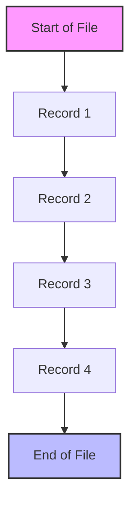
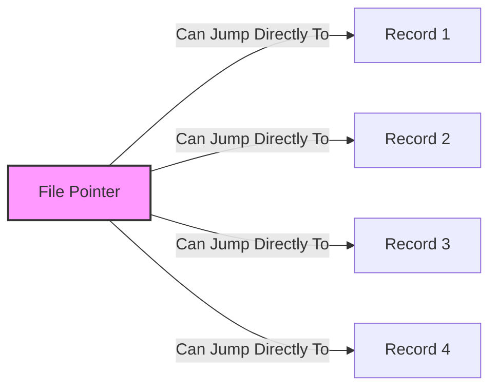
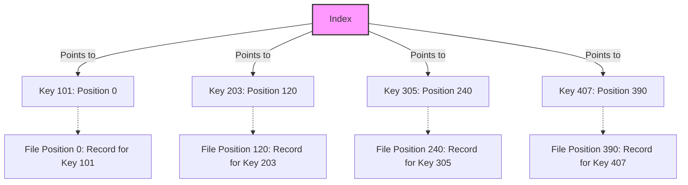

# File Access Methods

## Introduction

File access methods define how programs interact with data stored in files. They determine how data is read from or written to files, which significantly impacts application performance and usability. As a beginner programmer, understanding these different methods will help you choose the most appropriate technique for your specific use case.

In this guide, we'll explore the three primary file access methods:
- Sequential Access
- Random Access (Direct Access)
- Indexed Access

Let's dive into each method to understand how they work, their advantages, disadvantages, and practical applications.

## Sequential Access

Sequential access is the simplest file access method, where data is read or written in a sequential manner - one record after another from the beginning of the file.

### How Sequential Access Works



In sequential access:
1. To read record 3, you must first read records 1 and 2
2. Records are processed in the order they appear in the file
3. The file pointer moves forward as you read each record

### Example in Python

```python
# Sequential file reading
def read_file_sequentially(filename):
    with open(filename, 'r') as file:
        for line in file:
            print(line.strip())

# Example usage
read_file_sequentially('example.txt')
```

**Input:**
A file named `example.txt` containing:
```
Line 1: Introduction to Files
Line 2: Learning File Access Methods
Line 3: Sequential Access Example
```

**Output:**
```
Line 1: Introduction to Files
Line 2: Learning File Access Methods
Line 3: Sequential Access Example
```

### Advantages of Sequential Access

- **Simplicity**: Easy to implement and understand
- **Memory Efficiency**: Requires minimal memory overhead
- **Speed for Complete Processing**: Fast when you need to process all records

### Disadvantages of Sequential Access

- **Inefficient for Selective Access**: Slow when you need to access specific records
- **No Backward Movement**: Typically doesn't support backward navigation without reopening the file
- **Limited Flexibility**: Not suitable for applications requiring random data access

### Practical Applications

- **Log Files**: Server logs, application logs
- **Batch Processing**: Processing entire datasets in one go
- **Data Migration**: Moving data from one system to another
- **Text File Processing**: Reading configuration files, parsing CSV files

## Random Access (Direct Access)

Random access (also called direct access) allows you to read or write data at any position in the file without having to sequentially go through preceding data.

### How Random Access Works



In random access:
1. Each record typically has a fixed size
2. Position in file = record size × record number
3. You can directly move to any record without reading previous records

### Example in Python

```python
# Random access file reading
def read_random_access(filename, record_number, record_size=20):
    with open(filename, 'rb') as file:
        # Calculate position and move file pointer
        position = record_number * record_size
        file.seek(position)
        # Read one record
        record = file.read(record_size)
        return record.decode('utf-8').strip()

# Example usage
# Read the 3rd record (index 2)
data = read_random_access('data.bin', 2)
print(data)
```

**Input:**
A binary file with fixed-length records of 20 bytes each

**Output:**
```
Record #3 content...
```

### Example of Creating a Random Access File

```python
# Creating a file for random access
def create_random_access_file(filename, records):
    with open(filename, 'wb') as file:
        for record in records:
            # Ensure each record is exactly 20 bytes
            record_bytes = record.ljust(20).encode('utf-8')
            file.write(record_bytes)

# Example records
student_records = [
    "Alice,CS,3.8",
    "Bob,Math,3.5",
    "Charlie,Physics,3.9",
    "Diana,Biology,3.7"
]

create_random_access_file('students.bin', student_records)
```

### Advantages of Random Access

- **Speed**: Quickly access specific records without reading the entire file
- **Efficiency**: Good for applications that need selective record access
- **Bidirectional**: Can move forward or backward through the file
- **Updating in Place**: Can update records without recreating the entire file

### Disadvantages of Random Access

- **Complexity**: More complex to implement than sequential access
- **Fixed Record Size**: Often requires fixed-length records, which may waste space
- **Memory Usage**: May require more memory management
- **File Structure Knowledge**: Requires knowing the file structure beforehand

### Practical Applications

- **Databases**: Most database systems use random access
- **Game Save Files**: Quickly access and update specific player statistics
- **Configuration Systems**: Access specific settings without parsing entire files
- **User Profile Systems**: Update user information selectively

## Indexed Access

Indexed access uses an index (like a book's index) to locate records quickly, combining the flexibility of random access with the efficiency of variable-length records.

### How Indexed Access Works



In indexed access:
1. An index maps keys to file positions
2. To find a record, first search the index, then access the file directly
3. Records can be variable-length
4. Multiple indices can support different access patterns

### Example in Python

Here's a simplified example of implementing indexed access:

```python
import json

class IndexedFileSystem:
    def __init__(self, data_file, index_file):
        self.data_file = data_file
        self.index_file = index_file
        self.index = {}
        self._load_index()
    
    def _load_index(self):
        try:
            with open(self.index_file, 'r') as f:
                self.index = json.load(f)
        except FileNotFoundError:
            # Create new index if it doesn't exist
            self.index = {}
    
    def _save_index(self):
        with open(self.index_file, 'w') as f:
            json.dump(self.index, f)
    
    def add_record(self, key, data):
        # Open file in append mode to get position at end of file
        with open(self.data_file, 'a') as f:
            position = f.tell()
            f.write(f"{data}
")
        
        # Update index with position
        self.index[key] = position
        self._save_index()
    
    def get_record(self, key):
        if key not in self.index:
            return None
        
        position = self.index[key]
        with open(self.data_file, 'r') as f:
            f.seek(position)
            return f.readline().strip()

# Example usage
fs = IndexedFileSystem('employee_data.txt', 'employee_index.json')

# Add some records
fs.add_record('E001', 'John Doe,Engineering,75000')
fs.add_record('E002', 'Jane Smith,Marketing,82000')
fs.add_record('E003', 'Robert Johnson,Finance,90000')

# Retrieve a record by key
employee = fs.get_record('E002')
print(f"Employee E002: {employee}")
```

**Output:**
```
Employee E002: Jane Smith,Marketing,82000
```

### Advantages of Indexed Access

- **Speed**: Fast access to specific records without sequential reading
- **Flexibility**: Supports variable-length records
- **Multiple Access Paths**: Can have different indexes for the same data
- **Space Efficiency**: No need to pad records to fixed lengths

### Disadvantages of Indexed Access

- **Complexity**: More complex to implement and maintain
- **Index Overhead**: Requires additional storage for indexes
- **Consistency Management**: Must keep indexes synchronized with data
- **Update Cost**: Updating indexes adds overhead

### Practical Applications

- **Relational Databases**: Use B-tree and other indexes extensively
- **File Systems**: Modern file systems use indexes to locate files
- **Search Engines**: Index documents for quick retrieval
- **Content Management Systems**: Quickly find content by various attributes

## Comparison of File Access Methods

| Feature | Sequential Access | Random Access | Indexed Access |
|---------|-------------------|---------------|----------------|
| Implementation Complexity | Low | Medium | High |
| Access Speed (specific record) | Slow | Fast | Very Fast |
| Space Efficiency | High | Low-Medium | Medium |
| Variable Length Records | Yes | No (typically) | Yes |
| Use Case | Reading entire files | Fixed-size records with known positions | Complex data with multiple access patterns |
| Memory Requirements | Low | Medium | High |
| Update Flexibility | Low | Medium | High |

## Best Practices for Choosing File Access Methods

1. **Consider Your Access Pattern**:
   - Need to read the entire file? → Sequential Access
   - Need to access specific records by position? → Random Access
   - Need to access records by different fields? → Indexed Access

2. **Evaluate Record Size Variability**:
   - Fixed-size records → Random Access works well
   - Variable-size records → Sequential or Indexed Access

3. **Assess Performance Requirements**:
   - Speed is critical → Random or Indexed Access
   - Memory usage is constrained → Sequential Access

4. **Consider Implementation Complexity**:
   - Simple implementation → Sequential Access
   - Complex needs justify complex solutions → Indexed Access

## Practical Example: Student Records System

Let's consider a practical example of a student records system and how different access methods might apply:

```python
# Example implementation of a student records system using various access methods

class SequentialStudentSystem:
    def __init__(self, filename):
        self.filename = filename
    
    def add_student(self, student_id, name, major, gpa):
        with open(self.filename, 'a') as f:
            f.write(f"{student_id},{name},{major},{gpa}
")
    
    def find_student(self, student_id):
        with open(self.filename, 'r') as f:
            for line in f:
                fields = line.strip().split(',')
                if fields[0] == student_id:
                    return {
                        'id': fields[0],
                        'name': fields[1],
                        'major': fields[2],
                        'gpa': fields[3]
                    }
        return None

class RandomAccessStudentSystem:
    def __init__(self, filename, record_size=100):
        self.filename = filename
        self.record_size = record_size
    
    def _format_record(self, student_id, name, major, gpa):
        record = f"{student_id},{name},{major},{gpa}"
        # Pad to fixed length
        return record.ljust(self.record_size)
    
    def add_student(self, index, student_id, name, major, gpa):
        record = self._format_record(student_id, name, major, gpa)
        with open(self.filename, 'r+b') as f:
            f.seek(index * self.record_size)
            f.write(record.encode('utf-8'))
    
    def find_student(self, index):
        with open(self.filename, 'rb') as f:
            f.seek(index * self.record_size)
            record = f.read(self.record_size).decode('utf-8').strip()
            if record:
                fields = record.split(',')
                return {
                    'id': fields[0],
                    'name': fields[1],
                    'major': fields[2],
                    'gpa': fields[3]
                }
        return None

class IndexedStudentSystem:
    def __init__(self, data_file, index_file):
        self.data_file = data_file
        self.index_file = index_file
        self.index = {}
        try:
            with open(index_file, 'r') as f:
                self.index = json.load(f)
        except (FileNotFoundError, json.JSONDecodeError):
            self.index = {}
    
    def _save_index(self):
        with open(self.index_file, 'w') as f:
            json.dump(self.index, f)
    
    def add_student(self, student_id, name, major, gpa):
        record = f"{student_id},{name},{major},{gpa}
"
        with open(self.data_file, 'a') as f:
            position = f.tell()
            f.write(record)
        self.index[student_id] = position
        self._save_index()
    
    def find_student(self, student_id):
        if student_id not in self.index:
            return None
        
        position = self.index[student_id]
        with open(self.data_file, 'r') as f:
            f.seek(position)
            record = f.readline().strip()
            fields = record.split(',')
            return {
                'id': fields[0],
                'name': fields[1],
                'major': fields[2],
                'gpa': fields[3]
            }
```

## Summary

File access methods are fundamental concepts in programming that determine how applications interact with data stored in files. Each method has its strengths and weaknesses:

- **Sequential Access**: Simple and efficient for processing entire files from beginning to end
- **Random Access**: Fast for accessing specific records by position when record sizes are fixed
- **Indexed Access**: Provides flexible, efficient access to records using keys or multiple attributes

The choice of file access method significantly impacts application performance and functionality. As you design and build applications, consider your data access patterns carefully to select the most appropriate method for your specific needs.

## Exercises

1. **Basic Sequential Access**: Write a program that reads a text file line by line and counts the number of words in each line.

2. **Random Access Challenge**: Create a program that simulates a simple address book using random access. The program should allow adding, viewing, and updating contacts.

3. **Index Implementation**: Implement a simple indexed file system for a library catalog that allows searching books by title, author, or ISBN.

4. **Performance Comparison**: Write a benchmark program that compares the performance of sequential, random, and indexed access for different file sizes and access patterns.

5. **Real-world Application**: Design and implement a simple logging system that uses an appropriate file access method based on how logs will be used.

## Additional Resources

- [Operating System Concepts](https://www.os-book.com/) by Silberschatz, Galvin, and Gagne - Provides detailed explanations of file systems and access methods
- [Python Documentation on File Objects](https://docs.python.org/3/tutorial/inputoutput.html#reading-and-writing-files)
- [Database System Concepts](https://www.db-book.com/) - For deeper understanding of indexed access and its relation to database systems
- [File Structures: An Object-Oriented Approach with C++](https://dl.acm.org/doi/book/10.5555/517613) by Michael J. Folk and Bill Zoellick