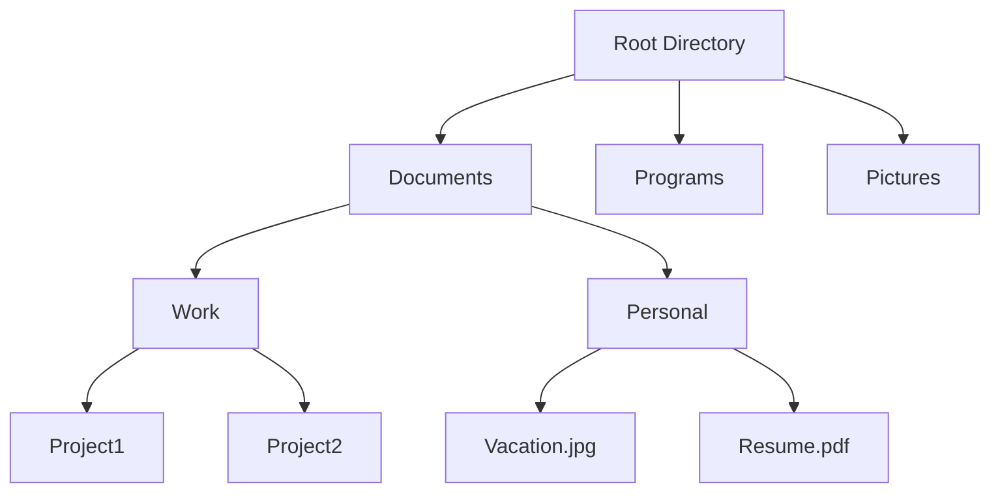

# Directory Structure

## Introduction

A directory structure is a hierarchical organization system used to arrange files on a computer or storage device. Much like a tree with branches, directories (also called folders) can contain both files and other directories, creating a structured way to organize data. Understanding directory structures is fundamental for programmers as it affects how you locate, access, and manage files in your projects.

## What is a Directory Structure?

A directory structure is essentially a system of organization that creates a hierarchy of folders and files. This hierarchy helps in:

- Organizing related files together
- Simplifying file management and access
- Establishing clear paths to locate specific data
- Creating logical separation between different components

## Visualizing Directory Structures

Directory structures can be visualized as trees, with the root directory at the top and branches extending downward.



## Root Directory and Paths

Every file system begins with a **root directory**, which is the top-level directory that contains all other directories and files.

- In Windows, each drive has its own root, typically represented as `C:\`, `D:\`, etc.
- In Unix-like systems (Linux, macOS), there is a single root represented as `/`

### Absolute vs. Relative Paths

To access files within a directory structure, we use paths:

**Absolute paths** start from the root directory and provide the complete location of a file or directory:

```
# Windows absolute path
C:\Users\username\Documents\project\file.txt

# Unix-like absolute path
/home/username/Documents/project/file.txt
```

**Relative paths** start from the current directory:

```
# If current directory is C:\Users\username\
Documents\project\file.txt

# If current directory is /home/username/
Documents/project/file.txt
```

## Directory Navigation Commands

### Windows Command Prompt

```
# Display current directory
cd

# Change directory
cd path\to\directory

# Move up one directory
cd ..

# List directory contents
dir

# Make a new directory
mkdir new_directory
```

### Unix-like Terminal (Linux/macOS)

```
# Display current directory
pwd

# Change directory
cd path/to/directory

# Move up one directory
cd ..

# List directory contents
ls

# Detailed listing with permissions
ls -l

# Make a new directory
mkdir new_directory
```

## Special Directory References

Most file systems include special references that help with navigation:

- `.` (single dot): Refers to the current directory
- `..` (double dot): Refers to the parent directory
- `~` (tilde): In Unix-like systems, refers to the home directory of the current user

Example usage:

```bash
# Change to parent directory
cd ..

# Run a script in the current directory
./script.sh

# Navigate to home directory
cd ~
```

## Directory Structure Patterns in Programming

Different programming ecosystems have conventional directory structures. Let's look at some examples:

### Web Development Project Structure

```
project-root/
├── index.html
├── css/
│   ├── styles.css
│   └── normalize.css
├── js/
│   ├── main.js
│   └── utilities.js
├── images/
│   ├── logo.png
│   └── background.jpg
└── fonts/
    └── opensans.woff
```

### Node.js Project Structure

```
node-project/
├── package.json
├── node_modules/
├── index.js
├── src/
│   ├── controllers/
│   ├── models/
│   ├── routes/
│   └── utils/
├── tests/
└── public/
    ├── css/
    ├── js/
    └── images/
```

### Python Project Structure

```
python-project/
├── requirements.txt
├── setup.py
├── README.md
├── docs/
├── my_package/
│   ├── __init__.py
│   ├── module1.py
│   └── module2.py
└── tests/
    ├── __init__.py
    ├── test_module1.py
    └── test_module2.py
```

## Working with Directory Structures in Code

### Python Example

```python
import os

# Current working directory
current_dir = os.getcwd()
print(f"Current directory: {current_dir}")

# List contents of a directory
contents = os.listdir(current_dir)
print("Directory contents:")
for item in contents:
    print(f"  - {item}")

# Create a new directory
os.mkdir("new_folder")
print("Created 'new_folder'")

# Check if a path exists
if os.path.exists("new_folder"):
    print("The folder exists!")

# Join paths (works cross-platform)
file_path = os.path.join(current_dir, "new_folder", "example.txt")
print(f"File path: {file_path}")
```

Output:
```
Current directory: /home/user/projects
Directory contents:
  - file1.txt
  - file2.py
  - images
  - docs
Created 'new_folder'
The folder exists!
File path: /home/user/projects/new_folder/example.txt
```

### JavaScript (Node.js) Example

```javascript
const fs = require('fs');
const path = require('path');

// Current working directory
const currentDir = process.cwd();
console.log(`Current directory: ${currentDir}`);

// List contents of a directory
const contents = fs.readdirSync(currentDir);
console.log('Directory contents:');
contents.forEach(item => {
  console.log(`  - ${item}`);
});

// Create a new directory
fs.mkdirSync('new_folder');
console.log("Created 'new_folder'");

// Check if a path exists
if (fs.existsSync('new_folder')) {
  console.log('The folder exists!');
}

// Join paths (works cross-platform)
const filePath = path.join(currentDir, 'new_folder', 'example.txt');
console.log(`File path: ${filePath}`);
```

Output:
```
Current directory: C:\Users\user\projects
Directory contents:
  - file1.txt
  - file2.js
  - images
  - docs
Created 'new_folder'
The folder exists!
File path: C:\Users\user\projects
ew_folder\example.txt
```

## Best Practices for Directory Structure

1. **Keep it organized**: Group related files in their own directories
2. **Use descriptive names**: Directories should have meaningful names that indicate their contents
3. **Maintain consistency**: Follow established conventions for your programming language or framework
4. **Avoid deep nesting**: Extremely deep directory structures can be difficult to navigate
5. **Separate concerns**: Keep source code, assets, documentation, and tests in separate directories
6. **Document your structure**: Include a README file explaining your project's organization

## Common Directory Structure Issues

### Path Separator Differences

Different operating systems use different path separators:
- Windows: Backslash (`\`)
- Unix-like systems: Forward slash (`/`)

Most modern programming languages handle this automatically, but it's important to use proper path joining functions rather than string concatenation:

```python
# Good (cross-platform)
file_path = os.path.join("directory", "file.txt")

# Bad (platform-specific)
file_path = "directory" + "\\" + "file.txt"  # Windows-only
```

### Case Sensitivity

- Windows file systems are case-insensitive (though they preserve case)
- Unix-like file systems are typically case-sensitive

This can cause issues when moving projects between operating systems. Best practice is to maintain consistent casing in your directory and file names.

### Path Length Limitations

Some file systems (especially older Windows systems) have limitations on path length. To avoid issues:
- Keep file paths relatively short
- Avoid deeply nested directories
- Be mindful when generating file names programmatically

## Practical Applications

### Creating a Project Scaffold

```javascript
const fs = require('fs');
const path = require('path');

function createProjectStructure(rootDir) {
  // Create root directory
  if (!fs.existsSync(rootDir)) {
    fs.mkdirSync(rootDir);
  }
  
  // Define directory structure
  const dirs = [
    'src',
    'src/components',
    'src/utils',
    'public',
    'public/images',
    'public/css',
    'tests'
  ];
  
  // Create directories
  dirs.forEach(dir => {
    const fullPath = path.join(rootDir, dir);
    if (!fs.existsSync(fullPath)) {
      fs.mkdirSync(fullPath);
      console.log(`Created: ${fullPath}`);
    }
  });
  
  // Create base files
  const files = [
    { path: 'src/index.js', content: '// Entry point of application' },
    { path: 'public/index.html', content: '<!DOCTYPE html>
<html>
<head>
  <title>My Project</title>
</head>
<body>
  <div id="root"></div>
</body>
</html>' },
    { path: 'README.md', content: '# My Project

Project description goes here.' }
  ];
  
  files.forEach(file => {
    const fullPath = path.join(rootDir, file.path);
    fs.writeFileSync(fullPath, file.content);
    console.log(`Created: ${fullPath}`);
  });
  
  console.log('Project structure created successfully!');
}

// Usage
createProjectStructure('my-new-project');
```

This script creates a basic project structure with directories and starter files.

### File System Crawler

This example shows how to recursively traverse a directory structure:

```python
import os

def explore_directory(directory, indent=0):
    """Recursively explore and print contents of a directory."""
    print(' ' * indent + '📁 ' + os.path.basename(directory))
    
    # List all entries in this directory
    try:
        entries = os.listdir(directory)
        entries.sort()  # Sort alphabetically
        
        for entry in entries:
            fullpath = os.path.join(directory, entry)
            
            if os.path.isdir(fullpath):
                # Recursively explore subdirectories
                explore_directory(fullpath, indent + 2)
            else:
                # Print files
                print(' ' * (indent + 2) + '📄 ' + entry)
    except PermissionError:
        print(' ' * (indent + 2) + '❌ Permission denied')

# Usage example
explore_directory('/path/to/directory')
```

Output:
```
📁 directory
  📁 subdirectory1
    📄 file1.txt
    📄 file2.py
  📁 subdirectory2
    📄 image.png
  📄 README.md
```

## Summary

Directory structures provide a hierarchical organization system for files and folders in a file system. Understanding how to navigate, create, and manage directory structures is essential for effective programming and file management.

Key points to remember:
- Directory structures are hierarchical, starting from a root directory
- Paths can be absolute (from root) or relative (from current location)
- Different operating systems use different conventions and path separators
- Programming languages provide utilities for working with directories in a cross-platform way
- Following established directory structure patterns helps organize your projects

## Exercises

1. Create a simple directory structure for a personal project using command line tools.
2. Write a program that lists all files with a specific extension (e.g., `.txt`) in a directory and its subdirectories.
3. Design a directory structure for a web application with frontend and backend components.
4. Create a script that backs up specific directories to another location while preserving the directory structure.
5. Modify the file system crawler example to calculate and display the total size of each directory.

## Further Reading

- File system permissions and access control
- Symbolic links and hard links
- Virtual file systems
- Cloud storage directory structures
- Version control systems and their directory organization

By mastering directory structures, you'll have a solid foundation for organizing your projects and working efficiently with files in any programming environment.