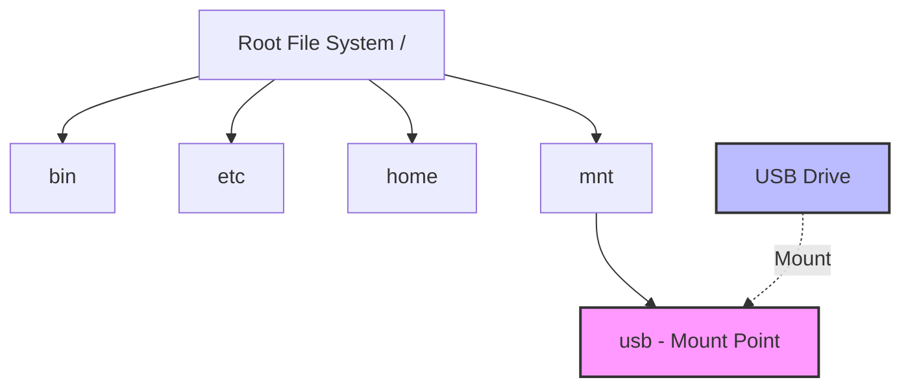

# File System Mounting

## Introduction

File system mounting is a fundamental concept in operating systems that allows you to access the data stored on storage devices. When you mount a file system, you're essentially connecting a storage device (like a hard drive, USB drive, CD-ROM, or network share) to a specific location in your file hierarchy, making its contents accessible through that path.

Think of mounting as plugging a physical device into your computer's file structure. Without mounting, the data on a storage device would remain inaccessible, even if the device is physically connected to your system.

## Understanding the Mount Point Concept

A **mount point** is simply a directory in your existing file system where the new file system will be attached. After mounting, any files or directories in this mount point become temporarily inaccessible, replaced by the contents of the mounted file system.



## Basic Mounting Operations

### Linux/Unix Systems

In Linux and Unix-like systems, mounting is typically done using the `mount` command:

```bash
# Basic syntax
mount -t filesystem_type device_path mount_point

# Example: Mounting a USB drive
mount -t vfat /dev/sdb1 /mnt/usb
```

Let's break down this command:
- `mount`: The command to perform the mounting operation
- `-t vfat`: Specifies the file system type (in this case, FAT32, common on USB drives)
- `/dev/sdb1`: The device file that represents the physical storage device
- `/mnt/usb`: The directory where we want to mount the storage device

To unmount a file system, use the `umount` command:

```bash
umount /mnt/usb
```

### Automatic Mounting with `/etc/fstab`

For permanent mounting configurations (devices that should be mounted at boot time), Linux systems use the `/etc/fstab` file:

```
# Device        Mount Point     FS Type     Options      Dump  Pass
/dev/sda1       /               ext4        defaults     0     1
/dev/sda2       /home           ext4        defaults     0     2
/dev/sdb1       /mnt/usb        vfat        user,noauto  0     0
```

Each line in this file represents a file system to mount, with these fields:
1. Device identifier (or UUID)
2. Mount point
3. File system type
4. Mount options
5. Dump flag (used by the dump utility for backups)
6. Pass number (used by fsck to determine the order of file system checks)

### Windows Systems

In Windows, mounting works a bit differently and is mostly automated. Storage devices are typically assigned drive letters:

```powershell
# Using PowerShell to mount a disk image
Mount-DiskImage -ImagePath "C:\path\to\image.iso"

# To dismount
Dismount-DiskImage -ImagePath "C:\path\to\image.iso"
```

Windows also supports mounting volumes to empty folders (similar to Unix mount points) using Disk Management or the `mountvol` command:

```cmd
# Mount a volume to a folder
mountvol C:\mount_folder \\?\Volume{GUID}\

# List available volumes
mountvol
```

## Special Mount Types

### Network File Systems

Mounting isn't limited to physical devices. You can also mount network file systems:

#### NFS (Network File System) on Linux

```bash
# Mounting an NFS share
mount -t nfs server_ip:/shared_folder /mnt/network_share
```

#### SMB/CIFS (Windows Shares) on Linux

```bash
# Mounting a Windows share
mount -t cifs //server_name/share_name /mnt/windows_share -o username=user,password=pass
```

### Temporary File Systems

Some mount points don't represent physical storage at all. For example, the `/proc` and `/sys` directories in Linux are special file systems that provide information about the system and running processes:

```bash
# Usually done automatically at boot, but this is the syntax
mount -t proc none /proc
mount -t sysfs none /sys
```

### Binding Mounts

Binding mounts allow you to mount a directory to multiple locations:

```bash
# Make the contents of /source available at /destination
mount --bind /source /destination
```

## Practical Examples

### Example 1: Working with USB Drives

Let's walk through the process of manually mounting a USB drive on Linux:

1. First, identify the device:
   ```bash
   lsblk
   ```
   
   Output might look like:
   ```
   NAME   MAJ:MIN RM  SIZE RO TYPE MOUNTPOINT
   sda      8:0    0  500G  0 disk 
   ├─sda1   8:1    0  450G  0 part /
   └─sda2   8:2    0   50G  0 part [SWAP]
   sdb      8:16   1   16G  0 disk 
   └─sdb1   8:17   1   16G  0 part
   ```

2. Create a mount point (if it doesn't exist):
   ```bash
   sudo mkdir -p /mnt/usb
   ```

3. Mount the USB drive:
   ```bash
   sudo mount /dev/sdb1 /mnt/usb
   ```

4. Verify the mount:
   ```bash
   df -h | grep sdb1
   ```
   
   Output:
   ```
   /dev/sdb1        16G  4.0G   12G  25% /mnt/usb
   ```

5. Access your files at `/mnt/usb`

6. When finished, unmount the drive:
   ```bash
   sudo umount /mnt/usb
   ```

### Example 2: Working with ISO Files

ISO files are disk images often used for CD/DVD distributions. You can mount them to access their contents without burning:

```bash
# Create a mount point
mkdir -p /mnt/iso

# Mount the ISO file
sudo mount -o loop ubuntu-22.04-desktop-amd64.iso /mnt/iso

# Browse the contents
ls -la /mnt/iso

# Unmount when done
sudo umount /mnt/iso
```

### Example 3: Creating and Mounting a RAM Disk

RAM disks are useful for temporary, high-speed storage:

```bash
# Create a 512MB RAM disk
sudo mkdir -p /mnt/ramdisk
sudo mount -t tmpfs -o size=512m tmpfs /mnt/ramdisk

# Check the mount
df -h | grep ramdisk

# Unmount when done
sudo umount /mnt/ramdisk
```

## Common Mount Options

Mount options control how the file system is mounted. Here are some common ones:

- `ro`: Read-only access
- `rw`: Read-write access (default)
- `noexec`: Prevents execution of binaries on the mounted file system
- `nosuid`: Ignores setuid/setgid bits
- `nodev`: Prevents interpretation of device files
- `user`: Allows non-root users to mount
- `auto`/`noauto`: Controls whether the file system is mounted automatically at boot
- `sync`/`async`: Controls whether writes are synchronous or asynchronous

Example using options:

```bash
# Mount a file system with custom options
sudo mount -o ro,noexec,nosuid /dev/sdb1 /mnt/secure
```

## Troubleshooting Mount Issues

### Common Problems and Solutions

1. **"Device is busy" error when unmounting**:
   ```bash
   # Find which processes are using the mount
   sudo lsof /mnt/usb
   
   # Force unmount (use with caution)
   sudo umount -f /mnt/usb
   ```

2. **"Unknown filesystem type" error**:
   ```bash
   # Install the necessary filesystem support
   # For example, for exFAT support:
   sudo apt-get install exfat-fuse exfat-utils
   ```

3. **Permissions issues**:
   ```bash
   # Remount with specific user/group ownership
   sudo mount -o uid=1000,gid=1000 /dev/sdb1 /mnt/usb
   ```

## Security Considerations

When mounting file systems, keep these security considerations in mind:

1. **Mount with restrictive options** for untrusted file systems:
   ```bash
   sudo mount -o ro,noexec,nosuid,nodev /dev/sdb1 /mnt/untrusted
   ```

2. **Don't automount unknown devices** in security-sensitive environments

3. **Use encrypted file systems** for sensitive data:
   ```bash
   # Create an encrypted container (example using LUKS)
   sudo cryptsetup luksFormat /dev/sdc1
   sudo cryptsetup open /dev/sdc1 encrypted_drive
   sudo mkfs.ext4 /dev/mapper/encrypted_drive
   sudo mount /dev/mapper/encrypted_drive /mnt/encrypted
   ```

## Summary

File system mounting is the process that connects storage devices to your file hierarchy, making their contents accessible through a specific path. We've covered:

- Basic mounting concepts and terminology
- How to mount and unmount devices in Linux and Windows
- Special mount types including network and temporary file systems
- Practical examples with USB drives, ISO files, and RAM disks
- Mount options and troubleshooting techniques
- Security considerations when mounting file systems

Understanding file system mounting is crucial for efficient system administration and enables you to work with various storage media effectively.

## Exercises

1. Try mounting a USB drive manually using the mount command, then configure it to mount automatically using `/etc/fstab`.

2. Create a RAM disk with a size of 256MB and benchmark its speed compared to your hard drive.

3. Mount an ISO file and explore its contents.

4. Set up a shared folder between your host system and a virtual machine using a network file system.

5. Research and experiment with different mount options to see how they affect file system behavior.

## Additional Resources

- The Linux `man` pages for mount, umount, and fstab: `man mount`, `man umount`, `man fstab`
- The [Arch Linux Wiki](https://wiki.archlinux.org/title/File_systems) has excellent documentation on file systems and mounting
- For Windows users, Microsoft's documentation on [Storage Management](https://docs.microsoft.com/en-us/windows-server/storage/storage)