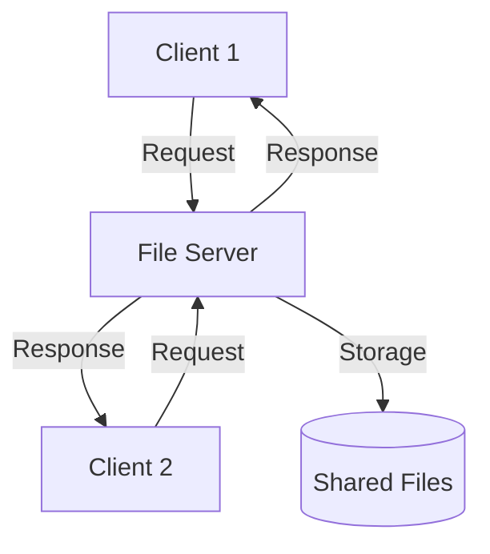

# File Sharing

## Introduction

File sharing is a fundamental concept in modern computing that allows multiple users or processes to access and manipulate the same files simultaneously. Whether you're working on a team project, setting up a home media server, or designing a multi-user application, understanding how file sharing works is essential for effective programming and system design.

In this guide, we'll explore the principles of file sharing in file systems, examine different approaches to implementing shared access, and look at practical examples you can apply in your own projects.

## What is File Sharing?

File sharing refers to the practice of making files accessible to multiple users or processes, either on the same computer or across a network. A file system with sharing capabilities must handle several key challenges:

- **Concurrent access**: Allowing multiple users to read or modify files simultaneously
- **Access control**: Managing permissions to determine who can access what
- **Consistency**: Ensuring that users see a consistent view of shared files
- **Performance**: Maintaining efficiency despite the overhead of sharing mechanisms

## Types of File Sharing

### 1. Local File Sharing

Local file sharing occurs when multiple processes on the same computer access the same files. Operating systems handle this through:

- **File descriptors**: References to open files that processes can use
- **File locks**: Mechanisms to prevent conflicting operations

Here's a simple example of local file sharing in Python:

```python
# Process 1
with open("shared_file.txt", "r") as file:
    data = file.read()
    print(f"Process 1 read: {data}")

# Process 2 (running separately)
with open("shared_file.txt", "a") as file:
    file.write("New content from Process 2
")
    print("Process 2 wrote to the file")
```

### 2. Network File Sharing

Network file sharing extends access across multiple computers using specialized protocols and file systems:



Common network file sharing systems include:

- **NFS (Network File System)**: Primarily for Unix/Linux environments
- **SMB/CIFS (Server Message Block/Common Internet File System)**: Used in Windows networks
- **AFP (Apple Filing Protocol)**: For macOS systems
- **WebDAV (Web Distributed Authoring and Versioning)**: HTTP-based file sharing

## File Sharing Permissions

Effective file sharing requires a robust permission system to control access. Most file systems implement permissions through:

### Unix-style Permissions

In Unix-like systems, permissions are divided into three categories:
- **Owner**: The user who created or owns the file
- **Group**: A collection of users with similar access needs
- **Others**: Everyone else

Each category can have read, write, and execute permissions:

```bash
$ ls -l shared_file.txt
-rw-rw-r-- 1 user group 1024 Mar 15 14:30 shared_file.txt
```

In this example:
- The owner (user) has read and write permissions (rw-)
- The group has read and write permissions (rw-)
- Others have only read permission (r--)

### Access Control Lists (ACLs)

For more granular control, modern file systems support Access Control Lists:

```bash
$ getfacl shared_file.txt
# file: shared_file.txt
# owner: user
# group: group
user::rw-
group::rw-
other::r--
user:john:rwx
```

Here, the user "john" has special read, write, and execute permissions on the file.

## Implementing File Sharing in Code

### Example 1: Using File Locks

When multiple processes need to modify a shared file, locks help prevent conflicts:

```python
import fcntl
import time

def write_to_shared_file(message):
    with open("shared_log.txt", "a") as file:
        # Acquire an exclusive lock
        fcntl.flock(file, fcntl.LOCK_EX)
        try:
            # Critical section - only one process can be here at a time
            file.write(f"{time.ctime()}: {message}
")
            file.flush()
        finally:
            # Release the lock
            fcntl.flock(file, fcntl.LOCK_UN)

# Usage
write_to_shared_file("Process A writing to shared file")
```

### Example 2: Shared Database Access

For more complex sharing requirements, a database can be more appropriate:

```python
import sqlite3
from threading import Lock

class SharedDatabase:
    def __init__(self, db_path):
        self.db_path = db_path
        self.lock = Lock()
        
    def add_data(self, key, value):
        with self.lock:
            conn = sqlite3.connect(self.db_path)
            cursor = conn.cursor()
            cursor.execute("INSERT OR REPLACE INTO data VALUES (?, ?)", (key, value))
            conn.commit()
            conn.close()
    
    def get_data(self, key):
        with self.lock:
            conn = sqlite3.connect(self.db_path)
            cursor = conn.cursor()
            cursor.execute("SELECT value FROM data WHERE key = ?", (key,))
            result = cursor.fetchone()
            conn.close()
            return result[0] if result else None

# Usage
db = SharedDatabase("shared.db")
db.add_data("user1", "Some shared information")
value = db.get_data("user1")
print(f"Retrieved shared data: {value}")
```

## Network File Sharing Implementation

### Example: Accessing NFS Shares in Python

```python
import os
import shutil

# Mount point of the NFS share
nfs_directory = "/mnt/shared_drive"

def list_shared_files():
    return os.listdir(nfs_directory)

def copy_to_shared(local_file, shared_filename):
    shutil.copy2(local_file, os.path.join(nfs_directory, shared_filename))
    print(f"Copied {local_file} to shared directory as {shared_filename}")

def read_from_shared(shared_filename):
    with open(os.path.join(nfs_directory, shared_filename), 'r') as file:
        return file.read()

# Usage
available_files = list_shared_files()
print(f"Files in shared directory: {available_files}")

copy_to_shared("local_document.txt", "shared_document.txt")
content = read_from_shared("shared_document.txt")
```

## Common File Sharing Challenges

### 1. Race Conditions

Race conditions occur when multiple processes access shared data simultaneously, leading to unexpected results:

```python
# Potential race condition
with open("counter.txt", "r") as file:
    count = int(file.read().strip())
    
count += 1  # Another process might read the old value before this write

with open("counter.txt", "w") as file:
    file.write(str(count))
```

Solution: Use proper locking mechanisms or atomic operations.

### 2. File Locking Strategies

Two main types of locks:

- **Exclusive locks**: Only one process can hold this lock (writing)
- **Shared locks**: Multiple processes can hold these locks simultaneously (reading)

```python
import fcntl

# Shared lock (for reading)
def read_with_lock(filename):
    with open(filename, "r") as file:
        fcntl.flock(file, fcntl.LOCK_SH)  # Shared lock
        data = file.read()
        fcntl.flock(file, fcntl.LOCK_UN)  # Release lock
        return data

# Exclusive lock (for writing)
def write_with_lock(filename, content):
    with open(filename, "w") as file:
        fcntl.flock(file, fcntl.LOCK_EX)  # Exclusive lock
        file.write(content)
        fcntl.flock(file, fcntl.LOCK_UN)  # Release lock
```

### 3. Network Latency and Disconnections

Network file sharing must handle connectivity issues:

```python
def robust_file_read(network_path, max_retries=3):
    for attempt in range(max_retries):
        try:
            with open(network_path, "r") as file:
                return file.read()
        except (IOError, OSError) as e:
            print(f"Attempt {attempt+1} failed: {str(e)}")
            if attempt < max_retries - 1:
                import time
                time.sleep(2 ** attempt)  # Exponential backoff
            else:
                raise
```

## Real-World Applications

### 1. Collaborative Document Editing

Modern collaborative editors use operational transformation or CRDTs (Conflict-free Replicated Data Types) to allow simultaneous editing of documents:

```javascript
// Simplified collaborative editor concept
function applyEdit(document, edit) {
  // Transform edit against all concurrent edits
  const transformedEdit = transformAgainstConcurrent(edit, concurrentEdits);
  
  // Apply the transformed edit
  document.content = applyEditToContent(document.content, transformedEdit);
  
  // Broadcast the edit to other users
  broadcastEdit(transformedEdit);
}
```

### 2. Version Control Systems

Git and other VCSs are specialized file sharing systems that track changes:

```bash
# Clone a shared repository
git clone https://github.com/example/shared-project.git

# Make changes locally
echo "New content" > shared_file.txt

# Share changes with others
git add shared_file.txt
git commit -m "Added new content to shared file"
git push origin main
```

### 3. Distributed File Systems

Systems like Hadoop HDFS handle file sharing across large clusters:

```java
// Simplified HDFS example
Configuration conf = new Configuration();
FileSystem hdfs = FileSystem.get(conf);

// Write to shared HDFS file
FSDataOutputStream out = hdfs.create(new Path("/shared/data.txt"));
out.writeUTF("This data is replicated across the cluster");
out.close();

// Read from shared HDFS file
FSDataInputStream in = hdfs.open(new Path("/shared/data.txt"));
String data = in.readUTF();
in.close();
```

## Best Practices for File Sharing

1. **Always use proper locking mechanisms** when multiple processes might modify files
2. **Implement retry logic** for network file operations
3. **Keep shared files organized** with clear ownership and permissions
4. **Design for eventual consistency** in distributed systems
5. **Monitor file sharing performance** and adjust based on usage patterns
6. **Implement proper error handling** for sharing failures
7. **Document sharing protocols** for team collaboration

## Summary

File sharing is a critical capability that enables collaboration and distributed computing. We've explored:

- The fundamental concepts of file sharing in local and networked environments
- Permission systems that control access to shared files
- Implementation techniques including file locks and database-backed sharing
- Challenges like race conditions and network failures
- Real-world applications of file sharing principles

By understanding these concepts, you're better equipped to design and implement systems that effectively share data between users, processes, and computers.

## Exercises

1. Implement a simple program that uses file locking to maintain a shared counter that multiple processes can increment safely.
2. Create a Python script that monitors a shared directory and notifies when files are added, modified, or deleted.
3. Design a simple client-server application where multiple clients can read and write to shared files stored on the server.
4. Experiment with different permission schemes for a shared directory and document the effects on different users.
5. Implement a versioning system that maintains previous versions of shared files when they are modified.

## Additional Resources

- The Operating Systems: Three Easy Pieces (OSTEP) chapter on file systems
- Python documentation on the `fcntl` module for file locking
- Network File System Protocol documentation (RFC 7530)
- Documentation for your operating system's file sharing capabilities
- Git documentation for distributed version control concepts