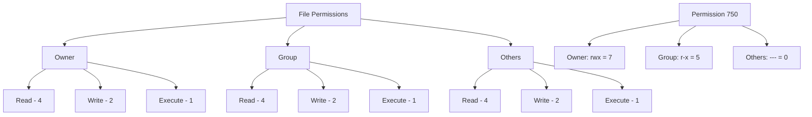

# File Protection

## Introduction

File protection is a critical aspect of operating systems that controls and manages access to files, ensuring data security and integrity. In a multi-user or networked environment, it's essential to prevent unauthorized access, accidental or malicious modification, and data breaches. File protection mechanisms allow operating systems to enforce rules about who can access files and what operations they can perform.

In this guide, we'll explore the fundamental concepts of file protection, various protection mechanisms, and how they're implemented in different operating systems. By the end, you'll have a solid understanding of how to secure your files and implement appropriate access controls in your programs.

## Core Concepts of File Protection

### Why File Protection Matters

Before diving into the mechanics of file protection, let's understand why it's crucial:

1. **Data Security**: Prevents unauthorized access to sensitive information
2. **Data Integrity**: Ensures files aren't accidentally or maliciously altered
3. **Privacy**: Maintains confidentiality of personal or sensitive files
4. **Resource Management**: Controls who can use storage resources and how

### Access Control Basics

At its core, file protection is about controlling what actions users can perform on files. These actions typically include:

- **Read**: View the contents of a file
- **Write**: Modify the file contents
- **Execute**: Run the file as a program
- **Delete**: Remove the file from the system
- **Create**: Make new files in a directory
- **List**: View the names and attributes of files in a directory

## File Permission Models

### Unix-like Permission System

Unix-based systems (including Linux and macOS) use a simple yet effective permission model based on three types of users:

1. **Owner**: The user who created the file
2. **Group**: A collection of users with similar access needs
3. **Others**: Everyone else on the system

For each category, the system defines three basic permissions:

- **Read (r)**: Permission to view file contents
- **Write (w)**: Permission to modify the file
- **Execute (x)**: Permission to run the file as a program

Let's see how to view these permissions in a Unix system:

```bash
$ ls -l myfile.txt
-rw-r--r-- 1 john developers 1024 Mar 15 14:30 myfile.txt
```

This output shows:
- The owner (john) has read and write permissions
- The group (developers) has read-only access
- Others have read-only access

To modify these permissions, we use the `chmod` command:

```bash
# Give execution permission to the owner
$ chmod u+x myfile.txt

# Remove read permission from others
$ chmod o-r myfile.txt

# Set specific permissions (rwx for owner, r-x for group, --- for others)
$ chmod 750 myfile.txt
```

### Understanding Permission Numbers

The numeric representation (like 750 in the example above) uses octal numbers where:
- 4 represents read permission
- 2 represents write permission
- 1 represents execute permission

By adding these values, we get:
- 7 (4+2+1) = read, write, and execute
- 5 (4+0+1) = read and execute
- 0 (0+0+0) = no permissions

Here's a diagram showing how permissions are represented:



### Windows Access Control Lists (ACLs)

Windows uses a more granular approach with Access Control Lists (ACLs). Instead of the three categories in Unix, Windows allows assigning permissions to specific users and groups, with more detailed permission types.

Key components of Windows ACLs:

1. **Security Descriptors**: Contain all security information for an object
2. **Discretionary Access Control List (DACL)**: Specifies access rights for users/groups
3. **System Access Control List (SACL)**: Controls auditing of access attempts

Here's a simple example of setting permissions with PowerShell:

```powershell
# Grant read access to a user
$acl = Get-Acl "C:\Data\important.txt"
$permission = "Domain\User", "Read", "Allow"
$accessRule = New-Object System.Security.AccessControl.FileSystemAccessRule $permission
$acl.SetAccessRule($accessRule)
$acl | Set-Acl "C:\Data\important.txt"
```

## Implementing File Protection in Programs

### File Access in C/C++

When programming, you'll need to work within the protection mechanisms of the operating system. Here's an example of opening a file with specific modes in C:

```c
#include <stdio.h>

int main() {
    FILE *file;
    
    // Open file for reading
    file = fopen("data.txt", "r");
    
    if (file == NULL) {
        printf("Cannot open file for reading. Check if file exists and you have read permissions.
");
        return 1;
    }
    
    // File operations...
    
    fclose(file);
    
    // Open file for writing
    file = fopen("output.txt", "w");
    
    if (file == NULL) {
        printf("Cannot open file for writing. Check if you have write permissions.
");
        return 1;
    }
    
    // Write operations...
    
    fclose(file);
    
    return 0;
}
```

### File Access in Python

Python simplifies file operations while still respecting system permissions:

```python
# Reading a file (requires read permission)
try:
    with open('data.txt', 'r') as file:
        content = file.read()
        print(f"File content: {content}")
except PermissionError:
    print("Permission denied: Unable to read the file")
except FileNotFoundError:
    print("File not found: Check the path and filename")

# Writing to a file (requires write permission)
try:
    with open('output.txt', 'w') as file:
        file.write("This is new content")
    print("Successfully wrote to the file")
except PermissionError:
    print("Permission denied: Unable to write to the file")
```

Output if successful:
```
File content: Hello, this is the content of data.txt
Successfully wrote to the file
```

Output if permission denied:
```
Permission denied: Unable to read the file
Permission denied: Unable to write to the file
```

## Advanced File Protection Concepts

### Setuid and Setgid Bits

Unix-like systems have special permission bits called `setuid` and `setgid` that allow users to run executables with the permissions of the file owner or group respectively.

```bash
# Set the setuid bit (file will run as the owner)
$ chmod u+s myprogram

# Set the setgid bit (file will run with the group's permissions)
$ chmod g+s myprogram
```

This is powerful but can pose security risks if misused.

### Sticky Bit

The sticky bit is a permission used on directories that allows only the file owner, directory owner, or root to delete or rename files within the directory. It's commonly used on shared directories like `/tmp`.

```bash
# Set the sticky bit on a directory
$ chmod +t /shared_directory
```

### File Encryption

Beyond permission systems, encryption provides an additional layer of protection:

```python
# Example of file encryption in Python using cryptography library
from cryptography.fernet import Fernet

# Generate encryption key
key = Fernet.generate_key()

# Create encryption object
cipher = Fernet(key)

# Read original file
with open('sensitive_data.txt', 'rb') as file:
    original_data = file.read()

# Encrypt the data
encrypted_data = cipher.encrypt(original_data)

# Save encrypted data
with open('encrypted_data.txt', 'wb') as file:
    file.write(encrypted_data)

print("File encrypted successfully")

# To decrypt
decrypted_data = cipher.decrypt(encrypted_data)
print(f"Decrypted content: {decrypted_data.decode()}")
```

## Real-World Applications

### Case Study: Protecting Configuration Files

Many applications store sensitive information like API keys or database credentials in configuration files. Here's a practical approach to securing them:

1. Set restrictive file permissions:

```bash
# Set permissions so only the owner can read/write
$ chmod 600 config.ini
```

2. Implement proper error handling in your code:

```python
import configparser
import os
import sys

def load_config(config_path):
    # Check if file exists
    if not os.path.exists(config_path):
        sys.exit(f"Error: Configuration file not found at {config_path}")
    
    # Check permissions
    stats = os.stat(config_path)
    if stats.st_mode & 0o077:  # Check if group or others have any permissions
        sys.exit(f"Error: Insecure permissions on {config_path}. Use chmod 600.")
    
    # Load configuration
    try:
        config = configparser.ConfigParser()
        config.read(config_path)
        return config
    except Exception as e:
        sys.exit(f"Error reading configuration: {e}")

# Usage
config = load_config('config.ini')
api_key = config['API']['key']
```

### Case Study: Implementing a Simple Access Control System

Let's build a basic file access control system in Python:

```python
import os
import json
from datetime import datetime

class SimpleAccessControl:
    def __init__(self, acl_file='access_control.json'):
        self.acl_file = acl_file
        self.acl = self._load_acl()
    
    def _load_acl(self):
        if os.path.exists(self.acl_file):
            with open(self.acl_file, 'r') as f:
                return json.load(f)
        return {"files": {}}
    
    def _save_acl(self):
        with open(self.acl_file, 'w') as f:
            json.dump(self.acl, f, indent=2)
    
    def set_permission(self, filename, username, permissions):
        """
        Set permissions for a user on a file
        permissions should be a string like 'rw' (read, write)
        """
        if filename not in self.acl["files"]:
            self.acl["files"][filename] = {}
        
        self.acl["files"][filename][username] = permissions
        self._save_acl()
        print(f"Granted {permissions} access to {username} for {filename}")
    
    def check_permission(self, filename, username, requested_access):
        """
        Check if user has requested access to a file
        requested_access should be 'r', 'w', or 'x'
        """
        if filename not in self.acl["files"] or username not in self.acl["files"][filename]:
            return False
        
        return requested_access in self.acl["files"][filename][username]
    
    def access_file(self, filename, username, access_type):
        """
        Try to access a file with given access type
        access_type should be 'read', 'write', or 'execute'
        """
        access_map = {'read': 'r', 'write': 'w', 'execute': 'x'}
        req_access = access_map.get(access_type)
        
        if not req_access:
            print(f"Invalid access type: {access_type}")
            return False
        
        if self.check_permission(filename, username, req_access):
            print(f"Access granted: {username} can {access_type} {filename}")
            # Log access
            with open('access_log.txt', 'a') as log:
                log.write(f"{datetime.now()} - {username} {access_type} {filename}
")
            return True
        else:
            print(f"Access denied: {username} cannot {access_type} {filename}")
            return False

# Usage example
if __name__ == "__main__":
    ac = SimpleAccessControl()
    
    # Set up permissions
    ac.set_permission("important_data.txt", "alice", "rw")
    ac.set_permission("important_data.txt", "bob", "r")
    ac.set_permission("program.exe", "alice", "rx")
    
    # Test access
    ac.access_file("important_data.txt", "alice", "write")  # Should succeed
    ac.access_file("important_data.txt", "bob", "write")    # Should fail
    ac.access_file("program.exe", "alice", "execute")       # Should succeed
```

Sample output:
```
Granted rw access to alice for important_data.txt
Granted r access to bob for important_data.txt
Granted rx access to alice for program.exe
Access granted: alice can write important_data.txt
Access denied: bob cannot write important_data.txt
Access granted: alice can execute program.exe
```

## Best Practices for File Protection

1. **Principle of Least Privilege**: Grant only the minimum permissions necessary
2. **Regular Audits**: Periodically review file permissions to identify vulnerabilities
3. **Use Access Control Groups**: Organize users into groups with similar access needs
4. **Separate System and User Files**: Keep system files protected from regular users
5. **Encrypt Sensitive Data**: Add encryption for highly sensitive information
6. **Regular Backups**: Maintain backups to recover from data corruption or loss
7. **Handle Temporary Files Securely**: Use secure methods for creating and managing temp files
8. **Validate All Inputs**: Prevent path traversal and other file-related attacks
9. **Error Handling**: Implement proper error handling for permission-related issues
10. **Documentation**: Document the protection schemes used in your applications

## Summary

File protection is a fundamental component of operating systems that safeguards data integrity, privacy, and security. We've covered:

- Basic concepts of access control and file permissions
- Permission models in Unix and Windows systems
- How to implement file access in programming languages
- Advanced protection concepts like setuid bits and encryption
- Real-world applications and best practices

By implementing proper file protection mechanisms, you can ensure that your applications handle data securely and respect user privacy while preventing unauthorized access.

## Exercises

1. Write a program that checks and reports the permissions of all files in a directory.
2. Implement a simple configuration file manager that encrypts sensitive information.
3. Create a file access logger that records all attempts to access protected files.
4. Design a permission-based file sharing system for a multi-user environment.
5. Research and compare file protection mechanisms across different operating systems (Windows, Linux, macOS).

## Further Reading

- Operating Systems: Principles and Practice - Understanding file systems and protection
- Computer Security: Principles and Practice - Advanced topics in file security
- The Linux Programming Interface - Detailed coverage of Linux file permissions
- Windows Internals - Deep dive into Windows security mechanisms