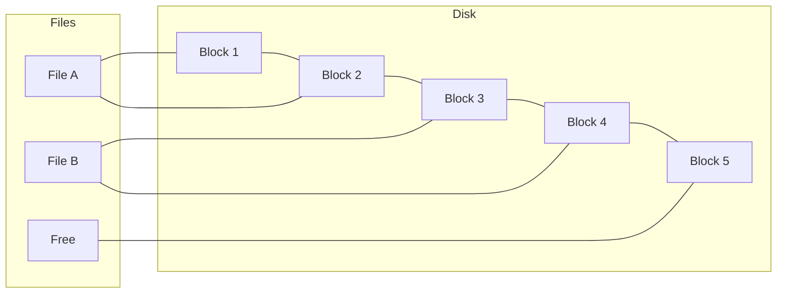
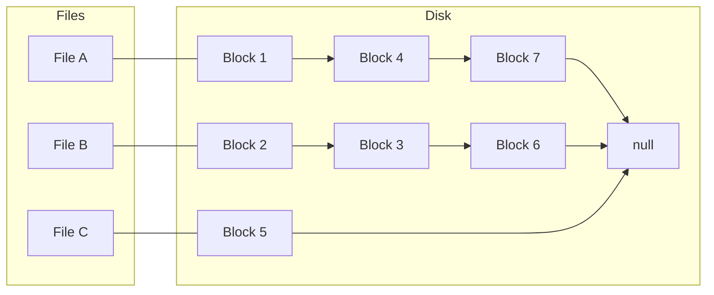
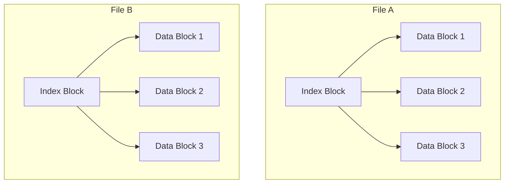

# File System Implementation

## Introduction

A file system is a crucial component of any operating system, responsible for organizing and managing files on storage devices. While users interact with files and directories through simple interfaces, a complex implementation exists beneath the surface to handle data storage, retrieval, and organization efficiently.

In this guide, we'll explore how file systems are implemented at a low level, focusing on the fundamental structures and algorithms that make file management possible. We'll cover everything from disk space allocation to directory organization and the challenges involved in building robust file systems.

## Basic File System Components

Every file system implementation must address these core components:

1. **Storage Allocation** - How disk space is assigned to files
2. **Directory Management** - How files are organized into directories
3. **File Metadata** - How to store information about each file
4. **Access Control** - How permissions and security are enforced
5. **I/O Operations** - How data is read from and written to files

Let's explore each of these components in detail.

## Storage Allocation Methods

Storage allocation refers to how the file system assigns disk space to files. There are several methods, each with different trade-offs.

### Contiguous Allocation

In contiguous allocation, each file occupies a continuous sequence of blocks on disk.



**Advantages:**
- Simple implementation
- Fast sequential access
- Minimal disk seek time

**Disadvantages:**
- External fragmentation (wasted space between files)
- Difficult to grow files (need to relocate if no adjacent free space)
- Requires knowing file size in advance

**Code example:** Checking if contiguous space is available

```c
// Simplified function to check if enough contiguous blocks are available
bool has_contiguous_space(int start_block, int num_blocks_needed) {
    for (int i = 0; i < num_blocks_needed; i++) {
        if (is_block_allocated(start_block + i)) {
            return false;
        }
    }
    return true;
}

// Search for a contiguous region
int find_contiguous_region(int num_blocks_needed) {
    for (int start = 0; start < TOTAL_BLOCKS; start++) {
        if (has_contiguous_space(start, num_blocks_needed)) {
            return start;  // Found a starting block with enough space
        }
    }
    return -1;  // No contiguous region found
}
```

### Linked Allocation

With linked allocation, each file is a linked list of blocks, with each block containing a pointer to the next block.



**Advantages:**
- No external fragmentation
- Files can grow dynamically
- No need to know file size in advance

**Disadvantages:**
- Slow random access (must traverse the list)
- Block pointers consume space in each block
- Reliability issues (one damaged pointer affects the rest of the file)

**Code example:** Reading a file with linked allocation

```c
// Simplified function to read a file with linked allocation
void read_linked_file(int start_block, char* buffer, int num_blocks) {
    int current_block = start_block;
    int blocks_read = 0;
    
    while (current_block != -1 && blocks_read < num_blocks) {
        // Read data from current block into buffer
        read_block(current_block, buffer + blocks_read * BLOCK_SIZE);
        
        // Get next block from the last few bytes of the current block
        current_block = get_next_block_pointer(current_block);
        blocks_read++;
    }
}
```

### Indexed Allocation

Indexed allocation uses an index block (or multiple index blocks) to store pointers to all data blocks of a file.



**Advantages:**
- Supports direct access to any block
- No external fragmentation
- Files can grow until index block is full

**Disadvantages:**
- Small files waste space (need at least an index block plus data blocks)
- Large files may need multiple levels of indexing
- Maximum file size limited by index block structure

**Code example:** Accessing a block with indexed allocation

```c
// Function to read a specific block of a file using indexed allocation
void read_indexed_file_block(int index_block, int block_number, char* buffer) {
    // Read the index block into memory
    int index_data[POINTERS_PER_INDEX_BLOCK];
    read_block(index_block, (char*)index_data);
    
    // Check if the block number is within range
    if (block_number >= POINTERS_PER_INDEX_BLOCK) {
        printf("Error: Block number out of range
");
        return;
    }
    
    // Get the actual data block number from the index
    int data_block = index_data[block_number];
    
    // Read the data block
    if (data_block != -1) {
        read_block(data_block, buffer);
    } else {
        printf("Error: Block does not exist
");
    }
}
```

## Directory Implementation

Directories provide a way to organize files in a hierarchical structure. The implementation of directories involves several design decisions.

### Linear List

The simplest directory implementation is a linear list of file entries.

```c
struct DirectoryEntry {
    char file_name[MAX_FILENAME_LENGTH];
    int file_attributes;  // Type, protection, etc.
    int file_address;     // Starting block or inode number
    int file_size;
};
```

This works well for small directories but becomes inefficient for directories with many files.

### Hash Table

For faster lookups, directories can be implemented as hash tables, where the file name is hashed to find its entry quickly.

```c
// Simple hash function for filenames
int hash_filename(char* name, int table_size) {
    unsigned int hash = 0;
    for (int i = 0; name[i] != '\0'; i++) {
        hash = hash * 31 + name[i];
    }
    return hash % table_size;
}

// Lookup file in a hashed directory
int lookup_file(Directory* dir, char* filename) {
    int index = hash_filename(filename, dir->hash_table_size);
    
    // Handle collisions with linear probing
    int original_index = index;
    do {
        if (strcmp(dir->entries[index].file_name, filename) == 0) {
            return dir->entries[index].file_address;
        }
        
        index = (index + 1) % dir->hash_table_size;
    } while (index != original_index && dir->entries[index].file_name[0] != '\0');
    
    return -1;  // File not found
}
```

## File Metadata: The Inode Structure

Most modern file systems use a structure called an **inode** (index node) to store file metadata separately from the directory entry. This approach separates the file name (stored in directory entries) from the file's metadata and data block information.

```c
struct Inode {
    int file_size;
    int owner_id;
    int group_id;
    int permissions;
    time_t access_time;
    time_t modification_time;
    time_t creation_time;
    int direct_blocks[12];      // Direct pointers to data blocks
    int single_indirect;        // Points to a block of pointers
    int double_indirect;        // Points to a block of indirect pointers
    int triple_indirect;        // Points to a block of double indirect pointers
};
```

An inode contains:
1. File metadata (size, ownership, permissions, timestamps)
2. Pointers to the actual data blocks
3. Usually a combination of direct, indirect, double indirect, and triple indirect pointers

```mermaid
graph TD
    I[Inode] --> D1[Direct Block 1]
    I --> D2[Direct Block 2]
    I --> D3[..." up to 12]
    I --> S[Single Indirect Block]
    I --> D[Double Indirect Block]
    I --> T[Triple Indirect Block]
    
    S --> S1[Data Block]
    S --> S2[Data Block]
    S --> S3[..." up to 1024]
    
    D --> DI1[Indirect Block]
    D --> DI2[Indirect Block]
    DI1 --> DI1D1[Data Block]
    DI1 --> DI1D2[Data Block]
```

**Practical example:** Reading a specific byte in a file

```c
// Simplified function to find the byte at a given offset using an inode
void read_byte_at_offset(Inode* inode, long offset, char* result) {
    // Calculate which block contains this byte
    int block_size = 4096;  // Example block size (4KB)
    int block_index = offset / block_size;
    int byte_in_block = offset % block_size;
    
    // Find the physical block number
    int physical_block;
    
    if (block_index < 12) {
        // Direct block
        physical_block = inode->direct_blocks[block_index];
    }
    else if (block_index < 12 + 1024) {
        // Single indirect block
        int* indirect_block = malloc(block_size);
        read_block(inode->single_indirect, (char*)indirect_block);
        physical_block = indirect_block[block_index - 12];
        free(indirect_block);
    }
    else {
        // Handle double and triple indirect blocks (implementation omitted for brevity)
        // This would follow the same pattern but with additional levels of indirection
        return;
    }
    
    // Read the actual block and extract the byte
    char* block_data = malloc(block_size);
    read_block(physical_block, block_data);
    *result = block_data[byte_in_block];
    free(block_data);
}
```

## Free Space Management

File systems must track which blocks are in use and which are free. There are several methods for managing free space.

### Bitmap

A bitmap uses one bit for each block on the disk. If the bit is 1, the block is in use; if it's 0, the block is free.

```c
// Check if a block is free using a bitmap
bool is_block_free(unsigned char* bitmap, int block_number) {
    int byte_index = block_number / 8;
    int bit_position = block_number % 8;
    
    return !(bitmap[byte_index] & (1 << bit_position));
}

// Mark a block as used in the bitmap
void mark_block_used(unsigned char* bitmap, int block_number) {
    int byte_index = block_number / 8;
    int bit_position = block_number % 8;
    
    bitmap[byte_index] |= (1 << bit_position);
}

// Mark a block as free in the bitmap
void mark_block_free(unsigned char* bitmap, int block_number) {
    int byte_index = block_number / 8;
    int bit_position = block_number % 8;
    
    bitmap[byte_index] &= ~(1 << bit_position);
}
```

### Free List

Alternatively, free blocks can be organized into a linked list, with each free block containing a pointer to the next free block.

## Real-World File System Examples

Let's look at how these concepts are applied in real file systems.

### ext4 (Fourth Extended File System)

ext4 is a widely used file system in Linux distributions.

**Key features:**
1. Uses inodes for file metadata
2. Implements bitmap-based free space management
3. Uses extent-based allocation (ranges of contiguous blocks)
4. Supports huge file sizes (up to 16 TiB) and large filesystem sizes (up to 1 EiB)
5. Includes journaling for crash recovery

**Example: ext4 extent structure**

```c
// Simplified version of ext4's extent structure
struct ext4_extent {
    uint32_t block;     // First block number for the extent
    uint16_t len;       // Number of blocks in the extent
    uint16_t start_hi;  // High 16 bits of logical block
    uint32_t start_lo;  // Low 32 bits of logical block
};
```

### NTFS (New Technology File System)

NTFS is Microsoft's primary file system for Windows.

**Key features:**
1. Uses Master File Table (MFT) instead of inodes
2. Implements bitmap-based free space management
3. Uses B-tree for directory structure
4. Supports file-level encryption, compression, and access control lists
5. Includes journaling for crash recovery

## Implementation Challenges

Creating a robust file system involves overcoming several challenges:

### 1. Performance Optimization

To maximize performance, file systems employ various techniques:

- **Block caching**: Keep frequently accessed blocks in memory
- **Read-ahead**: Predict and prefetch blocks likely to be needed soon
- **Write-behind/buffering**: Delay writing blocks to disk to optimize I/O operations

```c
// Simplified block cache implementation
typedef struct {
    int block_number;
    bool dirty;         // Has this block been modified?
    time_t last_used;   // For LRU replacement policy
    char data[BLOCK_SIZE];
} CacheBlock;

CacheBlock cache[CACHE_SIZE];

// Find a block in the cache or load it from disk
CacheBlock* get_cached_block(int block_number) {
    // First try to find the block in the cache
    for (int i = 0; i < CACHE_SIZE; i++) {
        if (cache[i].block_number == block_number) {
            cache[i].last_used = time(NULL);
            return &cache[i];
        }
    }
    
    // Block not found, find a slot (using LRU replacement policy)
    int lru_index = 0;
    time_t oldest_time = cache[0].last_used;
    
    for (int i = 1; i < CACHE_SIZE; i++) {
        if (cache[i].last_used < oldest_time) {
            oldest_time = cache[i].last_used;
            lru_index = i;
        }
    }
    
    // Flush the block if it's dirty
    if (cache[lru_index].dirty) {
        write_block(cache[lru_index].block_number, cache[lru_index].data);
    }
    
    // Load the new block
    cache[lru_index].block_number = block_number;
    cache[lru_index].dirty = false;
    cache[lru_index].last_used = time(NULL);
    read_block(block_number, cache[lru_index].data);
    
    return &cache[lru_index];
}
```

### 2. Crash Recovery

File systems must be able to recover from unexpected shutdowns or crashes:

- **Journaling**: Record operations in a log before performing them
- **Copy-on-write**: Never overwrite existing data, create new copies instead
- **Checkpointing**: Periodically create consistent states of the file system

**Simplified journaling example:**

```c
// Pseudocode for a simple journaling operation
void journal_write_operation(int block_number, char* data) {
    // 1. Write to the journal
    journal_begin_transaction();
    journal_write(JOURNAL_BLOCK_WRITE, block_number, data);
    journal_commit_transaction();
    
    // 2. Write to the actual block
    write_block(block_number, data);
    
    // 3. Mark the journal entry as complete
    journal_mark_transaction_complete();
}

// During recovery:
void recover_from_journal() {
    for each incomplete transaction in journal {
        for each operation in transaction {
            if (operation.type == JOURNAL_BLOCK_WRITE) {
                write_block(operation.block_number, operation.data);
            }
        }
    }
}
```

### 3. Security and Access Control

File systems must enforce permissions and protect data:

- Access control lists (ACLs)
- Encryption at rest
- User and group permissions

## Building a Simple File System

Let's tie everything together with pseudocode for a simple file system implementation:

```c
// Main structures for our simple file system
#define BLOCK_SIZE 4096
#define MAX_FILENAME 255
#define MAX_FILE_SIZE (1024 * 1024 * 1024)  // 1GB

typedef struct {
    char name[MAX_FILENAME];
    int inode_number;
} DirectoryEntry;

typedef struct {
    int size;
    int direct_blocks[12];
    int single_indirect;
    int double_indirect;
    int owner_id;
    int permissions;
    time_t modified_time;
    time_t access_time;
    time_t creation_time;
} Inode;

typedef struct {
    int num_blocks;
    int num_inodes;
    unsigned char* block_bitmap;
    unsigned char* inode_bitmap;
    Inode* inodes;
    int root_directory_inode;
} FileSystem;

// Initialize a new file system
FileSystem* initialize_fs(int num_blocks) {
    FileSystem* fs = malloc(sizeof(FileSystem));
    
    fs->num_blocks = num_blocks;
    fs->num_inodes = num_blocks / 4;  // Rule of thumb: 1 inode per 4 blocks
    
    // Allocate bitmaps for blocks and inodes
    int block_bitmap_size = (num_blocks + 7) / 8;  // Ceiling division by 8
    int inode_bitmap_size = (fs->num_inodes + 7) / 8;
    
    fs->block_bitmap = calloc(block_bitmap_size, 1);
    fs->inode_bitmap = calloc(inode_bitmap_size, 1);
    
    // Allocate inodes array
    fs->inodes = calloc(fs->num_inodes, sizeof(Inode));
    
    // Create root directory
    fs->root_directory_inode = allocate_inode(fs);
    
    // Initialize superblock and reserve system blocks
    // (Simplified for this example)
    
    return fs;
}

// Create a new file
int create_file(FileSystem* fs, int directory_inode, char* filename) {
    // Allocate an inode for the new file
    int inode_num = allocate_inode(fs);
    if (inode_num == -1) {
        return -1;  // No free inodes
    }
    
    // Initialize the inode
    Inode* inode = &fs->inodes[inode_num];
    inode->size = 0;
    inode->owner_id = get_current_user_id();
    inode->permissions = 0644;  // rw-r--r--
    inode->creation_time = time(NULL);
    inode->modified_time = inode->creation_time;
    inode->access_time = inode->creation_time;
    
    // Add entry to directory
    add_directory_entry(fs, directory_inode, filename, inode_num);
    
    return inode_num;
}

// Write data to a file
int write_file(FileSystem* fs, int inode_num, char* data, int length, int offset) {
    Inode* inode = &fs->inodes[inode_num];
    
    // Check if we need to allocate new blocks
    int start_block = offset / BLOCK_SIZE;
    int end_block = (offset + length - 1) / BLOCK_SIZE;
    
    // Allocate blocks as needed
    for (int i = start_block; i <= end_block; i++) {
        if (i < 12) {
            // Direct block
            if (inode->direct_blocks[i] == 0) {
                inode->direct_blocks[i] = allocate_block(fs);
                if (inode->direct_blocks[i] == -1) {
                    return -1;  // No free blocks
                }
            }
        }
        // Handle indirect blocks (omitted for brevity)
    }
    
    // Write the data
    // (Implementation omitted for brevity)
    
    // Update file size and timestamps
    if (offset + length > inode->size) {
        inode->size = offset + length;
    }
    inode->modified_time = time(NULL);
    
    return length;
}
```

## Performance Considerations

When implementing a file system, several performance considerations come into play:

1. **Block size trade-offs**:
   - Larger blocks → better sequential access, more wasted space
   - Smaller blocks → less wasted space, more overhead, more seeks

2. **Directory organization**:
   - Linear search is simple but slow for large directories
   - B-trees or hash tables make lookups faster but are more complex to implement

3. **Caching strategies**:
   - Least Recently Used (LRU)
   - Most Recently Used (MRU)
   - Frequency-based replacement

4. **Allocation strategies**:
   - Best fit vs. first fit vs. worst fit
   - Preallocation for expected growth

## Summary

File system implementation is a complex but fascinating area that combines data structures, algorithms, and systems programming. We've covered the fundamental components of file systems:

- Storage allocation methods (contiguous, linked, indexed)
- Directory implementations (linear lists, hash tables)
- File metadata management using inodes
- Free space management techniques
- Performance optimizations and caching
- Crash recovery mechanisms

Understanding these concepts helps programmers work more effectively with file systems and provides insights into how operating systems manage persistent storage.

## Exercises for Practice

1. Implement a simple in-memory file system using the structures and algorithms discussed in this guide.
2. Benchmark different block sizes to understand the performance implications.
3. Add a simple journaling mechanism to your file system for crash recovery.
4. Implement different free space management techniques and compare their efficiency.
5. Create a directory search function that uses B-trees for efficient lookups.

## Further Reading

- "Operating Systems: Three Easy Pieces" - Chapter on File Systems
- "The Design and Implementation of the FreeBSD Operating System" - Chapter on File Systems
- "File Systems: Structures and Algorithms" by Thomas R. Harbron
- Linux Kernel Documentation on ext4 and other file systems
- NTFS Technical Reference from Microsoft