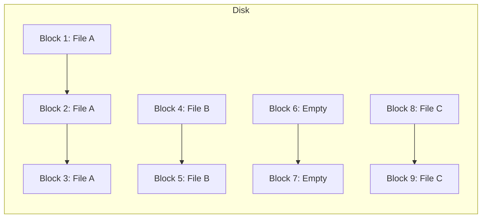
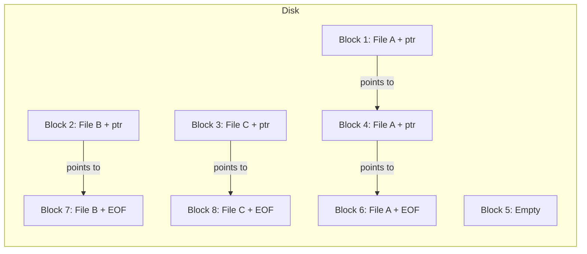
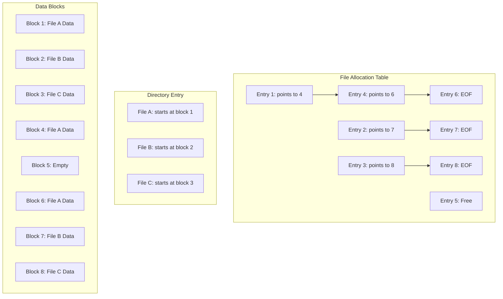
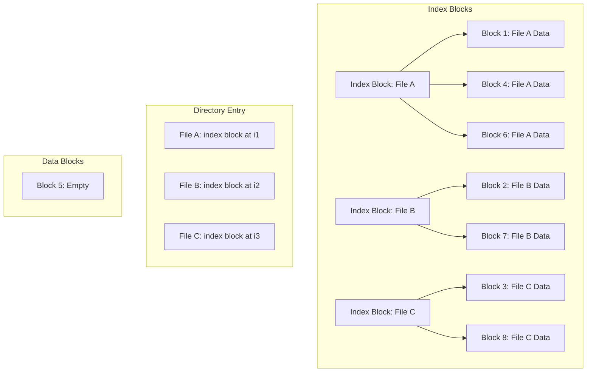

# Allocation Methods

## Introduction

When a file system stores files on a disk or any storage medium, it needs to decide how to allocate space for these files. This decision process involves selecting which specific disk blocks will be assigned to each file. The chosen allocation method significantly impacts the file system's performance, flexibility, and efficiency.

Allocation methods determine:
- How files are physically stored on disk
- How efficiently space is utilized
- How quickly data can be accessed
- How well the system handles file growth
- How effectively fragmentation is managed

In this guide, we'll explore the primary allocation methods used in modern file systems and understand their advantages and disadvantages for different usage scenarios.

## Allocation Strategies Overview

File systems typically employ one of three fundamental allocation strategies:

1. **Contiguous Allocation**: Files occupy consecutive blocks on disk
2. **Linked Allocation**: Files consist of scattered blocks linked together
3. **Indexed Allocation**: File blocks are tracked through index tables

Let's examine each method in detail to understand how they work and their practical implications.

## Contiguous Allocation

### How It Works

In contiguous allocation, files are stored in consecutive blocks on the disk. When a file is created, the system allocates a contiguous sequence of blocks.



To store a file, the system needs to know:
- The starting block (first block of the file)
- The length of the file (number of blocks)

### Implementation Example

Here's a simplified implementation of a contiguous allocation table:

```c
typedef struct {
    char filename[32];
    int start_block;  // Starting block number
    int file_length;  // Length in blocks
} FileEntry;

FileEntry file_table[100];  // Array to store file entries
```

The file system would use this table to track where files are located on disk.

### Advantages

- **Simple implementation**: Only requires tracking the starting block and length
- **Excellent read performance**: Reading a file sequentially is very fast
- **Direct access**: Random access to any part of the file is straightforward
- **Minimal overhead**: No pointers or extra structures needed

### Disadvantages

- **External fragmentation**: As files are created and deleted, free space becomes fragmented
- **File size limitations**: Hard to grow files since adjacent blocks may be occupied
- **Requires knowing file size in advance**: Optimal allocation needs prior knowledge of file size

### Real-world Application

Early file systems like FAT (File Allocation Table) and some real-time systems use variations of contiguous allocation. It's also used in CD-ROM and DVD file systems where files don't change after being written.

## Linked Allocation

### How It Works

In linked allocation, a file consists of blocks scattered anywhere on the disk. Each block contains data and a pointer to the next block in the file.



To store a file, the system only needs to know:
- The starting block (first block of the file)
- The end of the file is marked by a special end-of-file pointer

### Implementation Example

Here's a simplified implementation of a linked allocation system:

```c
#define BLOCK_SIZE 1024
#define EOF_MARKER -1

typedef struct {
    char data[BLOCK_SIZE - sizeof(int)];
    int next_block;  // Pointer to the next block
} DiskBlock;

typedef struct {
    char filename[32];
    int first_block;  // First block of the file
} FileEntry;

DiskBlock disk[1000];  // Array representing the disk
FileEntry file_table[100];  // Array to store file entries
```

### Advantages

- **No external fragmentation**: Any free block can be used
- **Files can grow dynamically**: No need for contiguous space
- **No need to know the file size in advance**: Files can grow as needed

### Disadvantages

- **Poor random access performance**: Must traverse the linked list to reach a specific position
- **Space overhead**: Each block needs space for a pointer
- **Reliability concerns**: If one pointer is corrupted, the rest of the file may be lost
- **Potential for scattered blocks**: Can lead to poor sequential access due to increased seek time

### The FAT Improvement

File Allocation Table (FAT) systems improved linked allocation by storing all the pointers in a separate table (the FAT) rather than with the data blocks:



### Real-world Application

The FAT file system (FAT12, FAT16, FAT32) is the most notable example of linked allocation. It's widely used in USB drives, memory cards, and was the primary file system in early versions of Windows.

## Indexed Allocation

### How It Works

Indexed allocation addresses the shortcomings of both previous methods by using an index block for each file. This block contains pointers to all the data blocks of the file.



### Implementation Example

Here's a simplified implementation of indexed allocation:

```c
#define BLOCK_SIZE 1024
#define MAX_BLOCKS_PER_FILE 100

typedef struct {
    int block_pointers[MAX_BLOCKS_PER_FILE];  // Array of pointers to data blocks
} IndexBlock;

typedef struct {
    char filename[32];
    int index_block;  // Pointer to the index block
} FileEntry;

char data_blocks[1000][BLOCK_SIZE];  // Array representing data blocks
IndexBlock index_blocks[100];  // Array of index blocks
FileEntry file_table[100];  // Array to store file entries
```

### Multi-level Indexing

For larger files, multi-level indexing can be used:

```c
typedef struct {
    int direct_blocks[12];          // Direct pointers to data blocks
    int single_indirect;            // Points to a block of pointers
    int double_indirect;            // Points to a block of pointers to blocks of pointers
    int triple_indirect;            // Points to a block of pointers to blocks of pointers to blocks of pointers
} UnixStyleInode;
```

### Advantages

- **Supports direct access**: Can directly access any block without traversing a linked list
- **No external fragmentation**: Blocks can be allocated anywhere on disk
- **Files can grow up to a certain limit**: As long as there's space in the index
- **No issues with block pointer corruption**: A corrupted pointer affects only one block

### Disadvantages

- **Space overhead**: Index blocks take up space, especially for small files
- **Maximum file size limitation**: Determined by the size of the index block
- **Complexity**: More complex to implement than contiguous or linked allocation

### Real-world Application

Unix-based file systems like ext2/3/4, UFS, and NTFS use variations of indexed allocation. The inode structure in these file systems incorporates indexed allocation with direct, indirect, double indirect, and triple indirect blocks.

## Comparing Allocation Methods

| Feature | Contiguous | Linked | Indexed |
|---------|------------|--------|---------|
| Random Access | Excellent | Poor | Good |
| Sequential Access | Excellent | Good | Good |
| Space Utilization | Poor (fragmentation) | Excellent | Good |
| File Growth | Difficult | Easy | Easy (up to limits) |
| Implementation Complexity | Simple | Moderate | Complex |
| Reliability | Good | Poor | Good |
| Overhead | None | Per-block pointer | Index blocks |
| Real-world Examples | CD-ROM, DVD file systems | FAT12/16/32 | ext2/3/4, NTFS |

## Practical Exercise: Implementing a Simple Contiguous Allocation System

Let's implement a very simple file system simulator that uses contiguous allocation:

```python
class ContiguousFileSystem:
    def __init__(self, disk_size):
        self.disk = [None] * disk_size  # None means the block is free
        self.directory = {}  # filename -> (start_block, length)
    
    def allocate_file(self, filename, size):
        # Find 'size' consecutive free blocks
        start_block = -1
        current_run = 0
        
        for i in range(len(self.disk)):
            if self.disk[i] is None:
                if current_run == 0:
                    start_block = i
                current_run += 1
                
                if current_run == size:
                    # Found enough space, allocate it
                    for j in range(start_block, start_block + size):
                        self.disk[j] = filename
                    
                    self.directory[filename] = (start_block, size)
                    return True
            else:
                current_run = 0
                start_block = -1
        
        return False  # Not enough contiguous space
    
    def read_file(self, filename, block_offset=0):
        if filename not in self.directory:
            return None
        
        start_block, length = self.directory[filename]
        
        if block_offset >= length:
            return None
        
        return f"Data from {filename} at block {start_block + block_offset}"
    
    def delete_file(self, filename):
        if filename not in self.directory:
            return False
        
        start_block, length = self.directory[filename]
        
        # Free the blocks
        for i in range(start_block, start_block + length):
            self.disk[i] = None
        
        # Remove from directory
        del self.directory[filename]
        return True
    
    def disk_status(self):
        return self.disk.copy()

# Example usage
fs = ContiguousFileSystem(10)
fs.allocate_file("document.txt", 3)
fs.allocate_file("image.jpg", 2)
print(fs.disk_status())  # ['document.txt', 'document.txt', 'document.txt', 'image.jpg', 'image.jpg', None, None, None, None, None]
print(fs.read_file("document.txt", 1))  # Data from document.txt at block 1
fs.delete_file("document.txt")
print(fs.disk_status())  # [None, None, None, 'image.jpg', 'image.jpg', None, None, None, None, None]
fs.allocate_file("video.mp4", 4)
print(fs.disk_status())  # [video.mp4', 'video.mp4', 'video.mp4', 'image.jpg', 'image.jpg', None, None, None, None, None]
```

This simple implementation demonstrates several key aspects of contiguous allocation:
1. Finding contiguous free space
2. Allocating blocks to files
3. Reading data from specific blocks
4. Deleting files and freeing space
5. External fragmentation (try allocating a file that needs 6 blocks after the last example)

## Summary

File system allocation methods determine how files are stored physically on storage devices. Each method offers different trade-offs:

- **Contiguous allocation** provides excellent performance but struggles with fragmentation and file growth.
- **Linked allocation** excels at space utilization and file growth but has poor random access performance.
- **Indexed allocation** offers a good balance of features at the cost of some space overhead and implementation complexity.

Modern file systems often use hybrid approaches, combining elements from different allocation methods to achieve optimal performance for their target use cases.

## Additional Resources

For deeper learning about file system allocation methods:

- Operating System Concepts by Silberschatz, Galvin, and Gagne
- Modern Operating Systems by Andrew S. Tanenbaum
- The Design and Implementation of the FreeBSD Operating System
- The Linux Programming Interface by Michael Kerrisk

## Practice Exercises

1. Implement a simple linked allocation system similar to the contiguous allocation example above.
2. Modify the contiguous allocation example to handle file resizing.
3. Design a hybrid allocation system that uses contiguous allocation for small files and indexed allocation for large files.
4. Calculate the maximum file size supported by a Unix-style inode with 12 direct blocks, and single, double, and triple indirect blocks, assuming 4KB block size and 4-byte block pointers.
5. Research and compare how modern file systems like ext4, NTFS, and APFS implement their allocation methods.